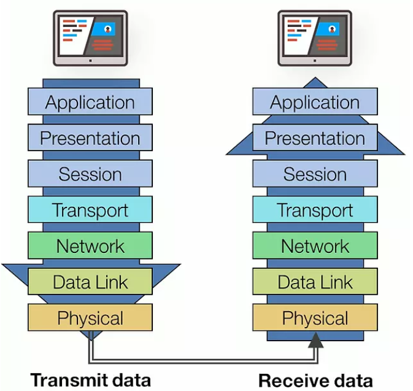

# OSI MODEL
## I. Mô Hình OSI
- Mô hình OSI(Open System Interconnection) là một mô hình hỗ trợ trong việc thiết kế và hiểu cách thức hoạt động của các giao tiếp trong mạng máy tính
- Mô hình OSI bao gồm 7 tâng/lớp (layer):
  - Tầng vật lý (Physical layer)
  - Tầng liên kết dữ liệu (Data link layer)
  - Tầng mạng (Network layer)
  - Tầng giao vận (Transport layer)
  - Tầng phiên (Session layer)
  - Tầng trình diễn (Presentation layer)
  - Tầng ứng dụng (Application layer)
  
## II. Các tầng trong mô hình OSI
- Mô hình bao gồm 7 tầng riêng biệt nhưng chúng liên kết chặt chẽ với nhau, mỗi tầng đều có nhiệm vụ gửi/nhận dữ liệu từ tầng kề trên hoặc kề dưới nó.
- Tại thiết bị gửi, dữ liệu xuất phát từ tầng ứng dụng(Application layer), lần lượt được chuyển tiếp và xử lý qua mỗi tầng, cho tới tầng vật lý (Physical layer), bên nhận thu được dữ liệu từ tầng vật lý, chuyển tiếp và xử lý lần lượt qua các tầng, cho tới tầng ứng dụng, thiết bị đón tiếp dữ liệu tại đây.
  

### 1. Tầng vật lý (Physical layer)
- Là tầng thấp nhất trong mô hình OSI, tầng vật lý thực hiện chức năng chuyển tiếp dữ liệu từ kênh truyền nguồn tới kênh truyền đích. 
- Dữ liệu trong tầng vật lý được biểu diễn dưới dạng dãy bit 0 và 1. Sau khi nhận được dữ liệu từ kênh truyền khác, tầng vật lý thực hiện chuyển tiếp dữ liệu lên tầng liên kết dữ liệu.

- Các chức năng của tầng vật lý:
  - Biểu diễn bit: Chuyển đổi dữ liệu số(bit) thành tín hiệu vật lý(tín hiệu điện, quang học, radio) để truyền trên phương tiện vật lý như cáp đồng, cáp quang, không khí.
  - Kiểm soát tốc độ dữ liệu(Bit rate control): Điều chỉnh tốc độ truyền dữ liệu, tức là số lượng bit truyền trên một kênh truyền trong một đơn vị thời gian. Điều này đảm bảo dữ liệu được truyền một cách hiệu quả và phù hợp với khả năng của phương tiện truyền dẫn.
  - Đồng bộ hóa các bit(Bit synchronization): Đảm bảo người nhận và người gửi đồng bộ về thời gian truyền và nhận từng bit, để tránh hiểu nhầm về dữ liệu đang được truyền.
  - Cấu hình đường truyền: Thiết lập cấu hình vật lý của đường truyền, bao gồm cài đặt các thiết bị như bộ định tuyến, switch, và hub.
  - Topo(Mô hình ghép nối) vật lý (Physical topologies): Xác định cách các thiết bị trong mạng được kết nối vật lý với nhau. Ví dụ: topo dạng sao, dạng vòng, dạng cây, ...
  - Chế độ truyền dẫn(Transmission mode): Xác định hướng truyền dữ liệu trong mạng. Có ba chế độ chính: Simplex(chỉ một hướng), Half-duplex(hai hướng nhưng không đồng thời), và Full-duplex(hai hướng đồng thời).
  
### 2. Tầng liên kết dữ liệu(Data link layer)
- Ở tầng vật lý, dữ liệu được truyền qua các đường truyền vật lý(các loại cáp) nên không đảm bảo tính toàn vẹn và bảo mật. Khắc phục cho nhược điểm đó, tầng liên kết dữ liệu cung cấp các cơ chế kiểm tra lỗi, quản lý quyền truy cập và điều chỉnh việc truyền dữ liệu, giúp đảm bảo tính toàn vẹn và tin cậy của dữ liệu trên mạng.
- Tầng liên kết dữ liệu chịu trách nhiệm:
  - Đóng gói dữ liệu(Framing): Chia dữ liệu được nhận từ tầng mạng thành các khung(frames) nhỏ hơn để dễ dàng xử lý. Mỗi khung chứa thông tin cần thiết để kiểm soát lỗi và đồng bộ hóa.
  - Định địa chỉ vật lý(Physical addressing): Gán địa chỉ vật lý, thường là địa chỉ MAC(Media Access Control), cho mỗi thiết bị trong mạng để xác định nguồn và đích của mỗi khung dữ liệu.
  - Kiểm soát lưu lượng(Flow control): Điều chỉnh tốc độ truyền dữ liệu giữa người gửi và người nhận để tránh quá tải dữ liệu tại người nhận. Điều này giúp đảm bảo rằng tất cả dữ liệu được nhận một cách đầy đủ và chính xác.
  - Kiểm soát lỗi(Error control): Phát hiện và sửa chữa lồi có thể xảy ra trong quá trình truyền dữ liệu. Điều này thường được thực hiện thông qua việc sử dụng các thuật toán kiểm tra lỗi .
  - Kiểm soát truy cập(Access control): Xác định cách thức các thiết bị trên cùng một mạng chia sẻ kênh truyền thông.
    
### 3. Tầng mạng(Network layer)
- Tầng mạng giúp truyền các gói dữ liệu qua các chặng trung gian, từ đó dữ liệu có thể được truyền qua nhiều mạng khác nhau.
- Tầng mạng có hai chức năng chính:
  - Định địa chỉ logic(Logical Addressing): Tầng mạng gán địa chỉ logic, thường là địa chỉ IP, cho mỗi thiết bị trong mạng. Điều này giúp xác định đích cuối cùng của dữ liệu trong mạng rộng lớn và đa dạng.
  - Định tuyến(Routing): Xác định lộ trình cho dữ liệu đi từ nguồn đến đích. Định tuyến dựa trên các thuật toán để chọn đường đi tối ưu nhất, giúp dữ liệu đến được đích nhanh chóng và hiệu quả. Định tuyến có thể thực hiện trong mạng nội bộ(LAN) hoặc qua các mạng khác nhau(WAN).
  
### 4. Tầng giao vận(Transport layer)
- Thay vì chuyển tiếp các gói dữ liệu một cách độc lập như tầng mạng, tầng giao vận giúp đảm bảo các gói dữ liệu thuộc cùng một thông điệp được chuyển tiếp một cách toàn vẹn.
- Các chức năng của tầng giao vận:
  - Phân mảnh/Phân đoạn và tái hợp (Segmentation and Reassembly): Chia nhỏ dữ liệu từ tầng phiên thành các phân đoạn nhỏ hơn đẻ truyền tải dễ dàng hơn trên mạng. Khi đến đích, những phân đoạn này được tái hợp thành dữ liệu ban đầu.
  - Kiểm soát kết nối: Thiết lập, duy trì và kết thúc các kết nối logic giữa người gửi và người nhận. Điều này bao gồm việc quản lý thiết lập kết nối, duy trì kết nối ổn định, và đóng kết nối sau khi truyền dữ liệu.
  - Kiểm soat lưu lượng: Điều chỉnh lưu lượng dữ liệu giữa người gửi và người nhận để tránh quá tải và đảm bảo truyền dữ liệu hiệu quả.
  - Kiểm soát lỗi: Phát hiện và sửa chữa lỗi có thể xảy ra trong quá trình truyền dữ liệu. Bao gồm việc kiểm tra lỗi và gửi lại dữ liệu nếu cần.
  - Định địa chỉ điểm dịch vụ(Service Point Addressing): Sử dụng cổng(port) để định địa chỉ dịch vụ tại các máy chủ, giúp xác định các ứng dụng cụ thể đang giao tiếp trên máy chủ.
  
### 5. Tầng phiên(Session layer)
- Tầng phiên quản lý việc thiết lập và duy trì phiên làm việc giữa các thiết bị trên mạng. Điều này giúp đảm bảo tính toàn vẹn và đáng tin cậy của phiên, đồng thời quản lý việc đồng bộ hóa dữ liệu và xác định các điểm dừng phiên(session termination).
- Đây là lớp chịu trách nhiệm mở và đóng giao tiếp giữa 2 thiết bị. Khoảng thời gian giữa lúc giao tiếp được mở và đóng được gọi là phiên. Lớp phiên đảm bảo phiên duy trì trạng thái mở đủ lâu để truyền tất cả dữ liệu đang được trao đổi, sau đó nhanh chóng đóng phiên để tránh lãng phí tài nguyên.
- Lớp phiên cũng đồng bộ hóa việc truyền dữ liệu với các điểm kiểm tra.
  - Ví dụ: nếu một tệp 100 megabyte đang được truyền, lớp phiên có thể đặt một điểm kiểm tra sau mỗi 5 megabyte. Trong trường hợp mất kết nối hoặc sự cố sau khi đã truyền 52 megabyte, phiên có thể được tiếp tục từ điểm kiểm tra cuối cùng, nghĩa là chỉ cần truyền thêm 50 megabyte dữ liệu. Nếu không toàn bộ quá trình truyền sẽ phải bắt đầu lại từ đầu.
  
### 6. Tầng trình diễn (Presentation layer)
- Tầng này chủ yếu chịu trách nhiệm chuẩn bị dữ liệu để tầng ứng dụng có thể sử dụng; nói cách khác, tầng 6 giúp dữ liệu có thể trình bày để các ứng dụng sử dụng. Tầng trình diễn chịu trách nhiệm biên dịch, mã hóa và nén dữ liệu.
- Hai thiết bị giao tiếp có thể sử dụng các phương pháp mã hóa khác nhau, do đó tầng 6 có trách nhiệm dịch dữ liệu đến thành cú pháp mà tầng ứng dụng của thiệt bị nhận có thể hiểu được.
- Nếu các thiết bị đang giao tiếp qua kết nối được mã hóa, tầng 6 có trách nhiệm thêm mã hóa ở phía người gửi cũng như giải mã hóa ở phía người nhận để có thể trình bày dữ liệu có thể đọc được và không được mã hóa cho tầng ứng dụng.
- Tầng trình diễn có trách nhiệm nén dữ liệu nhận được từ tầng ứng dụng trước khi chuyển đến tầng 5. Điều này giúp cải thiện tốc độ và hiệu quả truyền thông bằng cách giảm thiểu lượng dữ liệu được truyền.

### 7. Tầng ứng dụng (Application layer)
- Đây là tầng duy nhất tương tác trực tiếp với dữ liệu người dùng. Các ứng dụng phần mềm như trình duyệt web và ứng dụng email dựa vào tầng ứng dụng để khởi tạo giao tiếp. Tuy nhiên, các ứng dụng phần mềm máy khách không phải là một phần của tầng ứng dụng. Thay vào đó, tầng ứng dụng chịu trách nhiệm về các giao thức và thao tác dữ liệu mà phần mềm dựa vào để trình bày dữ liệu có ý nghĩa cho người dùng.
- Các giao thức lớp ứng dụng bao gồm HTTP cũng như SMTP (Giao thức truyền thư đơn giản là một trong những giao thức cho phép liên lạc qua email ).

## Cách hoạt động của Mô hình OSI
- Để thông tin mà con người có thể đọc được có thể tuyền qua mạng từ thiết bị này sang thiết bị khác, dữ liệu phải truyền xuống bảy tầng của mô hình OSI trên thiết bị gửi và sau đó truyền lên bảy tầng lớp ở đầu nhận.
- Ví dụ: Ông Breach muốn gửi email cho bà Astra. Ông Breach soạn email trong ứng dụng email trên laptop rồi nhấn "gửi". Ứng dụng email sẽ chuyển email đến TẦNG ỨNG DỤNG, tầng này sẽ chọn giao thức SMTP (vì đây là thư email) và chuyển dữ liệu đến TẦNG TRÌNH DIỄN. Sau đó, TẦNG TRÌNH DIỄN sẽ nén dữ liệu và đến TẦNG PHIÊN, tầng này sẽ khởi tạo phiên giao tiếp.
- Dữ liệu sau đó sẽ đến TẦNG GIAO VẬN của bên gửi, tại đây dữ liệu được phân đoạn, rồi các phân đoạn đó sẽ được chia thành các gói tin(packet) ở TẦNG MẠNG, rồi lại được chia nhỏ hơn nữa thành các khung(frames) ở TẦNG LIÊN KẾT DỮ LIỆU. TẦNG LIÊN KẾT DỮ LIỆU sau đó chuyển các khung dữ liệu này đến TẦNG VẬT LÝ, tầng này sẽ chuyển đổi dữ liệu thành luồng bit 0 và 1 và gửi qua một phương tiện vật lý(dây cap, ...).
- khi máy tính của bà Astra nhận được luồng bit thông qua một phương tiện vật lý(dây cap, wifi, ...) dữ liệu sẽ chạy qua cùng một chuỗi tầng trên thiết bị của bà nhưng theo thứ tự ngược lại. Đầu tiên, TẦNG VẬT LÝ sẽ chuyển đổi luồng bit 0 và 1 thành các khung dữ liệu được truyền đến TẦNG LIÊN KẾT DỮ LIỆU. Sau đó, TẦNG LIÊN KẾT DỮ LIỆU sẽ ghép các khung dữ liệu thành các gói tin cho TẦNG MẠNG. TẦNG MẠNG sau đó sẽ tạo các phân đoạn từ các gói tin cho TẦNG GIAO VẬN, tầng này sẽ ghép các phân đoạn này thành một dữ liệu duy nhất.
- Dữ liệu sau đó sẽ chảy vào TẦNG PHIÊN của người nhận, tầng này sẽ chuyển dữ liệu đến TẦNG TRÌNH DIỄN và kết thúc phiên giao tiếp. TẦNG TRÌNH DIỄN sau đó sẽ loại bỏ né và chuyển dữ liệu thô lên TẦNG ỨNG DỤNG. TẦNG ỨNG DỤNG sau đó sẽ đưa dữ liệu có thể đọc được bằng con nguồi vào phần mềm email của bà Astra, cho phép cô đọc email của ông Breach trên mày hình laptop.