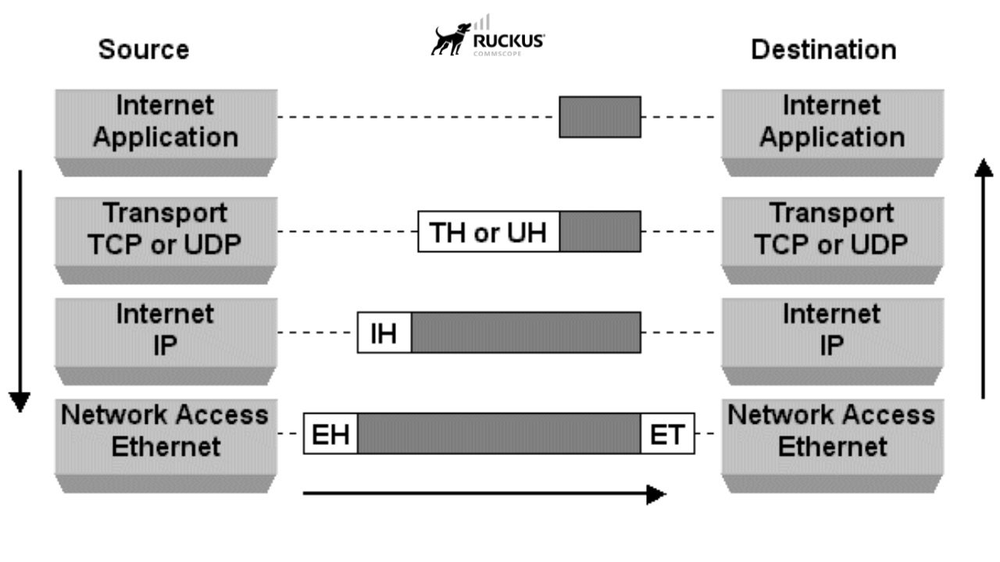
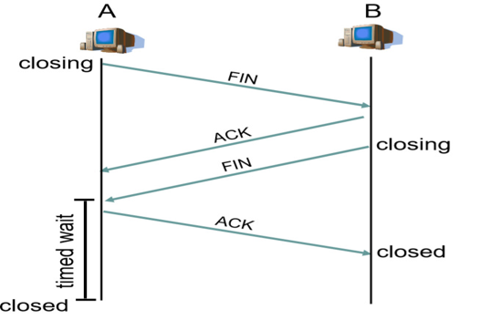

- [TCP/IP MODEL](#tcpip-model)
  - [I. Mô hình TCP/IP là gì?](#i-mô-hình-tcpip-là-gì)
  - [II. Các giao thức TCP/IP phổ biến](#ii-các-giao-thức-tcpip-phổ-biến)
    - [1. Giao thức HTTP(Hyper Text Transfer Protocol):](#1-giao-thức-httphyper-text-transfer-protocol)
    - [2. Giao thức HTTPS(Secure HTTP):](#2-giao-thức-httpssecure-http)
    - [3. Giao thức FTP(File Transfer Protocol - Giao thức truyền tệp)](#3-giao-thức-ftpfile-transfer-protocol---giao-thức-truyền-tệp)
  - [III. Chức năng của các tầng trong mô hình TCP/IP](#iii-chức-năng-của-các-tầng-trong-mô-hình-tcpip)
    - [4. Tầng Ứng Dụng(Application)](#4-tầng-ứng-dụngapplication)
    - [3. Tầng Giao Vận(Transport)](#3-tầng-giao-vậntransport)
    - [2. Tầng Mạng(Internet)](#2-tầng-mạnginternet)
    - [1. Tầng Truy Cập Mạng(Network Access/Link Layer)](#1-tầng-truy-cập-mạngnetwork-accesslink-layer)
  - [IV. So sánh mô hình TCP/IP và OSI](#iv-so-sánh-mô-hình-tcpip-và-osi)
    - [1. Điểm giống nhau giữa OSI và TCP/IP](#1-điểm-giống-nhau-giữa-osi-và-tcpip)
    - [2. Điểm khác nhau giữa OSI và TCP/IP](#2-điểm-khác-nhau-giữa-osi-và-tcpip)
  - [V. WORK FLOW Trong TCP/IP](#v-work-flow-trong-tcpip)

# TCP/IP MODEL
## I. Mô hình TCP/IP là gì?
- TCP/IP là bộ giao thức mạng(protocol suite) dùng để kết nối các máy tính và thiết bị trong mạng Internet. Nó là nền tảng chínhc ủa Internet hiện nay.
  - TCP (Transmission Control Protocol): Giao thức điều khiến truyền vận
    - Đảm bảo dữ liệu được chia thành các gói tin, gửi đến đúng nơi, đúng thứ tự, không mất mát
  - IP (Internet protocol): Giao thức liên mạng
    - Đảm nhận định địa chỉ(địa chỉ IP) và định tuyến(routing) để gói tin đi qua nhiều mạng và đến đúng đích

- Đặc điểm chính của TCP/IP:
  - Đa tầng: Chia thành 4 tầng(tương ứng với 7 tầng OSI)
  - Địa chỉ IP: Mỗi thiết bị có một địa chỉ IP để định danh trong mạng.
  - Kết nối tin cậy: TCP bảo đảm dữ liệu không bị mất hoặc trùng lặp.
  - Khả năng mở rộng cao: Hỗ trợ mạng toàn cầu.
  
- Bộ giao thức TCP/IP áp dụng mô hình giao tiếp client-server, trong đó máy khách (client) nhận các dịch vụ (như truy cập trang web) từ một máy chủ (server) trong mạng. TCP/IP là sự kết hợp của hai giao thức như tên gọi. Trong đó, IP (Giao thức Liên mạng) chịu trách nhiệm chuyển các gói tin đến địa chỉ đích đã được xác định. Quy trình hoạt động của IP là thêm các thông tin chỉ đường vào các gói tin để chúng đến được đích quy định.
  
## II. Các giao thức TCP/IP phổ biến
### 1. Giao thức HTTP(Hyper Text Transfer Protocol): 
- Xử lý giao tiếp giữa máy chủ web và trình duyệt web. Một web client(trình duyệt Internet trên máy tính) sẽ gửi một yêu cầu đến một web server để xem một trang web. Sau khi tiếp nhận yêu cầu, máy chủ web xử lý và gửi thông tin trang web về cho web client.

### 2. Giao thức HTTPS(Secure HTTP):
- HTTPS là giao thức được sử dụng để truyền thông tin dữ liệu bảo mật bởi 1 web client và 1 web server. Giao thức này được dùng để gửi dữ liệu giao dịch thẻ tín dụng hoặc các dữ liệu cá nhân khác từ một web client tới một server.

### 3. Giao thức FTP(File Transfer Protocol - Giao thức truyền tệp)
- Là giao thức trao đổi file dùng giữa hai hoặc nhiều máy tính với nhau qua Internet. Nhờ FTP, dù đang ở xa người dùng vẫn có thể truy cập vào máy chủ để truyền hoặc nhận dữ liệu.

## III. Chức năng của các tầng trong mô hình TCP/IP
- Mô hình TCP/IP tiêu chuẩn được chia thành 4 tầng (Layer) chồng lên nhau bao gồm: Tầng vật lý (Physical) → Tầng mạng (Network) → Tầng giao vận (Transport) và cuối cùng là Tầng kết nối mạng (Internet Access). Mỗi tầng đều có giao thức cụ thể khác nhau.

### 4. Tầng Ứng Dụng(Application)
- Cung cấp cho các ứng dụng những trao đổi dữ liệu chuẩn hóa, giao tiếp dữ liệu giữa 2 máy khác nhau thông qua các dịch vụ mạng khác nhau.
- Bao gồm các giao thức trao đổi dữ liệu hỗ trợ truyền tập tin: HTTP, FTP, Post Office Protocol 3(POP3), Simple Mail Transfer Protocol(SMTP) và Simple Network Management Protocol(SNMP).
- Dữ liệu trong tầng này là dữ liệu ứng dụng thực tế.

### 3. Tầng Giao Vận(Transport)
- Đảm bảo duy trì thông tin liên lạc từ đầu đến cuối trên toàn mạng là trách nhiệm của TCP. Giao thức này xử lý việc liên lạc giứa các máy chủ và cung cấp các tính năng kiểm soát luồng, ghép kênh và đảm bảo độ tin cậy.
- Trong tầng này bao gồm 2 giao thức cốt lõi là TCP và UDP. TCP giúp đảm bảo chất lượng gói tin và UDP giúp tốc độ truyền tải nhanh hơn.

### 2. Tầng Mạng(Internet)
- Tầng này có nhiệm vụ xử lý các gói tin mạng và kết nối các mạng độc lập, giúp vận chuyển các gói tin qua mạng.
- Giao thức: IP và ICMP(Internet Control Messagge Protocol) dùng để báo lỗi.

### 1. Tầng Truy Cập Mạng(Network Access/Link Layer)
- Tầng này bao gồm các giao thức hoạt động trên một liên kết duy nhất - thành phần mạng kết nối các nút hoặc máy chủ trong mạng, chịu trách nhiệm truyền dữ liệu giữa hai thiết bị trong cùng một mạng.
- Các giao thức truyền dữ liệu: Ethernet(cho mạng LAN) và ARP.

## IV. So sánh mô hình TCP/IP và OSI
- TCP/IP và OSI là hai giao thức mạng truyền thông phổ biến nhất hiện nay. TCP/IP dùng để thiết lập các liên kết và giao tiếp trong mạng. Mặt khác, OSI là một mô hình khái niệm, không được sử dụng thực tế. OSI xác định cách thức các ứng dụng giao tiếp qua mạng. 

### 1. Điểm giống nhau giữa OSI và TCP/IP
- Đều là các mô hình logic.
- Xác định tiêu chuẩn Network.
- Chia quá trình giao tiếp Network thành các layer.
- Cung cấp khuôn khổ để tạo và triển khai các tiêu chuẩn và thiết bị mạng.
- Cho phép một nhà sản xuất tạo ra những thiết bị, thành phần mạng có thể cùng tồn tại và hoạt động với các thiết bị, thành phần thuộc nhà sản xuất khác.

### 2. Điểm khác nhau giữa OSI và TCP/IP
| Tiêu chí                  | Mô hình OSI                                                                          | Mô hình TCP/IP                                            |
| ------------------------- | ------------------------------------------------------------------------------------ | --------------------------------------------------------- |
| **Số tầng**               | 7 tầng (Physical, Data Link, Network, Transport, Session, Presentation, Application) | 4 tầng (Network Access, Internet, Transport, Application) |
| **Bản chất**              | Lý thuyết, khái niệm, ít triển khai trực tiếp                                        | Thực tế, được áp dụng rộng rãi trên Internet              |                                 |
| **Mục đích ban đầu**      | Chuẩn hóa cách thiết kế mạng                                                         | Xây dựng mạng ARPANET (tiền thân Internet)                |
| **Phương pháp tiếp cận**  |Chiều dọc| Chiều ngang
| **Mức độ chi tiết**       | Chi tiết hơn, tách rõ Session và Presentation                                        | Gộp Session, Presentation vào Application                 |
| **Mối quan hệ giữa tầng** | Rõ ràng, nghiêm ngặt                                                                 | Linh hoạt, thực tiễn hơn                                  |
| **Ứng dụng hiện nay**     | Dùng để giảng dạy, phân tích, thiết kế mạng                                          | Dùng trong thực tế để kết nối Internet                    |

- Mô hình TCP/IP có xu hướng tiếp cận theo chiều ngang và OSI có xu hướng tiếp cận theo chiều dọc:
  - Trong mô hình OSI dữ liệu thông tin được chuyển từ tầng 7 xuống lần lượt theo chiều dọc.
  - Trong mô hình TCP/IP là mô hình nhấn mạnh về các chồng giao thức.
- TCP/IP chỉ sử dụng một tầng ứng dụng để xác định chức năng của các tầng trên, trong khi OSI sử dụng ba tầng (ứng dụng, trình bày và phiên) (Application, presentation và session).
- TCP/IP sử dụng Link Layer để xác định chức năng của tầng dưới cùng. Đối với OSI, nó sử dụng hai tầng: Physical và Data Link.
- OSI sử dụng lớp Network để định nghĩa các tiêu chuẩn và giao thức định tuyến, trong khi chức năng này được quản lý bởi tầng Internet của TCP/IP.

- Mô hình TCP/IP là một giao thức có hướng tiêu chuẩn, trong khi đó, OSI là một mô hình chung dựa trên chức năng của mỗi lớp.
- Trong mô hình TCP/IP, các giao thức được phát triển trước mô hình. Quá trình này ngược lại so với OSI.
- TCP/IP giúp thiết lập kết nối giữa các loại máy tính với nhau. Mặt khác, OSI giúp chuẩn hóa các router, switch, bo mạch chủ và các phần cứng khác.

## V. WORK FLOW Trong TCP/IP

- Bước 1: Ở tầng Application, bên A tạo ra dữ liệu, sau đó dữ liệu sẽ được chuyển xuống các tầng thấp hơn. Ở mỗi tầng, một header(và đôi khi là trailer) sẽ được bổ sung để giúp dữ liệu được truyền đi dúng cách.
- Bước 2: Tiếp theo, dữ liệu được chuyển xuống tầng Transport, tại đây dữ liệu có thể bị chia nhỏ thành các segment. Ở tầng này có 2 giao thức là TCP và UDP, gói tin sẽ sử dụng 1 trong 2 giao thức này:
  - `Nếu là giao thức TCP`:

    Thiết lập kết nối: `Bắt tay 3 bước`

    

    - Bước 1: Máy A khởi tạo kết nối bằng cách gửi một gói tin TCP SYN đến máy B. Gói SYN này chứa số thứ tự ban đầu(Initial Sequence Number - ISN) do máy A chọn(Ví dụ: seq = 5432).
    - Bước 2: Máy B nhận được gói SYN từ A và phản hồi bằng một gói SYN-ACK. Gói này chứa: số thứ tự của máy B, số xác nhận(ACK) của gói SYN từ A, tức là seq của A + 1.
    - Bước 3: Máy A xác nhận phản hồi từ máy B bằng cách gửi một gói ACK. Gói này chứa: Số xác nhận ACK = seq của B + 1, xác nhận rằng A đã nhận gói SYN-ACK từ B thành công. Kết nối được thiết lập thành công.

    Truyền dữ liệu:

    - Sau khi kết nối được thiết lập, các thiết bị cso thể bắt đầu truyền tải dữ liệu. Dữ liệu được chia thành các phân đoạn nhỏ hơn và đánh số tuần tự. Máy A gửi các phân đoạn này đến người nhận qua kết nối đã thiết lập. Mỗi phân đoạn được đánh số thứ tự để cho phép máy B xác định và lắp ráp chúng lại theo đúng thứ tự ban đầu.

    Đóng kết nối:

    

    Khi quá trình truyền tải hoàn tất, hai thiết bị có thể đóng kết nối.

    - Bước 1: Máy A gửi cho một thông điệp FIN(finish) để cho biết nó đã hoàn thành việc truyền tải dữ liệu.
    - Bước 2: Máy B gửi một ACK để xác nhận việc thông điệp FIN và sẵn sàng đóng kết nối.
    - Bước 3: Sau đó, Máy B sẽ gửi một thông điệp FIN để yêu cầu đóng kết nối từ phía máy A.
    - Bước 4: Máy A sẽ gửi một ACK xác nhận việc nhận thông điệp FIN từ Máy B. Kết nối được đóng.
- Bước 3: Dữ liệu tiếp tục được chuyển xuống tầng Network, tại đây mỗi Segment được đóng gói thành một Packet Header IP sẽ được thêm vào Packet, bao gồm địa chỉ IP nguồn và IP đích. Sau đó thiết bị thực hiện tìm next-hop(router tiếp theo) để định tuyến gói tin đi đúng hướng.
- Bước 4: Ở tầng network access, tầng này chính là tầng datalink và tầng physical ở mô hình OSI.

- Dữ liệu tiếp tục được chuyển xuống tầng Data Link. tại đây Packet sẽ được đóng gói thành Frame bằng cách thêm địa chỉ MAC nguồn (MAC của thiết bị hiện tại) và địa chỉ MAC đích (MAC của router tiếp theo). Đồng thời, Trailer (FCS - Frame Check Sequence) được thêm vào để kiểm tra lỗi trong quá trình truyền.

- Cuối cùng, mỗi Frame sẽ được tầng Vật Lý chuyển thành một chuỗi bit nhị phân và được mã hóa thành tín hiệu điện, quang hoặc sóng vô tuyến để truyền đến thiết bị B qua môi trường mạng.