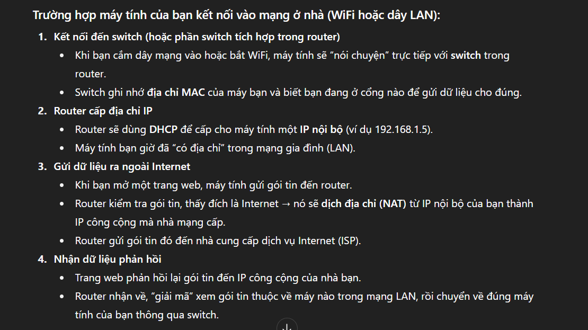

- [PORT](#port)
  - [1. Port là gì?](#1-port-là-gì)
  - [2. Port dùng để làm gì?](#2-port-dùng-để-làm-gì)
  - [3. Port hoạt động như thế nào?](#3-port-hoạt-động-như-thế-nào)
    - [1. Khi truy cập một dịch vụ(ví dụ: web):](#1-khi-truy-cập-một-dịch-vụví-dụ-web)
    - [2. Sever lắng nghe ở Port đó:](#2-sever-lắng-nghe-ở-port-đó)
    - [3. Port kết hợp với IP và giao thức(TCP/UDP):](#3-port-kết-hợp-với-ip-và-giao-thứctcpudp)
- [GATEWAY](#gateway)
  - [1. Gateway là gì?](#1-gateway-là-gì)
  - [2. Gateway dùng để làm gì?](#2-gateway-dùng-để-làm-gì)
  - [3. Gateway hoạt động như thế nào?](#3-gateway-hoạt-động-như-thế-nào)
    - [1. Khi bạn truy cập website:](#1-khi-bạn-truy-cập-website)
    - [2. Gateway nhận và xử lý:](#2-gateway-nhận-và-xử-lý)
    - [3. Gói tin ra ngoài Internet:](#3-gói-tin-ra-ngoài-internet)
    - [4. Dữ liệu trả về:](#4-dữ-liệu-trả-về)
- [ROUTER](#router)
  - [1. Router là gì?](#1-router-là-gì)
  - [2. Router dùng để làm gì?](#2-router-dùng-để-làm-gì)
  - [3. Router hoạt động thế nào?](#3-router-hoạt-động-thế-nào)
    - [1. Thiết bị gửi gói tin:](#1-thiết-bị-gửi-gói-tin)
    - [2. Router kiếm tra đích:](#2-router-kiếm-tra-đích)
    - [3. Dịch địa chỉ NAT:](#3-dịch-địa-chỉ-nat)
    - [4. Tìm đường đi:](#4-tìm-đường-đi)
    - [5. Nhận phản hồi và trả về:](#5-nhận-phản-hồi-và-trả-về)
- [SWITCH](#switch)
  - [1. Switch là gì?](#1-switch-là-gì)
  - [2. Switch dùng để làm gì?](#2-switch-dùng-để-làm-gì)
    - [1. Kết nối nhiều thiết bị trong mạng LAN: Máy tính, máy in, sever, camera IP, ...](#1-kết-nối-nhiều-thiết-bị-trong-mạng-lan-máy-tính-máy-in-sever-camera-ip-)
    - [2. Tránh lãng phí băng thông:](#2-tránh-lãng-phí-băng-thông)
    - [3. Mở rộng mạng nội bộ:](#3-mở-rộng-mạng-nội-bộ)
    - [4. Tăng tốc độ mạng:](#4-tăng-tốc-độ-mạng)
  - [3. Switch hoạt động như thế nào?](#3-switch-hoạt-động-như-thế-nào)
    - [1. Học địa chỉ MAC(MAC learning):](#1-học-địa-chỉ-macmac-learning)
    - [2. Xây bảng chuyển mạch:](#2-xây-bảng-chuyển-mạch)
    - [3. Chuyển dữ liệu thông minh:](#3-chuyển-dữ-liệu-thông-minh)
    - [4. Cập nhật bảng liên tục:](#4-cập-nhật-bảng-liên-tục)
- [PHÂN BIỆT PORT, GATEWAY, ROUTER VÀ SWITCH](#phân-biệt-port-gateway-router-và-switch)

# PORT
## 1. Port là gì? 
- Port(cổng) trong mạng máy tính là một số(từ 0 đến 65535 -> vì port được biểu diễn bằng 16 bit) dùng để xác định ứng dụng hoặc dịch vụ cụ thể đang chạy trên một thiết bị(máy tính, sever, điện thoại, ...).
- Nó giống như số phòng trong một tòa nhà:
  - Địa chỉ IP = địa chỉ tòa nhà.
  - Port = số phòng, giúp bưu tá(gói tin) biết gửi thư(dữ liệu) đến đúng ứng dụng.

## 2. Port dùng để làm gì?
- Phân biệt các dịch vụ trên cùng một địa chỉ IP.
- Cho phép nhiều kết nối đồng thời: Ví dụ vừa lướt web(HTTP port 80) vừa gọi video(port 443), cả hai vẫn hoạt động bình thường.
- Bảo mật và quản lý: có thể mở/đóng port để bảo vệ hệ thống hoặc cho phép dịch vụ hoạt động.

- Ví dụ về một số Port phổ biến:
  
|Port|Dịch vụ|
|---|---|
|80|HTTP(web không bảo mật)|
|443|HTTPS(web bảo mật)|
|21|FTP(truyền file)|
|22|SSH(truy cập từ xa an toàn)|
|25|SMTP(gửi email)|

## 3. Port hoạt động như thế nào?
### 1. Khi truy cập một dịch vụ(ví dụ: web):
- Trình duyệt gửi yêu cầu tới IP sever ở Port 80 hoặc 443.
### 2. Sever lắng nghe ở Port đó:
- Nếu gói tin đến đúng port đang mở, sever xử lý yêu cầu và phản hồi.
### 3. Port kết hợp với IP và giao thức(TCP/UDP):
- Một kết nối mạng thường được xác định bởi IP nguồn:Port nguồn -> IP đích:Port đích.
- Ví dụ:
    > 192.168.1.5:50500 -> 142.250.72.78:443
    - Máy client (IP 192.168.1.5) đang dùng port 50500 để gửi dữ liệu đến server Google (IP 142.250.72.78) qua port 443 (HTTPS).

# GATEWAY
## 1. Gateway là gì?
- Gateway(cổng mạng) là thiết bị hoặc phần mềm làm cầu nối giữa hai mạng khác nhau.
- Nó thường chính là router hoặc modem cho phép máy tính trong mạng nội bộ (LAN) giao tiếp với mạng ngoài(Internet)
- Hiểu đơn giản: Gateway giống như "cửa ra vào" của ngồi nhà "LAN" ra thế giới bên ngoài "Internet"

## 2. Gateway dùng để làm gì?
- Kết nối các mạng khác loại.
- Dịch địa chỉ(NAT): Chuyển đổi địa chỉ IP nội bộ thành IP công cộng để gửi dữ liệu ra Internet.
- Định tuyến dữ liệu: Xác định đường đi tốt nhất để gói tin đến đúng đích.
- Kiểm soát và bảo mật: Một số gateway còn lọc dữ liệu, chặn truy cập, tưởng lửa.

## 3. Gateway hoạt động như thế nào?
### 1. Khi bạn truy cập website:
- Máy tính gửi gói tin đến `Default Gateway`(thường là IP router, ví dụ 192.168.1.1)

### 2. Gateway nhận và xử lý:
- Nếu đích ở cùng mạng nội bộ -> gửi trực tiếp.
- Nếu đích ở mạng khác -> gateway dịch địa chỉ (NAT), chọn đường đi qua Internet.

### 3. Gói tin ra ngoài Internet:
- Gateway đóng vai trò đại diện của cả mạng LAN khi giao tiếp với Internet.
  
### 4. Dữ liệu trả về:
- Gateway nhận và gửi lại cho máy tính trong LAN dựa trên bảng NAT.

# ROUTER
## 1. Router là gì?
- Router(bộ định tuyến) là thiết bị kết nối nhiều mạng khác nhau và chuyển tiếp(route) dữ liệu giữa chúng.
- Nó giống như "người điều phối giao thông" trong mạng: quyết định gói tin đi đường nào để đến đúng nơi.

## 2. Router dùng để làm gì?
- Kết nội mạng LAN với Internet:
  - Router giúp các máy tính, điện thoại, TV trong nhà bạn cùng ra Internet qua một đường truyền.
- Định tuyến dữ liệu:
  - Chọn đường đi tối ưu cho dữ liệu đến đúng đích.
- Cấp phát địa chỉ IP:
  - Router phát IP nội bộ (LAN) cho các thiết bị.
- Chia sẻ kết nội mạng:
  - Nhiều người dùng chung một mạng Internet.
- Bảo mật mạng:
  - Router có tường lửa, NAT, VPN... để bảo vệ mạng nội bộ.
  
## 3. Router hoạt động thế nào?
### 1. Thiết bị gửi gói tin:
- Máy tính/điện thoại trong mạng LAN gửi dữ liệu đến một địa chỉ IP.
### 2. Router kiếm tra đích:
- Nếu đích ở cùng mạng nội bộ -> gửi trực tiếp.
- Nếu đích ở mạng khác -> Router chuyển gói tin ra cổng WAN.
### 3. Dịch địa chỉ NAT:
- Router đổi IP nội bộ thành IP công cộng để gửi ra Internet.
### 4. Tìm đường đi:
- Router sử dụng bảng định tuyến để chọn đường đi tối ưu.
### 5. Nhận phản hồi và trả về:
- Dữ liệu từ Internet về Router -> Router dựa vào NAT Table gửi lại đúng thiết bị yêu cầu.

# SWITCH
## 1. Switch là gì?
- Switch(bộ chuyển mạch) là thiết bị kết nối nhiều thiết bị trong cùng một mạng nộ bộ(LAN) và cho phép cúng gửi dữ liệu trực tiếp cho nhau.
- Switch hoạt động ở Tầng 2 (Data link layer) của mô hình OSI, sử dụng địa chỉ MAC để quyết định gửi dữ liệu đến đúng thiết bị.
- Nó giống như tổng đài điện thoại nộ bộ trong một tòa nhà: biết máy nào ở phòng nào và chỉ kết nối đúng phòng cần liên lạc.

## 2. Switch dùng để làm gì?
### 1. Kết nối nhiều thiết bị trong mạng LAN: Máy tính, máy in, sever, camera IP, ...
### 2. Tránh lãng phí băng thông:
- Switch chỉ gửi dữ liệu đến đúng thiết bị đích chứ không phát bừa.
### 3. Mở rộng mạng nội bộ:
- Thêm nhiều cổng để kết nối thêm máy.
### 4. Tăng tốc độ mạng:
- Gửi dữ liệu nhanh và chính xác hơn.

## 3. Switch hoạt động như thế nào?
### 1. Học địa chỉ MAC(MAC learning):
- Khi một thiết bị gửi dữ liệu, switch đọc địa chỉ MAC của thiết bị và ghi nhớ nó trong bảng CAM(MAC Address Table).
### 2. Xây bảng chuyển mạch:
- Switch ghi lại cổng nào kết nối với địa chỉ MAC nào.
### 3. Chuyển dữ liệu thông minh:
- Khi một thiết bị gửi gói tin, switch kiểm tra bảng MAC:
  - Nếu biết MAC đích -> gửi đúng cổng.
  - Nếu chưa biết -> gửi ra tất cả cổng.
### 4. Cập nhật bảng liên tục:
- Switch luôn học và cập nhật để định tuyến trong mạng LAN tối ưu.

# PHÂN BIỆT PORT, GATEWAY, ROUTER VÀ SWITCH
| Thành phần  | Là gì?                                                | Dùng để làm gì?                                                                   | Hoạt động ở tầng OSI | Điểm nổi bật                                              |
| ----------- | ----------------------------------------------------- | --------------------------------------------------------------------------------- | -------------------- | --------------------------------------------------------- |
| **Port**    | Số hiệu (0–65535) trong phần mềm, không phải thiết bị | Phân biệt ứng dụng/dịch vụ trong máy hoặc trên server. Ví dụ: HTTP 80, HTTPS 443. | Tầng 4 (Transport)   | Giúp nhiều ứng dụng chia sẻ cùng một kết nối mạng qua IP. |
| **Gateway** | “Cửa ngõ” mạng, thường là Router                      | Nối mạng nội bộ (LAN) với mạng ngoài (Internet), dịch địa chỉ (NAT).              | Tầng 3 (Network)     | Thiết bị đầu tiên nhận/gửi dữ liệu ra ngoài mạng.         |
| **Router**  | Bộ định tuyến                                         | Kết nối nhiều mạng, tìm đường đi tối ưu cho gói tin.                              | Tầng 3 (Network)     | Chọn đường, quản lý IP, chia sẻ kết nối Internet.         |
| **Switch**  | Bộ chuyển mạch mạng                                   | Kết nối nhiều thiết bị trong cùng LAN, gửi dữ liệu dựa vào MAC.                   | Tầng 2 (Data Link)   | Nhanh, chính xác, giảm tắc nghẽn so với Hub.              |

> NOTE: khi máy tính kết nối vào mạng thì router có tác dụng gì và switch có tác dụng gì

