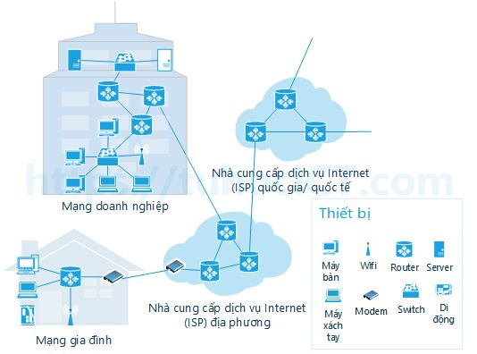
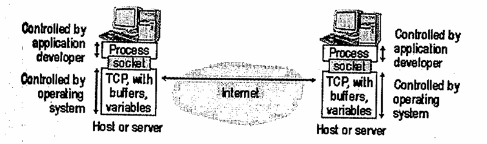
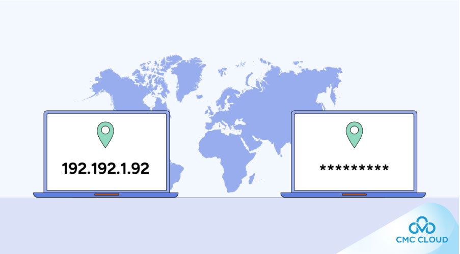

- [TẦNG ỨNG DỤNG](#tầng-ứng-dụng)
  - [I. Giao Thức Tầng Ứng Dụng](#i-giao-thức-tầng-ứng-dụng)
    - [`Mô hình Khách hàng/Người phục vụ(Client/Sever)`](#mô-hình-khách-hàngngười-phục-vụclientsever)
    - [`Truyền thông giữa các tiến trình`](#truyền-thông-giữa-các-tiến-trình)
      - [1. Ứng dụng và tiến trình:](#1-ứng-dụng-và-tiến-trình)
      - [2. Vai trò của socket:](#2-vai-trò-của-socket)
      - [3. Mức độ kiểm soát của Developer:](#3-mức-độ-kiểm-soát-của-developer)
    - [`Địa chỉ tiến trình`](#địa-chỉ-tiến-trình)
    - [`Chương trình giao tiếp người dùng(user agent)`](#chương-trình-giao-tiếp-người-dùnguser-agent)
  - [II. Các Yêu Cầu Của Ứng Dụng](#ii-các-yêu-cầu-của-ứng-dụng)
    - [1. Các yêu cầu của ứng dụng đối với giao thức vận chuyển](#1-các-yêu-cầu-của-ứng-dụng-đối-với-giao-thức-vận-chuyển)
    - [2. Ba nhóm yêu cầu chính](#2-ba-nhóm-yêu-cầu-chính)
    - [Bảng tổng kết](#bảng-tổng-kết)
  - [III. Dịch Vụ Và Các Giao Thức Giao Vận Internet](#iii-dịch-vụ-và-các-giao-thức-giao-vận-internet)
    - [TCP](#tcp)
    - [UDP](#udp)

# TẦNG ỨNG DỤNG
## I. Giao Thức Tầng Ứng Dụng

- Cần phân biệt ứng dụng mạng và giao thức tầng ứng dụng. Giao thức tầng ứng dụng chỉ là một phần(cho dù là phần quan trọng) của ứng dụng mạng.
- Ví dụ:
  - Web - ứng dụng mạng cho phép người dùng lấy các đối tượng từ Web sever bao gồm nhiều thành phần, như tiêu chuẩn định dạng văn bản(HTML), trình duyệt Web(Explorer, chrome), Web sever(Microsoft, google), và giao thức tầng ứng dụng.
  - Giao thức tầng ứng dụng của Web-HTTP(HyperText Transfer Protocol), định nghĩa cách thức chuyển thông điệp giữa Web client và Web sever.
  
- Giao thức tầng ứng dụng (như HTTP, SMTP, FTP) định nghĩa cách mà hai chương trình ứng dụng trên các thiết bị khác nhau gửi và nhận thông điệp để hiểu và làm việc được với nhau.. Xác định:
  - Kiểu thông điệp trao đổi, ví dụ như thông điệp yêu cầu hay thông điệp trả lời.
  - Cú pháp của thông điệp, ví dụ các trường trong thông điệp cũng như cách xác định của chúng.
  - Ý nghĩa của các trường.
  - Quy tắc xác định khi nào và như thế nào tiến trình gửi và trả lời thông điệp.

- Nhiều giao thức tầng ứng dụng được đặc tả trong các RFC. Ví dụ: đặc tả của HTTP là HTTP RFC. Nếu người thiết kế trình duyệt tuân theo các quy tắc của HTTP RFC, trình duyệt sẽ có thể lấy được trang Web từ bất kỳ Web sever nào tuân theo các quy tắc HTTP RFC.

### `Mô hình Khách hàng/Người phục vụ(Client/Sever)`

- Giao thức ứng dụng mạng chia ra hai phía CLient và Sever.
- Phía client trong thiết bị này liên lạc với phía sever trong thiết bị khác.
  - Ví dụ: 
    - trình duyệt Web là phía client, và Web server là phía sever của HTTP. 
    - Trong ứng dụng thư điện tử, mail sever gửi thư là phía client và mail sever nhận thư là phía sever của SMTP.

### `Truyền thông giữa các tiến trình`

Truyền thông giữa các tiến trình(process) trên hai máy khác nhau qua mạng bằng socket.

#### 1. Ứng dụng và tiến trình:
- Mỗi ứng dụng mạng(ví dụ trình duyệt web, server web) chính là một tiến trình ứng dụng chạy trên máy.
- Khi cả hai tiến trình muốn trao đổi dữ liệu, chúng gửi và nhận thông điệp qua socket.

👉 Có thể hình dung socket giống như “cửa” của tiến trình, nơi thông điệp đi vào hoặc đi ra.

#### 2. Vai trò của socket:
- Socket là giao diện(API) giữa tầng ứng dụng và tầng giao vận(TCP/UDP).
- Socket thường được định nghĩa theo mô hình TCP/IP là:
  > Socket = (IP address, Port number)
- Ở tầng Transport (TCP/UDP), socket là cặp (địa chỉ IP, số cổng) để định danh điểm cuối của kết nối.
- Khi nói đến một kết nối TCP đầy đủ, người ta hay gọi là socket pair (hay 4-tuple):
  > (IP nguồn, Port nguồn ,IP đích, Port đích)
- Người lập trình ứng dụng (developer) chỉ cần thao tác với socket, không cần quan tâm chi tiết tầng giao vận bên dưới hoạt động ra sao.
- Tầng giao vận (TCP/UDP) do hệ điều hành quản lý, đảm bảo thông điệp được chuyển đúng đến tiến trình đích.

#### 3. Mức độ kiểm soát của Developer:
- Lập trình viên có thể kiểm soát:
  
  1. Chọn giao thức giao vận (TCP hay UDP)
  2. Thiết lập một số tham số ở tầng giao vận, ví dụ: kích thước bộ đệm (buffer), kích thước tối đa gói tin.

- Nhưng lập trình viên không thể kiểm soát chi tiết toàn bộ tầng giao vận, vì việc quản lý này thuộc về hệ điều hành.

### `Địa chỉ tiến trình`

- Để gửi thông điệp cho tiến trình trên máy tính khác thì tiến trình gửi phải xác định được tiến trình nhận. 
- Tiến trình được xác định qua hai phần: (1) tên hay địa chỉ của máy tính, và (2) định danh xác định tiến trình trên máy tính nhận.

  (1) Trong ứng dụng Internet, máy tính được xác định qua địa chỉ IP. Địa chỉ IP của thiết bị mang tính xác định duy nhất, nên việc phân phối địa chỉ IP được quản lý chặt chẽ.

  (2) Ngoài địa chỉ thiết bị nhận, phía gửi phải thêm vào thông tin giúp phía nhận chuyển tiếp thông điệp cho tiến trình phù hợp(vì trong máy tính nhận có thể có nhiều tiến trình đồng thời hoạt động). Thông tin này là cổng phía nhận(destination port). Các giao thức tầng ứng dụng phổ biến đều được gán số hiệu cổng(port number) là một số cụ thể.

    Ví dụ: tiến trình Web server(HTTP) : 80, mail server(SMTP) : 25.

###  `Chương trình giao tiếp người dùng(user agent)`
- `User agent`: là chương trình trung gian giữa người dùng và ứng dụng mạng, nó là giao diện mà người dùng trực tiếp làm việc.
- Ví dụ: 
  - Trong ứng dụng Web:
    - User agent là trình duyệt (Chrome, Netscape Navigator, Internet Explorer, Firefox, Safari...).
    - Trình duyệt giúp bạn xem và tương tác với website, gửi/nhận dữ liệu qua giao thức HTTP.
    - Trình duyệt đóng vai trò client trong mô hình client-server.

## II. Các Yêu Cầu Của Ứng Dụng
### 1. Các yêu cầu của ứng dụng đối với giao thức vận chuyển
- Socket là giao diện giữa ứng dụng và tầng giao vận(transport layer).
- Ứng dụng gửi dữ liệu xuống socket, còn tầng giao vận chịu trách nhiệm chuyển dữ liệu qua mạng tới tiến trình nhận.
- Khi thiết kế ứng dụng, ta cần chọn giao thức giao vận(TCP, UDP, ...) dựa theo nhu cầu của ứng dụng.
  - Ví dụ:
    - Như khi đi từ Hà Nội vào Huế, ta có thể chọn tàu hỏa (giá rẻ, nhưng chậm) hoặc máy bay (nhanh, nhưng đắt).
    - Tương tự, ứng dụng chọn TCP hay UDP tùy yêu cầu.

### 2. Ba nhóm yêu cầu chính

Ứng dụng thường có yêu cầu đối với giao vận theo 3 khía cạnh:

a) Mất mát dữ liệu(Data loss)
- Một số ứng dụng không được phép mất dữ liệu: truyền file, email, giao dịch tài chính.
- Một số ứng dụng chấp nhận mất một ít dữ liệu: thoại qua Internet (VoIP), video call, game online — vì quan trọng là tốc độ và tính liên tục, mất vài gói tin không sao.

b) Băng thông(Bandwidth)
- Ứng dụng cần đủ tốc độ đường truyền để hoạt động hiệu quả.
- Ví dụ: thoại qua Internet cần ~32Kbps, video cần cao hơn nhiều.
- Nếu băng thông không đủ → âm thanh/video giật, không sử dụng được.
- Các ứng dụng “nhạy cảm băng thông” (bandwidth-sensitive): VoIP, video streaming.
- Các ứng dụng “không nhạy cảm băng thông” (elastic): email, web, tải file.

c) Thời gian(Timing/Delay)
- Ứng dụng thời gian thực (real-time) cần dữ liệu đến đúng lúc: VoIP, hội thảo video, game online.
- Nếu trễ (delay) cao → chất lượng giảm mạnh (cuộc gọi gián đoạn, game lag).
- Các ứng dụng khác (email, tải file) không nhạy cảm với thời gian, chỉ cần đủ chính xác.

### Bảng tổng kết

| Ứng dụng                   | Mất dữ liệu | Băng thông                                    | Thời gian        |
| -------------------------- | ----------- | --------------------------------------------- | ---------------- |
| Truyền file                | Không       | Elastic                                       | Không            |
| Email                      | Không       | Elastic                                       | Không            |
| Web (HTML)                 | Không       | Elastic (ít Kbps)                             | Không            |
| Thoại/Video thời gian thực | Có thể mất  | Âm thanh: vài Kbps – 1Mb Video: 10Kb – 5Mb | Rất nhạy (100ms) |
| Audio/Video lưu trữ        | Có thể mất  | Như trên                                      | Vài giây         |
| Game tương tác             | Có thể mất  | Vài Kbps – 10Kb                               | Rất nhạy (100ms) |
| Ứng dụng tài chính         | Không       | Elastic                                       | Không            |

## III. Dịch Vụ Và Các Giao Thức Giao Vận Internet
- Hai giao thức giao vận cho tầng ứng dụng: UDP và TCP.

### TCP
- Đặc trưng của giao thức TCP là hướng kết nối và cung cấp dịch vụ truyền dữ liệu tin cậy.

> `Dịch vụ hướng nối(connection oriented)`

  TCP client và TCP server trao dổi các thông tin điều khiển với nhau trước khi truyền dữ liệu ứng dụng. Quá trình `bắt tay` giữa client và server như vậy cho phép cả hai bên sẵn sàng xử lý các gói dữ liệu. Sau quá trình này, xuất hiện một đường kết nối TCP(TCP connection) giữa socket của hai tiến trình. Đây là `kết nối hai chiều(song công - full duplex)` vì cho phép hai tiến trình có thể đồng thời gửi và nhận thông điệp. Khi ứng dụng kết thúc việc gửi thông điệp, nó đóng kết nối lại.

> `Dịch vụ giao vận tin cậy`
  

### UDP
- UDP là giao thức giao vận khá đơn giản với mô hình phục vụ tối thiểu.
- UDP không có cơ chế kiểm soát tắc nghẽn, vì gậy tiến trình gửi có thể đẩy dữ liệu ra cổng UDP với tốc độ bất kỳ.

|Ứng dụng|Giao thức ứng dụng|Giao thức giao vận|
|---|---|---|
|Thư điện tử|SMTP|TCP|
|Truy cập từ xa|Telnet|TCP|
|Web|HTTP|TCP|
|Truyền file|FTP|TCP|
|Remote File Server|NFS|UDP hoặc TCP|
|Điện thoại Internet|Giao thức riêng|Thường là UDP|

