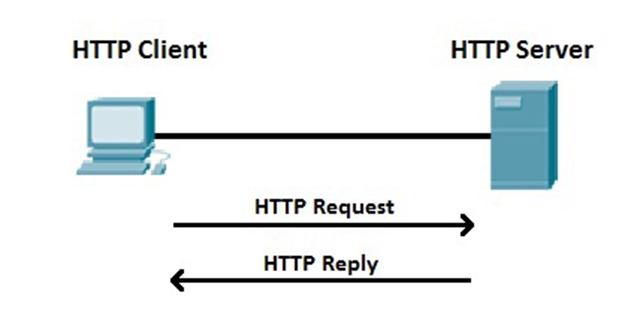

- [HTTP(HyperText Transfer Protocol)](#httphypertext-transfer-protocol)
  - [I. Tổng Quan Về HTTP](#i-tổng-quan-về-http)
    - [1. Khái niệm HTTP](#1-khái-niệm-http)
    - [2. Cách thức hoạt động](#2-cách-thức-hoạt-động)
  - [II. Kết nối liên tục và không liên tục(persistent/nonpersistent)](#ii-kết-nối-liên-tục-và-không-liên-tụcpersistentnonpersistent)
    - [1. Kết nối không liên tục(nonpersistent)](#1-kết-nối-không-liên-tụcnonpersistent)
    - [2. Kết nối liên tục(Persistent Connection)](#2-kết-nối-liên-tụcpersistent-connection)
  - [III. Khuôn dạng thông điệp HTTP](#iii-khuôn-dạng-thông-điệp-http)
    - [1. Thông điệp yêu cầu HTTP(HTTTP request message)](#1-thông-điệp-yêu-cầu-httphtttp-request-message)
    - [2. Thông điệp trả lời HTTP(HTTP response message)](#2-thông-điệp-trả-lời-httphttp-response-message)
  - [IV. Tương tác giữa người dùng và server](#iv-tương-tác-giữa-người-dùng-và-server)
    - [Authentication(kiểm chứng)](#authenticationkiểm-chứng)
      - [1. Quá trình cơ bản](#1-quá-trình-cơ-bản)
      - [2. Các bước hoạt động](#2-các-bước-hoạt-động)
    - [Cookie](#cookie)
      - [1. Cookie là gì?](#1-cookie-là-gì)
      - [2. Cách hoạt động](#2-cách-hoạt-động)


# HTTP(HyperText Transfer Protocol)


## I. Tổng Quan Về HTTP
### 1. Khái niệm HTTP
HTTP (HyperText Transfer Protocol) là giao thức truyền tải siêu văn bản, là một giao thức lớp ứng dụng trong mô hình OSI (Open Systems Interconnection). HTTP được sử dụng để trao đổi thông tin giữa trình duyệt web (client) và máy chủ web (server). Đây là nền tảng của World Wide Web (WWW), cho phép người dùng truy cập các trang web thông qua các trình duyệt như Brave, Chrome, Edge,...

Ví dụ: Khi bạn nhập một URL (ví dụ: http://example.com), trình duyệt sẽ gửi yêu cầu HTTP tới máy chủ, và máy chủ sẽ phản hồi lại nội dung trang web.

### 2. Cách thức hoạt động 


- Máy khách (Client):
  - Thường là trình duyệt web(Chrome, Edge, ...).
  - Gửi yêu cầu HTTP đến máy chủ để truy xuất tài nguyên (vd: truy cập 1 website).
- Máy chủ (Server):
  - Lưu trữ các tài nguyên web.
  - Nhận yêu cầu HTTP từ Client và phản rồi HTTP chứa tài nguyên được yêu cầu.
- Yêu cầu (Request):
  - Thông điệp được gửi từ Client đến Server.
  - Chứa thông tin về tài nguyên được yêu cầu và phương thức yêu cầu (vd: POST, GET). 
- Phản hồi (Response):
  - Thông điệp phản hồi từ Server tới Client.
  - Chứa tài nguyên được yêu cầu và mã trạng thái. (vd: 200 OK, 404 Not Found).
## II. Kết nối liên tục và không liên tục(persistent/nonpersistent)
### 1. Kết nối không liên tục(nonpersistent)
- Cách hoạt động:
  - Với HTTP/1.0 mặc định, mỗi yêu cầu/response dùng một kết nối TCP riêng.
  - Trình duyệt gửi yêu cầu đến server -> server trả về phản hồi -> TCP connection bị đóng.
  - Nếu trang web có nhiều thành phần(HTML, ảnh, ...) thì trình duyệt phải tạo một TCP connection mới cho từng thành phần.
- Đặc điểm:
  - Mỗi request/response = 1 connection.
  - Tốn thời gian vì phải thực hiện TCP handshake nhiều lần.
  - Hiệu suất thấp khi tải trang có nhiều tài nguyên.
  - Ít tốn tài nguyên server hơn, vì server không phải giữ kết nối lâu.
- Ví dụ:
  - Một trang web có 5 ảnh -> cần 1 kết nối cho file HTML + 5 kết nối cho ảnh = 6 TCP connections.

### 2. Kết nối liên tục(Persistent Connection)
- Cách hoạt động:
  - Được giới thiệu trong HTTP/1.1(và có thể dùng với HTTP/1.0 kèm header `Connection: keep-alive`).
  - Một TCP connection được mở và dùng cho nhiều request/response liên tiếp.
  - Sau khi gửi response, server không đóng kết nối ngay mà giữ nó mở trong một khoảng thời gian(timeout).
- Đặc điểm:
  - Một connection có thể truyền nhiều request/response.
  - Giảm chi phí thiết lập kết nối(TCP handshake và TLS handshake nếu có HTTPS).
  - Tăng tốc độ tải trang web vì có thể tái sử dụng kết nối cho nhiều tài nguyên.
  - Tốn thêm bộ nhớ và tài nguyên server để giữ các kết nối mở.
- Ví dụ:
  - Với trang web có 5 ảnh: chỉ cần 1 TCP connection để tải HTML và 5 ảnh.

## III. Khuôn dạng thông điệp HTTP
Có hai kiểu khuôn dạng HTTP: thông điệp yêu cầu và thông điệp trả lời.

### 1. Thông điệp yêu cầu HTTP(HTTTP request message)
- Một thông điệp yêu cầu thường có dạng sau:
```pgsql
GET /somedir/page.html HTTP/1.1
Host: www.someschool.edu
Connection: close
User-agent: Mozilla/4.0
Accept-language: Fr


```

- Dòng đầu tiên trong thông điệp được gọi là `dòng yêu cầu(request line)`: gồm 3 trường: `Method`, `path`, `version`.
  - Method: GET, POST, HEAD.
    - Khi method là POST ta cần để ý `content-length`. Ví dụ truyền 36 byte thì phải truyền vào content-length: 36
  - Path: địa chỉ URL.
  - Version: HTTP/1.1
- Headers: Các header được lưu dưới dạng key - value
  - Host: Tên miền của máy chủ(vd: someschool.edu).
  - User-agent: Thông tin về trình duyệt, hệ điều hành của client (vd: Mozilla/5.0).
  - Accept: Các loại dữ liệu mà client có thể xử lý (HTML, JSON, XML,...) (vd: text/html).
  - Content-Type: Loại dữ liệu gửi đi (ví dụ: JSON, XML).
  - Referer: Định danh nguồn truy cập đến từ đâu.
  - Connection: (close or keep-alive) 

    

### 2. Thông điệp trả lời HTTP(HTTP response message) 
- Một thông điệp trả lời thường có dạng sau:
```pgsql
HTTP/1.0 200 OK
Content-Type: text/html; charset=utf-8
Date: Mon, 20 March 2023 12:38:59 GMT
Content-Length: 2543

(body)
```
- Dòng đầu tiên trong thông điệp là `status code` : 
  - 1xx: Informational
  - 2xx: Success
  - 3xx: Redirection
  - 4xx: Client error
  - 5xx: Server error
- Headers: 
  - Server: Apache/2.4.1 (Unix)
    - Miêu tả loại Web server, ngôn ngữ lập trình và phiên bản của máy chủ đang đứng ra trả về Response cho người dùng.
    - Header Server có thể tắt trong cấu hình Web server để ngăn chặn việc thu thập thông tin của Hacker.
  - Content-type: text/html
    - Header content-type dùng để chỉ ra loại tài nguyên mà server trả về cho client.
    - Client(trình duyệt) cần biết loại content-type mà server trả về để xử lý dữ liệu cho phù hợp.
  - Date: Thời gian phản hồi.
  - Content-length: Kích thước nộ dung phản hồi(tính bằng byte).

## IV. Tương tác giữa người dùng và server
- Server muốn phân biệt người dùng không chỉ vì muốn hạn chế sự truy cập mà còn vì muốn phục vụ theo định danh người dùng.
- HTTP có 2 cơ chế để server phân biệt người dùng: `Authentication` và `cookies`.

### Authentication(kiểm chứng)
#### 1. Quá trình cơ bản
- Khi client (trình duyệt/người dùng) gửi request đến server, server có thể yêu cầu cung cấp username + password để truy cập tài nguyên.
- Đây gọi là Authentication (kiểm chứng).

#### 2. Các bước hoạt động

1. Client gửi request bình thường đến server

    VD: `GET /secret.html HTTP/1.1`

2. Server trả về mã `401 Unauthorized`
- Header kèm theo:
```mathematica
WWW-Authenticate: Basic realm="Restricted Area"
```
- Nghĩa là: server yêu cầu client xác thực bằng phương thức (ví dụ: Basic Auth).

3. Client nhận được yêu cầu -> trình duyệt sẽ hiện hộp thoại yêu cầu nhập username và password.
4. Client gửi lại request mới, lần này có thêm header:
```
Authorization: Basic YWxpY2U6c2VjcmV0
```
(Ở đây YWxpY2U6c2VjcmV0 là chuỗi username:password được mã hóa base64).

5. Server kiểm tra thông tin:
- Nếu đúng > trả về tài nguyên.
- Nếu sai -> lại trả về `401 Unauthorized`

### Cookie
#### 1. Cookie là gì?
- Cookie = một đoạn dữ liệu nhỏ (chuỗi ký tự) mà server gửi về cho client (trình duyệt) thông qua header `Set-Cookie`.
- Trình duyệt sẽ lưu cookie này trong một file đặc biệt trên máy client.
- Khi client gửi request mới đến cùng server đó, trình duyệt tự động kèm cookie trong header Cookie.

#### 2. Cách hoạt động
1. Lần đầu truy cập
- Server trả về header:
```javascript
Set-Cookie: 1678453
```
- Trình duyệt lưu cookie này.
  
2. Lần truy cập sau
- Trình duyệt gửi request và tự động thêm
```
Cookie: 1678453
```
- Server đọc cookie để nhận ra đây chính là client đã từng truy cập trước đó.

👉 Nhờ vậy server không cần hỏi lại username/password ngay lập tức, mà vẫn có thể nhận diện người dùng.