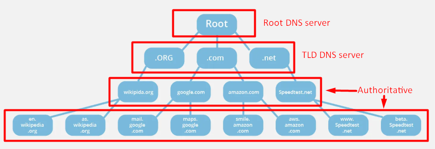
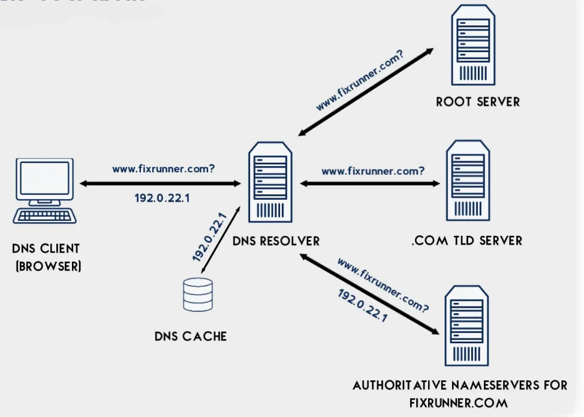

- [DNS(DOMAIN NAME SYSTEM)](#dnsdomain-name-system)
  - [I. Khái Niệm DNS](#i-khái-niệm-dns)
  - [II. Các Dịch Vụ Của DNS](#ii-các-dịch-vụ-của-dns)
    - [Dịch vụ đặt bí danh cho máy tính(Host aliasing)](#dịch-vụ-đặt-bí-danh-cho-máy-tínhhost-aliasing)
    - [Dịch vụ đặt bí danh cho mail server(Mail server aliasing)](#dịch-vụ-đặt-bí-danh-cho-mail-servermail-server-aliasing)
    - [Phân tán tải(load distribution)](#phân-tán-tảiload-distribution)
  - [III. Phân Loại DNS Server](#iii-phân-loại-dns-server)
    - [1. Recursive DNS Server (DNS đệ quy)](#1-recursive-dns-server-dns-đệ-quy)
    - [2. Root DNS Server (Máy chủ gốc)](#2-root-dns-server-máy-chủ-gốc)
    - [3. TLD DNS Server (Top-Level Domain)](#3-tld-dns-server-top-level-domain)
    - [4. Authoritative DNS Server (DNS có thẩm quyền)](#4-authoritative-dns-server-dns-có-thẩm-quyền)
  - [IV. Cơ Chế Hoạt Động Của DNS](#iv-cơ-chế-hoạt-động-của-dns)
  - [V. Bản Ghi DNS](#v-bản-ghi-dns)
    - [1. Bản ghi tài nguyên(Resource Record - RR) trong DNS](#1-bản-ghi-tài-nguyênresource-record---rr-trong-dns)
    - [2. Các loại bản ghi(Type) chính](#2-các-loại-bản-ghitype-chính)

# DNS(DOMAIN NAME SYSTEM)
## I. Khái Niệm DNS


DNS - Domain Name System là một hệ thống quan trọng chuyển đổi tên miền sang địa chỉ IP, giúp các thiết bị có thể giao tiếp và kết nối với nhau trên internet.

DNS về căn bản là một hệ thống chuyển đổi các tên miền mà con người dễ ghi nhớ (dạng ký tự, ví dụ: www.example.com) sang địa chỉ IP vật lý (dạng số, ví dụ 123.11.5.19) tương ứng của tên miền đó.

## II. Các Dịch Vụ Của DNS
### Dịch vụ đặt bí danh cho máy tính(Host aliasing)
Máy tính có tên phức tạp có thể có một hoặc nhiều bí danh(alias)
- Ví dụ: Tên máy tính `relay1.west-coast.enterprise.com` có thể có 2 bí danh là `www.enterprise.com` và `enterprise.com`.
- `relay1.west-coast.enterprise.com` là tên đầy đủ(canonical name).
- Một ứng dụng có thể yêu cầu DNS xác định tên đầy đủ cũng như địa chỉ IP của 1 tên bí danh.

### Dịch vụ đặt bí danh cho mail server(Mail server aliasing)
1. Địa chỉ email cần dễ nhớ
- Ví dụ: Bim có email là `Bim@hotmail.com`
- Người dùng chỉ cần nhớ hotmail.com

2. Tên máy chủ thư thường phức tạp
- Máy chủ thật sự của Hotmail có thể tên dài và khó nhớ, ví dụ:
```
relay1.west-coast.hotmail.com
```
- Nếu bắt người dùng nhập như vậy thì rất bất tiện.

3. DNS giúp ánh xạ tên dễ nhớ sang tên thât/IP
- DNS cho phép tạo bí danh(alias).
- Khi người dùng gửi thư đến `Bim@hotmail.com`, DNS sẽ dịch sang tên đầy đủ hoặc IP của máy chủ thật sự.

4. Alias dùng chung cho nhiều dịch vụ
- Một công ty có thể muốn mail server và web server cùng chia sẻ một tên miền dễ nhớ.
- Ví dụ:
  - Website: `www.enterprise.com`
  - Email: `user@enterprise.com`
- Dù phía sau là hai máy chủ khác nhau nhưng nhờ DNS alias người dùng vẫn chỉ thấy một tên thống nhất: `enterprise.com`

### Phân tán tải(load distribution)
- Một tên miền có thể trỏ đến nhiều địa chỉ IP khác nhau để phân phối lưu lượng truy cập. DNS có thể trả về IP khác nhau theo vùng địa lý, giảm tải, tăng tốc độ.
- VD: youtube.com có thể trả về IP khác nhau nếu bạn ở Mỹ hay Việt Nam.

## III. Phân Loại DNS Server



### 1. Recursive DNS Server (DNS đệ quy)

- Là trung gian giữa người dùng và hệ thống phân giải tên miền toàn cầu.
- Nhận yêu cầu từ client (máy tính, điện thoại…) và đi lần lượt đến **Root** → **TLD** → **Authoritative DNS** để lấy IP.
- Lưu trữ kết quả tra cứu vào bộ nhớ cache để phục vụ các yêu cầu tiếp theo nhanh hơn.
- ví dụ:
  - `8.8.8.8` (Google)
  - `1.1.1.1` (Cloudflare)
  - DNS của nhà mạng như: VNPT, Viettel, FPT…

### 2. Root DNS Server (Máy chủ gốc)

- Đứng đầu chuỗi truy vấn DNS. Nó không chứa thông tin chi tiết về các tên miền cụ thể, nhưng nó biết địa chỉ của các máy chủ TLD (Top-Level Domain).
- Khi Recursive Resolver cần tra cứu một tên miền mà không có trong cache, nó sẽ hỏi Root Server để biết địa chỉ của TLD Server tương ứng.
- Được quản lý bởi các tổ chức toàn cầu (ví dụ: Verisign, ICANN) vận hành. Có 13 hệ thống máy chủ gốc được định danh từ A đến M, phân tán trên toàn cầu.

### 3. TLD DNS Server (Top-Level Domain)

- Quản lý các đuôi miền cấp cao như `.com`, `.vn`, `.edu`, `.org`...
- Chuyển tiếp truy vấn đến **authoritative DNS server** cụ thể của tên miền.
- Ví dụ:
  - `.com` → được quản lý bởi **Verisign**.
  - `.vn` → được quản lý bởi **VNNIC**.

### 4. Authoritative DNS Server (DNS có thẩm quyền)

  Authoritative DNS Server (máy chủ DNS có thẩm quyền) là máy chủ DNS chính thức chứa bản ghi DNS gốc cho một tên miền (domain).

- Nó được ủy quyền trực tiếp từ chủ sở hữu tên miền hoặc cơ quan quản lý tên miền (registrar, registry).
- Khi nhận được truy vấn, nó sẽ trả lời bằng thông tin chính xác nhất (IP, mail server, …) chứ không phải thông tin “cache” như các máy chủ DNS khác (ví dụ recursive DNS).
- Có 2 loại Authoritative server:
  - Primary(Master):
    - Lưu trữ bản gốc (zone file) của domain.
    - Quản trị viên chỉnh sửa trực tiếp tại đây.
  - Secondary(Slave):
    - Sao chép dữ liệu từ Primary.
    - Giúp phân tải và tăng độ tin cậy.

## IV. Cơ Chế Hoạt Động Của DNS



**`Bước 1`: Truy vấn từ Client → Recursive DNS Server**

- Người dùng mở trình duyệt và nhập `www.example.com`.
- Hệ điều hành kiểm tra:
  - File hosts cục bộ (nếu có).
  - Cache DNS cục bộ (nếu có).
  - Nếu không có → gửi truy vấn đến Recursive DNS Server.

**`Bước 2`: Recursive DNS Server xử lý truy vấn**

Recursive DNS sẽ thực hiện các bước sau nếu không có cache:

1. **Hỏi Root DNS Server:**
    - Hỏi: “IP của `www.example.com` là gì?”.
    - Root DNS: “Hãy hỏi `.com` TLD Server”.
2. **Hỏi TLD DNS Server (.com):**
    - Hỏi: “IP của `www.example.com` là gì?”.
    - `.com` server: “domain `example.com` được quản lý bởi DNS server tại `ns1.exampledns.com` (authoritative)”.
3. **Hỏi Authoritative DNS Server:**
    - Truy vấn đến `ns1.exampledns.com`: “IP của `www.example.com` là gì?”.
    - Server này trả lời: “IP là `217.64.213.12`” (A record).

**`Bước 3`: Trả kết quả về Client**

- Recursive DNS server lưu kết quả vào cache (để lần sau trả lời nhanh hơn).
- Trả IP `217.64.213.12` về cho máy người dùng.

**`Bước 4`: Client kết nối đến web server**

- Trình duyệt dùng địa chỉ IP để kết nối đến 217.64.213.12 (qua HTTP/HTTPS).
- Gửi request và tải nội dung web.

## V. Bản Ghi DNS
### 1. Bản ghi tài nguyên(Resource Record - RR) trong DNS
- Máy chủ DNS(name server) lưu trữ các bản ghi tài nguyên để ánh xạ giữa tên miền(host name) và địa chỉ IP hoặc thông tin khác.
- Mỗi bản ghi tài nguyên có 4 trường chính:
```pgsql
(Name, Value, Type, TTL).
```
  - **Name**: tên miền (hostname, domain name).
  - **Value**: giá trị gắn với tên miền(IP, tên alias, mail server, ...).
  - **Type**: loại bản ghi(A, NS, CNAME, MX, ...).
  - **TTL(Time To Live)**: thời gian tồn tại cảu bản ghi trong cache, hết hạn thì phải hỏi lại.

### 2. Các loại bản ghi(Type) chính
a) Bản ghi A(Address Record)
- Name: tên miền.
- Value: địa chỉ IPv4 của máy chủ.
- Ví dụ:
```css
play1.bar.foo.com   145.37.93.126   A
```
  -> `play1.bar.foo.com` có IP là `145.37.93.126`.

b) Bản ghi NS(Name Server Record)
- Name: một miền(ví dụ foo.com).
- Value: hostname của authoritative name server cho miền đó.
- Dùng để chuyển tiếp truy vấn DNS đến máy chủ có thẩm quyền.
- Ví dụ:
```
foo.com   dns.foo.com   NS
```
  -> Miền `foo.com` được quản lý bởi `dns.foo.com`.

c) Bản ghi CNAME(Canonical Name Record)
- Dùng để tạo bí danh(alisas) cho một tên miền.
- Name: alias.
- Value: tên miền chính(canonical name).
- Ví dụ:
```objectivec
foo.com   play1.bar.foo.com   CNAME
```
  -> `foo.com` thực chất trỏ đến `play1.bar.foo.com`.

d) Bản ghi MX(Mail Exchange Record)
- Xác định mail server cho một miền.
- Name: miền.
- Value: tên máy chủ mail.
- Ví dụ:
```
foo.com   mail.bar.foo.com   MX
```
  -> Mail gửi đến `@foo.com` sẽ được xử lý bởi `mail.bar.foo.com`.

