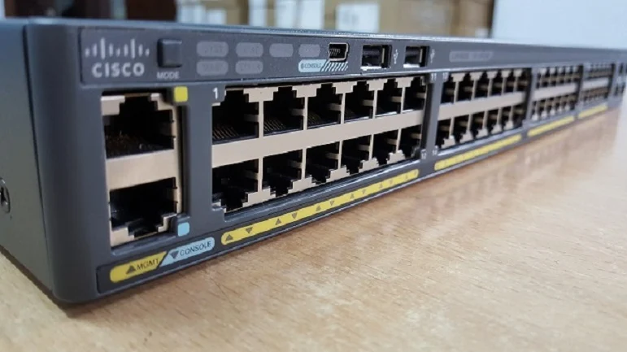

- [SWITCH](#switch)
  - [1. Switch là gì?](#1-switch-là-gì)
  - [2. Chức năng của thiết bị chuyển mạch Switch](#2-chức-năng-của-thiết-bị-chuyển-mạch-switch)
    - [2.1. Kết nối các thiết bị trong mạng LAN](#21-kết-nối-các-thiết-bị-trong-mạng-lan)
    - [2.2. Chia nhỏ miền đụng độ(collision domain)](#22-chia-nhỏ-miền-đụng-độcollision-domain)
    - [2.3. Học và lưu trữ địa chỉ MAC](#23-học-và-lưu-trữ-địa-chỉ-mac)
    - [2.4. Chuyển tiếp dữ liệu(Forwading)](#24-chuyển-tiếp-dữ-liệuforwading)

# SWITCH
## 1. Switch là gì?

- Switch là thiết bị chuyển mạch trong hệ thống mạng. Chúng được sử dụng để kết nối các đoạn mạng vào với nhau theo kiểu hình sao.
- Switch chính là thiết bị trung tâm và tất cả các thiết bị khác sẽ kết nối với thiết bị này để chuyển dữ liệu.

## 2. Chức năng của thiết bị chuyển mạch Switch
### 2.1. Kết nối các thiết bị trong mạng LAN
- Switch dùng để kết nối nhiều máy tính, máy in, server, access point... trong cùng một mạng cục bộ(LAN).
- Mỗi thiết bị kết nối vào switch thông qua một cổng.
### 2.2. Chia nhỏ miền đụng độ(collision domain)
- Không giống hub, switch gửi dữ liệu trực tiếp đến đúng cổng của thiết bị đích nhờ vào địa chỉ MAC.
- Điều này giảm thiểu va chạm dữ liệu, tăng hiệu suất truyền thông.
### 2.3. Học và lưu trữ địa chỉ MAC
- Switch có bảng MAC(MAC address table) để ghi nhớ địa chỉ phần cứng của từng thiết bị kết nối.
- Khi một gói tin đi qua, switch lưu lại địa chỉ MAC nguồn và gán với cổng tương ứng.
### 2.4. Chuyển tiếp dữ liệu(Forwading)
- Khi nhận được frame, switch tra bảng MAC để quyết định