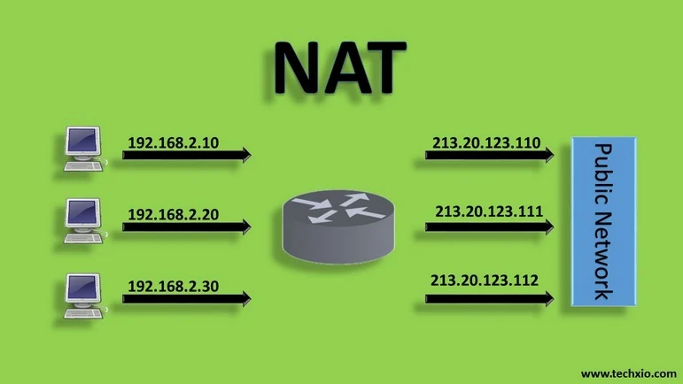
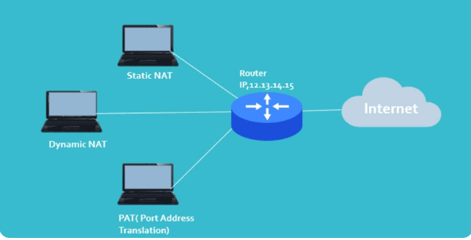

- [NAT(NETWORK ADDRESS TRANSLATION)](#natnetwork-address-translation)
  - [I. Khái Niệm](#i-khái-niệm)
  - [II. Nguyên Lý Hoạt Động Của NAT](#ii-nguyên-lý-hoạt-động-của-nat)
  - [III. Phân Loại NAT](#iii-phân-loại-nat)
  - [IV. Ưu Điểm Và Nhược Điểm Của NAT](#iv-ưu-điểm-và-nhược-điểm-của-nat)
    - [Ưu điểm](#ưu-điểm)
    - [Nhược điểm](#nhược-điểm)
  - [V. SNAT VÀ DNAT](#v-snat-và-dnat)
    - [1. DNAT(Source NAT)](#1-dnatsource-nat)
    - [2. DNAT(Destination NAT)](#2-dnatdestination-nat)
    - [Tình huống](#tình-huống)


# NAT(NETWORK ADDRESS TRANSLATION)
## I. Khái Niệm



NAT (Network Address Translation) là một kỹ thuật trong mạng máy tính cho phép chuyển đổi địa chỉ IP giữa các thiết bị trong mạng nội bộ và mạng bên ngoài. Nó được sử dụng để ánh xạ địa chỉ IP riêng (private IP) của các thiết bị trong mạng nội bộ sang một địa chỉ IP công cộng (public IP) khi chúng truy cập internet.

`Chức năng chính`: 

- Chia sẻ địa chỉ IP Public: NAT cho phép nhiều thiết bị trong mạng nội bộ(sử dụng địa chỉ IP Private) chia sẻ một hoặc một số địa chỉ IP Public để truy cập Internet. Điều này rất quan trọng khi số lượng địa chỉ IP Public có hạn trong IPv4.
- Tăng cường bảo mật: NAT che giấu địa chỉ IP Private của các thiết bị trong mạng nội bộ khỏi internet, giúp bảo vệ mạng khỏi các cuộc tấn công bên ngoài. Thiết bị từ ngoài internet không thể kết nối trực tiếp với các thiết bị có IP Private mà không qua NAT.
- Giảm bớt nhu cầu sử dụng địa chỉ IP Public: Bằng cách sử dụng một hoặc một vài địa chỉ IP Public cho hàng trăm hoặc hàng nghìn thiết bị có IP Private, NAT giúp tiết kiệm đáng kể tài nguyên địa chỉ IP Public.
- Dễ dàng cấu hình mạng nội bộ: NAT cho phép thay đổi, cấu trúc lại địa chỉ IP Private trong mạng nội bộ mà không ảnh hưởng đến địa chỉ IP Public. Điều này tạo ra sự linh hoạt trong việc quản lý và tổ chức mạng nội bộ.
- Hỗ trợ kết nối từ mạng nội bộ ra ngoài internet: Khi một thiết bị trong mạng nội bộ muốn truy cập internet, NAT sẽ ánh xạ địa chỉ IP Private thành địa chỉ IP Public. Điều này cho phép các thiết bị trong mạng nội bộ có thể duy trì kết nối với các dịch vụ và hệ thống trên internet.

## II. Nguyên Lý Hoạt Động Của NAT
NAT hoạt động dựa trên việc thay đổi địa chỉ IP và cổng của các gói tin khi chúng đi qua router. Nó giúp che giấu các địa chỉ IP nội bộ với bên ngoài, đồng thời tiết kiệm địa chỉ IP công cộng bằng cách cho phép nhiều thiết bị sử dụng chung một địa chỉ IP công cộng.

Quá trình này thường diễn ra tại router hoặc firewall để quản lý kết nối giữa mạng nội bộ và internet, cụ thể như sau:

1) Gửi gói tin từ mạng nội bộ ra ngoài: 
- Khi một thiết bị trong mạng nộ bộ muốn truy cập Internet, nó sẽ gửi một gói tin đến router NAT.
- Gói tin này chứa địa chỉ IP nguồn là địa chỉ IP riêng của thiết bị, và địa chỉ IP đích là địa chỉ IP công cộng của máy chủ mà thiết bị muốn kết nối.

2) Thay đổi địa chỉ IP nguồn: 
- Router NAT nhận gói tin và thay đổi địa chỉ IP nguồn từ địa chỉ IP riêng thành địa chỉ IP công cộng của router (hoặc một địa chỉ IP công cộng được ánh xạ).
- Đôi khi, NAT cũng thay đổi cả cổng nguồn của gói tin để đảm bảo sự phân biệt giữa các kết nối khác nhau sử dụng chung một địa chỉ IP public. Đây là quá trình Port Address Translation (PAT).
- Sau đó, router gửi gói tin ra ngoài internet với địa chỉ IP công cộng mới.

3) Lưu bảng NAT: 
- Router NAT sẽ lưu thông tin ánh xạ giữa địa chỉ IP và cổng nguồn ban đầu với địa chỉ IP và cổng nguồn mới trong bảng NAT.
- Bảng này giúp router biết cách chuyển tiếp gói tin phản hồi từ internet về đúng thiết bị trong mạng nội bộ.

4) Nhận gói tin phản hồi: 
- Khi máy chủ bên ngoài phản hồi, gói tin sẽ được gửi về địa chỉ IP công cộng của router NAT.
- Router NAT kiểm tra bảng NAT để tìm ánh xạ phù hợp giữa địa chỉ IP công cộng và địa chỉ IP riêng ban đầu.

5) Chuyển đổi lại địa chỉ IP:
- Router NAT thay đổi địa chỉ IP đích từ địa chỉ IP công cộng trở lại địa chỉ IP riêng của thiết bị trong mạng nội bộ.
- Gói tin sau đó được gửi đến thiết bị ban đầu trong mạng nội bộ.

6) Kết thúc phiên:
- Khi phiên kết nối kết thúc, ánh xạ trong bảng NAT sẽ được xóa hoặc thời gian sử dụng ánh xạ sẽ hết hạn.

## III. Phân Loại NAT



NAT được phân thành ba loại chính dựa trên cách thức ánh xạ địa chỉ IP giữa mạng nội bộ và mạng bên ngoài: NAT tĩnh, NAT động, và NAT Overload (PAT).

`NAT tĩnh(Static NAT)`
- NAT tĩnh ánh xạ một địa chỉ IP riêng (private IP) cố định từ mạng nội bộ sang một địa chỉ IP công cộng (public IP) cố định. Đây là một ánh xạ 1:1, có nghĩa là mỗi địa chỉ IP riêng luôn tương ứng với một địa chỉ IP công cộng cụ thể.
- Ưu điểm: Thích hợp cho các thiết bị trong mạng nội bộ cần truy cập từ bên ngoài với địa chỉ IP công cộng cố định, chẳng hạn như các máy chủ web hoặc máy chủ email.
- Nhược điểm: Không tiết kiệm địa chỉ IP công cộng vì mỗi thiết bị yêu cầu một địa chỉ IP công cộng riêng biệt.

`NAT động(Dynamic NAT)`
- NAT động ánh xạ các địa chỉ IP riêng trong mạng nội bộ thành một địa chỉ IP công cộng ngẫu nhiên từ một nhóm (pool) các địa chỉ IP công cộng có sẵn. Không phải lúc nào một địa chỉ IP riêng cũng tương ứng với một địa chỉ IP công cộng cố định, mà phụ thuộc vào địa chỉ IP nào còn trống trong nhóm IP công cộng.
- Ưu điểm: Tiết kiệm địa chỉ IP công cộng hơn NAT tĩnh vì không cần ánh xạ cố định.
- Nhược điểm: 
  - Địa chỉ IP công cộng thay đổi thường xuyên, gây khó khăn cho việc thiết lập các kết nối từ ngoài vào mạng nội bộ.
  - Hạn chế số lượng địa chỉ IP công cộng trong pool.

`NAT Overload(PAT)`
- NAT Overload, hay còn gọi là PAT, cho phép nhiều thiết bị trong mạng nội bộ chia sẻ một địa chỉ IP công cộng duy nhất. Thay vì ánh xạ 1:1, PAT sử dụng các cổng (port) để phân biệt giữa các kết nối từ các thiết bị khác nhau trong mạng nội bộ.
- Ưu điểm: 
  - Tiết kiệm tối đa địa chỉ IP công cộng vì nhiều thiết bị có thể sử dụng chung một địa chỉ IP công cộng.
  - Là phương pháp phổ biến nhất hiện nay cho các mạng gia đình và văn phòng nhỏ.
- Nhược điểm: Có thể dẫn đến việc tắc nghẽn hoặc quá tải khi có quá nhiều kết nối từ một địa chỉ IP công cộng.
- NAT Overload là một phiên bản mở rộng của NAT động, trong đó ánh xạ không chỉ dựa trên địa chỉ IP mà còn dựa trên các cổng để phân biệt nhiều kết nối.

## IV. Ưu Điểm Và Nhược Điểm Của NAT

### Ưu điểm

- **Tiết kiệm địa chỉ IP công cộng:** Network Address Translation cho phép nhiều thiết bị trong mạng nội bộ sử dụng chung một hoặc một số địa chỉ IP công cộng, giúp giảm nhu cầu tiêu tốn địa chỉ IP công cộng, đặc biệt khi số lượng IPv4 bị giới hạn.

- **Tăng cường bảo mật mạng nội bộ:** Network Address Translation che giấu địa chỉ IP nội bộ khỏi internet, làm cho các thiết bị bên ngoài không thể xác định hoặc truy cập trực tiếp vào các thiết bị bên trong mạng nội bộ. Điều này giúp bảo vệ mạng nội bộ khỏi các cuộc tấn công từ bên ngoài.

- **Linh hoạt trong việc đổi địa chỉ IP:** NAT cho phép thay đổi cấu trúc địa chỉ IP bên trong mạng nội bộ mà không cần thông báo hoặc thay đổi cấu hình của các thiết bị bên ngoài.

- **Hỗ trợ nhiều thiết bị cùng truy cập internet:** Với NAT Overload (PAT), nhiều thiết bị trong mạng nội bộ có thể chia sẻ một địa chỉ IP công cộng duy nhất, tạo điều kiện cho việc truy cập internet mà không cần nhiều địa chỉ IP công cộng.

- **Giảm chi phí ISP:** Việc chỉ cần một vài địa chỉ IP công cộng thay vì phải mua nhiều địa chỉ từ nhà cung cấp dịch vụ (ISP) giúp tiết kiệm chi phí.

### Nhược điểm

- **Giảm hiệu suất kết nối:** Quá trình chuyển đổi địa chỉ IP và cổng qua NAT có thể tạo thêm độ trễ (latency) và làm giảm hiệu suất kết nối mạng, đặc biệt là khi có quá nhiều thiết bị chia sẻ một địa chỉ IP công cộng.
- **Khó khăn trong việc thiết lập kết nối từ ngoài vào mạng nội bộ:** Các dịch vụ yêu cầu kết nối từ internet vào thiết bị bên trong mạng nội bộ (ví dụ: máy chủ web hoặc máy chủ trò chơi) có thể gặp khó khăn trong việc cấu hình và hoạt động do NAT không cho phép truy cập trực tiếp.
- **Vấn đề với một số giao thức:** Một số giao thức mạng, như SIP (Session Initiation Protocol) và IPSec, có thể gặp khó khăn trong việc hoạt động qua Network Address Translation vì các vấn đề liên quan đến việc thay đổi địa chỉ và cổng.

- **Tăng độ phức tạp trong cấu hình:** Để các dịch vụ yêu cầu truy cập từ bên ngoài hoạt động chính xác, cần cấu hình cẩn thận NAT tĩnh, NAT động hoặc Port Forwarding, điều này có thể phức tạp đối với người dùng không quen thuộc.

- **Không tương thích với IPv6:** Network Address Translation chủ yếu được sử dụng cho địa chỉ IPv4, trong khi IPv6 có thể không cần đến Network Address Translation do có số lượng địa chỉ IP lớn hơn. Điều này có thể làm cho NAT trở nên kém cần thiết trong các mạng sử dụng IPv6.

## V. SNAT VÀ DNAT
### 1. DNAT(Source NAT)
- Mục đích: Khi thiết bị trong mạng nộ bộ(private IP) truy cập ra ngoài Internet, router sẽ thay đổi địa chỉ nguồn từ IP nội bộ -> IP công cộng.
- Lý do cần: Vì IP private không định tuyến được trên Internet.
- Ví dụ: 
  - Máy trong LAN: `192.168.1.10` -> muốn truy cập `8.8.8.8`.
  - Gói tin gốc: Source = `192.168.1.10`, Dest = `8.8.8.8`.
  - Router NAT: Source = `203.0.113.5`(IP public), Dest = `8.8.8.8`.
  - Khi phản hồi về, router "dịch" ngược lại -> gửi cho máy `192.168.1.10`.

👉 SNAT chủ yếu dùng cho kết nối outbound (từ trong ra ngoài).

### 2. DNAT(Destination NAT)
- Mục đích: Cho phép thiết bị ngoài Internet truy cập vào dịch vụ bên trong LAN. Router sẽ thay đổi địa chỉ đích từ IP công cộng → IP nội bộ.
- Lý do cần: Vì Internet chỉ "thấy" IP công cộng của router, không thấy IP pỉvate bên trong.
- Ví dụ: 
  - Người ngoài truy cập `203.0.113.5:80` (web server).
  - Gói tin gốc: Source = `8.8.8.8`, Dest = `203.0.113.5:80`.
  - Router NAT: Dest = `192.168.1.100:80` (web server nội bộ).
  - Server nội bộ nhận gói tin và phản hồi; router lại dịch ngược để trả về cho client ngoài.

👉 DNAT chính là Port Forwarding cấu hình trên router để host game/server.

### Tình huống
A đang ở nhà, IP nội bộ của PC là `192.168.1.5`.
A tự host server Minecraft trên port **25565**.
Router của A có IP công cộng: ``203.0.113.5``.

A muốn bạn bè ngoài Internet kết nối ``203.0.113.5:25565`` để chơi cùng.

**NẾU CHỈ CÓ SNAT**
- Khi A trong LAN truy cập ra ngoài Internet
  - Source từ `192.168.1.5` -> thành `203.0.113.5`.
  - Kết nối đi ra ngoài OK.
- Nhưng chiều từ ngoài vào:
  - Người ngoài gửi gói tin: Dest = `203.0.113.5:25565`.
  - Router nhận gói nhưng không biết phải chuyển vào đâu(trong LAN có thể nhiều máy, cùng port).
  - Kết nối thất bại.

**KHI CÓ DNAT**
CẤU hình trên router:
```pgsql
External: 203.0.113.5:25565 (TCP/UDP)
→ Forward to Internal: 192.168.1.5:25565
```

- Đây chính là DNAT (Destination NAT): router thay đổi địa chỉ đích từ IP công cộng → IP nội bộ.
- Người ngoài kết nối `203.0.113.5:25565`:
  - Router nhận gói tin, Dest ban đầu `203.0.113.5:25565`.
  - Router đổi Dest thành `192.168.1.5:25565` rồi gửi vào LAN.
  - Server Minecraft trên PC nhận gói tin và trả lời.
  - Router làm SNAT ngược chiều để trả kết quả ra Internet.

👉 Lúc này bạn bè mới kết nối vào server game của A được.