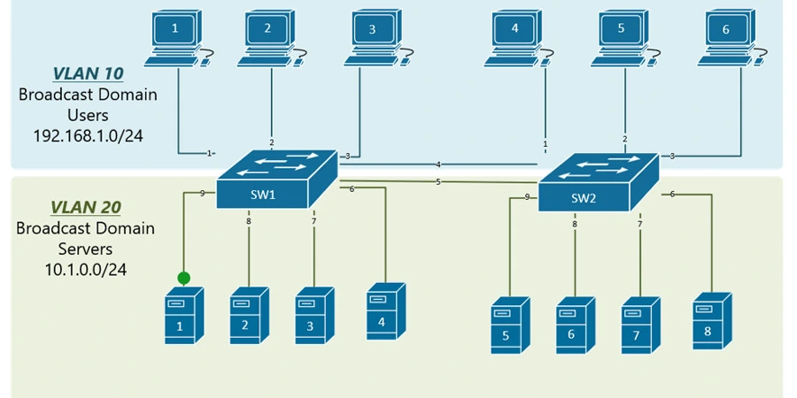
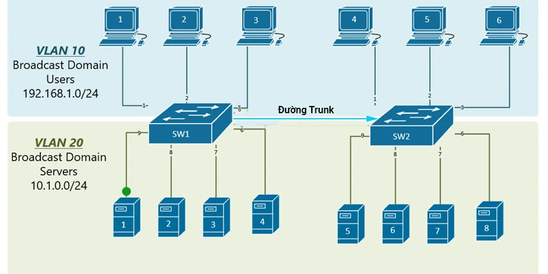
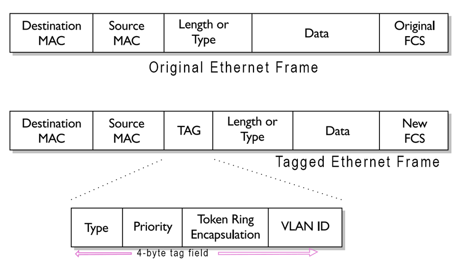
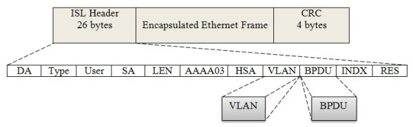
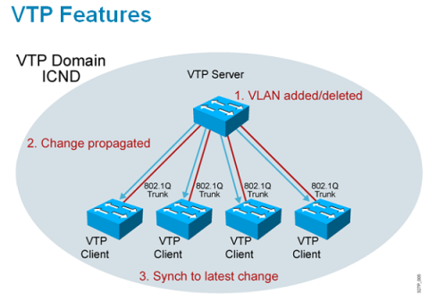
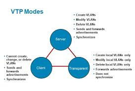
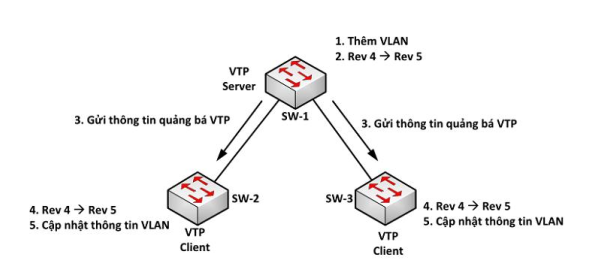
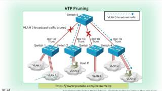
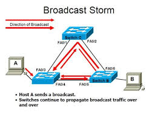

- [TRUNK](#trunk)
  - [Đường Trunk Là Gì?](#đường-trunk-là-gì)
  - [Chuẩn IEEE 802.1Q(DOT1Q)](#chuẩn-ieee-8021qdot1q)
    - [Định Nghĩa 802.1Q](#định-nghĩa-8021q)
    - [Cách hoạt động](#cách-hoạt-động)
    - [Ví trí trong khung Ethernet](#ví-trí-trong-khung-ethernet)
  - [Chuẩn ISL](#chuẩn-isl)
  - [Access Port và Trunk Port](#access-port-và-trunk-port)
    - [Access Port](#access-port)
    - [Trunk Port](#trunk-port)
  - [VTP và STP](#vtp-và-stp)
    - [VTP(VLAN Trunking Protocol)](#vtpvlan-trunking-protocol)
      - [Các Mode hoạt động](#các-mode-hoạt-động)
      - [Hoạt động của sw khi tham gia VTP](#hoạt-động-của-sw-khi-tham-gia-vtp)
      - [VTP Pruning](#vtp-pruning)
    - [STP(Spanning Tree Protocol)](#stpspanning-tree-protocol)
      - [Hoạt Động Của STP](#hoạt-động-của-stp)


# TRUNK
## Đường Trunk Là Gì?
Đường Trunk hay Trunking là một kỹ thuật kết nối các thiết bị mạng với nhau để tạo thành một mạng lớn hơn, đặc biệt trong các mạng LAN (Local Area Network) hoặc các mạng VLAN (Virtual Local Area Network).

Đường trunk cho phép chuyển gói dữ liệu từ một VLAN này sang một VLAN khác trên cùng một đường truyền vật lý, điều này giúp tối ưu hóa việc sử dụng băng thông và giảm độ trễ trong mạng.



Hai máy trong cùng VLAN nhưng khác switch liên lạc được, ta phải kết nối các cổng tương ứng trên 2 Switch lại với nhau.

Ví dụ: muốn kết nối máy tính 1 (kết nối với Switch 1) trong mạng VLAN 10 tới máy tính 4 (kết nối với Switch 2) trong mạng VLAN 10 thì phải sử dụng dây kết nối số 4

Nếu có nhiều VLAN thì ta phải thêm nhiều dây kết nối giữa 2 switch -> tốn cap, tốn port.

`Giải pháp đường Trunk`:



**Đường trunk** là một kết nối mạng chuyên dụng được thiết lập giữa các thiết bị mạng, như switch hoặc router, để truyền dữ liệu giữa các mạng con (subnet) hoặc VLANs. Đường trunk cho phép truyền thông qua một đường truyền vật lý duy nhất.

Khi một cổng được cấu hình trunk, dữ liệu từ nhiều VLAN sẽ truyền qua cùng một đường truyền. Để phân biệt gói tin thuộc VLAN nào, người ta sử dụng các giao thức gắn thẻ (tagging). Có 2 chuẩn phổ biến là IEEE 802.1Q (DOT1Q) và ISL.

## Chuẩn IEEE 802.1Q(DOT1Q)
### Định Nghĩa 802.1Q
- IEEE 802.1Q (còn gọi là DOT1Q) là tiêu chuẩn mở do IEEE phát triển, được sử dụng rộng rãi trên các thiết bị mạng của nhiều hãng khác nhau (Cisco, HP, Juniper...).
- Gói tin VLAN khi đi qua cổng trunk sẽ được gắn thẻ VLAN (VLAN Tagging) theo chuẩn 802.1Q.



### Cách hoạt động
- Thêm một thẻ (tag VLAN) vào gói tin Ethernet để xác định VLAN mà nó thuộc về.
- Kích thước tag VLAN: 4 byte(32 bit) được chèn vào giữa phần Header và Payload

### Ví trí trong khung Ethernet
Khung ethernet bình thường(không VLAN):
```css
[MAC đích] [MAC nguồn] [EtherType] [Payload]
```

Khung ethernet có VLAN tag 802.1Q:
```css
[MAC đích] [MAC nguồn] [TAG] [EtherType] [Payload]
```

TAG bao gồm 4 thành phần ta quan tâm đến 2 thành phần chính là:
- Type(16 bits) luôn là 0x8100.
- VLAN ID(12 bits).

## Chuẩn ISL



- Thay vì chèn TAG vào giữa frame thì ISL chèn thêm 26 bytes thông tin VLAN vào đầu của frame.

## Access Port và Trunk Port
### Access Port
- Chức năng: Mỗi cổng truy cập chỉ được gán một VLAN duy nhất.
- Mục đích: Kết nối các thiết bị trong 1 VLAN.

### Trunk Port
- Chức năng: addtag và untag cho các frame ở đường trunk.
- Mục đích: kết nối giữa các switch với nhau để mở rộng VLAN.

|Đặc điểm|Access Port|Trunk Port|
|---|---|---|
|Số lượng VLAN|Một VLAN duy nhất|Nhiều VLAN|
|Gắn thẻ|Không|Gắn thẻ bằng các chuẩn|
|Kết nối cho|Thiết bị host|Switch|

## VTP và STP
### VTP(VLAN Trunking Protocol)
- Mục đích: Tự động đồng bộ VLAN trên toàn bộ hệ thống mà không cần cấu hình thủ công từng Switch.



- Đưa tất cả switch vào 1 VTP domain.
- Trên sw1 khi add/delete VLAN thì toàn bộ sw còn lại sẽ thay đổi theo.

Bước 1: Tạo sự thay đổi VLAN.
Bước 2: Lan truyền sự thay đổi.
Bước 3: Các sw nằm dưỡi sẽ đồng bộ với sự thay đổi gần nhất.

#### Các Mode hoạt động



1) Mode Server:
- Có thể tạo, sửa, xóa VLAN
- Gửi thông tin cho các sw khác
- Học sự thay đổi từ các sw khác, và có thể truyền thông tin cho người khác học.

2) Mode Client:
- Không thể tạo, sửa, xóa VLAN.
- Học thông tin VLAN.
- Có thể gửi thông tin VLAN và truyền thông tin cho người khác.

3) Mode Transparent:
- Tạo, sửa, xóa thông tin VLAN. Nhưng chỉ trong local của switch đó.
- Không gửi và không học thông tin VLAN của ai.
- Nhưng có thể forward thông tin cho người khác.

#### Hoạt động của sw khi tham gia VTP



- VTP gửi thông điệp như multicast frame trong 1 VTP domain.
- VTP server và client được đồng bộ theo số revision cao nhất.
- Chỉ các sw thuộc cùng VTP domain hoặc password mới có thể trao đổi với nhau:
  - Cấu hình trên các sw tên miền bằng cách khai báo cho các con sw 1 VTP domain, có thể đặt thêm password để đảm bảo cơ chế bảo mật.
- Mỗi con sw khi tham gia VTP đều mang 1 số REV:
  - Số REV ban đầu luôn = 0, cứ mỗi lần sw tạo, sửa hoặc xóa VLAN thì số REV sẽ tăng thêm 1 đơn vị.
  - Thời điểm ban đầu chỉ có 1 VLAN cho sw1 -> REV = 0, thực hiện lệnh tạo VLAN 2 -> số REV = 1, thực hiện lệnh VLAN 3 -> số REV = 2, thực hiện lệnh xóa VLAN 3 -> số REV = 3.
    -> Càng tạo nhiều cấu hình VLAN thì số REV càng cao.
    -> Cẳ server và client đều phải đồng bộ cấu hình VLAN theo cái cấu hình VLAN có số REV cao nhất.


#### VTP Pruning



- sw server bật tính năng VTP pruning, các server client thông báo xem có ID VLAN giống với VLAN của máy host vừa gửi broadcast hay không?
- Nếu không có nó ngắt đường trunk nối đến sw server để không truyền dữ liệu đến nó nữa -> giúp tiết kiệm băng thông.

### STP(Spanning Tree Protocol)
- STP giúp ngăn chặn các vòng lặp(loops) trong mạng bằng cách tạo ra 1 cây bao trùm(spanning tree) để đảm bảo chỉ có một đường dẫn hoạt động giữa các switch.



- Hiện tượng Broadcast storm.
- Bảng địa chỉ MAC thay đổi liên tục -> hiện tượng bảng MAC không ổn định.

#### Hoạt Động Của STP
1) Tìm Root sw:
- Ban đầu tất cả các sw đều coi mình là root sw, sau đó tất cả các sw sẽ gửi cho các sw còn lại 1 gói BPDU, gói này là đơn vị của dữ liệu trong STP nó chứa Bridge - ID, Bridge - ID gồm 8 bytes: 2 bytes Priority và 6 bytes MAC. Các sw sẽ tìm ra sw có Bridge - ID nhỏ nhất sẽ là root sw.
- So sánh bridge - ID: Ta sẽ so sánh Priority trước, nếu 2 Priority bằng nhau ta mới so sánh MAC giữa chúng.
- So sánh địa chỉ MAC: so sánh từng số hexa một, gặp khác biệt thì loại MAC có số hexa lớn hơn.
- Chỉ có root sw mới được quyền gửi BPDU, các con sw khác chỉ được forward BPDU đi ngang qua nó.

2) Tìm Root port:
- Trên những con sw không phải root sw, phải tiến hành tìm 1 port được gọi là root port.
- Root port là port cung cấp đường về root sw cho con sw đang xét mà có `tổng path-cost` là nhỏ nhất.

|Bandwidth|Cost|
|---|---|
|10Mbps|100|
|100Mbps|19|
|1Gbps|4|
|10Gbps|2|

- Nếu nhiều cổng có cùng tổng path-cost thì cổng nào nối con sw neighbor có Bridge - ID nhỏ hơn thì cổng đó là root port.
- Nếu nhiểu cổng có cùng tổng path-cost mà lại có cùng 1 con sw neighbor có Bridge - ID nhỏ nhất thì ta xét đến cổng nào kết nối với Port - ID nhỏ hơn sẽ là root port.

3) Tìm Designated port:
- Trên mỗi phân đoạn mạng, tìm 1 cổng designated port. Là port cung cấp đường về root sw cho phân đoạn mạng(không phải cho sw) mà có tổng path-cost nhỏ nhất.
- Tất cả các cổng của root sw đều là designated port, các cổng đấu nối với công root port sẽ là designated port.

4) Sau khi tìm được hết các cổng Designated port thì cổng port còn lại sẽ là Blocking port.

