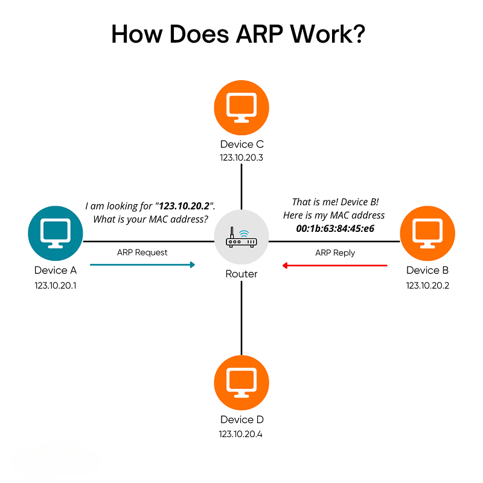

# ARP(Address Resolution Protocol)
## ARP là gì?

Giao thức giải quyết địa chỉ (ARP - Address Resolution Protocol) là một giao thức mạng được áp dụng để xác định địa chỉ phần cứng, cụ thể là địa chỉ MAC (Media Access Control), của một thiết bị từ địa chỉ IP nguồn. Nó thường được sử dụng khi một thiết bị muốn liên lạc với các thiết bị khác trong phạm vi mạng cục bộ.

## Các loại ARP
- `Proxy ARP`: 
  - Là "thiết bị trung gian"(router) đứng ra trả lời thay cho IP nằm ở mạng khác, như thể IP đó nằm trong mạng LAN này.
  - Cách hoạt động:
    - Thiết bị A trong mạng **192.168.1.0/24** gửi ARP: “Ai có IP **192.168.2.5**?”
    - Router thấy IP **192.168.2.5** không nằm trong mạng này, nhưng nó biết đường đi đến mạng **192.168.2.0/24**.
    - Router trả lời ARP thay: “Tôi (router) có IP đó” và cung cấp địa chỉ MAC của router.
    - Thiết bị A gửi frame Ethernet tới MAC của router, router nhận được và chuyển tiếp gói tới IP đích thật (**192.168.2.5**).
- `Gratuitous ARP`:
  - Là một gói ARP do thiết bị tự gửi đi, không phải để hỏi địa chỉ MAC của IP khác, mà để:
    - Thông báo cho các thiết bị khác trong mạng rằng “IP này giờ là MAC này”.
    - Kiểm tra xem có ai khác đang dùng IP đó (phát hiện xung đột IP).
  - Nghĩa là thiết bị “tự giới thiệu” MAC của mình cho mọi người, thay vì đợi người khác hỏi.
  - Cách hoạt động:
    - Khi một máy có IP 192.168.1.10 vừa khởi động, nó sẽ gửi một gói ARP: “Ai có IP 192.168.1.10?” (đây là chính nó)
    - Mục đích: 
      - Nếu không ai trả lời → IP chưa ai dùng → an toàn.
      - Nếu có ai trả lời → có xung đột IP.
    - Đồng thời, các thiết bị khác trong LAN sẽ cập nhật bảng ARP của họ với MAC mới của IP 192.168.1.10.
- `Reverse ARP`:
  - Một thiết bị không biết địa chỉ IP của mình, nhưng biết địa chỉ MAC của nó, sẽ gửi yêu cầu RARP để xin một địa chỉ IP từ server.
  - Cách hoạt động: 
    - Một thiết bị chưa có IP gửi một gói RARP Request lên mạng LAN với MAC của nó.
    - RARP Server trong mạng sẽ trả về một RARP Response chứa IP tương ứng với MAC đó.
    - Thiết bị nhận IP và bắt đầu hoạt động.

## Cách hoạt động của ARP
1) Máy A kiểm tra ARP cache
- Nếu đã có IP <-> MAC trong bảng ARP, dùng luôn, không hỏi nữa.
- 
2) Nếu chưa có, gửi ARP Request(Broadcast)
- A gửi gói ARP Request đến FF:FF:FF:FF:FF:FF(broadcast MAC):
    "Ai có IP 192.168.1.5 thì cho xin MAC"

3) Máy B(IP 192.168.1.5) nhận được ARP Request
- B gửi ARP Reply về cho riêng A:
    "MAC của tôi là 00:11:22:33:44:55"

4) Máy A nhận được ARP Reply
- Lưu IP <-> MAC vào bảng ARP cache.
- Dùng MAC vừa nhận để chuyển dữ liệu.