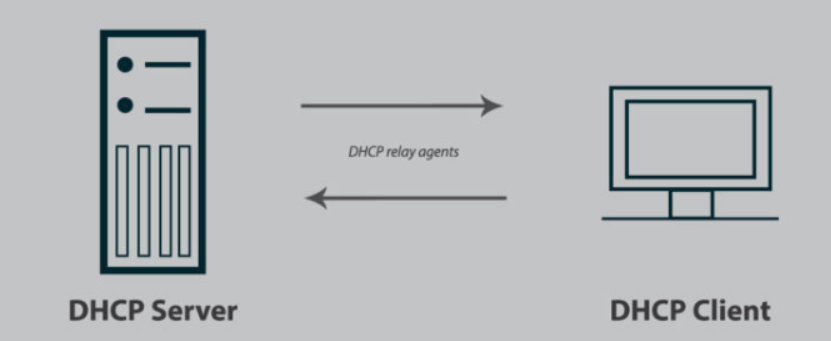
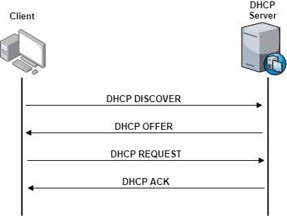

- [DHCP(Dynamic Host Configuration Protocol)](#dhcpdynamic-host-configuration-protocol)
  - [I. DHCP là gì?](#i-dhcp-là-gì)
  - [II. DHCP dùng để làm gì?](#ii-dhcp-dùng-để-làm-gì)
  - [III. Thành Phần DHCP](#iii-thành-phần-dhcp)
  - [IV. Cách Hoạt Động DHCP](#iv-cách-hoạt-động-dhcp)

# DHCP(Dynamic Host Configuration Protocol)
## I. DHCP là gì?

DHCP(Dynamic Host Configuration Protocol) là giao thức cấu hình tự động cho host.

## II. DHCP dùng để làm gì?

Nó cung cấp cho các host địa chỉ IP, Subnet Mask, default Gateway. Nó cung cấp 1 database trung tâm để theo dõi tất cả các máy tính trong hệ thống mạng. Mục đích là tránh trường hợp 2 máy tính khác nhau lại chung 1 địa chỉ IP. Ngoài việc cung cấp địa chỉ IP, DHCP còn cung cấp các thông tin cấu hình khác, cụ thể là DNS.

Và nó thường được cấp phát bởi DHPC server được tích hợp sẵn trên router.

DHCP giao tiếp bằng UDP và sử dụng port 67 và 68. DHCP server sử dụng port 67 để nghe thông tin từ các client và sử dụng port 68 để reply thông tin.

Hiện nay DHCP có 2 version: IPv4 và IPv6

## III. Thành Phần DHCP

1) DHCP client: 
- Là thiết bị yêu cầu cấp địa chỉ IP.
- Bất kỳ thiết bị nào có thể kết nối mạng đều có thể làm DHCP Client: máy tính, laptop, điện thoại, camera IP, máy in mạng, máy chủ…

💡 Hiểu nôm na: “Mình là client, mình xin IP”.

2) DHCP server:
- Là thiết bị cấp phát địa chỉ IP và các thông tin mạng (Gateway, DNS…).
- Có thể là:
  - Một router.
  - Một máy chủ chạy phần mềm DHCP(Windows Server, Linux, ...).
- Server nhận yêu cầu của client, chọn IP phù hợp trong “pool” (dải IP) rồi gửi cho client.

3) DHCP Relay Agent

- Là thiết bị trung gian chuyển tiếp yêu cầu DHCP từ client đến server khi chúng không nằm chung mạng con (subnet).
- Vì gói DHCP Discover của client là broadcast (chỉ lan trong 1 subnet), nên nếu server ở subnet khác thì client sẽ không “thấy” server.
- DHCP Relay Agent giúp “đưa” gói đó qua router đến server thật.
- Hoạt động:
  - Lắng nghe các gói tin DHCP broadcast từ client trong subnet của nó.
  - Thêm thông tin về subnet của client vào gói tin.
  - Chuyển tiếp các gói tin DHCP (Discover, Request) dưới dạng unicast đến DHCP server.
  - Chuyển tiếp các gói tin phản hồi từ DHCP server dưới dạng broadcast đến subnet của client.

## IV. Cách Hoạt Động DHCP

Thành phần chính gồm 4 gói tin : DISCOVER, OFFER, REQUEST, ACK

Kịch bản quá trình cấp phát IP trong giao thức DHCP:

1) Client tạo ra bản tin DISCOVER để yêu cầu cấp phát địa chỉ IP và gửi đi tới các Server. (Do chưa biết chính xác địa chỉ Server cấp IP cho mình nên gói tin sẽ gửi ở dạng Broadcast)

2) Các Server nhận bản tin DISCOVER của Client gửi:
- Nó sẽ kiểm tra xem địa chỉ IP nào phù hợp để cấp cho Client.
- Server tạo bản tin OFFER (chứa thông tin về IP và các thông số cấu hình khác mà Client yêu cầu để có thể sử dụng để truy cập Internet)
- Các Server sẽ gửi bản tin OFFER dưới dạng Broadcast.

3) Client nhận các gói OFFER:
- Client chọn OFFER (có thể là gói tin đầu tiên nhận được , hoặc là gói có chứa IP mà nó đã từng dùng trước đó ). Còn nếu không nhận được gói OFFER nào thì nó sẽ gửi lại gói DISCOVER 1 lần nữa:
- Tạo gói REQUEST và gửi dưới dạng Broadcast tới tất cả các Server. Nếu nó nhận OFFER từ Server nào thì gói REQUEST gửi về Server đó sẽ mang ý nghĩa đồng ý nhận IP, còn các Server khác thì thông báo là không nhận OFFER đó.

4) Server nhận bản tin REQUEST (Đối với các Server không được nhận OFFER thì sẽ bỏ qua gói tin này)
- Server xử lí gói tin REQUEST: Kiểm tra xem IP này còn sử dụng được không.
- Nếu còn sử dụng được thì nó ghi lại thông tin và gửi lại gói tin ACK cho Client. Nếu không thì sẽ gửi lại PNAK để quay lại bước 1.