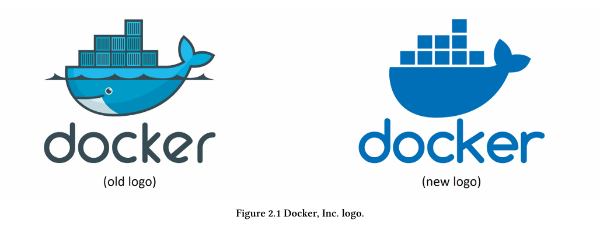
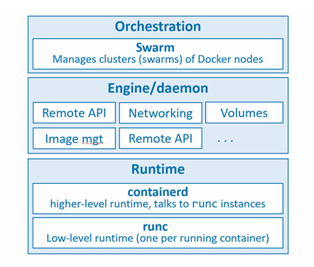

# Docker

1 cuốn tài liệu hoặc 1 cuộc trò chuyện về container sẽ không đầy đủ nếu không nói về Docker. Nhưng khi chúng ta nói `Docker`, chúng ta có thể đang ám chỉ 1 trong những điều sau:

1. Docker, Inc - Công ty 

2. Công nghệ Docker 

## Docker - The TLDR

Docker là phần mềm chạy trên Linux và Windows. Nó tạo ra, quản lý và thậm chí có thể điều phối các container

Phần mềm này hiện được xây dựng từ nhiều công cụ khác nhau thuộc dự án mã nguồn mở `Moby`. Docker, Inc là công ty đã tạo ra công nghệ này và tiếp tục phát triển các công nghệ cũng như giải pháp giúp việc đưa code từ máy tính cá nhân (laptop) của bạn chạy trên môi trường cloud trở nên dễ dàng hơn 

## Docker, Inc. 

Docker, Inc. là một công ty công nghệ có trụ sở tại San Francisco, được thành lập bởi Solomon Hykes 

Ban đầu, công ty hoạt động như một nhà cung cấp nền tảng dưới dạng dịch vụ (PaaS) có tên là dotCloud. Ở phía sau, nền tảng dotCloud được xây dựng dựa trên các container Linux. Để hỗ trợ việc tạo và quản lý các container này, họ đã phát triển một công cụ nội bộ và sau đó đặt biệt danh là `Docker`

Thời điểm hiện tại, Docker, INC. đang tập trung vào các sản phẩm như `Docker Desktop` và `Docker Hub` nhằm đơn giản hóa quá trình từ mã nguồn trên laptop cho đến khi ứng dụng được chạy trên cloud

## The Docker technology
Khi hầu hết mọi người nói về Docker, họ đang đề cập đến công nghệ dùng để chạy container. Tuy nhiện, có ít nhất 3 thành phần bạn cần lưu ý khi nhắc đến công nghệ Docker:

1. Runtime (môi trường thực thi)

2. Daemon (Engine)

3. Orchestrator (bộ điều phối)

**runtime:**

Hoạt động ở tầng thấp nhất và chịu trách nhiệm khởi động cũng như dừng các container. Docker triển khai một kiến trúc runtime phân tầng, gồm runtime cấp thấp và runtime cấp cáo phối hợp với nhau 

Runtime cấp thấp được gọi là `runc`, nhiệm vụ của nó là tương tác trực tiếp với hệ điều hành bên dưới để khởi động và dừng container. Mỗi container đang chạy trên một node Docker đều có một instance của runc quản lý 

Runtime cấp cao hơn được gọi là `containerd`, `containerd` làm nhiều việc hơn so với `runc`. Nó quản lý toàn bộ vòng đời của container, bao gồm:
- kéo image (pull images)
- tạo interface mạng
- quản lý các instance runc ở tầng thấp 

Một cài đặt Docker điển hình sẽ có một tiến trình containerd duy nhất (docker-containerd) điều khiển các instance runc (docker-runc) tương ứng container đang chạy

**Docker daemon (dockerd):**

Nằm phía trên containerd và thực hiện các tác vụ ở mức cao hơn như:

- Cung cấp Docker Remote API
- Quản lý image, volume, network, ...

Một nhiệm vụ quan trọng của Docker daemon là cung cấp một giao diện tiêu chuẩn, dễ sử dụng, giúp trừu tượng hóa (abstract) các tầng thấp bên dưới 

**Orchestrator:**

Docker cũng hỗ trợ sẵn việc quản lý các cụm node chạy Docker. 

Các cụm này được gọi là `swarms` và công nghệ tương ứng là `Docker Swarm`.

`Docker Swarm` dễ sử dụng và đã được nhiều công ty áp dụng trong môi trường production thực tế. Tuy nhiên, hiện nay đa số người dùng lựa chọn `Kubernetes` thay vì `Docker Swarm`

## The Open Container Initiative (OCI)

Open Container Initiative (OCI) là một hôi đồng quản trị chịu trách nhiệm tiêu chuẩn hóa các thành phần cốt lõi ở mức thấp của hạ tầng container. 

Cụ thể, họ tập trung vào hai thứ chính: 
- định dạng image 
- container runtime 

Tiêu chuẩn chính của OCI: 
- `image-spec` -> chuẩn cho container image 
- `runtime-spec` -> chuẩn cho container runtime

> OCI = tiêu chuẩn chung giúp toàn bộ hệ sinh thái container hoạt động thống nhất và tương thích 

