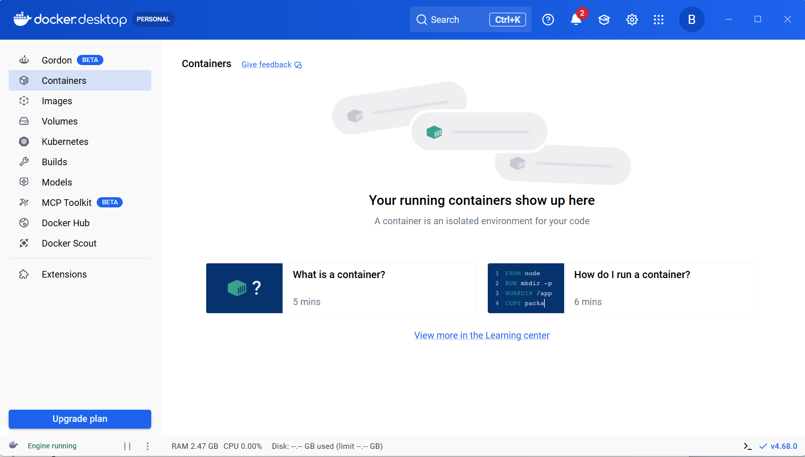
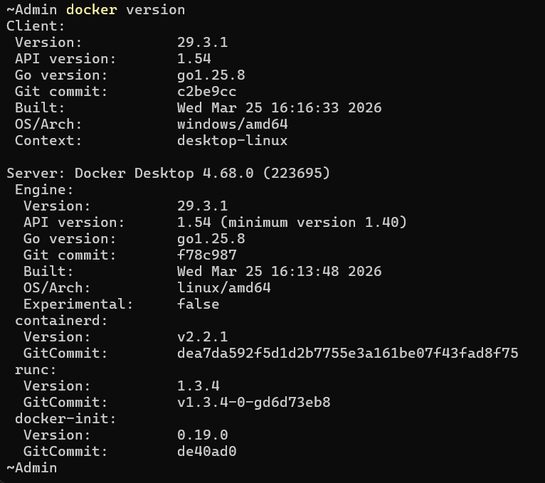
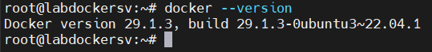
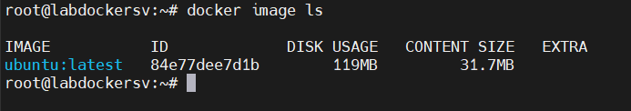
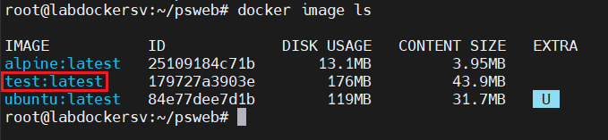
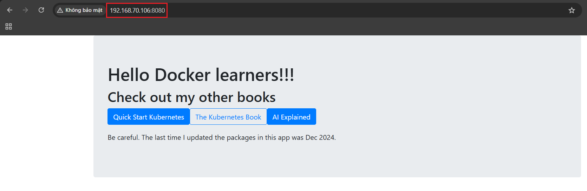

# Installing Docker

Có rất nhiều cách và môi trưởng để cài đặt Docker: Windows, Mac và Linux.

Bạn có thể cài trên cloud, on-premises (tại chỗ), hoặc trên laptop.

Ngoài ra còn có cài đặt thủ công, cài đặt bằng script, cài đặt qua wizard, ...

Ta sẽ đề cập đến các nội dung sau: 

- Docker Desktop cài đặt trên: 
  - Windows 10
  - Mac
- Cài đặt trên server: 
  - Linux
- Play with Docker

## Docker Desktop 

Docker Desktop là một sản phẩm đóng gói của Docker, Inc.. Nó chạy trên các phiên bản 64-bit của Windows 10 và Mac, rất dễ tải về cũng như cài đặt 

Docker Desktop trên Windows 10 có thể chạy cả container Windows gốc lẫn container Linux. Docker Desktop trên Mac chỉ có thể chạy container Linux.

### Windows pre-reqs
Docker Desktop trên Windows yêu cầu tất cả các điều sau:

- Phiên bản Windows 10 64-bit thuộc các bản Pro / Enterprise / Education (không hoạt động với bản Home)
- Hệ thống phải bật hỗ trợ ảo hóa phần cứng (hardware virtualization) trong BIOS
- Các tính năng Hyper-V và Containers phải được bật trong Windows

### Installing Docker Desktop on Windows 10





### Installing Docker Desktop on Mac

## Installing Docker on Linux 

### Install

- Update hệ thống: 

  ```bash
  sudo apt update
  ```

- install Docker from the official repo

  ```bash
  sudo apt install docker.io
  ```

- Kiểm tra phiên bản docker: 

  

  ```bash
  root@labdockersv:~# docker info
  Client:
  Version:    29.1.3
  Context:    default
  Debug Mode: false
  Plugins:
    trust: Manage trust on Docker images (Docker Inc.)
      Version:  29.1.3
      Path:     /usr/libexec/docker/cli-plugins/docker-trust

  Server:
  Containers: 0
    Running: 0
    Paused: 0
    Stopped: 0
  Images: 0
  Server Version: 29.1.3
  Storage Driver: overlayfs
    driver-type: io.containerd.snapshotter.v1
  Logging Driver: json-file
  Cgroup Driver: systemd
  Cgroup Version: 2
  Plugins:
    Volume: local
    Network: bridge host ipvlan macvlan null overlay
    Log: awslogs fluentd gcplogs gelf journald json-file local splunk syslog
  CDI spec directories:
    /etc/cdi
    /var/run/cdi
  Swarm: inactive
  Runtimes: io.containerd.runc.v2 runc
  Default Runtime: runc
  Init Binary: docker-init
  containerd version:
  runc version:
  init version:
  Security Options:
    apparmor
    seccomp
    Profile: builtin
    cgroupns
  Kernel Version: 5.15.0-171-generic
  Operating System: Ubuntu 22.04.5 LTS
  OSType: linux
  Architecture: x86_64
  CPUs: 6
  Total Memory: 5.782GiB
  Name: labdockersv
  ID: aa93d2ff-0a7e-4718-b1a5-a44fa07ff6ab
  Docker Root Dir: /var/lib/docker
  Debug Mode: false
  Experimental: false
  Insecure Registries:
    ::1/128
    127.0.0.0/8
  Live Restore Enabled: false
  Firewall Backend: iptables
  ```

### Một số lệnh docker 

**image**

- Sử dụng `image ls` để liệt kê các image:

  ```bash
  root@labdockersv:~# docker image ls
                                                                                                                                            i Info →   U  In Use
  IMAGE   ID             DISK USAGE   CONTENT SIZE   EXTRA
  root@labdockersv:~#
  ```

  Trong đó: 

  - `IMAGE`: tên image + tag: ubuntu = tên image, latest = phiên bản 
  - `ID`: ID duy nhất của image 
  - `DISK USAGE`: Tổng dung lượng image chiếm trên ổ đĩa
  - `CONTENT SIZE`: Dung lượng thực của nội dung image
  - `EXTRA`: Thông tin bổ sung 


- Pull 1 image ubuntu:

  ```bash
  root@labdockersv:~# docker image pull ubuntu:latest
  latest: Pulling from library/ubuntu
  689b91d88a0f: Pull complete
  b22f29e93d86: Download complete
  Digest: sha256:84e77dee7d1bc93fb029a45e3c6cb9d8aa4831ccfcc7103d36e876938d28895b
  Status: Downloaded newer image for ubuntu:latest
  docker.io/library/ubuntu:latest
  root@labdockersv:~#
  ```

  

**Containers**

Khi đã có image, ta sử dụng `docker container run` để khởi động container

```bash
root@labdockersv:~# docker container run -it ubuntu:latest /bin/bash
root@ab608aab6eac:/#
```

- `docker container run`: khởi động container mới 
- Option `-it` yêu cầu docker làm cho container thành interactive và gắn shell hiện tại vào terminal của container

Kiểm tra các process của container thấy có 2 tiến trình đang chạy:

```bash
root@ab608aab6eac:/# ps -ef
UID          PID    PPID  C STIME TTY          TIME CMD
root           1       0  0 07:13 pts/0    00:00:00 /bin/bash
root          10       1  0 07:16 pts/0    00:00:00 ps -ef
root@ab608aab6eac:/#
```

Để thoát khỏi container về docker và để nó chạy nền, sử dụng lần lượt `ctrl + p`, `ctrl + q`. Sau đó tại server, kiểm tra các container đang chạy:

```bash
root@labdockersv:~# docker container ls
CONTAINER ID   IMAGE           COMMAND       CREATED         STATUS         PORTS     NAMES
ab608aab6eac   ubuntu:latest   "/bin/bash"   4 minutes ago   Up 4 minutes             distracted_albattani
root@labdockersv:~#
```

Trong đó: 

- `CONTAINER ID`: ID rút gọn của container 
- `IMAGE`: image dùng để tạo container 
- `COMMAND`: lệnh đang chạy bên trong container -> đây là process chính (PID 1) của container (Nếu process này dừng -> container cũng dừng)
- `CREATED`: Thời điểm container được tạo 
- `STATUS`: trạng thái hiện tại 
- `PORTS`: Mapping port giữa host <-> container 
- `NAMES`: Tên container (Docker tự đặt)

### Chạy dockerfile

- clone 1 repo có sẵn trên git:

  ```bash
  git clone https://github.com/nigelpoulton/psweb.git
  ```

- Di chuyển đến thư mục mới clone: 

  ```bash
  root@labdockersv:~# cd psweb/
  root@labdockersv:~/psweb# ls
  Dockerfile  README.md  app.js  package.json  views
  root@labdockersv:~/psweb#
  ```

- Build container từ docker file:

  ```bash
  docker image build -t test:latest .
  ```

  Trong đó:
  - `docker image build`: lệnh dùng để build image, Docker sẽ đọc file `Dockerfile` để tạo image
  - `-t test:latest`: -t = tag (đặt tên cho image)  


  Kiểm tra lại image đã có trên máy:

  

- Run container từ image, đặt tên là `webtest` và port trên web là `8080`:

  ```bash
  root@labdockersv:~/psweb# docker container run -d \
  > --name webtest \
  > --publish 8080:8080 \
  > test:latest
  21d5c257ea41cc990ae131e79bec6b16e856db5a301796a2b1da168874acd4ff
  root@labdockersv:~/psweb#
  ```

  Trong đó:

  - `docker container run`: tạo container mới và chạy nó 
  - `-d (detach)`: Chạy container ở background
  - `--name webtest`: Đặt tên container là webtest
  - `--publish 8080:8080`: Map port giữa host <-> container
  - `test:latest`: image dùng để tạo container

- Kiểm tra:

  ```bash
  root@labdockersv:~/psweb# docker container ls
  CONTAINER ID   IMAGE           COMMAND           CREATED          STATUS          PORTS                                         NAMES
  21d5c257ea41   test:latest     "node ./app.js"   2 minutes ago    Up 2 minutes    0.0.0.0:8080->8080/tcp, [::]:8080->8080/tcp   webtest
  ab608aab6eac   ubuntu:latest   "/bin/bash"       37 minutes ago   Up 36 minutes                                                 distracted_albattani
  root@labdockersv:~/psweb#
  ```

  