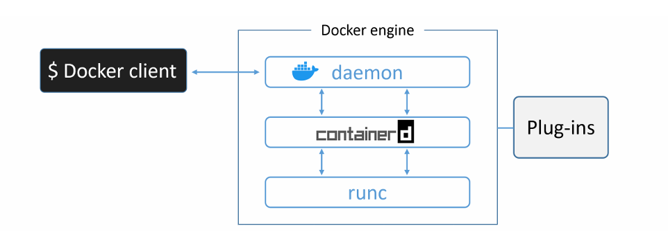
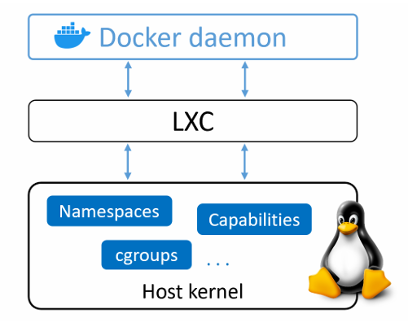
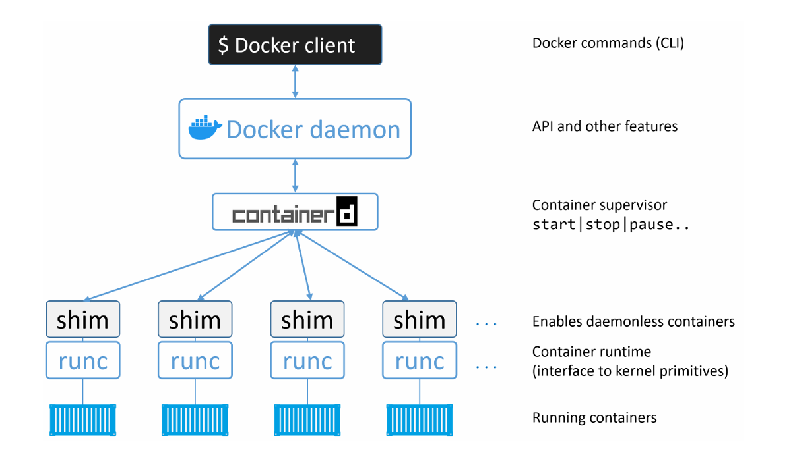
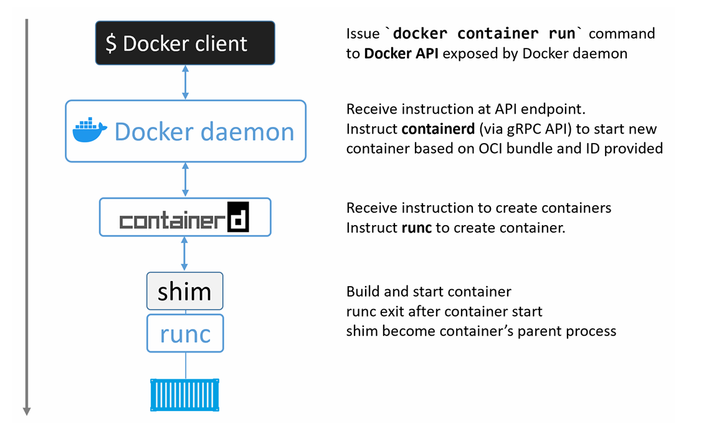
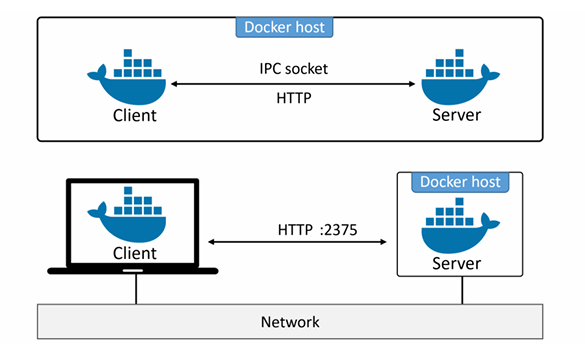
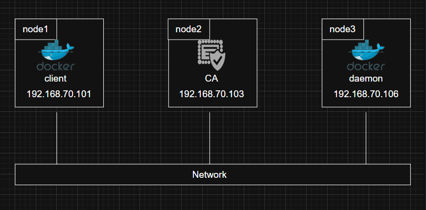
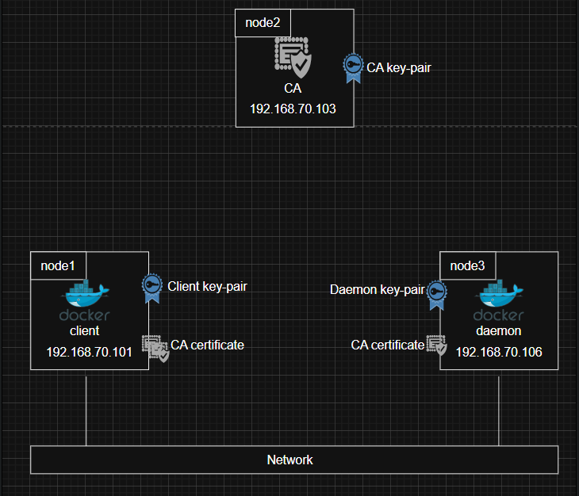
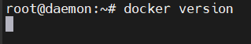
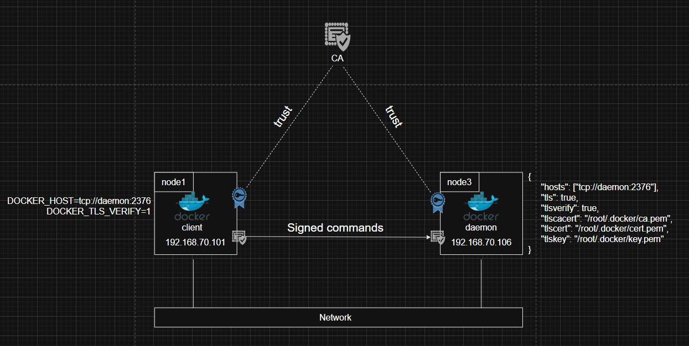

# The Docker Engine
Chúng ta sẽ xem cách Docker Engine hoạt động bên trong 

Bạn hoàn toàn có thể sử dụng Docker mà không cần hiểu những nội dung trong chương này, nên nếu muốn bạn có thể bỏ qua. Tuy nhiên, để thực sự thành thạo một công nghệ, bạn cần hiểu những gì diễn ra “bên trong”. Vì vậy, để trở thành một người giỏi Docker, bạn nên nắm được kiến thức trong chương này.

chúng ta sẽ áp dụng cách tiếp cận 3 tầng, chia chương thành 3 phần:

- `TLDR`: 
- `Deep dive`: 
- `Commands`:

## Docker Engine - The TLDR 

Docker Engine là phần mềm cốt lõi dùng để chạy và quản lý container. Chúng ta thường gọi tắt nó là Docker 

Docker Engine có thiết kế dạng module và được xây dựng từ nhiều công cụ nhỏ chuyên biệt. Khi có thể, các công cụ này dựa trên các tiêu chuẩn mở như `OCI (Open Container Initiative)` duy trì

Ở khía cạnh khác, Docker Engine giống như một động cơ oto - cả 2 đều có cấu trúc module và được tạo thành từ nhiều bộ phận chuyên biệt nhỏ 

- Động cơ oto gồm nhiều bộ phận như: ống nạp, ga, li-lanh, ... phối hợp với nhau để xe chạy
- Docker Engine bao gồm nhiều công cụ chuyên biệt như: API, execution driver, runtime, ... phối hợp với nhau để tạo và chạy container


Các thành phần chính của Docker Engine bao gồm: 

- Docker daemon
- containerd
- runc
- và các plugin như networking và storage 

Tất cả các thành phần này phối hợp với nhau để tạo và chạy container.



## Docker Engine - The Deep Dive

Khi Docker mới được phát hành, Docker Engine có 2 thành phần chính là:

- Docker daemon 
- LXC

Docker daemon là một binary nguyên khối (monolithic). Nó chứa toàn bộ code cho:

- Docker client
- Docker API
- container runtime
- quá trình build image
- và nhiều thành phần khác 

LXC cung cấp cho daemon quyền truy cập vào các thành phần nền tảng của container có sẵn trong kernel linux:

- namespaces
- control groups



### Getting rid of LXC

Việc phụ thuộc vào LXC là 1 vấn đề ngay từ đầu vì:

- LXC chỉ dành riêng cho Linux. Đây là một vấn đề đối với một dự án có tham vọng hỗ trợ đa nền tảng 
- Việc phụ thuộc vào một công cụ bên ngoài cho một thành phần cốt lõi như vậy là một rủi ro lớn, có thể cản trở quá trình phát triển.

Do đó, Docker Inc. đã phát triển công cụ riêng của họ gọi là `libcontainer` để thay thế LXC. Mục tiêu của `libcontainer` là trở thành một công cụ không phụ thuộc nền tảng (platform-agnostic), cung cấp cho Docker quyền truy cập vào các thành phần nền tảng của container tồn tại trong kernel của máy host 

`Libcontainer` đã thay thế LXC làm execution driver mặc định trong Docker phiên bản 0.9.

### Getting rid of the monolithic Docker daemon

Theo thời gian, tính nguyên khối (monolithic) của Docker daemon ngày càng trở nên có vấn đề:
- Khó cải tiến
- Trở nên chậm hơn
- Không đáp ứng được nhu cầu của hệ sinh thái 

Docker, Inc. nhận thức được những thách thức này và đã bắt đầu một nỗ lực lớn để tách nhỏ daemon nguyên khối và chuyển sang kiến trúc module. Mục tiêu là tách càng nhiều chức năng càng tốt ra khỏi daemon, và triển khai lại chúng dưới dạng các công cụ nhỏ, chuyên biệt

Các công cụ chuyên biệt này có thể:
- dễ dàng thay thế cho nhau 
- được bên thứ 3 tái sử dụng để xây dựng các công cụ khác 

Cách tiếp cận này tuân theo triết lý Unix đã được kiểm chứng: xây dựng các công cụ nhỏ, chuyên biệt, rồi ghép chúng lại để tạo thành hệ thống lớn hơn.

Quá trình tách và tái cấu trúc Docker Engine này đã dẫn đến việc toàn bộ phần thực thi container (container execution) và runtime container được loại bỏ khỏi daemon, và chuyển thành các công cụ nhỏ, chuyên biệt.



### The influence of the Open Container Initiative (OCI)

Trong khi Docker, Inc. đang tách nhỏ daemon và tái cấu trúc code. OCI (Open Container Initiative) đang trong quá trình định nghĩa 2 tiêu chuẩn liên quan đến container:

- Image spec
- Container runtime spec

Cả 2 tiêu chuẩn này được phát hành phiên bản 1.0 vào tháng 7 năm 2017 và sẽ không thay đổi nhiều, vì tính ổn định là yếu tố quan trọng nhất. 

Docker, Inc. đã tham gia sâu vào việc xây dựng các tiêu chuẩn này và đóng góp rất nhiều code

Kể từ Docker 1.11 (2016), Docker Engine triển khai các tiêu chuẩn OCI càng sát càng tốt. Ví dụ, Docker daemon không còn chứa code runtime của container nữa - toàn bộ phần runtime đã được tách ra thành 1 lớp riêng tuân thủ OCI. Mặc định, Docker sử dụng runc cho phần này. runc là bản triển khai tham chiếu của tiêu chuẩn OCI container-runtime-spec. Đây chính là lớp runtime runc

Ngoài ra, thành phần containerd của Docker Engine đảm bảo rằng các Docker image được cung cấp cho runc dưới dạng các OCI bundle hợp lệ.

### runc

runc chỉ có một múc đích duy nhất - tao container 

### containerd

Mục đích duy nhất ban đầu của nó là quản lý vòng đời container: start, stop, pause, rm, ...

containerd có sẵn dưới dạng một daemon cho cả Linux và Windows, Docker đã sử dụng nó trên Linux kể từ phiên bản 1.11. Trong kiến trúc Docker Engine, containerd nằm giữa daemon và runc 

Như trên ta biết containerd ban đầu được thiết kế để làm nhiệm vụ duy nhất là quản lý vòng đời container. Tuy nhiên, nó đã mở rộng và đảm nhận thêm nhiều chức năng khác như:
- pull image
- quản lý volume
- quản lý network 


### Starting a new container (example)

Ta sẽ thử đi qua quy trình tạo một container mới 

Cách phổ biến nhất để khởi chạy container là sử dụng Docker CLI. Lệnh sau sẽ tạo một container đơn giản từ image `alpine:latest`: 

```bash
root@labdockersv:~# docker container run --name ctr1 -it alpine:latest sh
/ #
```

Khi ta nhập lệnh như trên vào Docker CLI, Docker client sẽ chuyển nó thành 1 payload API phù hợp và gửi (POST) tới endpoint API do Docker daemon cung cấp 

API này được triển khai trong daemon và có thể được truy cập qua socket local hoặc qua mạng

Khi daemon nhận được yêu cầu tạo container mới, nó sẽ gọi đến containerd. Nhớ rằng daemon không còn chứa code để tạo container nữa!

Daemon giao tiếp với containerd thông qua một API kiểu CRUD

containerd không trực tiếp tạo container mà sử dụng runc để làm việc này. containerd sẽ chuyển Docker image thành 1 OCI bundle hợp lệ và yêu cầu runc sử dụng bundle đó để tạo container

runc sẽ tương tác với kernel của OS để tập hợp các thành phần cần thiết để tạo container. Tiến trình của container sẽ được khởi chạy như một tiến trình con của runc, và ngay khi container bắt đầu chạy, runc sẽ thoát.



Tóm tắt:

- Chạy:

    ```bash
    docker container run
    ```

- Docker client -> gửi request tới Docker daemon
- Docker daemon: gọi `containerd`
- `containerd`: gọi `runc`
- `runc`: tạo container, start container, thoát
- `shim`: Trở thành process cha của container và giữ container sống

### One huge benefit of this model

Việc loại bỏ toàn bộ logic và code liên quan đến việc khởi chạy và quản lý container khỏi daemon có nghĩa là container runtime đã được tách khỏi Docker daemon

Nó cho phép thực hiện bảo trì và nâng cấp Docker daemon mà không ảnh hưởng đến các container đang chạy

### What's this shim all about?
containerd sử dụng runc để tạo container mới. Thực tế nó tạo một instance runc mới cho mỗi container

Sau khi mỗi container được tạo xong, tiến trình runc cha sẽ thoát

Chúng ta có thể chạy hàng trăm container mà không cần chạy hàng trăm instance runc

Sau khi tiến trình runc cha thoát, tiến trình `containerd-shim` sẽ trở thành tiến trình cha của container. Nó sẽ:
- Giữ các luồng STDIN & STDOUT luôn mở, để khi daemon được khởi động lại, container không bị dừng 
- Báo cáo trạng thái kết thúc (exit status) của container về cho daemon

### How it's implemented on Linux

Trong hệ thống Linux, các thành phần ta nói phía trên được triển khai như sau:

- dockerd (Docker daemon)
- docker-containerd (containerd)
- docker-containerd-shim (shim)
- docker-runc (runc)

### What’s the point of the daemon

Sau khi loại bỏ runtime code và excution, docker daemon, 1 số chức năng chính vẫn tồn tại trong daemon bao gồm: quản lý image, build image, API, authentication, security, core network, orchestration.

### Securing client and daemon communication 

Tìm hiểu cách bỏa mật Docker daemon qua mạng

Docker triển khai mô hình client-server:
- Thành phần client triển khai CLI
- Thành phần server (daemon) triển khai các chức năng, bao gồm cả REST API công khai 


Client có tên là `docker` (`docker.exe` trên Win) và daemon có tên là `dockerd` (`dockerd.exe` trên Win). Cài đặt mặc định sẽ đặt cả hại trên cùng một máy và cấu hình chúng giao tiếp qua socket IPC cục bộ:

- `/var/run/docker.sock` trên Linux
- `//./pipe/docker_engine` trên Windows

Ngoài ra, cũng có thể cấu hình chúng qua mạng. Theo mặc định, giao tiếp qua mạng sử dụng socket HTTP không bảo mật trên cổng `2375/tcp`



Cấu hình không an toàn như vậy có thể chấp nhận trong môi trường lab, nhưng trong production không thể nào chấp nhận được

**Giải pháp TLS:**

Docker cho phép bạn buộc client và daemon chỉ chập nhận các kết nối mạng được bảo mật bằng TLS. Điều này được khuyến nghị trong môi trường production

- Bảo mật client: buộc client chỉ kết nối tới các Docker daemon có chứng chỉ được ký bởi một Certificate Authority (CA) đáng tin cậy
- Bảo mật daemon: buộc daemon chỉ chấp nhận kết nối từ các client có chứng chỉ do CA đáng tin cậy cấp 

## Lab setup 

**Mô hình tổng quan:**



**Quy trìng tổng thể:**

- Cấu hình CA và các Cert
- Tạo CA
- Tạo và ký khóa cho Daemon
- Tạo và ký khóa cho Client
- Phân phối các khóa
- Cấu hình Docker sử dụng TLS
- Cấu hình chế độ daemon
- Cấu hình chế độ client

### Create a CA (self-signed certs)

Chạy các lệnh sau trên node CA trong lab:

1. Tạo private key mới cho CA

    Hãy nhớ passphrase sau khi tạo và sau khi tạo xong ta sẽ có `ca-key.pem` - private key của CA:

    ```bash
    root@ca:~# openssl genrsa -aes256 -out ca-key.pem 4096
    Enter PEM pass phrase:
    Verifying - Enter PEM pass phrase:
    root@ca:~#
    root@ca:~# ls
    ca-key.pem  snap
    root@ca:~#
    ```

2. Dùng private key của CA để tạo public key (certificate)

    Ta sẽ cần nhập lại passphrase trước đó:

    ```bash
    root@ca:~# openssl req -new -x509 -days 730 -key ca-key.pem -sha256 -out ca.pem
    Enter pass phrase for ca-key.pem:
    You are about to be asked to enter information that will be incorporated
    into your certificate request.
    What you are about to enter is what is called a Distinguished Name or a DN.
    There are quite a few fields but you can leave some blank
    For some fields there will be a default value,
    If you enter '.', the field will be left blank.
    -----
    Country Name (2 letter code) [AU]:
    State or Province Name (full name) [Some-State]:
    Locality Name (eg, city) []:
    Organization Name (eg, company) [Internet Widgits Pty Ltd]:
    Organizational Unit Name (eg, section) []:
    Common Name (e.g. server FQDN or YOUR name) []:
    Email Address []:
    root@ca:~#
    ```

    Lúc này ta sẽ có file `ca.pem` - public key của CA, còn gọi là certificate

    ```bash
    root@ca:~# ls
    ca-key.pem  ca.pem  snap
    root@ca:~#
    ```

### Create a key-pair for the daemon

Trong bước này, ta sẽ tạo một cặp khóa mới cho Docker daemon trên node3:
- Tạo private key
- Tạo certificate signing request (CSR)
- Thêm địa chỉ IP và cấu hình cho phép xác thực server
- Tạo certificate

Thực hiện các lệnh sau trên CA (node2)

1. Tạo private key cho daemon

    ```bash
    root@ca:~# openssl genrsa -out daemon-key.pem 4096
    root@ca:~#
    ```

    Lệnh này tạo file `daemon-key.pem` - private key của daemon

2. Tạo certificate signing request (CSR)

    Dùng để CA tạo và ký certificate cho daemon. Hãy đảm bảo dùng đúng DNS name của node daemon (ví dụ: `daemon`).

    ```bash
    root@ca:~# openssl req -subj "/CN=daemon" \
    -sha256 -new -key daemon-key.pem -out daemon.csr
    ```

    Ta sẽ có file `daemon.csr` - đây là CSR

3. Thêm các thuộc tính cần thiết vào certificate

    Tạo file `extfile.cnf` với nội dung:

    ```bash
    subjectAltName = DNS:daemon,IP:192.168.70.106
    extendedKeyUsage = serverAuth
    ```

    - Thêm DNS và IP của daemon
    - cấu hình certificate dùng cho xác thực server

4. Tạo certificate cho daemon

    Dùng CSR, CA key và file cấu hình để ký certificate:

    ```bash
    root@ca:~# openssl x509 -req -days 730 -sha256 \
    -in daemon.csr \
    -CA ca.pem -CAkey ca-key.pem \
    -CAcreateserial \
    -out daemon-cert.pem \
    -extfile extfile.cnf
    Certificate request self-signature ok
    subject=CN = daemon
    Enter pass phrase for ca-key.pem:
    root@ca:~#
    ```

    Ta sẽ có file `daemon-cert.pem` - public key (certificate) của daemon

Như vậy ta đã có:
- CA (`ca.pem` + `ca-key.pem`)
- Key-pair cho daemon (`daemon-key.pem` + `daemon-cert.pem`)

-> Có thể dùng để bảo mật Docker daemon

Ta có thể xóa các file `daemon.csr` và `extfile.cnf`

### Create a key-pair for the client

Ta sẽ làm tương tự như tạo cặp khóa cho daemon

Thực hiện các lệnh sau trên CA (node2):

1. Tạo private key cho node1

    ```bash
    root@ca:~# openssl genrsa -out client-key.pem 4096
    root@ca:~#
    ```

    Ta sẽ có file `client-key.pem`

2. Tạo CSR

    Sử dụng đúng DNS name của node client (Ví dụ: `client`)

    ```bash
    root@ca:~# openssl req -subj '/CN=client' -new -key client-key.pem -out client.csr
    root@ca:~#
    ```

    Ta sẽ có file `client.csr` 

3. Tạo file `extfile.cnf`

    Thêm nội dung sau để certificate hợp lệ cho xác thực client:

    ```bash
    extendedKeyUsage = clientAuth
    ```

4. Tạo certificate cho node1

    Sử dụng CSR, khóa của CA và file `extfile.cnf` để tạo certificate đã ký cho client:

    ```bash
    root@ca:~# openssl x509 -req -days 730 -sha256 \
    -in client.csr \
    -CA ca.pem -CAkey ca-key.pem \
    -CAcreateserial \
    -out client-cert.pem \
    -extfile extfile.cnf
    Certificate request self-signature ok
    subject=CN = client
    Enter pass phrase for ca-key.pem:
    root@ca:~#
    ```

    Ta đã tạo được `client-cert.pem` - public key (certificate) của client

Xóa file `client.csr` và `extfile.cnf`

Lúc này ta đã có các file sau trong thư mục làm việc:

- `ca-key.pem` - private key của CA
- `ca.pem` - certificate (public key) của CA
- `client-cert.pem` - certificate của client
- `client-key.pem` - private key của client
- `daemon-cert.pem` - certificate của daemon
- `daemon-key.pem` - private key của daemon

**Thiết lập quyền cho các file:**

- Loại bỏ quyền ghi và chỉ cho phép đọc đối với private key:

    ```bash
    chmod 0400 ca-key.pem client-key.pem daemon-key.pem
    ```

- Loại bỏ quyền ghi đối với các certificate:

    ```bash
    chmod -v 0444 ca.pem daemon-cert.pem client-cert.pem
    ```

### Distribute keys

Khi đã có đầy đủ khóa và chứng chỉ cần thiết, ta sẽ phân phối chúng tới các node client và daemon:

- `ca.pem`, `daemon-cert.pem`, và `daemon-key.pem` từ CA sang node3(daemon)
- `ca.pem`, `client-cert.pem`, và `client-key.pem` từ CA sang node1(client)

**NOTE:**

Docker yêu cầu các file được copy phải có tên và vị trí như sau:

- `daemon-cert.pem` -> `~/.docker/cert.pem`
- `daemon-key.pem` -> `~/.docker/key.pem`
- `client-cert.pem` -> `~/.docker/cert.pem`
- `client-key.pem` -> `~/.docker/key.pem`

Ta sẽ tạo thư mục ẩn `~/.docker` trên node client và daemon sau đó set quyền (777) cho thư mục này 

**Mô hình lab hiện tại như sau:**



Việc có mặt của public key của CA (`ca.pem`) trên cả node client và daemon chính là điều giúp chúng tin tưởng các certificate được CA ký 

### Configure Docker for TLS

Docker có 2 chế độ TLS:

- chế độ daemon (daemon mode)
- chế độ client (client mode)

Chế độ daemon buộc daemon chỉ cho phép kết nối từ các client có chứng chỉ hợp lệ

Chế độ client yêu cầu client chỉ kết nối tới các daemon có chứng chỉ hợp lệ 

#### Configuring the Docker daemon for TLS

Việc bảo mật daemon đơn giản là thiết lập một vài tham số (flags) trong file cấu hình `daemon.json`:

- `tlsverify` bật xác thực TLS
- `tlscacert` cho daemon biết CA nào được tin cậy
- `tlscert` chỉ ra vị trí certificate của daemon
- `tlskey` chỉ ra vị trí private key của daemon
- `hosts` cho Docker biết daemon sẽ bind trên socket nào 

Chỉnh sửa file `daemon.json`:

```bash
vi /etc/docker/daemon.json
```

```json
{
  "hosts": ["tcp://daemon:2376"],
  "tls": true,
  "tlsverify": true,
  "tlscacert": "/root/.docker/ca.pem",
  "tlscert": "/root/.docker/cert.pem",
  "tlskey": "/root/.docker/key.pem"
}
```

**NOTE:** Các hệ thống Linux dùng systemd không cho phép tùy chọn `hosts` trong `daemon.json`. Thay vào đó, ta sẽ phải cấu hình trong file override của systemd.

```bash
sudo systemctl edit docker
```

Lệnh này sẽ mở file `/etc/systemd/system/docker.service.d/override.conf`. Thêm 3 dòng sau rồi lưu lại:

```bash
[Service]
ExecStart=
ExecStart=/usr/bin/dockerd -H tcp://daemon:2376
```

Reload + restart Docker:

```bash
sudo systemctl daemon-reexec
sudo systemctl daemon-reload
sudo systemctl restart docker
```

Kiểm tra giá trị của `hosts` mới bằng lệnh: 

```bash
ps -elf | grep dockerd
```

```bash
root@daemon:~# ps -elf | grep dockerd
4 S root        3526       1  2  80   0 - 532504 futex_ 14:15 ?       00:00:00 /usr/bin/dockerd -H tcp://daemon:2376
0 S root        3743    2038  0  80   0 -   868 pipe_r 14:15 pts/1    00:00:00 grep --color=auto dockerd
root@daemon:~#
```

Lúc này ta sẽ thử chạy lệnh `docker version` trên node daemon:



Ta thử lại bằng lệnh sau:

```bash
root@daemon:~# docker -H tcp://daemon:2376 version
Client:
 Version:           29.1.3
 API version:       1.52
 Go version:        go1.24.4
 Git commit:        29.1.3-0ubuntu3~22.04.1
 Built:             Fri Mar  6 11:37:07 2026
 OS/Arch:           linux/amd64
 Context:           default
Error response from daemon: Client sent an HTTP request to an HTTPS server.
root@daemon:~#
```

Nếu kết quả của bạn như này tức là đã thành công 

#### Configuring the Docker client for TLS

Ta sẽ cấu hình Docker client trên node1 cho 2 mục đích:
- kết nối tới Docker daemon từ xa qua mạng
- ký tất cả các lệnh docker

Thực hiện các lệnh sau trong node client (node1) 

Export biến môi trường sau để cấu hình client kết nối tới remote daemon qua mạng. Client phải có thể kết nối tới daemon bằng tên host thì mới hoạt động được.

```bash
export DOCKER_HOST=tcp://daemon:2376
```

Chạy lệnh `docker version`:

```bash
root@client:~# docker version
Client:
 Version:           27.5.1
 API version:       1.47
 Go version:        go1.22.2
 Git commit:        27.5.1-0ubuntu3~22.04.2
 Built:             Mon Jun  2 12:18:38 2025
 OS/Arch:           linux/amd64
 Context:           default
Error response from daemon: Client sent an HTTP request to an HTTPS server.
root@client:~#
```

Docker client lúc này đang gửi lệnh tới remote daemon qua mạng mà không cần chỉ định flag `-H tcp://daemon:2376`. Tuy nhiên, ta vẫn cần cấu hình client để ký các lệnh

Export thêm một biến môi trường để nói với Docker client rằng hãy ký tất cả các lệnh bằng certificate của nó.

```bash
export DOCKER_TLS_VERIFY=1
```

Chạy lại lệnh `docker version`:

```bash
root@client:~# docker version
Client:
 Version:           27.5.1
 API version:       1.47
 Go version:        go1.22.2
 Git commit:        27.5.1-0ubuntu3~22.04.2
 Built:             Mon Jun  2 12:18:38 2025
 OS/Arch:           linux/amd64
 Context:           default

Server:
 Engine:
  Version:          29.1.3
  API version:      1.52 (minimum version 1.44)
  Go version:       go1.24.4
  Git commit:       29.1.3-0ubuntu3~22.04.1
  Built:            Fri Mar  6 11:37:07 2026
  OS/Arch:          linux/amd64
  Experimental:     false
 containerd:
  Version:          2.2.1
  GitCommit:
 runc:
  Version:          1.3.4-0ubuntu1~22.04.1
  GitCommit:
 docker-init:
  Version:          0.19.0
  GitCommit:
root@client:~#
```

**Client đã kết nối thành công tới remote daemon qua một kết nội mạng an toàn!!!**

**Mô hình lúc này như sau:**

