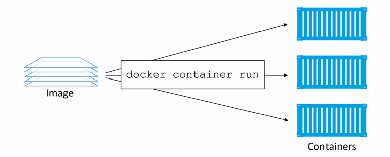
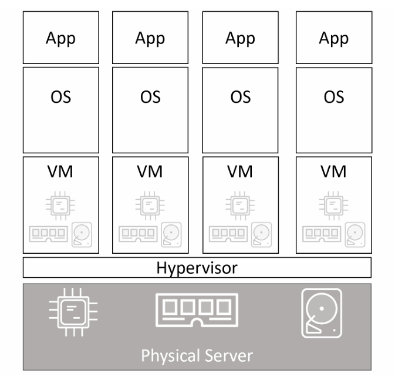
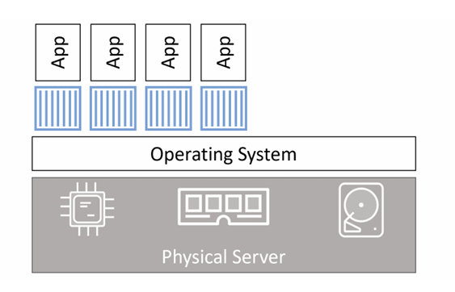
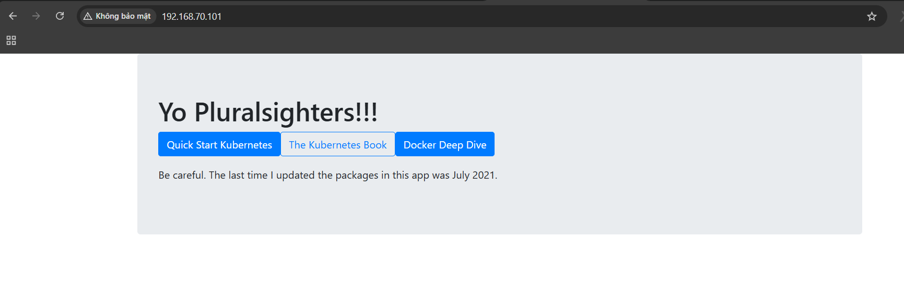
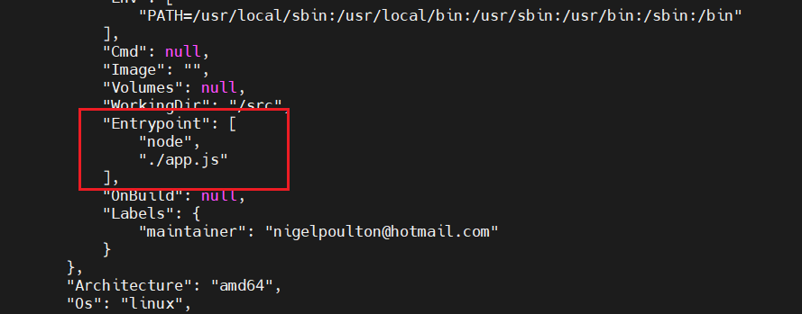

# Containers
## Docker containers - The TLDR

Container là instance đang chạy (runtime instance) của một image. Tương tự như việc bạn có thể khởi động một máy ảo từ một VM template, bạn có thể khởi chạy 1 hoặc nhiều container từ một image duy nhất 



Cách đơn giản nhất để khởi chạy container là dùng lệnh `docker container run`

**Cú pháp:**

```bash
docker container run <image> <app>
```

Ví dụ sau sẽ khởi chạy một container Ubuntu chạy shell Bash:

```bash
$ docker container run -it ubuntu /bin/bash
```

## Docker containers - The deep dive
### Containers vs VMs

Cả container và máy ảo (VM) đều cần một host để chạy. 

Host này có thể là: 
- Laptop 
- máy chủ vật lý trong data center
- 1 instance trên public cloud

Giả sử doanh nghiệp của bạn có một server vật lý cần chạy 4 ứng dụng 

Trong mô hình VM. server vật lý được bật và hypervisor khởi động. Sau đó, hypervisor chiếm toàn bộ tài nguyên phần cứng như CPU, RAM, storage và NIC rồi chia các tài nguyên này thành các phiên bản ảo hoạt động giống hệt phần cứng thật. Tiếp theo, nó đóng gói các tài nguyên này thành một cấu trúc phần mềm gọi là máy ảo (VM).

Sau đó, chúng ta cài hệ điều hành và ứng dụng vào từng VM.

Với kịch bản một server vật lý chạy 4 ứng dụng, chúng ta sẽ tạo 4 VM, cài 4 hệ điều hành và sau đó cài 4 ứng dụng



Trong mô hình container: server được bật và hệ điều hành khởi động. Tương tự như mô hình VM, hệ điều hành chiếm toàn bộ tài nguyên phần cứng. 

Trên nền hệ điều hành đó, chúng ta cài một container engine như Docker.

Container engine sau đó sử dụng các tài nguyên của hệ điều hành và chia chúng thành các môi trường cô lập gọi là container.

Mỗi container sẽ giống như một hệ điều hành thật. Bên trong mỗi container chúng ta sẽ chạy một ứng dụng 



- Hypervisor thực hiện ảo hóa phần cứng - chia tài nguyên phần cứng thành các phiên bản ảo gọi là VM
- container thực hiện ảo hóa hệ điều hành - chia tài nguyên hệ điều hành thành các phiên bản ảo gọi là container

### The VM tax

Như ta đã biết ban đầu VM và container khá giống nhau (đều cần host + OS/hypervisor). Nhưng khác biệt đến từ việc:
- VM - chia phần cứng 
- container - chia OS

Với VM model: 
- Mỗi VM cần 1 OS riêng 
- Tốn CPU, RAM, disk 
- Cần license

Với container model:
- Chỉ có 1 OS duy nhất trên host
- Tất cả container share kernel
- Chỉ tốn 1 OS tax

### Running containers
### Checking that Docker is running
Khi đăng nhập vào một Docker host ta nên kiểm tra lại trạng thái hoạt động của Docker:

```bash
$ docker version
Client: Docker Engine - Community
Version: 19.03.8
API version: 1.40
OS/Arch: darwin/amd64
Experimental: true
Server: Docker Engine - Community
Engine:
Version: 19.03.8
API version: 1.40 (minimum version 1.12)
OS/Arch: linux/amd64
Experimental: true
<Snip>
```

Nếu gặp lỗi ta có thể kiểm tra docker daemon:

- Linux không sử dụng systemd:

    ```bash
    $ service docker status
    docker start/running, process 29393
    ```

- Linux sử dụng systemd:

    ```bash
    $ systemctl is-active docker
    active
    ```

### Starting a simple container
Cách đơn giản nhất để khởi chạy một container là dùng lệnh `docker container run`

```bash
$ docker container run -it ubuntu:latest /bin/bash
Unable to find image 'ubuntu:latest' locally
latest: Pulling from library/ubuntu
d51af753c3d3: Pull complete
fc878cd0a91c: Pull complete
6154df8ff988: Pull complete
fee5db0ff82f: Pull complete
Digest: sha256:747d2dbbaaee995098c9792d99bd333c6783ce56150d1b11e333bbceed5c54d7
Status: Downloaded newer image for ubuntu:latest
root@50949b614477:/#
```

Trong đó:
- `docker container run`: yêu cầu Docker chạy một container mới
- `-it`: làm cho container có tính tương tác và gắn vào terminal của bạn
- `/bin/bash`: các ứng dụng chạy bên trong container


Khi bạn nhấn Enter, Docker client sẽ đóng gói lệnh và gửi (POST) nó đến API server đang chạy trên Docker daemon. Docker daemon nhận lệnh và kiểm tra trong kho image cục bộ xem đã có image đó chưa. Trong ví dụ này, nó chưa có, nên sẽ tìm trên Docker Hub. Khi tìm thấy, nó sẽ tải (pull) về và lưu vào cache cục bộ.

Sau khi image được tải về, daemon sẽ yêu cầu `containerd` và `runc` tạo và khởi động container

Có thể nhận thấy một số lệnh không hoạt động trong container. Lý do là vì các image được tối ưu để nhẹ, nên không bao giờ gồm đầy đủ các công cụ

```bash
root@50949b614477:/# ls -l
# chạy OK

root@50949b614477:/# ping nigelpoulton.com
bash: ping: command not found
```

### Container processes

Khi ta chạy container ubuntu cùng với việc chạy Bash shell (`/bin/bash`). Điều này khiến bash trở thành process duy nhất chạy bên trong container 

```bash
root@50949b614477:/# ps -elf
F S UID PID PPID NI ADDR SZ WCHAN STIME TTY TIME CMD
4 S root 1 0 0 - 4558 wait 00:47 ? 00:00:00 /bin/bash
0 R root 11 1 0 - 8604 - 00:52 ? 00:00:00 ps -elf
```

Nếu bạn đang ở trong container và gõ exit, bạn sẽ kết thúc process Bash và container cũng sẽ dừng (terminate). Điều này là do container không thể tồn tại nếu không có process chính của nó. Điều này đúng cho cả Linux và Windows — nếu process chính bị dừng thì container cũng dừng.

### Container lifecycle

Lifecycle của một container - tạo ra, hoạt động, "nghỉ ngơi", xóa

Chúng ta đã thấy cách khởi chạy container bằng lệnh `docker container run`

Bây giờ ta sẽ sử dụng một cách khác để có thể theo dõi vòng đời của nó. 

```bash
docker container run --name percy -it ubuntu:latest /bin/bash
```

- Đặt tên của container được tạo là `percy`

Bên trong container vừa tạo, ta truy cập thư mục `/tmp` và tạo 1 số file:

```bash
root@c60c487bda43:/# cd tmp/
root@c60c487bda43:/tmp#
root@c60c487bda43:/tmp# ls -l
total 0
root@c60c487bda43:/tmp# echo "This is the first time i learn Docker" > newfile
root@c60c487bda43:/tmp# ls -l
total 4
-rw-r--r-- 1 root root 38 Apr 14 15:41 newfile
root@c60c487bda43:/tmp# cat newfile
This is the first time i learn Docker
root@c60c487bda43:/tmp#
```

Nhấn `Ctrl + P + Q` để thoát khỏi container mà không dừng nó 

Bây giờ, sử dụng lệnh `docker container stop` để dừng container và cho nó "nghỉ ngơi":

```bash
root@client:~# docker container stop percy
percy
```

Chạy lệnh `docker container ls` để liệt kê các container đang chạy:

```bash
root@client:~# docker container ls
CONTAINER ID   IMAGE     COMMAND   CREATED   STATUS    PORTS     NAMES
root@client:~#
```

Container không xuất hiện vì nó đang ở trạng thái đã dừng. 

```bash
root@client:~# docker container ls -a
CONTAINER ID   IMAGE           COMMAND       CREATED          STATUS                            PORTS     NAMES
c60c487bda43   ubuntu:latest   "/bin/bash"   5 minutes ago    Exited (137) About a minute ago             percy
```

Ta sẽ thầy container ở trạng thái `Excited`

Việc dừng container giống như dừng một VM. Mặc dù nó không chạy, nhưng toàn bộ cấu hình và dữ liệu vẫn còn trên hệ thống 

Sử dụng lệnh `docker container start` để "đánh thức" nó:

```bash
root@client:~# docker container start percy
percy
root@client:~# docker container ls
CONTAINER ID   IMAGE           COMMAND       CREATED         STATUS         PORTS     NAMES
c60c487bda43   ubuntu:latest   "/bin/bash"   8 minutes ago   Up 7 seconds             percy
root@client:~#
```

Container đã được khởi động lại. Bây giờ kiểm tra file chúngt a tạo ra trước đó còn tồn tại hay không bằng cách dùng `docker container exec`:

```bash
root@client:~# docker container exec -it percy bash
root@c60c487bda43:/# cd tmp/
root@c60c487bda43:/tmp# ls -l
total 4
-rw-r--r-- 1 root root 38 Apr 14 15:41 newfile
root@c60c487bda43:/tmp# cat newfile
This is the first time i learn Docker
root@c60c487bda43:/tmp#
```

Ta thấy: file vẫn còn và dữ liệu vẫn nguyên vẹn. 

**NOTE:**

- Dữ liệu được lưu trên filesystem của Docker host. Nếu host lỗi, dữ liệu sẽ mất
- Container được thiết kế là immutable (không thay đổi), nên không nên ghi dữ liệu trực tiếp vào nó 

Để xóa container ta có thể sử dụng 1 lệnh duy nhất bằng flag `-f`, nhưng best practice là:
- dừng trước
- xóa sau

```bash
docker container stop percy
docker container rm percy
docker container ls
```

### Stopping containers gracefully

Hầu hết các container trong môi trường Linux sẽ chạy một tiến trình duy nhất.

Trong ví dụ trước, container đang chạy ứng dụng `/bin/bash`. Khi bạn "kill" một container đang chạy bằng lệnh:

```bash
docker container rm <container> -f
```

container sẽ bị dừng ngay lập tức mà không có bất kỳ cảnh báo nào. Nghĩa là bạn không cho container (và ứng dụng bên trong) bất kỳ cơ hội nào để hoàn tất công việc hoặc thoát một cách an toàn 

Ngược lại, lệnh:

```bash
docker container stop
```

Nó gửi tín hiệu trước để tiến trình bên trong container viết rằng nó sắp bị dừng, từ đó có cơ hội dọn dẹp và kết thúc một cách an toàn. Sau khi tiến trình kết thúc, ta sẽ xóa container bằng `docker container rm`

**Cơ chế liên quan đến tín hiệu Linux:**

- `docker container stop` gửi tín hiệu SIGTERM đến tiến trình chính (PID 1) trong container 

  => Cho phép ứng dụng xử lý, dọn dẹp và tự thoát một cách "graceful"

- Nếu sau 10s mà tiến trình chưa thoát

  => Docker sẽ gửi SIGKILL (ép buộc dừng ngay lập tức)

- Trong khi đó, 

  ```bash
  docker container rm <container> -f
  ```

  bỏ qua SIGTERM và gửi thẳng SIGKILL

### Self-healing containers with restart policies

restart policy là một dạng tự phục hồi (self-healing) cho phép Docker tự động khởi động lại container sau khi xảy ra một số sự kiện hoặc lỗi nhất định

Restart policy được áp dụng cho từng container, và có thể được cấu hình bằng cách:
- mệnh lệnh (imperative) trên dòng lệnh trong các câu lệnh `docker container run`
- hoặc khai báo (declarative) trong các file yaml để dùng với các công cụ cấp cao như Docker Swarm, Docker Compose và K8s

Có 3 loại restart policy sau:
- `always`
- `unless-stopped`
- `on-failure`

**Policy always:**

Luôn khởi động lại 1 container đã dừng, trừ khi container đó được dừng bằng `docker container stop`

Ví dụ: ta chạy container với `--restart always`:

```bash
docker container run --name nerversaydie -it --restart always ubuntu:latest bash
```

Chờ vài giây rồi gõ `exit` để két thức tiến trình PID 1 của container và làm container dừng 

```bash
root@client:~# docker container run --name nerversaydie -it --restart always ubuntu:latest bash
root@e2646363feb0:/# exit
exit
root@client:~#
```

Tuy nhiên, ta kiểm tra lại bằng `docker container ls`

```bash
root@client:~# docker container ls
CONTAINER ID   IMAGE           COMMAND   CREATED              STATUS          PORTS     NAMES
e2646363feb0   ubuntu:latest   "bash"    About a minute ago   Up 23 seconds             nerversaydie
root@client:~#
```

Ta thấy container `neversaydie` vẫn đang được chạy nhờ restart policy always 

Ta sử dụng `docker container inspect` để xem chi tiết sẽ thấy trường `RestartCount` tăng lên 1:

```bash
root@client:~# docker container inspect e2646363feb0 | grep RestartCount
        "RestartCount": 1,
root@client:~#
```

**Unless-Stopped** là container sẽ không khởi động lại khi daemon khởi động lại nếu nó được đặt trong Stopped (Exited) state.

**on-failure** sẽ khởi động lại container nếu nó thoát với mã lỗi khác 0. Nó cũng sẽ khởi động lại container khi Docker daemon restart, kể cả những container đang ở trạng thái stopped.

### Web server example

Chạy một container từ một image chạy một web server đơn giản trên port 8080

```bash
root@client:~# docker container run -d --name webserver -p 80:8080 nigelpoulton/pluralsight-docker-ci
Unable to find image 'nigelpoulton/pluralsight-docker-ci:latest' locally
latest: Pulling from nigelpoulton/pluralsight-docker-ci
5843afab3874: Pull complete
c8fa36f3749c: Pull complete
54ac346c930b: Pull complete
4f4fb700ef54: Pull complete
8b62849545a1: Pull complete
Digest: sha256:9b6241ad65941128fb03eb2d1ec7d3c161c26894782ad25e4619131fe68667fe
Status: Downloaded newer image for nigelpoulton/pluralsight-docker-ci:latest
80939d44288926560ca80080b64c88d126493e0ce9fa0f82f578b5f0566dc82b
root@client:~#
```

Trong đó:

- `docker container run`: khởi chạy một container
- `-d`: chạy ở chế độ nền (daemon node)
- `--name webserver`: đặt tên cho container 
- `-p 80:8080`: ánh xạ port
  - 80: port host
  - 8080: port container 

```bash
root@client:~# docker container ls
CONTAINER ID   IMAGE                                COMMAND           CREATED         STATUS         PORTS                                     NAMES
80939d442889   nigelpoulton/pluralsight-docker-ci   "node ./app.js"   2 minutes ago   Up 2 minutes   0.0.0.0:80->8080/tcp, [::]:80->8080/tcp   webserver
root@client:~#
```

Truy cập trên browser:



### Inspecting containers

Trong ví dụ trên, ta không chỉ định app cho container khi chạy lệnh `docker container run` nhưng container vẫn chạy web service.

Khi xây dựng một Docker image, ta có thể nhúng một chỉ thị xác định default app cho bất kỳ container nào sử dụng image đó. 

```bash
docker image inspect nigelpoulton/pluralsight-docker-ci
```



Các default app có thể được khai báo trong `Cmd` hoặc `Entrypoint`

### Tidying up

Ta có cách để xóa toàn bộ container trên Docker host là:

```bash
docker container rm $(docker container ls -aq) -f
```

## Containers - The commands

- `docker container run`: dùng để khởi chạy 1 container mới 
- `Ctrl + P + Q`
- `docker container ls`: liệt kê các container đang chạy (status UP) 
- `docker container exec`: chạy một tiến trình mới bên trong một container đang chạy 
- `docker container stop`: dừng một container đang chạy
- `docker container start`: khởi động lại một container đang dừng
- `docker container rm`:  dùng để xóa container đã dừng 
- `docker container inspect`: hiển thị thông tin chi tiết về cấu hình và trạng thái runtime của container 

