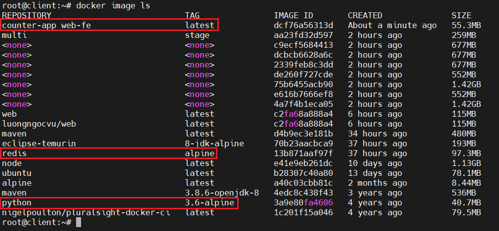
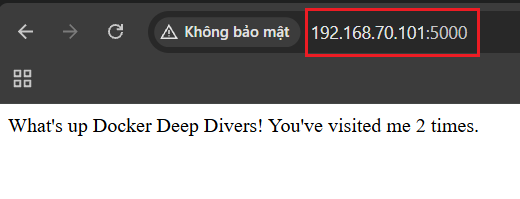
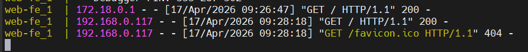

# Deploying Apps with Docker Compose
## Deploying apps with Compose - The TLDR
Các ứng dụng hiện đại được tạo thành từ nhiều dịch vụ nhỏ hơn tương tác với nhau để tạo thành một ứng dụng hoàn chỉnh. Chúng ta gọi mô hình này là microservices. 

Ví dụ: Một ứng dụng có thể bao gồm 7 dịch vụ sau:
- Web frontend
- Ordering
- Catalog
- Cơ sở dữ liệu backend
- Logging
- Authentication
- Authorization

Khi tất cả các dịch vụ này hoạt động cùng nhau, ta sẽ có một ứng dụng hữu ích.

Việc triển khai và quản lý nhiều microservice nhỏ như vậy có thể khó khăn. Đây chính là lúc Docker Compose phát huy tác dụng.

Compose là công cụ giúp build và run các container. Chỉ với 1 lệnh, ta có thể dễ dàng tạo và start toàn bộ các service phục vụ cho việc chạy ứng dụng.

## Deploying apps with Compose - The Deep Dive

Ta sẽ chia thành các phần sau:
- Tổng quan về Compose
- Cài đặt Compose
- Các file Compose
- Triển khai ứng dụng với Compose
- Quán lý ứng dụng với Compose

### Compose background 

Compose là một chương trình python độc lập cần được cài đặt trên Docker Host

Ta định nghĩa các ứng dụng nhiều container (microservices) trong một file YAML, truyền file đó cho lệnh `docker-compose` và Compose sẽ triển khai ứng dụng thông qua Docker API

### Installing Compose

```bash
sudo curl -L \
"https://github.com/docker/compose/releases/download/1.25.5/docker-compose-$(uname -s)-$(uname -m)" \
-o /usr/local/bin/docker-compose
```

```bash
sudo chmod +x /usr/local/bin/docker-compose
```

Kiểm tra cài đặt và phiên bản:

```bash
root@client:~# docker-compose --version
docker-compose version 1.25.5, build 8a1c60f6
```

### Compose files

Docker Compose sử dụng các file YAML để định nghĩa các ứng dụng gồm nhiều service 

Tên mặc định của file YAML trong Compose là `docker-compose.yml`

Ví dụ dưới đây minh họa một file Compose đơn giản, định nghĩa một ứng dụng Flask nhỏ với hai microservices (web-fe và redis). 

```yaml
version: "3.8"
services:
  web-fe:
    build: .
    command: python app.py
    ports:
      - target: 5000
        published: 5000
    networks:
      - counter-net
    volumes:
      - type: volume
        source: counter-vol
        target: /code

  redis:
    image: "redis:alpine"
    networks:
      - counter-net

networks:
  counter-net:

volumes:
  counter-vol:
```

Ứng dụng này là một web server đơn giản đếm số lần truy cập vào một trang web và lưu giá trị đó vào Redis. Chúng ta sẽ gọi ứng dụng này là `counter-app`

Ta thấy: file có 4 key cấp cao nhất là:
- `version`
- `services`
- `networks`
- `volumes`

Tất nhiên là còn có các key khác như `secrets` hoặc `configs`

- `version`: xác định phiên bản của định dạng file Compose 
- `services`: nơi định nghĩa các service của ứng dụng 
- `networks`: cho Docker biết tạo các network mới. Mặc định, Compose sẽ tạo các mạng kiểu bridge — đây là mạng dùng cho một host duy nhất và chỉ kết nối các container trên cùng một Docker host

#### Our specific Compose file 

Compose file định nghĩa toàn bộ app gồm:
- 2 service: `web-fe`, `redis`
- 1 network: `counter-net`
- 1 volume: `counter-vol`

Mỗi service = 1 container:

- `web-fe` -> 1 container
- `redis` -> 1 container 

Tên service sẽ xuất hiện trong tên container 

Nhiệm vụ của service `web-fe`: 
- Build image từ Dockerfile (`build .`)
- Chạy app Python (`app.py`)
- Map port `5000 -> 5000`
- Kết nối network `counter-net`
- Mount volume vào `/code`

-> Đây là container chạy web app

Nhiệm vụ của service `redis`:
- Dùng image có sẵn `redis:alpine`
- Kết nối cùng network `counter-net`

-> Đây là db lưu dữ liệu

Các service giao tiếp với nhau bằng tên service vì cùng network. Ví dụ: `web-fe` gọi `redis` bằng hostname `redis`

Vai trò của Compose:
- Tự động Build image
- Tự động tạo container 
- Tự động kết nối network
- Tự động gán volume

### Deploying an app with Compose

Clone repository về local:

```bash
git clone https://github.com/nigelpoulton/counter-app.git
```

```bash
cd counter-app
```

```bash
root@client:~/counter-app# ls -l
total 20
-rw-r--r-- 1 root root 110 Apr 17 16:01 Dockerfile
-rw-r--r-- 1 root root 187 Apr 17 16:01 README.md
-rw-r--r-- 1 root root 599 Apr 17 16:01 app.py
-rw-r--r-- 1 root root 367 Apr 17 16:01 docker-compose.yml
-rw-r--r-- 1 root root  11 Apr 17 16:01 requirements.txt
root@client:~/counter-app#
```

- `app.py`: source code 
- `docker-compose.yml`: file compose mô tả cách build và triển khai app
- `Dockerfile`: mô tả cách build image cho service `web-fe`
- `requirements.txt`: dependencies

Sử dụng Compose để khởi chạy ứng dụng (tất cả các lệnh sau phải chạy trong thư mục `counter-app`):

```bash
docker-compose up &
```

- `docker-compose up` là cách phổ biến nhất để khởi chạy một Compose app (Ứng dụng nhiều container được định nghĩa trong file Compose) 
- `docker-compose up` sẽ build hoặc pull tất cả image cần thiết, tạo tất cả network và volume cần thiết, và khởi động tát cả container cần thiết 
- Mặc định, `docker-compose up` đọc file có tên `docker-compose.yml`. Nếu file có tên khác thêm flag `-f`:

  ```bash
  docker-compose -f prod-equus-bass.yml up
  ```
- Ta có thể dùng `-d` để chạy ứng dụng ở chế độ nền:

  ```bash
  docker-compose up -d
  ```

- Kiểm tra danh sách image trên docker host sau khi đã chạy app bằng compose:

  

  - `counter-app_web-fe:latest`: được tạo bằng lệnh `build: .` trong file `docker-compose.yml`
  - `python:3.6-alpine`: là base image trong Dockerfile
  - `redis:alpine`: được pull từ Docker Hub bởi `image: "redis:alpine"` trong phần `.services.redis` của file Compose

- Kiểm tra danh sách container:

  ```bash
  root@client:~/counter-app# docker container ls
  CONTAINER ID   IMAGE                COMMAND                  CREATED         STATUS         PORTS                                       NAMES
  6d8fb5087948   counter-app_web-fe   "python app.py"          6 minutes ago   Up 6 minutes   0.0.0.0:5000->5000/tcp, :::5000->5000/tcp   counter-app_web-fe_1
  2a2c3302bda6   redis:alpine         "docker-entrypoint.s…"   6 minutes ago   Up 6 minutes   6379/tcp                                    counter-app_redis_1
  ```

- Kiểm tra danh sách network và volume:

  ```bash
  root@client:~/counter-app# docker network ls
  NETWORK ID     NAME                      DRIVER    SCOPE
  172d91a604f7   bridge                    bridge    local
  063f6fc222dd   counter-app_counter-net   bridge    local
  791a6832dcc4   host                      host      local
  66bb744e0bbc   none                      null      local
  root@client:~/counter-app# docker volume ls
  DRIVER    VOLUME NAME
  local     counter-app_counter-vol
  root@client:~/counter-app#
  ```

- Truy cập ở browser:

  

- Kiểm tra trên host:

  

### Managing an app with Compose

Ta sẽ tìm hiểu cách khởi động, dừng, xóa và xem trạng thái của các ứng dụng được quản lý bởi Docker compose

Dừng ứng dụng bằng câu lệnh:

```bash
docker-compose down
```

```bash
root@client:~/counter-app# docker-compose down
Stopping counter-app_web-fe_1 ... done
Stopping counter-app_redis_1  ... done
Removing counter-app_web-fe_1 ... done
Removing counter-app_redis_1  ... done
Removing network counter-app_counter-net
```

Ta thấy: volume `counter-vol` không bị xóa, lý do là vì volume được thiết kế để lưu dữ liệu lâu dài

```bash
root@client:~/counter-app# docker volume ls
DRIVER    VOLUME NAME
local     counter-app_counter-vol
```

Dùng lệnh sau để khởi động lại ứng dụng chạy ở chế độ nền:

```bash
docker-compose up -d
```

Hiển thị trạng thái của các ứng dụng:

```bash
root@client:~/counter-app# docker-compose ps
        Name                      Command               State                    Ports
--------------------------------------------------------------------------------------------------------
counter-app_redis_1    docker-entrypoint.sh redis ...   Up      6379/tcp
counter-app_web-fe_1   python app.py                    Up      0.0.0.0:5000->5000/tcp,:::5000->5000/tcp
```

Dùng `docker-compose top` để liệt kê các tiến trình chạy bên trong mỗi service (Container):

```bash
root@client:~/counter-app# docker-compose top
counter-app_redis_1
UID    PID    PPID    C   STIME   TTY     TIME             CMD
----------------------------------------------------------------------
lxd   48817   48790   0   16:44   ?     00:00:00   redis-server *:6379

counter-app_web-fe_1
UID     PID    PPID    C   STIME   TTY     TIME                    CMD
--------------------------------------------------------------------------------------
root   48847   48824   0   16:44   ?     00:00:00   python app.py
root   48934   48847   1   16:44   ?     00:00:01   /usr/local/bin/python /code/app.py
```

- Các PID được trả về là PID nhìn từ Docker host (không phải bên trong container).

Dùng lệnh `docker-compose stop` để dừng ứng dụng mà không xóa tài nguyên:

```bash
docker-compose stop
```

Kiểm tra lại trạng thái:

```bash
root@client:~/counter-app# docker-compose ps
        Name                      Command               State    Ports
----------------------------------------------------------------------
counter-app_redis_1    docker-entrypoint.sh redis ...   Exit 0
counter-app_web-fe_1   python app.py                    Exit 0
```

- Ta thấy: việc dừng compose app không xóa app khỏi hệ thống. Nó chỉ dừng các container 

  ```bash
  root@client:~/counter-app# docker container ls -a
  CONTAINER ID   IMAGE                                COMMAND                  CREATED         STATUS                          PORTS                                     NAMES
  9e8a3da42a3f   counter-app_web-fe                   "python app.py"          4 minutes ago   Exited (0) About a minute ago                                             counter-app_web-fe_1
  84c5771ff5b3   redis:alpine                         "docker-entrypoint.s…"   4 minutes ago   Exited (0) About a minute ago                                             counter-app_redis_1
  ```

Ta có thể xóa 1 compose app đã dừng bằng lệnh:

```bash
docker-compose rm
```

- Lệnh này sẽ xóa container và network, nhưng không xóa volume, image, hoặc mã nguồn ứng dụng trong thư mục build context (`app.py`, `Dockerfile`, `requirements.txt`, `docker-compose.yml`).

Khởi động lại ứng dụng và kiểm tra:

```bash
docker-compose restart 
```

```bash
root@client:~/counter-app# docker-compose ps
        Name                      Command               State                    Ports
--------------------------------------------------------------------------------------------------------
counter-app_redis_1    docker-entrypoint.sh redis ...   Up      6379/tcp
counter-app_web-fe_1   python app.py                    Up      0.0.0.0:5000->5000/tcp,:::5000->5000/tcp
```

Ta có thể dùng `docker-compose down` để dừng và xóa ứng dụng trong một lệnh:

```bash
docker-compose down
```

- Ứng dụng bây giờ đã bị xóa. Chỉ còn lại image, volume và mã nguồn.

## Deploying apps with Compose - The Commands

- `docker-compose up` lệnh dùng để deploy một Compose app 
- `docker-compose stop` dừng tất cả các container trong một ứng dụng Compose mà không xóa chúng khỏi hệ thống. Ứng dụng có thể được khởi động lại bằng `docker-compose restart`.
- `docker-compose rm` sẽ xóa một ứng dụng Compose đã dừng. Nó sẽ xóa các container và network, nhưng không xóa volume và image.
- `docker-compose restart` sẽ khởi động lại một ứng dụng Compose đã được dừng bằng `docker-compose stop`. Nếu bạn đã thay đổi ứng dụng Compose sau khi dừng, các thay đổi này sẽ không xuất hiện khi restart. Bạn cần phải deploy lại ứng dụng để áp dụng các thay đổi.
- `docker-compose ps` sẽ liệt kê từng container trong ứng dụng Compose. Nó hiển thị trạng thái hiện tại, lệnh mà mỗi container đang chạy, và các cổng mạng.
- `docker-compose down` sẽ dừng và xóa một ứng dụng Compose đang chạy. Nó xóa container và network, nhưng không xóa volume và image.