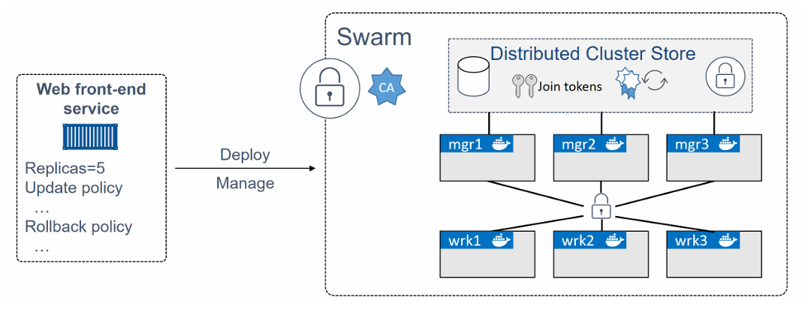
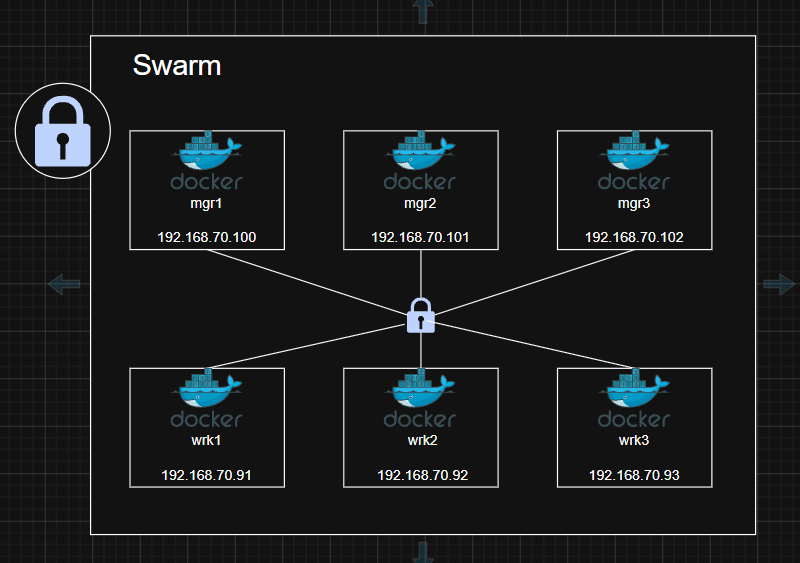
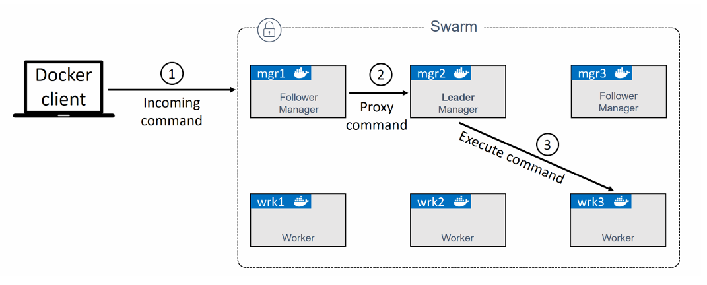
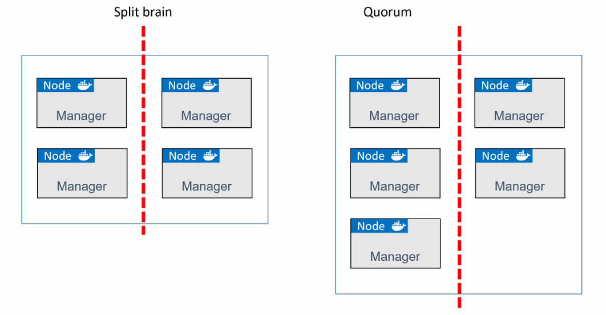
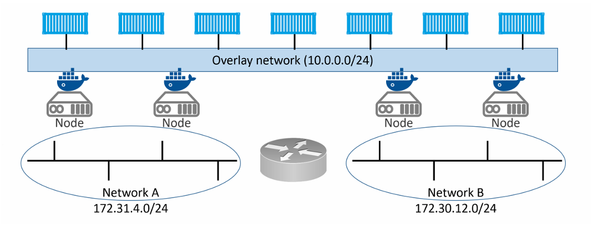
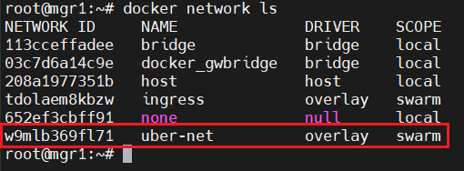
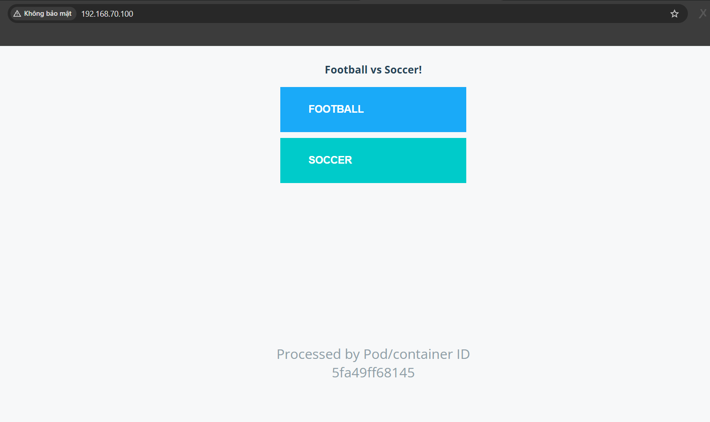

# Docker Swarm 
## Docker Swarm - The TLDR
Docker Swarm gồm 2 thành phần chính: 

1. Một cụm (cluster) các Docker host bảo mật ở cấp độ doanh nghiệp

2. Một engine để điều phối các ứng dụng microservices

Ở khía cạnh clustering, Swarm nhóm một hoặc nhiều node Docker lại và cho phép bạn quản lý chúng như một cluster. Bạn thậm chí có thể thêm hoặc loại bỏ node mà không làm gián đoạn hệ thống

Ở khía cạnh orchestration, Swarm cung cấp một API mạnh mẽ cho phép bạn triển khai và quản lý các ứng dụng microservices phức tạp một cách dễ dàng 

## Docker Swarm - The Deep Dive
### Swarm primer

Ở khía cạnh clustering, một swarm bao gồm một hoặc nhiều node Docker. Các node này có thể là server vật lý, máy ảo (VM) hoặc các instance trên cloud. Các node phải cài Docker và có thể giao tiếp với nhau qua mạng ổn định 

Các node được cấu hình manager hoặc worker:
- Manager đảm nhiệm control plane của cluster, tức là quản lý trạng thái của cluster và phân phối task cho các worker
- Worker nhận task từ manager và thực thi chúng

Cấu hình và trạng thái của Swarm được lưu trong 1 database etcd phân tán nằm trên tất cả manager 

Swarm sử dụng TLS để mã hóa giao tiếp, xác thực node và phân quyền vai trò.

Trong swarm, bạn không chạy container trực tiếp như `docker container run nginx` mà ta sẽ chạy `docker service create nginx` 

=> Swarm không làm việc với container nữa, mà làm việc với service 

Service là một wrapper bên ngoài container, nó chứa: 

- image (nginx, redis, ...)
- số lượng container (replicas)
- network
- policy (update, restart)

Ta không cần quan tâm container cụ thể, ta chỉ cần nói `tôi cần 5 nginx` => Swarm sẽ tự lo phần còn lại 

Service có thể: 

- Scaling:

  ```bash
  docker service scale web=5
  ```

  => Tự tạo 5 container 

- Rolling update:

  ```bash
  docker service update --image nginx:latest web
  ```

  => update từ từ, không downtime

- Rollback:

  => Lỗi => Quay lại version cũ



### Build a secure Swarm cluster 

Ta sẽ xây dựng một cluster swarm an toàn với 3 node manager và 3 node worker

**Mô Hình:**



Ta sẽ cần mở các port sau:
- `2377/tcp`: dùng cho giao tiếp bảo mật giữa client và swarm
- `7946/tcp` và `udp`: dùng cho cơ chế gossip của control plane 
- `4789/udp`: dùng cho mạng overlay dựa trên VXLAN 

Quá trình tổng quát đê buld 1 swarm: 
- Khởi tạo node manager đầu tiên
- Thêm các node manager khác 
- Thêm các node worker 

#### Initializing a new swarm

Các Docker node chưa thuộc một swarm được gọi là đang ở chế độ single-engine. Khi chúng được thêm vào một swarm, chúng sẽ tự động chuyển sang chế độ swarm mode 

chạy lệnh `docker swarm init` trên một Docker host đang ở chế độ single engine sẽ chuyển node đó sang swarm node, tạo một swarm mới và biến node đó thành manager đầu tiên của swarm

Các node khác có thể được thêm vào swarm với vai trò worker hoặc manager. Việc join một Docker host vào một swarm có sẵn cũng sẽ tự động chuyển nó sang swarm mode.

Ban đầu ta sẽ đưa `mgr1` vào swarm node và khởi tạo 1 swarm mới. Sau đó, `wrk1`, `wrk2` và `wrk3` sẽ được thêm vào làm worker. Cuối cùng, `mgr2`, `mgr3` sẽ được thêm vào làm manager 

1. Login vào `mgr1` và khởi tạo một swarm mới 

```bash
docker swarm init \  
--advertise-addr 192.168.70.100:2377 \ 
--listen-addr 192.168.70.100:2377
```

  - `docker swarm init`: yêu cầu Docker khởi tạo một swarm mới và biến node này thành manager đầu tiên. Đồng thời bật swarm mode trên node
  - `--advertise-addr`: đây là endpoint API của swarm được quảng bá cho các node khác (có thể là IP của node hoặc là IP của LB)
  - `--listen-addr`: địa chỉ IP mà node sẽ lắng nghe traffic của swarm. Nếu không chỉ định, nó sẽ mặc định giống với `--advertise-addr`. Nếu `--advertise-addr` là load balancer, bắt buộc phải dùng `--listen-addr` để chỉ định IP nội bộ.


2. Liệt kê các node trong swarm 

```bash
docker node ls
```

```bash
ID                            HOSTNAME   STATUS    AVAILABILITY   MANAGER STATUS   ENGINE VERSION
d345mvqi10bc8kreye4wocbhr *   mgr1       Ready     Active         Leader           27.5.1
```

- `mgr1` là node duy nhất và được đánh dấu là leader 

3. Từ `mgr1` chạy lệnh `docker swarm join-token` để lấy các lệnh và token dùng để thêm worker và manager mới vào swarm 

```bash
root@mgr1:~# docker swarm join-token worker
To add a worker to this swarm, run the following command:

    docker swarm join --token SWMTKN-1-51qwg6uy6v9vs94elbf7wifk2c4j1fcwpxe3p5pt0ddiimns3j-e8ix3sabli4lhyxfqld6resfb 192.168.70.100:2377
```

```bash
root@mgr1:~# docker swarm join-token manager
To add a manager to this swarm, run the following command:

    docker swarm join --token SWMTKN-1-51qwg6uy6v9vs94elbf7wifk2c4j1fcwpxe3p5pt0ddiimns3j-2clpiock9bwevedokkk40dgnu 192.168.70.100:2377
```

**NOTE:** Lệnh join cho worker hay manager giống nhau, chỉ khác ở token. Việc node trở thành worker hay manager phụ thuộc hoàn toàn vào token sử dụng. Cần giữ token an toàn vì chỉ cần token là có thể join vào swarm.

4. Login vào `wrk1` và join vào swarm với vai trò worker:

```bash
docker swarm join \
--token SWMTKN-1-51qwg6uy6v9vs94elbf7wifk2c4j1fcwpxe3p5pt0ddiimns3j-e8ix3sabli4lhyxfqld6resfb \
192.168.70.100:2377 \
--advertise-addr 192.168.70.91:2377 \
--listen-addr 192.168.70.91:2377
```

5. Lặp lại tương tự với `wrk2` và `wrk3`

6. Login vào `mgr2` và join vào swarm với vai trò manager

```bash
docker swarm join \
--token SWMTKN-1-51qwg6uy6v9vs94elbf7wifk2c4j1fcwpxe3p5pt0ddiimns3j-2clpiock9bwevedokkk40dgnu \
192.168.70.100:2377 \
--advertise-addr 192.168.70.101:2377 \
--listen-addr 192.168.70.101:2377
```

7. Lặp lại tương tự với `mgr3`

8. Kiểm tra danh sách node

```bash
docker node ls
```

```bash
ID                            HOSTNAME   STATUS    AVAILABILITY   MANAGER STATUS   ENGINE VERSION
d345mvqi10bc8kreye4wocbhr *   mgr1       Ready     Active         Leader           27.5.1
yjxlv71ig31kp2r2t1r28ejrx     mgr2       Ready     Active         Reachable        27.5.1
tn7b0y8tha0kjvlx9znasj61i     mgr3       Ready     Active         Reachable        27.5.1
p7sp39mutlnztteccbt2z4ayd     wrk1       Ready     Active                          27.5.1
u1rsq5py8dvo18hn60th3838a     wrk2       Ready     Active                          27.5.1
n4mh8mrecayeiwrdnj454k62i     wrk3       Ready     Active                          27.5.1
```

Ta thấy:

- 3 manager (`Leader` hoặc `Reachable`)
- 3 worker 
- Dấu `*` cho biết node bạn đang đăng nhập 

### Swarm manager high availability (HA)

Các manager trong Swarm có hỗ trợ sẵn High Availability (HA). Điều này có nghĩa là một hoặc nhiều node có thể bị lỗi, và các node còn lại vẫn tiếp tục duy trì hoạt động của swarm 

Swarm triển khai một dạng HA multi-manager kiểu active-passive. Mặc dù có nhiều manager, nhưng tại một thời điểm chỉ có một node thực sự hoạt động. Node hoạt động này được gọi là `leader`, và chỉ `leader` mới thực thi các lệnh trực tiệp lên swarm. 

Do đó, chỉ có `leader` mới thay đổi cấu hình hoặc phân công task cho các worker. Nếu một manager dạng follower nhận được lệnh, nó sẽ proxy lệnh đó đến leader



- Bước 1: Lệnh được gửi đến một manager từ Docker client bên ngoài 
- Bước 2: Manager không phải leader nhận lệnh và chuyển tiếp đến leader
- Bước 3: Leader thực thi lệnh trên swarm

**Về HA, có 2 best practice quan trọng:**

1. Triển khai số lượng manager là số lẻ
  
2. Không triển khai quá nhiều manager (khuyển nghị 3 hoặc 5) 

Lý do là vì ta có khái niệm `Quorum (đa số)`: Swarm chỉ hoạt động bình thường khi > 50% manager còn nhìn thấy nhau

Ví dụ:

- 3 manager => cần 2 để hoạt động
- 5 manager => cần 3 để hoạt động

Tình huống `split-brain`: Cluster bị chia thành 2 phần do lỗi mạng:

- 4 manager (số chẵn): Mỗi bên chứa 2 node => Không có bên nào có quorum (> 50%) => bên này không biết bên kia còn sống hay chết => Cluster vẫn chạy nhưng không thể deploy service mới, scale hay update
- 3 manager (số lẻ): sẽ có 1 bên có 2 node và 1 bên 1 node, bên 2 node có quorum nên vẫn tiếp tục hoạt động => cluster vẫn quản lý được 



Tuy nhiên ta cũng không nên dùng quá nhiều manager (Khuyên nghị 3 hoặc 5 node manager). Lý do là vì thuật toán `Raft` trong swarm cần `vote` giữa các node => Càng nhiều node vote càng chậm 

#### Built-in Swarm security

Các cluster Swarm có rất nhiều cơ chế bảo mật được tích hợp sẵn như: cấu hình CA, join token, mutual TLS, kho lưu trữ cluster được mã hóa, mạng được mã hóa, ID node dựa trên mật mã, ...

#### Locking a Swarm 

Các manager cũ hoặc backup cũ có thể gây nguy hiểm:

Giả sử: 

- Trước đây `mgr1` là manager hợp lệ, nó có đầy đủ quyền + dữ liệu cluster. Sau đó, remove `mgr1` khỏi cluster. Nhưng sau này khi `mgr1` được join lại vì nó từng là manager (vẫn có key) => có thể đọc được dữ liệu trong Raft log (db chưa toàn bộ trạng thái của cluster)

- Backup swarm lúc T1, sau đó T2 ta deploy app mới, thay đổi config nhưng lại restore lại backup T1 => Toàn bộ config hiện tại bị ghi đè bởi config cũ, mất service mới, config sai 

Để ngăn các tình huống như vậy, Docker cho phép bạn khóa swarm bằng tính năng `Autolock`: buộc các manager sau khi restart phải cung cấp khóa mở khóa cluster trước khi được phép tham gia lại 

Ta có thể áp dụng khóa ngay khi tạo swarm bằng lệnh:

```bash
docker swarm init --autolock
```

Hoặc nếu đã tạo swarm từ trước ta sử dụng lệnh sau:

```bash
docker swarm update --autolock=true
```

```bash
Swarm updated.
To unlock a swarm manager after it restarts, run the `docker swarm unlock`
command and provide the following key:

    SWMKEY-1-ZK6RJdGnPXLPDGCSJNkO5rpv5waDUKOv/9RHXXA5KwU

Remember to store this key in a password manager, since without it you
will not be able to restart the manager.
```

Ta có thể xem lại khóa mở khóa bằng lệnh:

```bash
docker swarm unlock-key
```

```bash
To unlock a swarm manager after it restarts, run the `docker swarm unlock`
command and provide the following key:

    SWMKEY-1-ZK6RJdGnPXLPDGCSJNkO5rpv5waDUKOv/9RHXXA5KwU

Remember to store this key in a password manager, since without it you
will not be able to restart the manager.
```

Bây giờ trên `mgr2` ta sẽ thử restart lại Docker:

```bash
root@mgr2:~# service docker restart
```

Kiểm tra lại các node trong swarm cluster từ `mgr1`:

```bash
root@mgr1:~# docker node ls
ID                            HOSTNAME   STATUS    AVAILABILITY   MANAGER STATUS   ENGINE VERSION
d345mvqi10bc8kreye4wocbhr *   mgr1       Ready     Active         Leader           27.5.1
yjxlv71ig31kp2r2t1r28ejrx     mgr2       Down      Active         Unreachable      27.5.1
tn7b0y8tha0kjvlx9znasj61i     mgr3       Ready     Active         Reachable        27.5.1
p7sp39mutlnztteccbt2z4ayd     wrk1       Ready     Active                          27.5.1
u1rsq5py8dvo18hn60th3838a     wrk2       Ready     Active                          27.5.1
n4mh8mrecayeiwrdnj454k62i     wrk3       Ready     Active                          27.5.1
```

- status của `mgr2` đã ở trạng thái `Down` và `Unreachable`

Nếu kiểm tra lại các node trong `mgr2`: 

```bash
root@mgr2:~# docker node ls
Error response from daemon: Swarm is encrypted and needs to be unlocked before it can be used. Please use "docker swarm unlock" to unlock it.
```

- Node `mgr2` vẫn chưa được phép tham gia lại swarm 

Để unlock ta chạy lệnh sau trên `mgr2`:

```bash
docker swarm unlock
```

```bash
root@mgr2:~# docker swarm unlock
Enter unlock key:
```

```bash
root@mgr2:~# docker node ls
ID                            HOSTNAME   STATUS    AVAILABILITY   MANAGER STATUS   ENGINE VERSION
d345mvqi10bc8kreye4wocbhr     mgr1       Ready     Active         Leader           27.5.1
yjxlv71ig31kp2r2t1r28ejrx *   mgr2       Ready     Active         Reachable        27.5.1
tn7b0y8tha0kjvlx9znasj61i     mgr3       Ready     Active         Reachable        27.5.1
p7sp39mutlnztteccbt2z4ayd     wrk1       Ready     Active                          27.5.1
u1rsq5py8dvo18hn60th3838a     wrk2       Ready     Active                          27.5.1
n4mh8mrecayeiwrdnj454k62i     wrk3       Ready     Active                          27.5.1
```

- Node `mgr2` đã quay lại trạng thái `Ready` và `Reachable`

### Swarm services

Như ta đã biết, service là một khái niệm mới và chỉ áp dụng trong chế độ swarm

Service cho chúng ta chỉ định hầu hết các tùy chọn quen thuộc của container như tên, map port, attach network và image. Nhưng nó còn bổ sung các tính năng quan trọng theo kiểu cloud-native, bao gồm trạng thái mong muốn (desired state) và tự động điều chỉnh (automatic reconciliation)

Ví dụ: Swarm services cho phép chúng ta một cách khai báo trạng thái mong muốn của ứng dụng, sau đó áp dụng vào swarm và để swarm tự lo việc triển khai và quản lý 

Giả sử ta có 1 ứng dụng với phần front-end web. Bạn có 1 image cho web server cần 5 instance để xử lý lưu lượng truy cập bình thường mỗi ngày. Bạn chuyển yêu cầu này thành một service duy nhất, trong đó chỉ định image cần dùng, và swarm sẽ đảm bảo luôn có 5 instances web server đang chạy

Ta có thể tạo service theo 2 cách: 
- tạo bằng command line với `docker service create`
- tạo bằng stack file 

Trong chapter này ta sẽ tạo bằng command line 

```bash
docker service create --name web-fe \
-p 8080:8080 \
--replicas 5 \
nigelpoulton/pluralsight-docker-ci
```

- `docker service create`: tạo service mới 
- `--name web-fe`: đặt tên service là web-fe
- `-p 8080:8080`: map port 8080 trên mỗi node của swarm tới port 8080 bên trong mỗi replica của service 
- `--replicas 5`: yêu cầu luôn có 5 bản sao của service đang chạy 
- `nigelpoulton/pluralsight-docker-ci`: image cho các replica


Yêu cầu được gửi đến một manager node. Manager đang giữ vai trò leader sẽ tạo ra 5 replica trên toàn bộ swarm. Mỗi node nhận task sẽ pull image và chạy container ở port 8080. Leader cũng lưu lại trạng thái mong muốn của service trong cluster và đồng bộ nó với tất cả manager

Tất cả service luôn được swarm giám sát. Swarm chạy một vòng lặp nền gọi là `reconciliation loop`, liên tục so sánh trạng thái thực tế (observed state) với trạng thái mong muốn (desired state). Nếu 2 trạng thái này khác nhau, swarm sẽ tự động điều chỉnh để đưa trạng thái thực tế về trạng thái mong muốn 

**Ví dụ:** nếu một worker đang chạy một trong 5 replica bị lỗi, trạng thái thực tế sẽ giảm từ 5 xuống 4. Điều này không khớp với trạng thái mong muốn là 5, nên swarm sẽ tự động tạo thêm một replica mới để đưa hệ thống về lại đúng 5. Đây là một nguyên lý quan trọng của các ứng dụng cloud-native, giúp hệ thống có khả năng tự phục hồi (self-healing) khi có lỗi xảy ra.

### Viewing and inspecting services 

Ta có thể sử dụng `docker service ls` để xem danh sách tất cả các service đang chạy trong 1 swarm

```bash
docker service ls
```

```bash
ID             NAME      MODE         REPLICAS   IMAGE                                       PORTS
s9dp2m0myzpf   web-fe    replicated   5/5        nigelpoulton/pluralsight-docker-ci:latest   *:8080->8080/tcp
```

- Ta thấy có tổng 5/5 replica đang chạy

Ta có thể sử dụng lệnh `docker service ps` để xem danh sách các replica của service và trạng thái của từng cái

```bash
docker service ps web-fe
```

```bash
ID             NAME       IMAGE                                       NODE      DESIRED STATE   CURRENT STATE           ERROR     PORTS
iig0oz8pw3bh   web-fe.1   nigelpoulton/pluralsight-docker-ci:latest   mgr1      Running         Running 9 minutes ago
sv4lbj5v7lbq   web-fe.2   nigelpoulton/pluralsight-docker-ci:latest   wrk1      Running         Running 9 minutes ago
rl2dovtbfygm   web-fe.3   nigelpoulton/pluralsight-docker-ci:latest   wrk2      Running         Running 9 minutes ago
u4317ghlzysz   web-fe.4   nigelpoulton/pluralsight-docker-ci:latest   mgr2      Running         Running 9 minutes ago
kf62hb1glrqj   web-fe.5   nigelpoulton/pluralsight-docker-ci:latest   mgr3      Running         Running 9 minutes ago
```

- Ta có thể dùng tên của service hoặc id của service 
- Ta thấy mỗi dòng hiển thị 1 replica(container), cho biết nó đang chạy trên node nào trong swarm, cũng như `desired state` và `current state`

Sử dụng lệnh `docker service inspect` để xem chi tiết về một service 

```bash
docker service inspect web-fe
```

```bash
[
    {
        "ID": "s9dp2m0myzpf4sufegn3mobv8",
        "Version": {
            "Index": 49
        },
        "CreatedAt": "2026-04-22T03:54:54.768969331Z",
        "UpdatedAt": "2026-04-22T03:54:55.086992531Z",
        "Spec": {
            "Name": "web-fe",
            "Labels": {},
            "TaskTemplate": {
                "ContainerSpec": {
                    "Image": "nigelpoulton/pluralsight-docker-ci:latest@sha256:9b6241ad65941128fb03eb2d1ec7d3c161c26894782ad25e4619131fe68667fe",
                    "Init": false,
                    "StopGracePeriod": 10000000000,
                    "DNSConfig": {},
                    "Isolation": "default"
                },
                "Resources": {
                    "Limits": {},
                    "Reservations": {}
                },
                "RestartPolicy": {
                    "Condition": "any",
                    "Delay": 5000000000,
                    "MaxAttempts": 0
                },
                "Placement": {
                    "Platforms": [
                        {
                            "Architecture": "amd64",
                            "OS": "linux"
                        }
                    ]
                },
                "ForceUpdate": 0,
                "Runtime": "container"
            },
            "Mode": {
                "Replicated": {
                    "Replicas": 5
                }
            },
            "UpdateConfig": {
                "Parallelism": 1,
                "FailureAction": "pause",
                "Monitor": 5000000000,
                "MaxFailureRatio": 0,
                "Order": "stop-first"
            },
            "RollbackConfig": {
                "Parallelism": 1,
                "FailureAction": "pause",
                "Monitor": 5000000000,
                "MaxFailureRatio": 0,
                "Order": "stop-first"
            },
            "EndpointSpec": {
                "Mode": "vip",
                "Ports": [
                    {
                        "Protocol": "tcp",
                        "TargetPort": 8080,
                        "PublishedPort": 8080,
                        "PublishMode": "ingress"
                    }
                ]
            }
        },
        "Endpoint": {
            "Spec": {
                "Mode": "vip",
                "Ports": [
                    {
                        "Protocol": "tcp",
                        "TargetPort": 8080,
                        "PublishedPort": 8080,
                        "PublishMode": "ingress"
                    }
                ]
            },
            "Ports": [
                {
                    "Protocol": "tcp",
                    "TargetPort": 8080,
                    "PublishedPort": 8080,
                    "PublishMode": "ingress"
                }
            ],
            "VirtualIPs": [
                {
                    "NetworkID": "tdolaem8kbzwf14oo52ghy4ys",
                    "Addr": "10.0.0.8/24"
                }
            ]
        }
    }
]
```

Ta có thể thêm option `--pretty` để hiển thị output ngắn gọn và dễ đọc hơn:

```bash
root@mgr1:~# docker service inspect --pretty web-fe

ID:             s9dp2m0myzpf4sufegn3mobv8
Name:           web-fe
Service Mode:   Replicated
 Replicas:      5
Placement:
UpdateConfig:
 Parallelism:   1
 On failure:    pause
 Monitoring Period: 5s
 Max failure ratio: 0
 Update order:      stop-first
RollbackConfig:
 Parallelism:   1
 On failure:    pause
 Monitoring Period: 5s
 Max failure ratio: 0
 Rollback order:    stop-first
ContainerSpec:
 Image:         nigelpoulton/pluralsight-docker-ci:latest@sha256:9b6241ad65941128fb03eb2d1ec7d3c161c26894782ad25e4619131fe68667fe
 Init:          false
Resources:
Endpoint Mode:  vip
Ports:
 PublishedPort = 8080
  Protocol = tcp
  TargetPort = 8080
  PublishMode = ingress
```

### Replicated vs global services
Chế độ nhân bản (replication mode) mặc định của một service là replicated. Chế độ này triển khai một số lượng replica mong muốn và phân bố chúng đều nhất có thể trên toàn bộ cluster.

Chế độ còn lại là global, trong đó mỗi node trong swarm sẽ chạy đúng một replica.

Để triển khai một service ở chế độ global, bạn cần thêm cờ `--mode global` vào lệnh `docker service create`.


### Scaling a service

Một tính năng khác của service là khả năng dễ dàng scale (mở rộng hoặc thu hẹp)

Ví dụ: scale service `web-fe` đơn giản bằng cách chạy lệnh `docker service scale`

```bash
docker service scale web-fe=10
```

- Số lượng replica của service tăng từ 5 lên 10. Nó sẽ cập nhập `desired state` của service từ 5 thành 10

```bash
root@mgr1:~# docker service ls
ID             NAME      MODE         REPLICAS   IMAGE                                       PORTS
s9dp2m0myzpf   web-fe    replicated   10/10      nigelpoulton/pluralsight-docker-ci:latest   *:8080->8080/tcp
```

- Ta thấy `REPLICAS` đã thành 10/10

```bash
root@mgr1:~# docker service ps web-fe
ID             NAME        IMAGE                                       NODE      DESIRED STATE   CURRENT STATE                ERROR     PORTS
iig0oz8pw3bh   web-fe.1    nigelpoulton/pluralsight-docker-ci:latest   mgr1      Running         Running 3 hours ago
sv4lbj5v7lbq   web-fe.2    nigelpoulton/pluralsight-docker-ci:latest   wrk1      Running         Running 3 hours ago
rl2dovtbfygm   web-fe.3    nigelpoulton/pluralsight-docker-ci:latest   wrk2      Running         Running 3 hours ago
u4317ghlzysz   web-fe.4    nigelpoulton/pluralsight-docker-ci:latest   mgr2      Running         Running 3 hours ago
kf62hb1glrqj   web-fe.5    nigelpoulton/pluralsight-docker-ci:latest   mgr3      Running         Running 3 hours ago
oihsc1qsyi8w   web-fe.6    nigelpoulton/pluralsight-docker-ci:latest   wrk3      Running         Running 58 seconds ago
x7jrztjvxngx   web-fe.7    nigelpoulton/pluralsight-docker-ci:latest   mgr3      Running         Running about a minute ago
oldxc8oadsm9   web-fe.8    nigelpoulton/pluralsight-docker-ci:latest   mgr1      Running         Running about a minute ago
ra99zwbod9bh   web-fe.9    nigelpoulton/pluralsight-docker-ci:latest   wrk1      Running         Running about a minute ago
u26jd3ym8wn2   web-fe.10   nigelpoulton/pluralsight-docker-ci:latest   wrk3      Running         Running 58 seconds ago
```

Ta cũng có thể scale ngược lại từ 10 thành 5 bằng lệnh:

```bash
docker service scale web-fe=5
```

### Removing a service 
Sử dụng `docker service rm` để xóa service đã được triển khai:

```bash
docker service rm web-fe
```

Kiểm tra:

```bash
root@mgr1:~# docker service ls
ID        NAME      MODE      REPLICAS   IMAGE     PORTS
```

Nên cẩn thận khi dùng `docker service rm` vì nó sẽ xóa toàn bộ replica của service mà không yêu cầu xác nhận 

### Rolling updates 
Nhờ có Docker services, việc cập nhật các ứng ụng microservices được thiết kế tốt trở nên dễ dàng

Ta sẽ thực hiện triển khai một service mới. Đầu tiên, ta sẽ tạo một overlay network mới cho service

```bash
docker network create -d overlay uber-net
```

- Lệnh này tạo 1 overlay network mới tên là `uber-net`

Overlay network tạo ra một mạng layer2 mới để các container có thể tham gia, và tất cả container trong đó đều có thể giao tiếp với nhau (kể cả các node trong swarm nằm trên các mạng vật lý khác nhau)



- 4 node trong swarm nằm trên 2 mạng underlay khác nhau, được kết nối bằng 1 router layer3
- Overlay network trải rộng trên cả 4 node tạo thành 1 network layer2 cho container sử dụng

Kiểm tra network đã được tạo thành công chưa:

```bash
docker network ls
```



Tạo một service mới và gắn nó vào network này:

```bash
docker service create --name uber-svc \ 
--network uber-net \
-p 80:80 \
--replicas 12 \
nigelpoulton/tu-demo:v1
```

- `--name uber-svc`: đặt tên cho service
- `--network uber-net`: yêu cầu tất cả các replica chạy trên network `uber-net`
- `-p 80:80`: expose port 80 trên toàn bộ swarm và map nó tới port 80 bên trong mỗi replica
- `nigelpoulton/tu-demo:v1`: image 


```bash
root@mgr1:~# docker service ls
ID             NAME       MODE         REPLICAS   IMAGE                     PORTS
lzayo9dvdy7r   uber-svc   replicated   12/12      nigelpoulton/tu-demo:v1   *:80->80/tcp
root@mgr1:~# docker service ps uber-svc
ID             NAME          IMAGE                     NODE      DESIRED STATE   CURRENT STATE            ERROR     PORTS
qy7a8jrgukdq   uber-svc.1    nigelpoulton/tu-demo:v1   wrk2      Running         Running 23 seconds ago
afl5mrjvarys   uber-svc.2    nigelpoulton/tu-demo:v1   wrk3      Running         Running 21 seconds ago
572dj4c46dam   uber-svc.3    nigelpoulton/tu-demo:v1   mgr2      Running         Running 21 seconds ago
l381ohzpajas   uber-svc.4    nigelpoulton/tu-demo:v1   wrk1      Running         Running 22 seconds ago
pkihgeej7s67   uber-svc.5    nigelpoulton/tu-demo:v1   mgr3      Running         Running 21 seconds ago
i2yjmg03eewv   uber-svc.6    nigelpoulton/tu-demo:v1   mgr2      Running         Running 22 seconds ago
ycfor4w8yr3k   uber-svc.7    nigelpoulton/tu-demo:v1   mgr3      Running         Running 22 seconds ago
ernmqcsca037   uber-svc.8    nigelpoulton/tu-demo:v1   wrk2      Running         Running 22 seconds ago
4zyhyzp8n5cw   uber-svc.9    nigelpoulton/tu-demo:v1   wrk1      Running         Running 21 seconds ago
9p2h4fr3uhet   uber-svc.10   nigelpoulton/tu-demo:v1   mgr1      Running         Running 19 seconds ago
mvzrk2f9tztr   uber-svc.11   nigelpoulton/tu-demo:v1   wrk3      Running         Running 22 seconds ago
fetde6ey4ar8   uber-svc.12   nigelpoulton/tu-demo:v1   mgr1      Running         Running 20 seconds ago
```

- `-p 80:80` sẽ tạo ra một ánh xạ port trên toàn bộ swarm - mọi traffic đi vào bất kỳ node nào trong swarm ở port 80 đều được chuyển tiếp tới port 80 của một replica bất kỳ của service 

- Chế độ publish cổng này trên mọi node trong swarm — kể cả những node không chạy replica — được gọi là `ingress mode` và là mặc định. Chế độ thay thế là `host mode`, trong đó service chỉ được publish trên những node đang chạy replica. Để dùng `host mode`, bạn cần dùng cú pháp đầy đủ như sau:

    ```bash
    docker service create --name uber-svc \
    --network uber-net \
    --publish published=80,target=80,mode=host \
    --replicas 12 \
    nigelpoulton/tu-demo:v1
    ```

Trên browser bạn chỉ cần nhập IP của node bất kì nào trong swarm:



Trong ví dụ trên thì đây là một ứng dụng bỏ phiếu đơn giản, cho phép ghi nhận phiếu bầu cho `football` vs `soccer`. 

Bây giờ thay vì việc vote `football` hay `soccer` ta muốn thay đổi lựa chọn vote sang một phiên bản mới. Một image container mới đã được tạo cho cuộc khảo sát mới và được đẩy lên cùng repo trên Docker Hub, nhưng lần này được gắn tag `v2` thay vì `v1`

Bây giờ ta sẽ update image mới lên swarm theo từng bước: mỗi lần 2 replica với khoảng nghỉ 20s giữa mối lần. 

```bash
docker service update \
--image nigelpoulton/tu-demo:v2 \
--update-parallelism 2 \
--update-delay 20s uber-svc
```

- `docker service update`: update các service đang chạy bằng cách thay đổi trạng thái mong muốn (desired state) của service 
- `--update-parallelism 2`: update 2 replica 1 lần 
- `--update-delay`: khoảng nghỉ 20s giữa mỗi lần

Nếu bạn chạy `docker service ps uber-svc` trong khi quá trình update đang diễn ra, bạn sẽ thấy một số replica đang chạy v2 trong khi một số khác vẫn chạy v1. Sau khi đủ thời gian (khoảng 4 phút), tất cả replica sẽ đạt trạng thái mong muốn mới là sử dụng image v2.

```bash
root@mgr2:~# docker service ps uber-svc
ID             NAME             IMAGE                     NODE      DESIRED STATE   CURRENT STATE             ERROR     PORTS
qy7a8jrgukdq   uber-svc.1       nigelpoulton/tu-demo:v1   wrk2      Running         Running 21 minutes ago
d1uw1o8cvudg   uber-svc.2       nigelpoulton/tu-demo:v2   wrk1      Running         Running 7 seconds ago
afl5mrjvarys    \_ uber-svc.2   nigelpoulton/tu-demo:v1   wrk3      Shutdown        Shutdown 18 seconds ago
572dj4c46dam   uber-svc.3       nigelpoulton/tu-demo:v1   mgr2      Running         Running 21 minutes ago
l381ohzpajas   uber-svc.4       nigelpoulton/tu-demo:v1   wrk1      Running         Running 21 minutes ago
pkihgeej7s67   uber-svc.5       nigelpoulton/tu-demo:v1   mgr3      Running         Running 21 minutes ago
i2yjmg03eewv   uber-svc.6       nigelpoulton/tu-demo:v1   mgr2      Running         Running 21 minutes ago
ycfor4w8yr3k   uber-svc.7       nigelpoulton/tu-demo:v1   mgr3      Running         Running 21 minutes ago
ernmqcsca037   uber-svc.8       nigelpoulton/tu-demo:v1   wrk2      Running         Running 21 minutes ago
56dflkt5w2q6   uber-svc.9       nigelpoulton/tu-demo:v2   wrk3      Running         Running 8 seconds ago
4zyhyzp8n5cw    \_ uber-svc.9   nigelpoulton/tu-demo:v1   wrk1      Shutdown        Shutdown 17 seconds ago
9p2h4fr3uhet   uber-svc.10      nigelpoulton/tu-demo:v1   mgr1      Running         Running 21 minutes ago
mvzrk2f9tztr   uber-svc.11      nigelpoulton/tu-demo:v1   wrk3      Running         Running 21 minutes ago
fetde6ey4ar8   uber-svc.12      nigelpoulton/tu-demo:v1   mgr1      Running         Running 21 minutes ago
```

Bạn có thể quan sát quá trình update theo thời gian thực bằng cách mở trình duyệt tới bất kỳ node nào trong swarm và refresh nhiều lần. Một số request sẽ được xử lý bởi các replica chạy phiên bản cũ, một số khác bởi phiên bản mới. Sau một thời gian, tất cả request sẽ được xử lý bởi phiên bản mới.

### Troubleshooting
Ta có thể xem log của Swarm service bằng lệnh `docker service logs`

```bash
docker service logs uber-svc
```

- Theo dõi log realtime: `--follow`

### Backing up Swarm 
Backup Swarm sẽ sao lưu các đối tượng thuộc control plane cần thiết để khôi phục lại Swarm trong trường hợp xảy ra lỗi nghiêm trọng. 

Cấu hình và trạng thái của swarm được lưu trong thư mục `/var/lib/docker/swarm` trên tất cả các manager node. Nó bao gồm: Raft log, overlay network, Secrets, Configs, Services, .... Một bản backup đơn giản là 1 bản sao của toàn bộ thư mục này 

Dữ liệu này được replicate trên tất cả manager, do đó ta nên backup từ nhiều manager. Tuy nhiên, vì cần phải dừng Docker daemon khi backup nên tốt nhất là backup từ manager không phải leader.

Các lệnh sau sẽ tạo:

- Một overlay network tên “Unimatrix-01”
- Một secret tên “missing_drones” với nội dung “Seven of Nine”

```
$ docker network create -d overlay Unimatrix-01
$ printf "Seven of Nine" | docker secret create missing_drones
```

Thực hiện backup:

- Dừng Docker trên một manager không phải leader

    ```
    $ service docker stop
    ```

- Backup cấu hình swarm

    ```
    $ tar -czvf swarm.bkp /var/lib/docker/swarm/
    ```

- Khởi động lại Docker

    ```
    $ service docker restart
    ```

- Bây giờ thực hiện restore: Tất cả các node phải:

  - Dừng Docker
  - Xóa thư mục `/var/lib/docker/swarm`

- Điều kiện để restore:

  - Docker version phải giống lúc backup
  - IP node phải giống node đã backup

- Các bước:

  - Restore dữ liệu từ file backup
  
    ```bash
    $ tar -zxvf swarm.bkp -C /
    ```

  - Khởi động Docker
  
    ```bash
    $ service docker start
    ```

  - Khởi tạo lại swarm
  
    ```bash
    $ docker swarm init --force-new-cluster
    ```

    - Lệnh này tạo cluster mới từ dữ liệu đã restore.

  - Kiểm tra network và secret đã được khôi phục
  
    ```
    $ docker network ls
    $ docker secret ls
    ```

- Swarm đã được khôi phục.

- Thêm lại các manager và worker node, sau đó tạo backup mới.

## Docker Swarm - The Commands
- `docker swarm init`: tạo một swarm mới. Node chạy lệnh này sẽ trở thành manager đầu tiên và chuyển sang swarm mode
- `docker swarm join-token`: lấy lệnh và token cần thiết để thêm worker hoặc manager vòa một swarm đã tồn tại 
  - Lấy lệnh join cho manager: `docker swarm join-token manager`
  - Lấy lệnh join cho worker: `docker swarm join-token worker`
- `docker node ls`: liệt kê các node trong swarm
- `docker service create`: tạo một service mới 
- `docker service ls`: liệt kê các service đang chạy trong swarm
- `docker service ps <service_name or service_id>`: cung cấp thông tin chi tiết về từng replica của service.
- `docker service inspect`: cung cấp thông tin chi tiết của service. flag `--pretty`: hiển thị những thông tin quan trọng nhất 
- `docker service scale`: scale số lượng replica của 1 service
- `docker service update`: cập nhật service đang chạy 
- `docker service logs`: xem log của 1 service
- `docker service rm`: xóa service ra khỏi swarm 

