# Docker Networking
Tìm hiểu về những kiến thức cơ bản về Networking trong Docker. Bao gồm các khái niệm như Container Network Model (CNM) và libnetwork.

## Docker Networking - The TLDR
Docker sử dụng: 
- CNM (container network model) 
- libnetwork: implementation thực tế của CNM (thứ Docker sử dụng)

Cách hoạt động:
- libnetwork cung cấp core networking
- Các driver cắm vào để tạo các kiểu mạng khác nhau (bridge, overlay, VLAN)


Docker đã có sẵn driver cho nhu cầu phổ biến:
- Bridge (1 máy)
- Overlay (nhiều máy)
- Kết nội mạng ngoài (VLAN)

## Docker Networking - The Deep Dive
### The theory
Docker networking bao gồm 3 thành phần chính:
- Container Network Model (CNM)
- libnetwork
- Drivers

CNM là đặc tả thiết kế. Nó mô tả các thành phần cơ bản cấu thành nên một mạng trong Docker

libnetwork là một hệ thống thực tế của CNM được Docker sử dụng. Nó được viết bằng Go và triển khai các thành phần cốt lõi đã được định nghĩa trong CNM

Drivers mở rộng mô hình bằng cách triển khai các topology mạng cụ thể

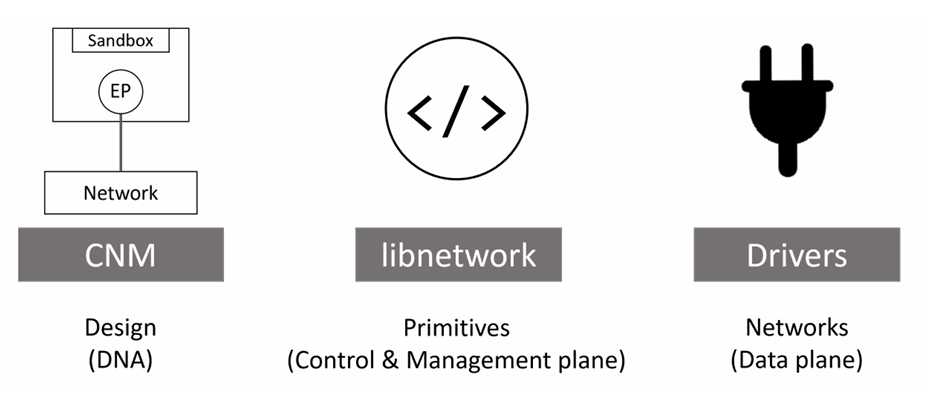

#### The Container Network Model (CNM)

Design cho Docker Network chính là CNM. Nó mô tả các thành phần cơ bản cấu thành nên một mạng Docker 

Ở mức tổng quan, nó định nghĩa 3 thành phần chính:

- Sandboxes
- Endpoints
- Networks

`Sandbox` là một network stack bao gồm: interface Ethernet, port, routing table, DNS

`Endpoint` là các interface mạng ảo (VD: `veth`). Giống như interface mạng bình thường, nó chịu trách nhiệm giữ các kết nối. Trong CNM, endpoint có nhiệm vụ là kết nối một sandbox với một network

`Network` là một nhóm các endpoints có thể giao tiếp trực tiếp với nhau. Việc triển khai có thể là 1 linux bridge, 1 VLAN, ...

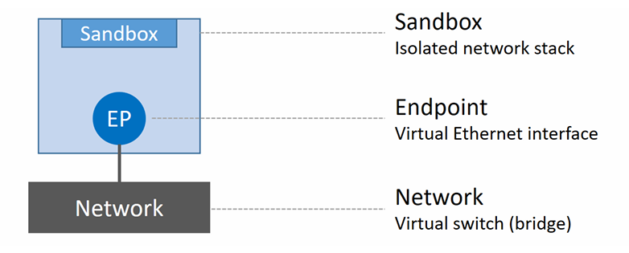

Đơn vị nhỏ nhất trong môi trường Docker là container, vì thế ta có thể nói CNM cung cấp networking cho container

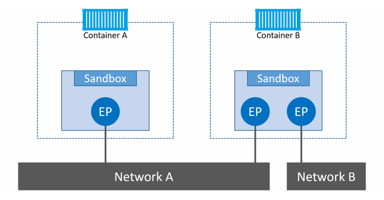

- Container A có 1 interface (endpoint) và kết nối với Network A
- Container B có 2 interface (endpoint) và kết nối với cả Network A và B


Hai container có thể giao tiếp với nhau vì cùng nằm trong Network A. Tuy nhiên, 2 endpoints trong container B không thể giao tiếp trực tiếp với nhau nếu không có router layer 3 hỗ trợ


**NOTE:** endpoint giống như card mạng bình thường - chỉ có thể kết nối đến 1 network duy nhất. Nếu muốn container kết nối nhiều network, nó phải có nhiều endpoint

Mặc dù container A và container B chạy trên cùng 1 host, nhưng network stack của chúng vẫn hoàn toàn bị cô lập ở mức hệ điều hành nhờ vào sandbox

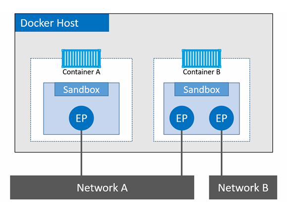

#### Libnetwork
libnetwork là 1 implementation của CNM trong Docker, nó là mã nguồn mở được viết bằng Go 

libnetwork triển khai đầy đủ cả ba thành phần được định nghĩa trong CNM

#### Drivers
Driver chịu trách nhiệm tạo network, kết nối container, đảm bảo isolation 

Docker đi kèm với 1 số driver tích hợp sẵn, được gọi là native drivers hoặc local drivers. Trên linux chúng là: bridge, overlay, macvlan

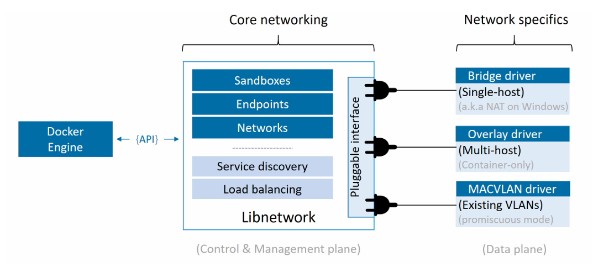

### Single-host bridge networks

Loại mạng Docker đơn giản nhất là mạng bridge trên một host (single-host bridge network)

- Single-host: chỉ tồn tại trên 1 host duy nhất và chỉ có thể kết nối các container nằm trên host đó
- Bridge: sw layer 2

Docker tạo các mạng bridge single-host bằng driver bridge tích hợp sẵn 

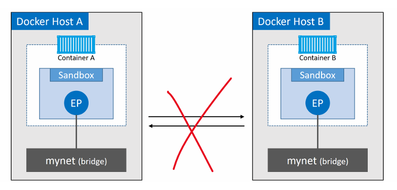

Ta thấy: 
- 2 Docker host với các mạng bridge cục bộ giống hệt nhau(`mynet`) nhưng 2 host vẫn cô lập với nhau 

Mỗi Docker host đều có một mạng bridge singel-host mặc định. Trên Linux là `bridge`. 

Mặc định, đây là mạng mà các container mới sẽ được kết nối vào, trừ khi ta ghi đè bằng flag `--network`

```bash
root@client:~# docker network ls
NETWORK ID     NAME                      DRIVER    SCOPE
172d91a604f7   bridge                    bridge    local
cbf0877dd2d0   counter-app_counter-net   bridge    local
791a6832dcc4   host                      host      local
66bb744e0bbc   none                      null      local
root@client:~#
```

Sử dụng `docker network inspect` để xem chi tiết:

```bash
root@client:~# docker network inspect bridge
[
    {
        "Name": "bridge",
        "Id": "172d91a604f700b9682b47cb846dd4bf1333c9f0601a98d9cf46baabb8fa34cf",
        "Created": "2026-04-13T11:57:21.63904786+07:00",
        "Scope": "local",
        "Driver": "bridge",
        "EnableIPv6": false,
        "IPAM": {
            "Driver": "default",
            "Options": null,
            "Config": [
                {
                    "Subnet": "172.17.0.0/16",
                    "Gateway": "172.17.0.1"
                }
            ]
        },
        "Internal": false,
        "Attachable": false,
        "Ingress": false,
        "ConfigFrom": {
            "Network": ""
        },
        "ConfigOnly": false,
        "Containers": {},
        "Options": {
            "com.docker.network.bridge.default_bridge": "true",
            "com.docker.network.bridge.enable_icc": "true",
            "com.docker.network.bridge.enable_ip_masquerade": "true",
            "com.docker.network.bridge.host_binding_ipv4": "0.0.0.0",
            "com.docker.network.bridge.name": "docker0",
            "com.docker.network.driver.mtu": "1500"
        },
        "Labels": {}
    }
]
```

Các mạng Docker được tạo bằng bridge driver trên Linux được xây dựng dựa trên công nghệ Linux bridge. Ta có thể kiểm tra bằng các công cụ tiêu chuẩn của Linux:

```bash
root@client:~# ip link show docker0
3: docker0: <NO-CARRIER,BROADCAST,MULTICAST,UP> mtu 1500 qdisc noqueue state DOWN mode DEFAULT group default
    link/ether 02:42:ed:52:e1:82 brd ff:ff:ff:ff:ff:ff
```

Mạng bridge mặc định trên tất cả Docker host chạy Linux được ánh xạ tới 1 linux bridge có tên là `docker0`

```bash
root@client:~# docker network inspect bridge | grep bridge.name
            "com.docker.network.bridge.name": "docker0",
```

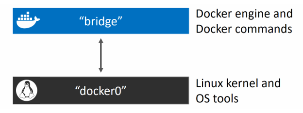

Khi ta thêm các container kết nối vào mạng "bridge". Mạng "bridge" này được ánh xạ tới Linux Bridge `docker0` trong kernel của host, và từ đó có thể được ánh xạ tới một interface Ethernet trên host thông qua port mapping 

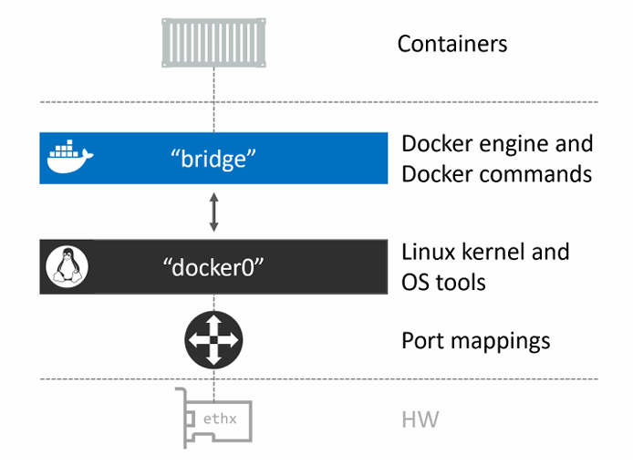

Ta sử dụng lệnh sau để tạo một mạng bridge single-host:

```bash
docker network create -d bridge localnet
```

- `-d, --driver`: chỉ định loại network driver mà Docker sử dụng khi tạo network
- `localnet`: đặt tên cho network 

```bash
root@client:~# docker network ls
NETWORK ID     NAME                      DRIVER    SCOPE
172d91a604f7   bridge                    bridge    local
cbf0877dd2d0   counter-app_counter-net   bridge    local
791a6832dcc4   host                      host      local
2cd142de2491   localnet                  bridge    local
66bb744e0bbc   none                      null      local
```

Sau khi tạo xong ta cũng sẽ có thêm 1 Linux Bridge mới được tạo trong kernel

```bash
brctl show
bridge name        bridge id            STP enabled    interfaces
docker0            8000.0242aff9eb4f    no             
br-20c2e8ae4bbb    8000.02429636237c    no             
```

- Tất cả các Linux Bridge đều không bật spanning tree và đều không có thiết bị nào được kết nối 

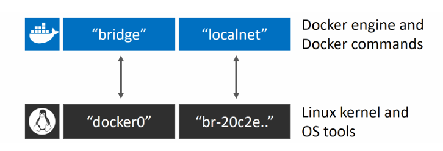

Ta sử dụng câu lệnh sau để tạo 1 container mới attach vào `localnet`:

```bash
docker container run -d --name c1 \
  --network localnet \
  alpine sleep 1d
```

Sử dụng `docker network inspect` để xem container `c1` có nằm trên mạng `localnet` hay không:

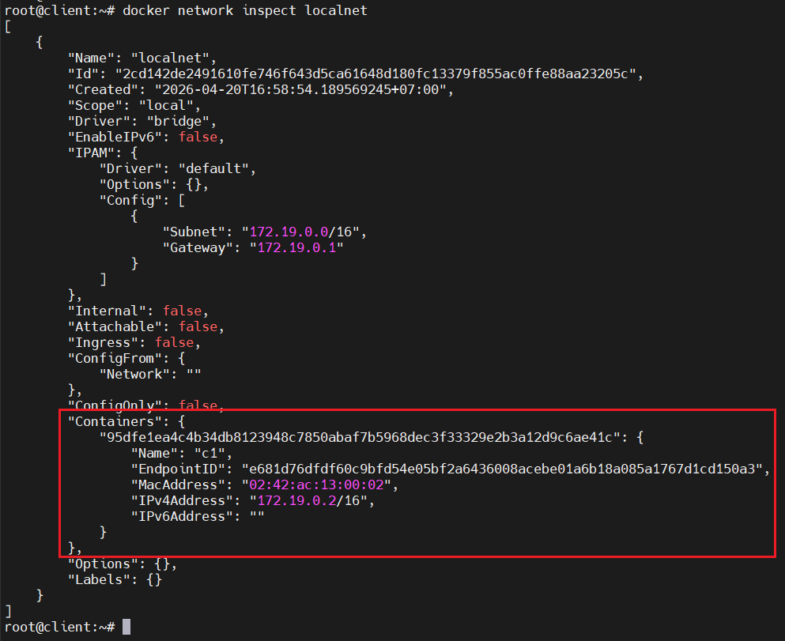

```bash
root@client:~# brctl show
bridge name     bridge id               STP enabled     interfaces
br-2cd142de2491         8000.02424dbe59f0       no              vethf0de2b5
br-cbf0877dd2d0         8000.0242fad56f15       no
docker0         8000.0242ed52e182       no
```

Ta thấy: `br-2cd142de2491` đã có interface của `c1` gắn vào 

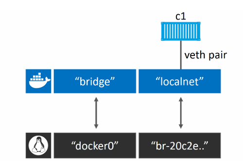

Nếu ta thêm 1 container khác vào cùng mạng, nó có thể ping container `c1` bằng tên. Điều này là do tất cả các container mới đều được tự động đăng ký với dịch vụ DNS tích hợp của Docker, cho phép chúng phân giải tên của tất cả các container khác trên cùng mạng.

**NOTE**: Mạng bridge mặc định trên Linux (`docker0`) không hỗ trợ phân giải tên miền thông qua Docker DNS service.

**TEST:**

1. Tạo một container mới attach vào mạng `localnet`

  ```bash
  docker container run -it --name c2 \
    --network localnet \
    alpine sh
  ```

2. Từ c2 ta sẽ ping tới c1 bằng tên

  ```bash
  / # ping c1
  PING c1 (172.19.0.2): 56 data bytes
  64 bytes from 172.19.0.2: seq=0 ttl=64 time=0.324 ms
  64 bytes from 172.19.0.2: seq=1 ttl=64 time=0.157 ms
  64 bytes from 172.19.0.2: seq=2 ttl=64 time=0.105 ms
  64 bytes from 172.19.0.2: seq=3 ttl=64 time=0.106 ms
  ^C
  --- c1 ping statistics ---
  4 packets transmitted, 4 packets received, 0% packet loss
  round-trip min/avg/max = 0.105/0.173/0.324 ms
  / #
  ```

Như vậy ta đã biết các container trên mạng bridge chỉ có thể giao tiếp với các container khác trên cùng mạng. Tuy nhiên ta có thể vượt qua điều này bằng cách sử dụng `port mapping`

`port mapping` cho phép ánh xạ 1 container tới 1 port trên Docker host. Mọi traffic truy cập vào Docker host tại port đã cấu hình sẽ được forward tới container 

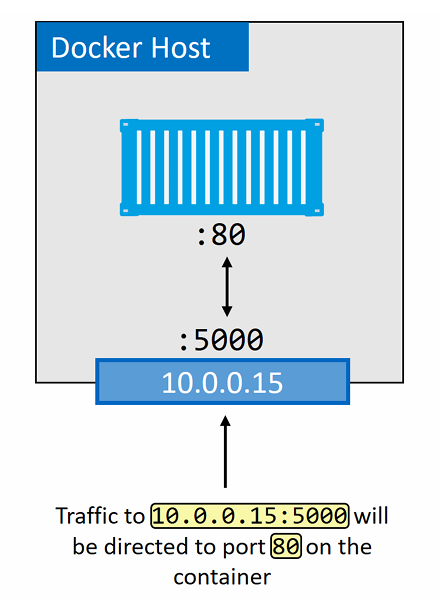

**Ví dụ:**

- Chạy một container web server mới và ánh xạ cổng 80 của container tới cổng 5000 trên Docker host:

  ```bash
  docker container run -d --name web \
    --network localnet \
    --publish 5000:80 \
  nginx
  ```

- Kiểm tra port mapping:

  ```bash
  root@client:~# docker port web
  80/tcp -> 0.0.0.0:5000
  80/tcp -> [::]:5000
  ```

- Kiểm tra trên browser:

  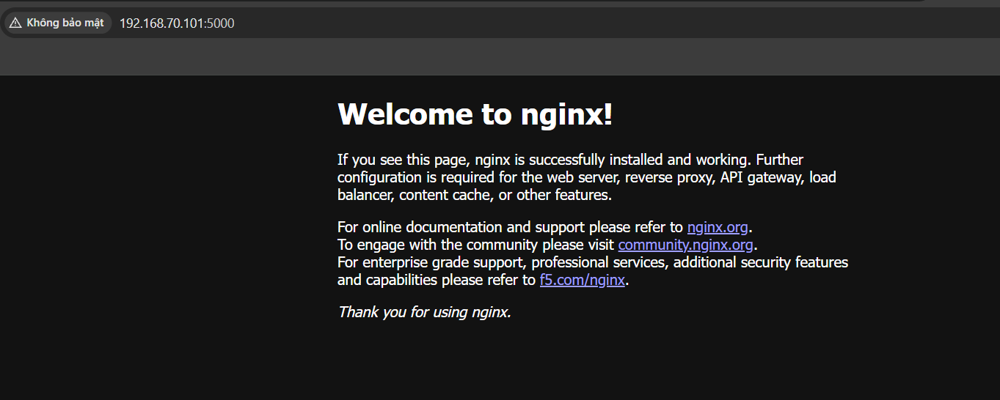

Bất kỳ hệ thống bên ngoài nào giờ đây cũng có thể truy cập container NGINX đang chạy trên mạng bridge localnet thông qua port mapping tới cổng TCP 5000 trên Docker host.

### Multi-host overlay networks 
Mạng Overlay là mạng đa host. Chúng cho phép một mạng duy nhất trải dài trên nhiều host, để các container trên các host khác nhau có thể giap tiếp trực tiếp với nhau 

Docker cung cấp sẵn một driver cho mạng overlay. Chỉ cần thêm flag `--d overlay` vào lệnh `docker network create`

### Connecting to existing networks

Driver MACVLAN tích hợp sẵn được tạo ra để biến các container thành những thành viên chính thức trên mạng vật lý hiện có bằng cách cấp cho mỗi container một địa chỉ MAC và địa chỉ IP riêng.

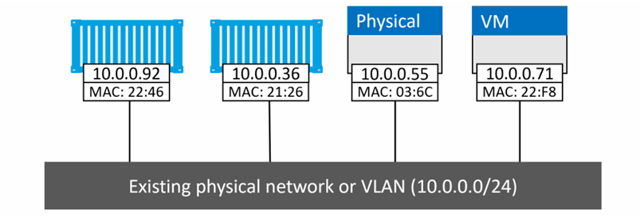

Hiệu năng của MACVLAN khá tốt vì không cần port mapping hay bridge bổ sung - kết nối trực tiếp interface của container với interface của host (hoặc sub-interface). Tuy nhiên, nhược điểm của nó là yêu cầu card mạng (NIC) của host phải chạy ở chế độ `promiscuous`

**Ví dụ giả định:**

Giả sử chúng ta có một mạng vất lý với hai VLAN: 
- VLAN100: 10.0.0.0/24
- VLAN200: 192.168.3.0/24

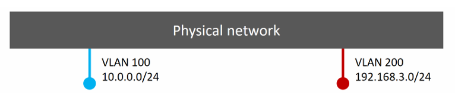

Thêm một Docker host và kết nối với mạng bên trên

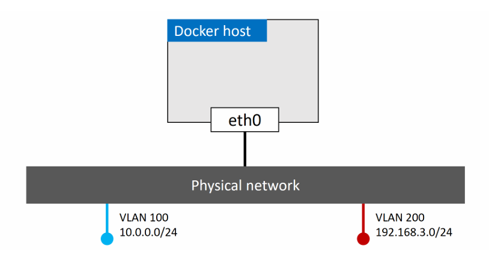

Sau đó, chúng ta có yêu cầu một container chạy trên host này phải được kết nối vào VLAN 100. Để làm điều này, chúng ta tạo một mạng Docker mới sử dụng driver macvlan với các thông tin sau:

- Thông tin subnet
- gateway
- dải IP có thể cấp cho container 
- Interface hoặc sub-interface trên host sẽ sử dụng 

```bash
$ docker network create -d macvlan \
  --subnet=10.0.0.0/24 \
  --ip-range=10.0.0.0/25 \
  --gateway=10.0.0.1 \
  -o parent=eth0.100 \
  macvlan100
```

- MACVLAN sử dụng các sub-interface tiêu chuẩn của Linux, ta sẽ phải gắn tag cho chúng bằng ID của VLAN mà chúng sẽ kết nối tới: `eth0.100`
- `--ip-range`: chỉ định dải IP mà MACVLAN network có thể cấp cho container. Dải IP này phải được dành riêng cho Docker và không được sử dụng bởi các node khác hoặc DHCP server 

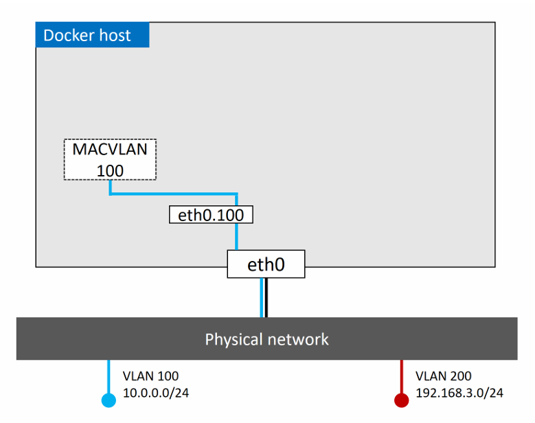

Lúc này ta có thể triển khai một container kết nối vào mạng MACVLAN100

```bash
$ docker container run -d --name mactainer1 \
  --network macvlan100 \
  alpine sleep 1d
```

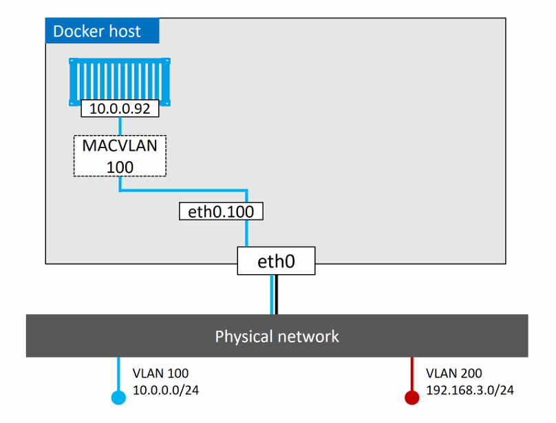

- container `mactainer1` có thể ping và giao tiếp với bất kỳ hệ thống nào khác trên VLAN100

Ta cũng có thể tạo nhiều mạng MACVLAN và kết nối các container trên cùng một Docker host vào các mạng đó

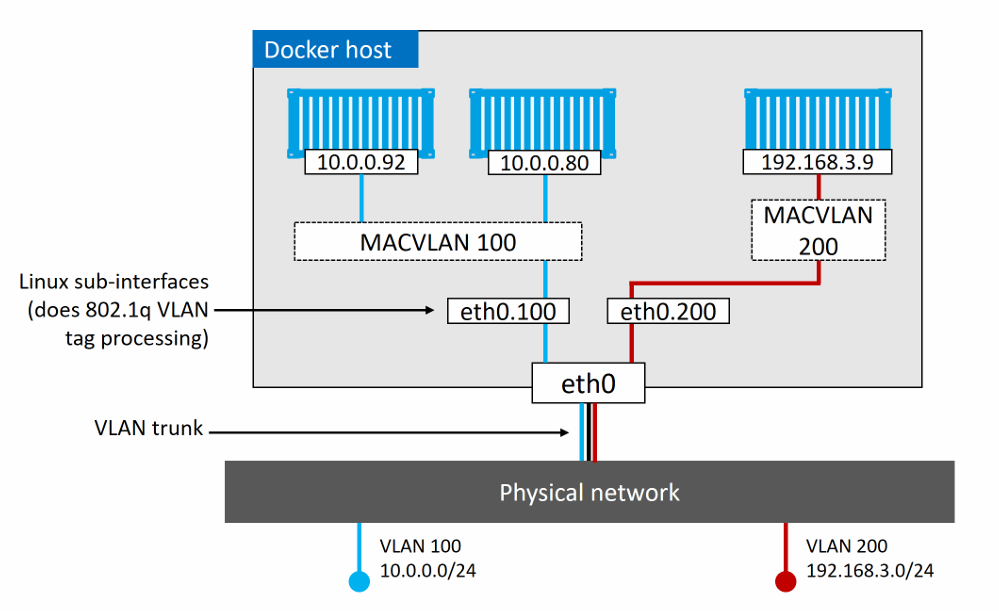

#### Container and Service logs for troubleshooting 

Nếu bạn nghĩ rằng đang gặp vấn đề kết nối giữa các container, bạn nên kiểm tra log của Docker daemon cũng như log của container 

Trên Linux ta có thể xem log của daemon bằng các cách sau:

- Systemd: 

  ```bash
  journalctl -u docker.service
  ```

- hoặc: 
  - `/var/log/upstart/docker.log`
  - `/var/log/messages`
  - `/var/log/daemon.log`

Ta có thể điều chỉnh mức độ chi tiết của log trong `/etc/docker/daemon.json`

```json
{
  "debug": true,
  "log-level": "debug"
}
```

- Các mực độ chi tiết:
  - `debug`: chi tiết nhất 
  - `info`: mặc định
  - `warn`
  - `error`
  - `fatal`: ít nhất 

Xem log của container bằng câu lệnh sau:

```bash
docker log <container_name>
```

```bash 
root@client:~# docker logs web
/docker-entrypoint.sh: /docker-entrypoint.d/ is not empty, will attempt to perform configuration
/docker-entrypoint.sh: Looking for shell scripts in /docker-entrypoint.d/
/docker-entrypoint.sh: Launching /docker-entrypoint.d/10-listen-on-ipv6-by-default.sh
10-listen-on-ipv6-by-default.sh: info: Getting the checksum of /etc/nginx/conf.d/default.conf
10-listen-on-ipv6-by-default.sh: info: Enabled listen on IPv6 in /etc/nginx/conf.d/default.conf
/docker-entrypoint.sh: Sourcing /docker-entrypoint.d/15-local-resolvers.envsh
/docker-entrypoint.sh: Launching /docker-entrypoint.d/20-envsubst-on-templates.sh
/docker-entrypoint.sh: Launching /docker-entrypoint.d/30-tune-worker-processes.sh
/docker-entrypoint.sh: Configuration complete; ready for start up
2026/04/20 10:23:53 [notice] 1#1: using the "epoll" event method
2026/04/20 10:23:53 [notice] 1#1: nginx/1.29.8
2026/04/20 10:23:53 [notice] 1#1: built by gcc 14.2.0 (Debian 14.2.0-19)
2026/04/20 10:23:53 [notice] 1#1: OS: Linux 5.15.0-171-generic
2026/04/20 10:23:53 [notice] 1#1: getrlimit(RLIMIT_NOFILE): 1048576:1048576
2026/04/20 10:23:53 [notice] 1#1: start worker processes
2026/04/20 10:23:53 [notice] 1#1: start worker process 29
2026/04/20 10:23:53 [notice] 1#1: start worker process 30
2026/04/20 10:23:53 [notice] 1#1: start worker process 31
2026/04/20 10:23:53 [notice] 1#1: start worker process 32
2026/04/20 10:23:53 [notice] 1#1: start worker process 33
2026/04/20 10:23:53 [notice] 1#1: start worker process 34
192.168.0.117 - - [20/Apr/2026:10:24:31 +0000] "GET / HTTP/1.1" 200 896 "-" "Mozilla/5.0 (Windows NT 10.0; Win64; x64) AppleWebKit/537.36 (KHTML, like Gecko) Chrome/147.0.0.0 Safari/537.36" "-"
192.168.0.117 - - [20/Apr/2026:10:24:31 +0000] "GET /favicon.ico HTTP/1.1" 404 555 "http://192.168.70.101:5000/" "Mozilla/5.0 (Windows NT 10.0; Win64; x64) AppleWebKit/537.36 (KHTML, like Gecko) Chrome/147.0.0.0 Safari/537.36" "-"
2026/04/20 10:24:31 [error] 30#30: *1 open() "/usr/share/nginx/html/favicon.ico" failed (2: No such file or directory), client: 192.168.0.117, server: localhost, request: "GET /favicon.ico HTTP/1.1", host: "192.168.70.101:5000", referrer: "http://192.168.70.101:5000/"
```

### Ingress load balancing

Swarm hỗ trợ hai chế độ publish giúp các service có thể truy cập từ bên ngoài cluster:
- Ingress mode (mặc định)
- Host mode

Các service được publish theo ingress mode có thể được truy cập từ bất kỳ node nào trong swarm - kể cả các nốt không chạy replica của service

Các service được publish theo host mode chỉ có thể được truy cập thông qua các node đang chạy replica của service.

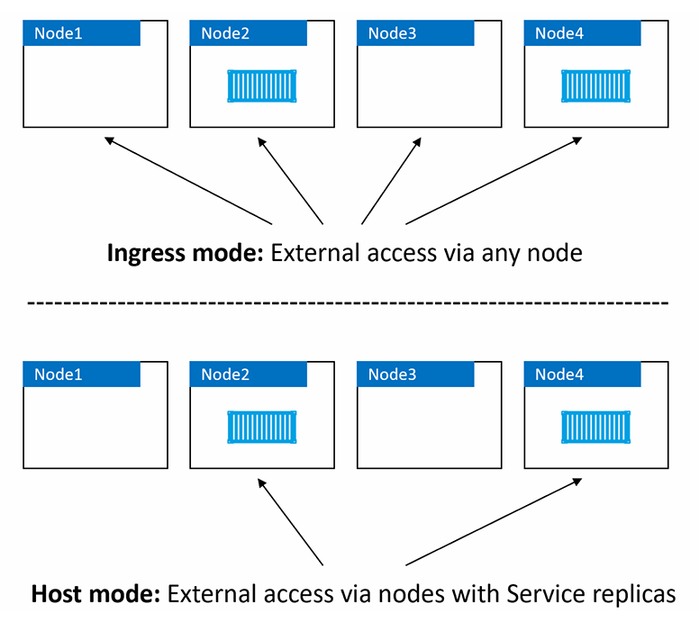

Ingress mode là chế độ mặc định. Điều này có nghĩa là mỗi khi bạn publish một service bằng `-p` hoặc `--publish`, nó sẽ mặc định dùng ingress mode. Để publish service ở host mode, bạn cần dùng cú pháp dài của flag `--publish` và thêm `mode=host`

```bash
$ docker service create -d --name svc1 \
  --publish published=5000,target=80,mode=host \
  nginx
```

- Cú pháp ngắn: 

  ```bash
  -p 5000:80
  ```

- Cú pháp dài: 

  ```bash
  --publish published=5000,target=80,mode=host
  ```

Bên trong Swarm mode, mỗi một service đều sẽ được gán cho một DNS nội bộ để truy cập. Swarm manager sẽ sử dụng khả năng load balancing nội bộ để gửi các yêu cầu đến các service trong cluster dựa theo DNS của service đó.

## Docker Networking - The commands

- `docker network ls`: Liệt kê tất cả network trong local Docker host
- `docker network create`: Tạo một docker network mới 
- `docker network inspect`: Cung cấp thông tin cấu hình chi tiết về Docker network 
- `docker network rm`: Xóa network trong Docker host
- `docker network prume`: Xóa những network không sử dụng 

