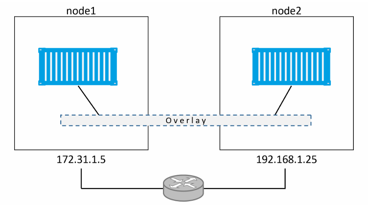
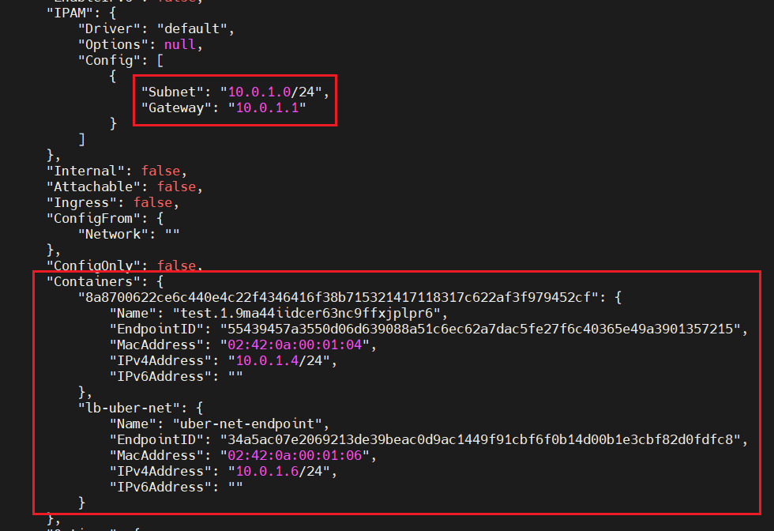
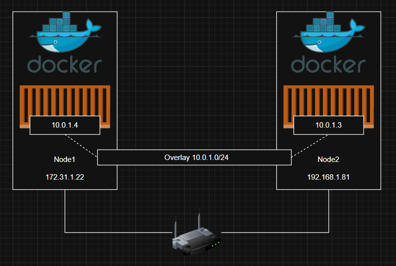
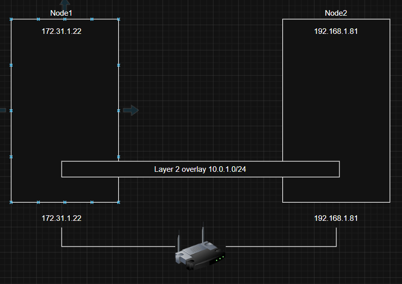
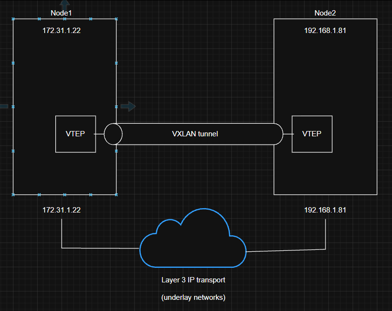
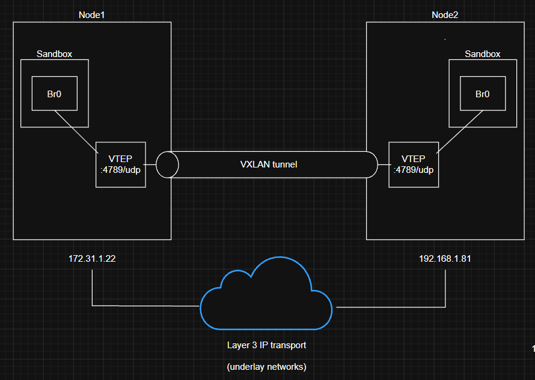
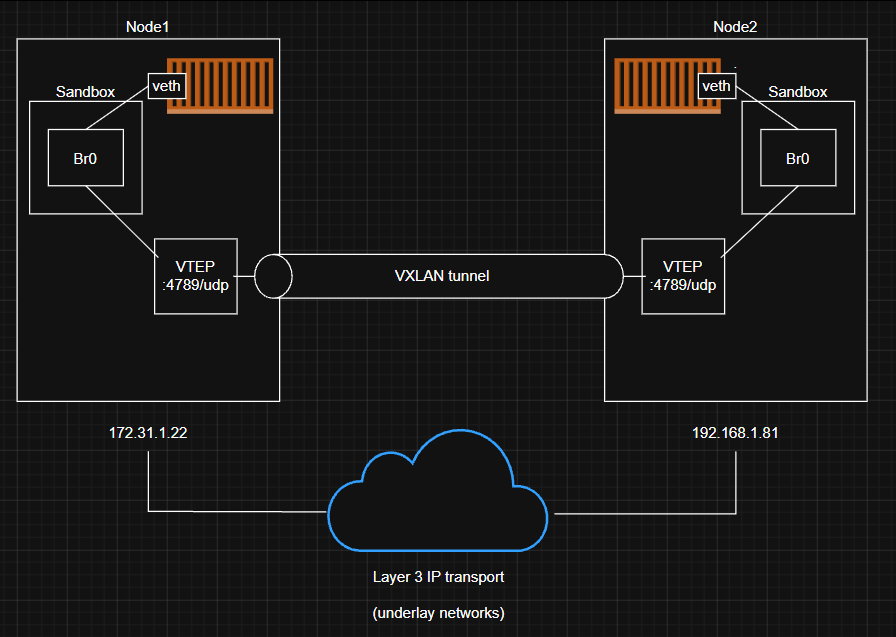
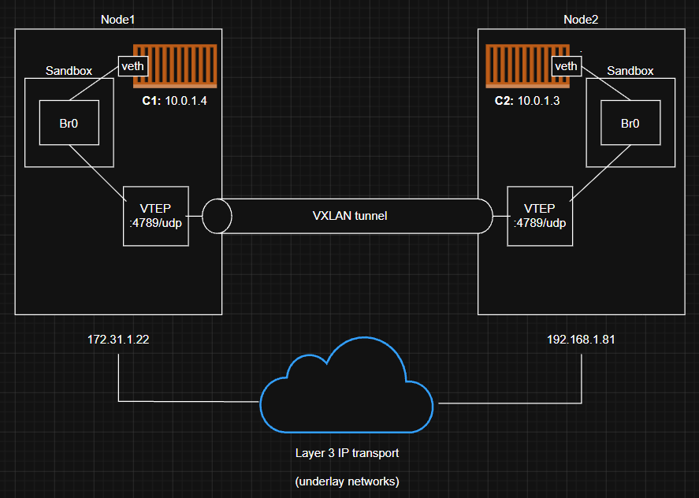

# Docker overlay networking 
## Docker overlay networking - The TLDR
Trong thực tế, việc các container có thể giao tiếp với nhau một cách đáng tin cậy và an toàn là rất quan trọng, ngay cả khi chúng nằm trên các host khác nhau và thuộc các mạng khác nhau. 

Đây chính là lúc mạng overlay phát huy tác dụng. Nó cho phép ta tạo ra một mạng layer 2 an toàn, trải dài trên nhiều host. Các container kết nối vào mạng này có thể giao tiếp trực tiếp với nhau 

Docker cung cấp sẵn overlay driver

## Docker overlay networking - The deep dive

Ta sẽ chia chapter này thành 2 phần: 
- Phần 1: xây dựng và kiểm thử một Docker overlay network 
- Phần 2: Giải thích cơ chế giúp nó hoạt động 

### Build and test a Docker overlay network in Swarm mode 

**Mô Hình:**


- Sử dụng 2 docker host nằm trên 2 mạng layer2 riêng biệt, được kết nối thông qua một router 

#### Build a Swarm 
Chạy lệnh sau trên `node1`: 

```bash
docker swarm init \
--advertise-addr=172.31.1.22 \
--listen-addr=172.31.1.22:2377
```

```bash
Swarm initialized: current node (6cjsl6phjudwwwehogqkyziry) is now a manager.

To add a worker to this swarm, run the following command:

    docker swarm join --token SWMTKN-1-0d686482vma625r1i6p38zr5ahj4cl2pia5svtrzmypj3w2lwc-6vaeet321yylkyegyaotbb06n 172.31.1.22:2377

To add a manager to this swarm, run 'docker swarm join-token manager' and follow the instructions.
```

Chạy lệnh sau trên node2:

```bash
docker swarm join --token SWMTKN-1-0d686482vma625r1i6p38zr5ahj4cl2pia5svtrzmypj3w2lwc-6vaeet321yylkyegyaotbb06n \
172.31.1.22:2377
```

Lúc này ta đã có 1 cluster swarm gồm 2 node: node1 là manager và node2 là worker:

```bash
root@node1:~# docker node ls
ID                            HOSTNAME   STATUS    AVAILABILITY   MANAGER STATUS   ENGINE VERSION
6cjsl6phjudwwwehogqkyziry *   node1      Ready     Active         Leader           27.5.1
8d8kba293yks6qq430y1hc99a     node2      Ready     Active                          27.5.1
```

#### Create a new overlay network 
Ta sẽ tạo 1 overlay network mới có tên là `uber-net`:

Chạy lệnh sau trên node1(manager):

```bash
docker network create -d overlay uber-net
```

```bash
root@node1:~# docker network create -d overlay uber-net
h0khuylsyaf1isl2oyc7m4zol
```

- Network này có thể được sử dụng bởi tất cả các host trong Swarm và control plane của nó được mã hóa bằng TLS 
- Ta cũng có thể mã hóa data plane bằng cách thêm `-o encrypted` vào lệnh. Tuy nhiên nó có thể gây `overhead hiệu năng`

- `Control plane traffic`: lưu lượng dùng cho quản lý cluster
- `Data plane traffic`: lưu lượng của ứng dụng 

Ta có thể liệt kê tất cả network trên mỗi node bằng lệnh:

```bash
docker network ls
```

```bash
NETWORK ID     NAME              DRIVER    SCOPE
5571fdced798   bridge            bridge    local
dc4de2beae1b   docker_gwbridge   bridge    local
208a1977351b   host              host      local
qf100vskw28l   ingress           overlay   swarm
652ef3cbff91   none              null      local
h0khuylsyaf1   uber-net          overlay   swarm
```

- Network mới tạo nằm ở cuối danh sách với tên uber-net. Các network còn lại được Docker tự động tạo khi cài đặt Docker và khi swarm được khởi tạo.

Nếu ta chạy `docker network ls` trên node2, ta sẽ thấy không xuất hiện network `uber-net`

```bash
root@node2:~# docker network ls
NETWORK ID     NAME              DRIVER    SCOPE
e9ca6e6659f8   bridge            bridge    local
ae9df14be900   docker_gwbridge   bridge    local
208a1977351b   host              host      local
qf100vskw28l   ingress           overlay   swarm
652ef3cbff91   none              null      local
```

Lý do là vì các overlay network mới chỉ được mở rộng sang worker node khi node đó thực sự được giao chạy container trên network đó

Cách tiếp cận **lazy** này giúp cải thiện khả năng mở rộng của hệ thống mạng bằng cách giảm lượng traffic gossip trong mạng.

#### Attach a service to the overlay network 
Sử dụng lệnh sau trên `node1` để có thể tạo 1 service và gắn nó vào network `uber-net`:

```bash
docker service create --name test \
--network uber-net \
--replicas 2 \
ubuntu sleep infinity
```

- `docker service create`: Tạo 1 service mới 
- `--name test`: đặt tên của service là test
- `--network uber-net`: attach network của service vào uber-net
- `--replicas 2`: tạo 2 replica 

Vì chúng ta tạo 2 replica và swarm có 2 node nên mỗi node sẽ chạy 1 container:

```bash
root@node1:~# docker service ps test
ID             NAME      IMAGE           NODE      DESIRED STATE   CURRENT STATE                ERROR     PORTS
9ma44iidcer6   test.1    ubuntu:latest   node1     Running         Running about a minute ago
uftklvo43wro   test.2    ubuntu:latest   node2     Running         Running about a minute ago
```

Khi Swarm khởi chạy container trên một overlay network, nó sẽ tự động mở rộng network đó đến node đang chạy container. Do đó `node2` bây giờ đã có `uber-net`

```bash
root@node2:~# docker network ls
NETWORK ID     NAME              DRIVER    SCOPE
e9ca6e6659f8   bridge            bridge    local
ae9df14be900   docker_gwbridge   bridge    local
208a1977351b   host              host      local
qf100vskw28l   ingress           overlay   swarm
652ef3cbff91   none              null      local
h0khuylsyaf1   uber-net          overlay   swarm
```

Các container standalone (không thuộc swarm service) không thể join overlay network trừ khi network đó được tạo với `attachable=true`

Ta có thể tạo 1 overlay network cho phép container standalone tham gia bằng lệnh:

```bash
docker network create -d overlay --attachable uber-net
```

### Test the overlay network 
Ta có 2 Docker host trên các mạng riêng biệt, và một overlay network duy nhất trải dài trên cả 2. Có 1 container được kết nối vào overlay network trên mỗi node. Ta sẽ test xem chúng có thể ping lần nhau hay không?



Chạy lệnh `docker network inspect` để xem subnet được gán cho overlay network và các địa chỉ IP được gán cho 2 container trong service `test`:

```bash
root@node1:~# docker network inspect uber-net
[
    {
        "Name": "uber-net",
        "Id": "h0khuylsyaf1isl2oyc7m4zol",
        "Created": "2026-04-23T09:22:30.131942626+07:00",
        "Scope": "swarm",
        "Driver": "overlay",
        "EnableIPv6": false,
        "IPAM": {
            "Driver": "default",
            "Options": null,
            "Config": [
                {
                    "Subnet": "10.0.1.0/24",
                    "Gateway": "10.0.1.1"
                }
            ]
        },
        "Internal": false,
        "Attachable": false,
        "Ingress": false,
        "ConfigFrom": {
            "Network": ""
        },
        "ConfigOnly": false,
        "Containers": {
            "8a8700622ce6c440e4c22f4346416f38b715321417118317c622af3f979452cf": {
                "Name": "test.1.9ma44iidcer63nc9ffxjplpr6",
                "EndpointID": "55439457a3550d06d639088a51c6ec62a7dac5fe27f6c40365e49a3901357215",
                "MacAddress": "02:42:0a:00:01:04",
                "IPv4Address": "10.0.1.4/24",
                "IPv6Address": ""
            },
            "lb-uber-net": {
                "Name": "uber-net-endpoint",
                "EndpointID": "34a5ac07e2069213de39beac0d9ac1449f91cbf6f0b14d00b1e3cbf82d0fdfc8",
                "MacAddress": "02:42:0a:00:01:06",
                "IPv4Address": "10.0.1.6/24",
                "IPv6Address": ""
            }
        },
        "Options": {
            "com.docker.network.driver.overlay.vxlanid_list": "4097"
        },
        "Labels": {},
        "Peers": [
            {
                "Name": "6a50c5a3d815",
                "IP": "192.168.1.81"
            },
            {
                "Name": "4fe93fe5082f",
                "IP": "172.31.1.22"
            }
        ]
    }
]
```



Ta thấy: 
- subnet của `uber-net` là `10.0.1.0/24` - Không trùng với bất kỳ mạng vật lý nào của 2 node 
- địa chỉ IP được gán container chạy trên host 

Làm tương tự ở `node2` ta sẽ biết được IP của container trên `node2`

Cấu hình hiện tại sẽ như sau:



Có 1 overlay network layer 2 trải dài trên cả 2 host, mỗi container đều có 1 IP trên overlay network này. Do đó container trên `node1` có thể ping được container `node2` bằng IP của nó `10.0.1.3` mặc dù cả 2 node nằm trên các mạng layer 2 underlay khác nhau.

Đăng nhập vào container trên `node1` và ping container trên `node2`:

```bash
root@node1:~# docker container exec -it 8a8700622ce6 bash
root@8a8700622ce6:/# ping 10.0.1.3
PING 10.0.1.3 (10.0.1.3) 56(84) bytes of data.
64 bytes from 10.0.1.3: icmp_seq=1 ttl=64 time=2.03 ms
64 bytes from 10.0.1.3: icmp_seq=2 ttl=64 time=1.06 ms
64 bytes from 10.0.1.3: icmp_seq=3 ttl=64 time=1.05 ms
64 bytes from 10.0.1.3: icmp_seq=4 ttl=64 time=0.907 ms
^C
--- 10.0.1.3 ping statistics ---
4 packets transmitted, 4 received, 0% packet loss, time 3004ms
rtt min/avg/max/mdev = 0.907/1.258/2.025/0.446 ms
root@8a8700622ce6:/#
```  

- Container trên `node1` có thể ping trên `node2` thông qua overlay network. Nếu tạo network với flag `-o encrypted`, quá trình này sẽ được mã hóa 

Ta sẽ thử truy vết đường đi của lệnh ping từ bên trong container 

```bash
root@8a8700622ce6:/# traceroute 10.0.1.3
traceroute to 10.0.1.3 (10.0.1.3), 30 hops max, 60 byte packets
 1  test.2.uftklvo43wrol107sij6mztaz.uber-net (10.0.1.3)  2.025 ms  1.860 ms  1.790 ms
```

- Kết quả chỉ hiển thị 1 hop duy nhất, chứng minh rằng các container đang giao tiếp thông qua overlay network - hoàn toàn không biết các underlay network bên dưới chúng đang đi qua 

### The theory of how it all works 

Sau khi ta đã tìm hiểu cách xây dựng và sử dụng 1 overlay network an toàn, bước tiếp theo ta sẽ tìm hiểu cách mọi thứ được kết hợp với nhau ở phía sau 

#### VXLAN primer
Docker overlay networking sử dụng các VXLAN tunnel để tạo ra các mạng overlay layer2 ảo 

Ở mức cao nhất, VXLAN cho phép bạn tạo một mạng layer 2 ảo chạy trên một hạ tầng layer 3 hiện có. Điều này có nghĩa là bạn có thể tạo ra một mạng đơn giản, che giấu bên dưới là những mạng phức tạp.

Ví dụ mà chúng ta đã dùng trước đó đã tạo ra một mạng layer 2 mới `10.0.1.0/24` nằm trên một mạng IP layer 3 bao gồm 2 mạng Layer 2 là `172.31.1.0/24` và `192.168.1.0/24`



Điểm hay của VXLAN là nó là một công nghệ đống gói (encapsulation), mà các router và hạ tầng mạng hiện có chỉ nhìn thấy như các gói IP/UDP thông thường và xử lý mà không gặp vấn đề gì 

Để tạo mạng overlay layer 2 ảo, một VXLAN tunnel sẽ được thiết lập xuyên qua hạ tầng IP layer 3 bên dưới. 

Mỗi đầu của VXLAN tunnel được kết thúc tại một VXLAN Tunnel Endpoint (VTEP). Chính VTEP này thực hiện việc đóng/mở gói (encapsulation/decapsulation) và các xử lý cần thiết khác để mọi thứ hoạt động 



#### Walk through our two-container example
Ta đã có 2 host được kết nối thông qua một mạng IP. Mỗi host chạy 1 container, và ta đã tạo 1 overlay network VXLAN duy nhất cho các container 

Để thực hiện điều này, một sandbox mới (network namespace) được tạo trên mỗi host. Ta đã biết sandbox giống như container, nhưng thay vì chạy ứng dụng, nó chạy một ngăn xếp mạng (network stack) được cô lập - tách biệt khỏi network stack của chính host

Một virtual switch (virtual bridge) tên là `Br0` được tạo bên trong sandbox. Một `VTEP` cũng được tạo, với một đầu được nối vào virtual switch `Br0`, và đầu còn lại được nối vào network stack của host. Đầu nằm trong network stack của host sẽ được gán một IP thuộc underlay network mà host kết nối vào, và được gắn với 1 UDP socket port 4789. Hai VTEP trên mỗi host sẽ tạo ra overlay thông qua một VXLAN tunnel



Tại thời điểm này, VXLAN overlay đã được tạo và sẵn sàng sử dụng 

Sau đó, mỗi container sẽ có một virtual Ethernet (veth) adapter riêng, adapter này cũng được nối vào virtual switch `Br0` cục bộ



#### Communication example 

Tìm hiểu cách hai container giao tiếp với nhau. 

Ta sẽ gọi container trên `node1` là `C1` và container trên `node2` là `C2`, `C1` ping tới `C2`



Quá trình flow khi `C1` ping tới `C2`: 

1. `C1` gửi packet 

    C1 ping gửi packet ra `veth` => `Br0`

2. `Br0` nhận gói tin 

    Br0 nhìn thầy IP đích: `10.0.1.3` cùng giải nhưng không có MAC tương ứng, chưa có trong ARP table. Do đó nó flood packet ra tất cả các port 

3. `VTEP` 

    VTEP biết đường đi tới C2 nó sẽ trả lời ARP cho Br0 (đây là dạng proxy ARP) bằng MAC của chính nó

4. `Br0` học đường đi 

    Sau khi nhận ARP reply từ VTEP, Br0 sẽ cập nhật và từ giờ mọi packet gửi tới `C2` sẽ gửi thẳng cho VTEP 

5. `VTEP` đóng gói Packet 

    VTEP nhận packet gốc sau đó đóng gói thành:

    ```bash
    Outer:
        Src: Node1 IP
        Dst: Node2 IP
        UDP: 4789
    
    Inner:
        Src: C1
        Dst: C2
    ```

    => Đây là VXLAN encapsulation 

6. Thêm `VNID`

    Trong header VXLAN có: VNID (VXLAN Network ID) giúp phân biệt network và giữ isolation giữa các overlay network 

7. Packet đi qua mạng thật (underlay)

    Router chỉ thấy được đây là UDP packet (port 4789) có SrcIP và DstIP của 2 host không thấy được container bên trong 

8. Node2 nhận Packet 

    kernel nhận thấy nó được gửi đến UDP port 4789. Kernel cũng biết rằng có 1 interface VTEP được gắn với socket này. Do đó nó sẽ chuyển gói tin đến VTEP

9. `VTEP` mở gói tin    

    VTEP đọc VNID, mở gói tin và gửi nó đến Br0 cục bộ trên VLAN tương ứng với VNID. 

10. `Br0` gửi gói tin đến `C2`

Docker cũng hỗ trợ định tuyến Layer 3 trong cùng một overlay network. 

Ta có thể tạo 1 overlay network với 2 subnet, và Docker sẽ tự động xử lý việc định tuyến giữa chúng.

```bash
docker network create --subnet=10.1.1.0/24 --subnet=11.1.1.0/24 -d overlay prod-net
```

=> Tạo 2 virtual switch Br0 và Br1 bên trong Sandbox 

## Docker overlay networking - The commands

- `docker network create`: tạo một network mới
  - `-d`: chỉ định driver để sử dụng 
  - `-o encrypted`: mã hóa data plane 
- `docker network ls`: liệt kê tất cả các network mà Docker Host có thể nhìn thấy. Các Docker host chạy ở chế độ swarm chỉ nhìn thấy overlay network nếu chúng đang chạy container gắn vào network đó. Điều này giúp giảm thiểu lượng gossip liên quan đến network.
- `docker network inspect`: hiển thị thông tin chi tiết về một network cụ thể.
- `docker network rm`: Xóa 1 network 