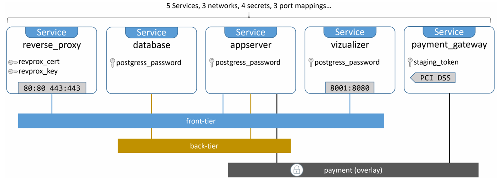
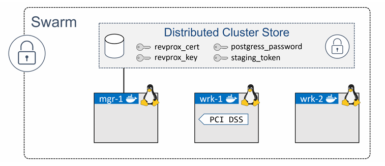
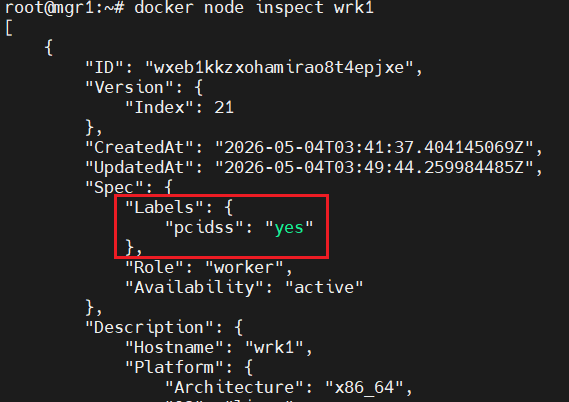

# Deploying apps with Docker Stacks 

Việc triển khai và quản lý các ứng dụng microservices cloud-native (ứng dụng gồm nhiều dịch vụ nhỏ tích hợp với nhau) ở quy mô lớn là một việc khó.

Docker Stacks ra đời để giải quyết vấn đề này. Chúng giúp đơn giản hóa việc quản lý ứng dụng bằng cách cung cấp: 
- Trạng thái mong muốn (desired state) 
- Rolling updates
- Scale 
- Health Checks

Tất cả được đóng gói trong một mô hình gọn gàng

## Deploying apps with Docker Stacks - The TLDR 
Stacks cho phép ta định nghĩa các ứng dụng phức tạp gồm nhiều service trong một file khai báo duy nhất 

Chúng cũng cung cấp cách đơn giản để triển khai ứng dụng và quản lý toàn bộ vòng đời của nó - từ triển khai ban đầu -> heal check -> scale -> update -> rollback ...

Quy trình rất đơn giản. Ta định nghĩa trạng thái mong muốn của ứng dụng trong một file `Compose`, sau đó triển khai và quản lý nó bằng lệnh `docker stack`. Vậy là xong.

File `Compose` bao gồm toàn bộ stack các microservices tạo nên ứng dụng. Nó cũng bao gồm tất cả volumes, networks, secrets và các hạ tầng khác mà ứng dụng cần. Lệnh `docker stack deploy` được dùng để triển khai toàn bộ ứng dụng từ 1 file duy nhất!!

Để làm được điều này, stacks được xây dựng dựa trên Docker Swarm, nghĩa là bạn sẽ có tất cả các tính năng bảo mật và nâng cao mà Swarm cung cấp 

## Deploying apps with Docker Stacks - The Deep Dive

Về mặt kiến trúc, stacks nằm ở tầng cao nhất trong hệ phân cấp ứng dụng của Docker. Chúng được xây dựng dựa trên services, và các services này lại được xây dựng dựa trên containers 

### Overview of the sample app

Ta sẽ sử dụng ứng ụng demo phổ biến `AtSea Shop`. Ứng dụng này được lưu trữ trên Github và được phát hành mã nguồn mở theo giấy phép Apache 2.0

Đây là một ứng dụng microservices cloud-native sử dụng certificates và secrets. 



Ứng dụng bao gồm:
- 5 services 
- 3 networks
- 4 secrets
- 3 port mapping 

**NOTE:** Services ở đây là đang đề cập đến đối tượng service của Docker, tức là một hoặc nhiều container giống nhau được quản lý như một thực thể duy nhất trên 1 cụm Swarm 

Clone repo Github của ứng dụng: 

```bash
git clone https://github.com/dockersamples/atsea-sample-shop-app.git
```

Ta sẽ tập trung vào file `docker-stack.yml` - stack file, file định nghĩa ứng dụng và các yêu cầu của nó. 

```yml
version: "3.2"

services:
  reverse_proxy:
    image: dockersamples/atseasampleshopapp_reverse_proxy
    ports:
      - "80:80"
      - "443:443"
    secrets:
      - source: revprox_cert
        target: revprox_cert
      - source: revprox_key
        target: revprox_key
    networks:
      - front-tier

  database:
    image: dockersamples/atsea_db
    environment:
      POSTGRES_USER: gordonuser
      POSTGRES_DB_PASSWORD_FILE: /run/secrets/postgres_password
      POSTGRES_DB: atsea
    networks:
      - back-tier
    secrets:
      - postgres_password
    deploy:
      placement:
        constraints:
          - 'node.role == worker'

  appserver:
    image: dockersamples/atsea_app
    networks:
      - front-tier
      - back-tier
      - payment
    deploy:
      replicas: 2
      update_config:
        parallelism: 2
        failure_action: rollback
      placement:
        constraints:
          - 'node.role == worker'
      restart_policy:
        condition: on-failure
        delay: 5s
        max_attempts: 3
        window: 120s
    secrets:
      - postgres_password

  visualizer:
    image: dockersamples/visualizer:stable
    ports:
      - "8001:8080"
    stop_grace_period: 1m30s
    volumes:
      - "/var/run/docker.sock:/var/run/docker.sock"
    deploy:
      update_config:
        failure_action: rollback
      placement:
        constraints:
          - 'node.role == manager'

  payment_gateway:
    image: dockersamples/atseasampleshopapp_payment_gateway
    secrets:
      - source: staging_token
        target: payment_token
    networks:
      - payment
    deploy:
      update_config:
        failure_action: rollback
      placement:
        constraints:
          - 'node.role == worker'
          - 'node.labels.pcidss == yes'

networks:
  front-tier:
  back-tier:
  payment:
    driver: overlay
    driver_opts:
      encrypted: 'yes'

secrets:
  postgres_password:
    external: true
  staging_token:
    external: true
  revprox_key:
    external: true
  revprox_cert:
    external: true
```

Ở mức cao nhất, file này định nghĩa 4 key chính:

- `version`: chỉ định phiên bản của định dạng file compose. Giá trị này phải là 3.0 trở lên để hoạt động với stacks.
- `services`: nơi định nghĩa các service tạo nên ứng dụng 
- `networks`: liệt kê các mạng cần thiết 
- `secrets`: định nghĩa các secrets mà ứng dụng sử dụng 

Stack file có 5 services: 

- `reverse_proxy`
- `database`
- `appserver`
- `visualizer`
- `payment_gateway`

Stack file có 3 networks:

- `front-tier`
- `back-tier`
- `payment`

Stack file có 4 secrets:

- `postgres_password`
- `staging_token`
- `revprox_key`
- `revprox_cert`

```yml
version: "3.2"
services:
  reverse_proxy:
  database:
  appserver:
  visualizer:
  payment_gateway:
networks:
  front-tier:
  back-tier:
  payment:
secrets:
  postgres_password:
  staging_token:
  revprox_key:
  revprox_cert:
```

### Looking closer at the stack file 

Một trong những việc đầu tiên Docker làm khi triển khai ứng dụng từ stack file là tạo các network cần thiết được liệt kê dưới khóa `networks`. Nếu các network chưa tồn tại Docker sẽ tạo chúng.

#### Networks 

```yml
networks:
  front-tier:
  back-tier:
  payment:
    driver: overlay
    driver_opts:
      encrypted: 'yes'
```

Stack file mô tả 3 network: `front-tier`, `back-tier` và `payment`. Theo mặc định, tất cả sẽ được tạo dưới dạng overlay network bởi driver overlay. Tuy nhiên, network payment là đặc biệt — nó yêu cầu mã hóa data plane.

#### Secrets
Secrets được định nghĩa là các đối tượng cấp cao, và stack file này định nghĩa 4 secrets:

```yml 
secrets:
  postgres_password:
    external: true
  staging_token:
    external: true
  revprox_key:
    external: true
  revprox_cert:
    external: true
```

Cả 4 secrets đều được khai bảo là `external` => chúng phải tồn tại sẵn trước khi stack được triển khai 

#### Services 

Services là nơi diễn ra hầu hết hoạt động 

Mỗi services là một tập hợp JSON chứa nhiều khóa. 


##### Service reverse_proxy 

```yml 
reverse_proxy:
  image: dockersamples/atseasampleshopapp_reverse_proxy
  ports:
    - "80:80"
    - "443:443"
  secrets:
    - source: revprox_cert
      target: revprox_cert
    - source: revprox_key
      target: revprox_key
  networks:
    - front-tier
```

Khóa `image` là khóa bắt buộc duy nhất trong service. Nó xác định image Docker dùng để tạo các replica. 1 service là một hoặc nhiều container giống nhau 

Mặc định, Docker sẽ pull image từ Docker Hub, nếu muốn dùng registry khác ta phải chỉ định

Một điểm khác biệt giữa Docker Stacks và Docker Compose là stacks không hỗ trợ build, nên tất cả image phải được build trước khi deploy 

Khóa `ports` định nghĩa 2 ánh xạ: 
- `80:80`: ánh xạ port 80 của swarm tới port 80 của mỗi replica
- `443:443`: tương tự cho port 443

Mặc định, các port dùng `ingress mode`, nghĩa là có thể truy cập từ mọi node trong swarm. Ta cũng có thể dùng `host mode` nhưng cú pháp dài hơn 

Khóa `secrets` định nghĩa 2 secret. Các secret này sẽ được mount vào container dưới dạng file tại: `/run/secrets/`

Các secret trong service này sẽ được mount thành: 
- `/run/secrets/revprox_cert`
- `/run/secrets/revprox_key`

Khóa `networks` đảm bảo các replica kết nối vào network `front-tier`

##### Service database 

```yml 
database:
  image: dockersamples/atsea_db
  environment:
    POSTGRES_USER: gordonuser
    POSTGRES_DB_PASSWORD_FILE: /run/secrets/postgres_password
    POSTGRES_DB: atsea
  networks:
    - back-tier
  secrets:
    - postgres_password
  deploy:
    placement:
      constraints:
        - 'node.role == worker'
```

Khóa `environment` cho phép truyền biến môi trường vào container khi runtime 

Service này dùng biến môi trường để: 
- Định nghĩa user database 
- Chỉ định ví trí password (từ secret)
- Định nghĩa tên database 

Một cách an toàn hơn là dùng secrets cho tất cả các giá trị này thay vì plaintext

Khóa `placement` đảm bảo service chỉ chạy trên `worker node`

Swarm hỗ trợ nhiều loại điều kiện placement như:

- `node.id`
- `node.hostname`
- `node.role`
- `engine labels`
- `custom node labels`

##### Service appserver

Serice appserver sử dụng một image, gắn vào 3 network và mount một secret. Nó cũng giới thiệu một số tính năng bổ sung dưới khóa `deploy`

```yml
appserver:
  image: dockersamples/atsea_app
  networks:
    - front-tier
    - back-tier
    - payment
  deploy:
    replicas: 2
    update_config:
      parallelism: 2
      failure_action: rollback
    placement:
      constraints:
        - 'node.role == worker'
    restart_policy:
      condition: on-failure
      delay: 5s
      max_attempts: 3
      window: 120s
  secrets:
    - postgres_password
```

`services.appserver.deploy.replicas = 2` sẽ thiết lập số lượng replica mong muốn cho service là 2

Nếu cần thay đổi số lượng replica sau khi đã triển khai service, ta nên thực hiện theo các khai báo. Nghĩa là cập nhật trường `services.appserver.deploy.replicas` trong stack file với giá trị mới, sau đó triển khai lại stack. 

`services.appserver.deploy.update_config` cho Docker biết cách xử lý khi cập nhật service. Docker sẽ cập nhật 2 replica cùng một lúc và sẽ thực hiện rollback nếu phát hiện việc update bị lỗi. Việc rollback sẽ khởi động các replica mới dựa trên định nghĩa trước đó của service. Giá trị mặc định của `failure_action` là `pause`, sẽ dừng việc cập nhật các replica tiếp theo. Tùy chọn còn lại là `continue`.

```yml
update_config:
  parallelism: 2
  failure_action: rollback
```

`services.appserver.deploy.restart_policy` cho Swarm biết cách khởi động lại các replica khi chúng bị lỗi.

```yml
restart_policy:
  condition: on-failure
  delay: 5s
  max_attempts: 3
  window: 120s
```

##### Visualizer

```yml 
visualizer:
  image: dockersamples/visualizer:stable
  ports:
    - "8001:8080"
  stop_grace_period: 1m30s
  volumes:
    - "/var/run/docker.sock:/var/run/docker.sock"
  deploy:
    update_config:
      failure_action: rollback
    placement:
      constraints:
        - 'node.role == manager'
```

`stop_grace_period`: thời gian chờ trước khi force kill container 

`volumes` được sử dụng để mount các volume đã được tạo trước và các thư mục từ host vào một replica của service. Ở đây, nó mount `/var/run/docker.sock` từ Docker host vào `/var/run/docker.sock` bên trong mỗi replica của service. Điều này có nghĩa là mọi thao tác đọc và ghi vào `/var/run/docker.sock` trong replica sẽ được chuyển trực tiếp tới cùng thư mục trên host.

`/var/run/docker.sock` chính là socker IPC mà Docker daemon dùng để expose tất cả các endpoint API của nó. Điều này có nghĩa là các replica có thể gửi lệnh tới Docker daemon. Điều này có những hệ quả bảo mật và không khuyến khích sử dụng trong môi trường thực tế

Lý do service này cần truy cập vào Docker daemon vì Visualizer là một tool để hiển thị trực quan (UI) các service đang chạy trong Docker Swarm. Do đó, nó cần có khả năng truy vấn Docker daemon trên 1 node manager 


##### payment_gateway

```yml
payment_gateway:
  image: dockersamples/atseasampleshopapp_payment_gateway
  secrets:
    - source: staging_token
      target: payment_token
  networks:
    - payment
  deploy:
    update_config:
      failure_action: rollback
    placement:
      constraints:
        - 'node.role == worker'
        - 'node.labels.pcidss == yes'
```

Service này sử dụng node label trong placement constraint. Node label là nhãn tùy chỉnh được gán cho node bằng lệnh `docker node update`

Trong ví dụ này, service yêu cầu chạy trên node đáp ứng tiêu chuẩn PCI DSS. Vì vậy, node cần có label phù hợp.

Do có hai ràng buộc, replica chỉ được triển khai trên node thỏa cả hai điều kiện - tức là node worker có label `pcidss=yes`.

### Deploying the app 

Điều kiện để triển khai ứng dụng: 
- `Swarm mode`: 
- `Labels`: Một trong các node worker của Swarm cần có một node label tùy chỉnh.
- `Secrets`: Ứng dụng sử dụng secrets, vì vậy cần phải tạo trước các secret này trước khi có thể triển khai.

#### Building a lab for the sample app 

Ta sẽ xây dựng một cụm Swarm gồm 3 node chạy Linux

**Môi Trường:**



Ta sẽ thực hiện 3 bước sau: 
- Tạo một Swarm mới
- Thêm node label
- Tạo các secret 

**Tạo một Swarm mới:**

1. Khởi tạo một Swarm mới 

Chạy lệnh sau trên node manager:

```bash
root@mgr1:~# docker swarm init
Swarm initialized: current node (1enddmkmsnxmft7txczf60cem) is now a manager.

To add a worker to this swarm, run the following command:

    docker swarm join --token SWMTKN-1-3l35crcqn09xm1skuvzmt2ylu0ppej4fyp042pqt5b3aaakniz-7682nrzzpgshn4wzi5mero5yz 192.168.70.91:2377

To add a manager to this swarm, run 'docker swarm join-token manager' and follow the instructions.
```

2. Thêm các node worker 

Chạy lệnh sau trên 2 node làm worker:

```bash
docker swarm join --token SWMTKN-1-3l35crcqn09xm1skuvzmt2ylu0ppej4fyp042pqt5b3aaakniz-7682nrzzpgshn4wzi5mero5yz 192.168.70.91:2377
```

3. Kiểm tra cấu hình Swarm 

```bash
root@mgr1:~# docker node ls
ID                            HOSTNAME   STATUS    AVAILABILITY   MANAGER STATUS   ENGINE VERSION
1enddmkmsnxmft7txczf60cem *   mgr1       Ready     Active         Leader           27.5.1
wxeb1kkzxohamirao8t4epjxe     wrk1       Ready     Active                          27.5.1
eeq481viyo4idwrnkaa9p1ssb     wrk2       Ready     Active                          27.5.1
```

Service `payment_gateway` có ràng buộc chỉ chạy trên các worker node có label `pcidss=yes`. Trong bước này, chúng ta sẽ thêm label đó vào node `wrk1`

**Thêm node label:**

Chạy các lệnh sau trên node manager 

1. Thêm nhãn node vào `wrk1`

```bash
docker node update --label-add pcidss=yes wrk1
```

Node label chỉ áp dụng trong swarm 

2. Xác minh node label

```bash
docker node inspect wrk1
```



Worker node `wrk1` hiện đã được cấu hình để có thể chạy các replica cho service `payment_gateway`

**Tạo các secret:**

Ứng dụng định nghĩa 4 secrets, tất cả đều cần được tạo trước khi triển khai: 
- postgress_password
- staging_token
- revprox_cert
- revprox_key

Chạy các lệnh sau từ node manager:

1. Tạo 1 cặp khóa mới 

3 trong số các secrets sẽ được điền bằng các khóa mật mã. Ta sẽ tạo các khóa trong bước này và sau đó đặt chúng vào Docker Secrets 

```bash
openssl req -newkey rsa:4096 -nodes -sha256 \
  -keyout domain.key -x509 -days 365 -out domain.crt
```

2. Tạo các secret `revprox_cert`, `revprox_key` và `postgress_password`

```bash
root@mgr1:~# docker secret create revprox_cert domain.crt
oo2re2up9m6tja3vslrb9egvd
root@mgr1:~# docker secret create revprox_key domain.key
khrp79vjvkqv635txrdinm549
root@mgr1:~# docker secret create postgress_password domain.key
j0w14kp3h13vl3p0qoz2tcria
```

3. Tạo secret `staging_token`

```bash
root@mgr1:~# echo staging | docker secret create staging_token -
k33itylgvrezvnf5ndwdj24aq
```

4. Liệt kê các secrets 

```bash
root@mgr1:~# docker secret ls
ID                          NAME                 DRIVER    CREATED          UPDATED
j0w14kp3h13vl3p0qoz2tcria   postgress_password             17 minutes ago   17 minutes ago
oo2re2up9m6tja3vslrb9egvd   revprox_cert                   18 minutes ago   18 minutes ago
khrp79vjvkqv635txrdinm549   revprox_key                    17 minutes ago   17 minutes ago
k33itylgvrezvnf5ndwdj24aq   staging_token                  16 minutes ago   16 minutes ago
```

#### Deploying the sample app 

Stacks được triển khai bằng lệnh `docker stack deploy`. Ở dạng cơ bản, nó nhận 2 tham số:
- tên của file stack 
- tên cảu stack 

Repo Github của ứng dụng chứa 1 file stack tên là `docker-stack.yml`, vì vậy chúng ta sẽ sử dụng file này làm stack file 

Ta sẽ đặt tên stack này là `seastack`

Chạy các lệnh sau bên trong thư mục `atsea-sample-shop-app` trên Swarm manager:

```bash
docker stack deploy -c docker-stack.yml seastack
```

```bash
Creating network seastack_front-tier
Creating network seastack_back-tier
Creating network seastack_default
Creating network seastack_payment
Creating service seastack_appserver
Creating service seastack_visualizer
Creating service seastack_payment_gateway
Creating service seastack_reverse_proxy
Creating service seastack_database
```

Sau khi chạy xong ta có thể kiểm tra network và service đã được triển khai như 1 phần của ứng dụng:

```bash
root@mgr1:~/atsea-sample-shop-app# docker network ls
NETWORK ID     NAME                  DRIVER    SCOPE
05c2cc04e38c   bridge                bridge    local
d6d08c6c8957   docker_gwbridge       bridge    local
208a1977351b   host                  host      local
legr25dx7ojh   ingress               overlay   swarm
652ef3cbff91   none                  null      local
o7o4l684t8dn   seastack_back-tier    overlay   swarm
yio9x3yyzfau   seastack_default      overlay   swarm
5gp79zkktaj4   seastack_front-tier   overlay   swarm
j3o7z9r7sseu   seastack_payment      overlay   swarm
```

```bash
root@mgr1:~/atsea-sample-shop-app# docker service ls
ID             NAME                       MODE         REPLICAS   IMAGE                                                     PORTS
pz6z0pzqg99a   seastack_appserver         replicated   2/2        dockersamples/atsea_app:latest
yk1uysdae67g   seastack_database          replicated   1/1        dockersamples/atsea_db:latest
drlezpjqevtf   seastack_payment_gateway   replicated   1/1        dockersamples/atseasampleshopapp_payment_gateway:latest
ui8603jahpm2   seastack_reverse_proxy     replicated   1/1        dockersamples/atseasampleshopapp_reverse_proxy:latest     *:80->80/tcp, *:443->443/tcp
f4g3avaffjlf   seastack_visualizer        replicated   1/1        dockersamples/visualizer:stable                           *:8001->8080/tcp
```

Sau khi deploy ta chú ý đến OUTPUT: 
- Các network được tạo trước các service. Điều này là do các service gắn vào các network, vì vậy cần phải tạo network trước khi các service có thể khởi động 
- Docker thêm tiền tố tên của stack vào mọi tài nguyên mà nó tạo. Ví dụ: `seastack_payment`, `seastack_back-tier`, ...
- Vì mỗi service cần phải gắn vào 1 network, nhưng trong stack file ta thấy service `visualizer` không chỉ định network nào. Do đó, Docker sẽ tạo ra 1 network tên là `seastack_default` để gắn vào service đó


Sử dụng `docker stack ls` để liệt kê các stack trên hệ thống bao gồm số lượng service của chúng

```bash
root@mgr1:~/atsea-sample-shop-app# docker stack ls
NAME       SERVICES
seastack   5
```

Sử dụng `docker stack ps <stack-name>` để cung cấp thông tin chi tiết hơn về 1 stack cụ thể, ví dụ trạng thái mong muốn (desired state) và trạng thái hiện tại (current state)

```bash
root@mgr1:~/atsea-sample-shop-app# docker stack ps seastack
ID             NAME                           IMAGE                                                     NODE      DESIRED STATE   CURRENT STATE                    ERR          OR                       PORTS
ixm03es9npje   seastack_appserver.1           dockersamples/atsea_app:latest                            wrk2      Running         Running less than a second ago                
p7yi6prme0lg    \_ seastack_appserver.1       dockersamples/atsea_app:latest                            wrk2      Shutdown        Failed 12 seconds ago            "ta          sk: non-zero exit (1)"
qo68vp7p16xa    \_ seastack_appserver.1       dockersamples/atsea_app:latest                            wrk2      Shutdown        Failed 38 seconds ago            "ta          sk: non-zero exit (1)"
uk3oqjvykm07   seastack_appserver.2           dockersamples/atsea_app:latest                            wrk1      Running         Running 8 seconds ago                         
tq3tc8rvu0c8    \_ seastack_appserver.2       dockersamples/atsea_app:latest                            wrk1      Shutdown        Failed 19 seconds ago            "ta          sk: non-zero exit (1)"
xip5pg0xnllf    \_ seastack_appserver.2       dockersamples/atsea_app:latest                            wrk1      Shutdown        Failed 39 seconds ago            "ta          sk: non-zero exit (1)"
xv294q93q1hl   seastack_database.1            dockersamples/atsea_db:latest                             wrk2      Running         Running 30 seconds ago                        
s20p0dvpadct   seastack_payment_gateway.1     dockersamples/atseasampleshopapp_payment_gateway:latest   wrk1      Running         Running 41 seconds ago                        
vffjzv8z9u37   seastack_reverse_proxy.1       dockersamples/atseasampleshopapp_reverse_proxy:latest     mgr1      Running         Running 23 seconds ago                        
xvbjvirolad3    \_ seastack_reverse_proxy.1   dockersamples/atseasampleshopapp_reverse_proxy:latest     mgr1      Shutdown        Failed 33 seconds ago            "ta          sk: non-zero exit (1)"
essqosrsfx1f   seastack_visualizer.1          dockersamples/visualizer:stable                           mgr1      Running         Running 46 seconds ago                        
```

Để xem log chi tiết hơn của một service cụ thể, ta có thể sử dụng lệnh `docker service logs`. Ta có thể truyền vào tên/ID của service hoặc ID của replica 

Nếu truyền tên/ID của service, ta sẽ nhận được log của tất cả replica trên service đó.

### Managing the app

Stack được xây dựng từ các tài nguyên Docker thông thường - networks, volumes, secrets, services, ...

Do đó, ta có thể kiểm tra chúng bằng các lệnh Docker tương ứng của chúng: `docker network`, `docker volume`, `docker secret`, `docker service`, ...

Ta có thể sử dụng lệnh `docker service` để quản lý các service thuộc stack 

Ví dụ: Ta có thể dùng lệnh `docker service scale` để tăng số lượng replica trong service `appserver`. Tuy nhiên, đây không phải là phương pháp được khuyến nghị 

Phương pháp được khuyến nghị là phương pháp khai báo. Sử dụng stack file 

Do đó, tất cả các thay đổi đối với stack nên được thực hiện trong file stack, và sau đó file stack đã cập nhật sẽ được sử dụng để triển khai lại ứng dụng.

Để xóa 1 stack ta sẽ sử dụng `docker stack rm`

## Deploying apps with Docker Stacks - The Commands

- `docker stack deploy`: đùng dể deploy và update các stack của các service được định nghĩa trong 1 stack file "docker-stack.yml"
- `docker stack ls`: liệt kê các stack trên Swarm
- `docker stack ps`: cung cấp thông tin chi tiết về một stack đã được triển khai
- `docker stack rm`: xóa 1 stack ra khỏi Swarm 