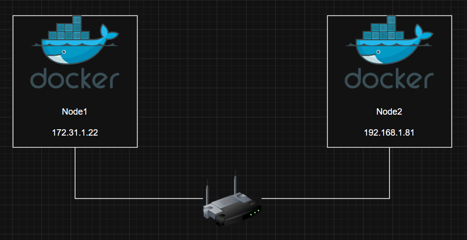

# Docker overlay networking 
## Docker overlay networking - The TLDR
Trong thực tế, việc các container có thể giao tiếp với nhau một cách đáng tin cậy và an toàn là rất quan trọng, ngay cả khi chúng nằm trên các host khác nhau và thuộc các mạng khác nhau. 

Đây chính là lúc mạng overlay phát huy tác dụng. Nó cho phép ta tạo ra một mạng layer 2 an toàn, trải dài trên nhiều host. Các container kết nối vào mạng này có thể giao tiếp trực tiếp với nhau 

Docker cung cấp sẵn overlay driver

## Docker overlay networking - The deep dive

Ta sẽ chia chapter này thành 2 phần: 
- Phần 1: xây dựng và kiểm thử một Docker overlay network 
- Phần 2: Giải thích cơ chế giúp nó hoạt động 

### Build and test a Docker overlay network in Swarm mode 

**Mô Hình:**

- Sử dụng 2 docker host nằm trên 2 mạng layer2 riêng biệt, được kết nối thông qua một router 

#### Build a Swarm 
