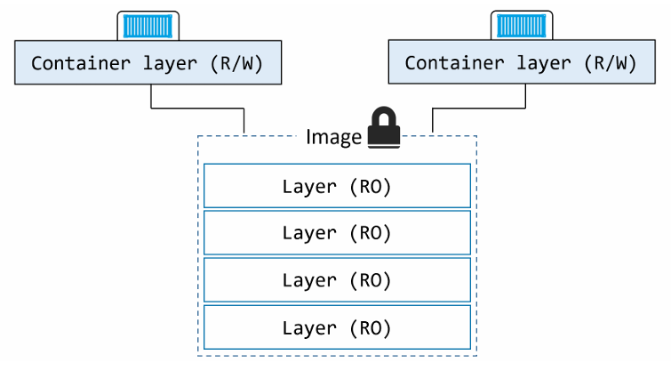
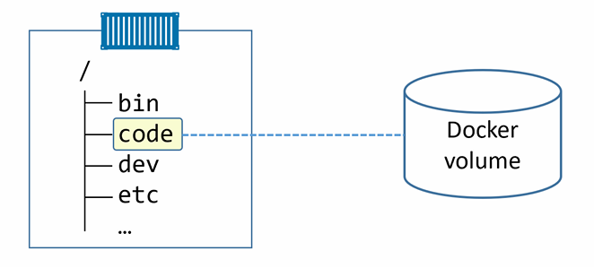
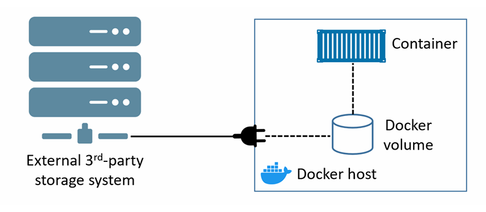
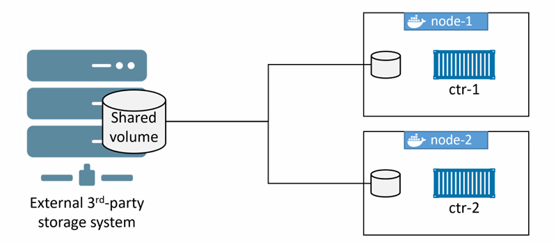

# Volumes and persistent data
Tìm hiểu cách Docker xử lý các ứng dụng có ghi dữ liệu lâu dài 

## Volumes and persistent data - the TLDR

Có 2 loại dữ liệu chính: 
- Persistent (bền vững): dữ liệu cần giữ lại, ví dụ: hồ sơ khách hàng, dữ liệu tài chính, log kiểm toán, ...
- Non-persistent (không bền vững): dữ liệu không cần lưu giữ 


Để xử lý dữ liệu không bền vững, mỗi container Docker đều có vùng lưu trữ không bền vững riêng. Vùng này được tạo tự động cho mỗi container và gắn chặt với vòng đời của container. Do đó, khi xóa container thì vùng lưu trữ và toàn bộ dữ liệu trong đó cũng sẽ bị xóa 

Để xử lý dữ liệu bền vững, container cần lưu trữ dữ liệu vào volume. Volume là một đối tượng riêng biệt, có vòng đời tách rời khỏi container. Điều này có nghĩa là bạn có thể tạo và quản lý volume đọc lập, và nó không phụ thuộc vào vòng đời của bất kỳ container nào. Kết quả là bạn có thể xóa container đang sử dụng volume mà volume đó vẫn không bị xóa.

## Volumes and persistent data - The Deep Dive
### Containers and non-persistent data
Container được thiết kế theo hướng read-only - một **best practice** là không thay đổi cấu hình của container sau khi nó đã được triển khai. Nếu có sự cố hoặc cần thay đổi gì, nên tạo 1 container mới với các bản sửa lỗi / cập nhật và triển khai nó thay thế container cũ. Không nên login vào container đang chạy để chỉnh sửa cấu hình 

Tuy nhiên, nhiều ứng dụng cần hệ thống `read-write` để có thể chạy. Điều này có nghĩa là không thể đơn giản làm cho container hoàn toàn chỉ đọc. Mỗi container Docker được tạo bằng cách thêm một lớp `read-write` mỏng (thin writable layer) lên trên image chỉ đọc mà nó dựa vào 



Lớp ghi này tồn tại trong filesystem của Docker host, thường nằm ở: `/var/lib/docker/overlay2/...`

Lớp ghi mỏng này là một phần không thể thiếu của container và cho phép tất cả các thao tác đọc/ghi. Nếu bạn hoặc ứng dụng câp nhật file hoặc thêm file mới, chúng sẽ được ghi vào lớp này. Tuy nhiên, lớp này gắn chặt với vòng đời của container - nó được tạo khi container được tạo và bị xóa khi container bị xóa. Việc nó bị xóa cùng container có nghĩa là nó không phù hợp để lưu trữ dữ liệu quan trọng cần giữ lâu dài

Nếu container của bạn không tạo ra dữ liệu cần lưu trữ lâu dài, thì lớp ghi tạm thời này là đủ dùng

**NOTE:**

Lớp lưu trữ ghi này được quản lý trên mỗi Docker host bởi một storage driver. Ta cần đảm bảo chọn đúng storage driver phù hợp với distro linux mình sử dụng:
- Red Hat: dùng `overlay2`
- Ubuntu: `overlay2`

### Containers and persistent data
Volume là cách được khuyến nghị để lưu trữ dữ liệu bền vững trong container. Lý do:
- Volume là các đối tượng độc lập, không gắn với vòng đời của container 
- Volume có thể được ánh xạ tới các hệ thống lưu trữu bên ngoài 
- Volume cho phép nhiều container trên các Docker host khác nhau truy cập và chia sẻ cùng 1 dữ liệu 

Ở mức tổng quát, ta tạo 1 volume, sau đó tạo container và mount volume đó vào container. Volume sẽ được mount vào 1 thư mục trong filesystem của container, mọi dữ liệu ghi vào thư mục đó sẽ được lưu trong volume. Nếu xóa container, volume và dữ liệu của nó vẫn còn tồn tại



Ta thấy:
- 1 Docker volume tồn tại bên ngoài container như 1 đối tượng riêng biệt
- Volume được mount vào filesystem của container tại `/code`
- Mọi dữ liệu ghi vào `/code` sẽ được lưu trên volume và vẫn tồn tại sau khi container bị xóa 
- Các thư mục khác trong container sử dụng lớp ghi mỏng trong local storage trên Docker Host

#### Creating and managing Docker volumes
Volumes là các đối tượng trong Docker. Điều này có nghĩa là chúng là 1 đối tượng riêng trong API và có nhóm lệnh riêng `docker volume`

Sử dụng lệnh sau để tạo 1 volume mới tên là `myvol`:

```bash
docker volume create myvol
```

Mặc định Docker tạo volume mới bằng driver local tích hợp sẵn. Các volume tạo bằng driver local chỉ khả dụng cho các container chạy trên cùng một node với volume đó. Sử dụng `-d` để chỉ định driver khác


Các driver volume từ bên thứ 3 có sẵn dưới dạng plugin. Chúng cung cấp cho Docker khả năng truy cập tới các hệ thống lưu trữ bên ngoài như dịch vụ lưu trữ cloud



Xem và kiểm tra chi tiết volume:

```bash
root@dockersvr:~# docker volume ls
DRIVER    VOLUME NAME
local     myvol
root@dockersvr:~# docker volume inspect myvol
[
    {
        "CreatedAt": "2026-04-23T16:41:49+07:00",
        "Driver": "local",
        "Labels": null,
        "Mountpoint": "/var/lib/docker/volumes/myvol/_data",
        "Name": "myvol",
        "Options": null,
        "Scope": "local"
    }
]
```

- `Driver` và `Scope` đều là local - volume được tạo bằng driver local chỉ khả dụng cho các container trên Docker host này 
- `Mountpoint`: vị trí của volume trong filesystem của Docker host

Tất cả các volume tạo bằng driver local sẽ có thư mục riêng: `/var/lib/docker/volumes/...`

Sau khi volume được tạo, nó có thể được sử dụng bởi một hoặc nhiều container 

Có 2 cách để xóa một Docker volume:
- `docker volume prune`: Xóa tất cả volume không được sử dụng bởi bất kỳ container hoặc service replica nào 
- `docker volume rm`: chỉ định chính xác volume muốn xóa 

Ta có thể khai báo volume trong Dockerfile bằng chỉ thị `VOLUME`. Cú pháp:

```bash
VOLUME <container-mount-point>
```

### Demonstrating volumes with containers and services

Xem cách sử dụng volume với container và service 

Sử dụng lệnh sau để tạo một container độc lập mới và mount một volume có tên là `bizvol`

```bash
docker container run -dit --name voltainer --mount source=bizvol,target=/vol \
alpine
```

- `--mount source=bizvol,target=/vol`: mount volume có tên `bizvol` vào container tại `/vol` 
- Lệnh này chạy thành công mặc dù trên hệ thống chưa có volume nào tên là `bizvol`

- Nếu bạn chỉ định 1 volume đã tồn tại, Docker sẽ sử dụng volume đó
- Nếu bạn chỉ định 1 volume chưa tồn tại, Docker sẽ tự tạo 

Kiểm tra volume: 

```bash
root@dockersvr:~# docker volume ls
DRIVER    VOLUME NAME
local     bizvol
```

Bạn không thể xóa volume nếu nó đang được sử dụng bởi container

```bash
root@dockersvr:~# docker volume rm bizvol
Error response from daemon: remove bizvol: volume is in use - [75cd7f39c0605061d305e3de5ae701aaf23b63b59470217fdef328c967d426dc]
```

Volume vừa tạo nên chưa có dữ liệu, bây giờ truy cập vào container và ghi dữ liệu vào đó. 

```bash
root@dockersvr:~# docker container exec -it voltainer sh
/ # echo "Hello I'm luongngocvu" > /vol/file1
/ # ls -l /vol
total 4
-rw-r--r--    1 root     root            22 Apr 24 01:23 file1
/ # cat /vol/file1
Hello I'm luongngocvu
/ #
```

Gõ `exit` để quay lại terminal của Docker host, sau đó xóa container:

```bash
root@dockersvr:~# docker container rm -f voltainer
voltainer
```

Mặc dù container bị xóa, volume vẫn tồn tại:

```bash
root@dockersvr:~# docker container ls
CONTAINER ID   IMAGE     COMMAND   CREATED   STATUS    PORTS     NAMES

root@dockersvr:~# docker volume ls
DRIVER    VOLUME NAME
local     bizvol
```

Vì volume vẫn còn, ta có thể kiểm tra mount point của nó trên host để xem còn dữ liệu không 

```bash
root@dockersvr:~# ls -l /var/lib/docker/volumes/bizvol/_data/
total 4
-rw-r--r-- 1 root root 22 Apr 24 08:23 file1
root@dockersvr:~#
root@dockersvr:~# cat /var/lib/docker/volumes/bizvol/_data/file1
Hello I'm luongngocvu
```

=> Volume và dữ liệu vẫn còn 

Ta cũng có thể mount volume `bizvol` vào một service hoặc container mới.

```bash
docker service create --name hellcat --mount source=bizvol,target=/vol \
alpine sleep 1d
```

```bash
root@node1:~# docker service create --name hellcat --mount source=bizvol,target=/vol \
alpine sleep 1d
9k9p47d3fw51xqa7l8a8vkiez
overall progress: 1 out of 1 tasks
1/1: running   [==================================================>]
verify: Service 9k9p47d3fw51xqa7l8a8vkiez converged
```

Vì không chỉ định `--replicas` nên chỉ có 1 replica được tạo. Xác định node mà nó đang chạy:

```bash
root@node1:~# docker service ps hellcat
ID             NAME        IMAGE           NODE      DESIRED STATE   CURRENT STATE            ERROR     PORTS
q9gpzwi25o8k   hellcat.1   alpine:latest   node1     Running         Running 51 seconds ago
```

- Replica chạy trên `node1`

Login vào `node1` và lấy container ID:

```bash
root@node1:~# docker container ls
CONTAINER ID   IMAGE           COMMAND            CREATED              STATUS              PORTS     NAMES
bf2809f3044b   alpine:latest   "sleep 1d"         About a minute ago   Up About a minute             hellcat.1.q9gpzwi25o8kqkni9k6r6nelu
```

- Tên container là sự kết hợp của `service-name`, `replica-number` và `replica-ID`

Truy cập vào container và kiểm tra dữ liệu trong `/vol`:

```bash
root@node1:~# docker container exec -it bf2809f3044b sh
/ # cat /vol/file1
Hi I'm luongngocvu
```

=> Volume đã giữ lại dữ liệu ban đầu và cung cấp cho container mới 

### Sharing storage across cluster nodes 
Việc tích hợp các hệ thống lưu trữ bên ngoài với Docker giúp có thể chia sẻ volume giữa các node trong cluster. 

Ví dụ: 1 NFS share có thể được cung cấp cho nhiều Docker host, cho phép nó được sử dụng bởi container và các service replica bất kể chúng đang chạy ở host nào 



Trên hình ta thấy:
- 1 volume dùng chung bên ngoài được cung cấp cho 2 docker node
- Các node có thể cung cấp volume cho container 

