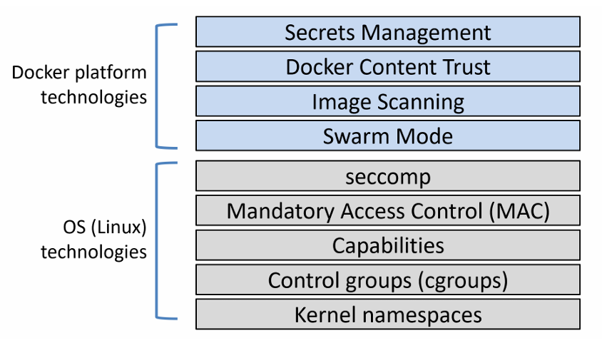
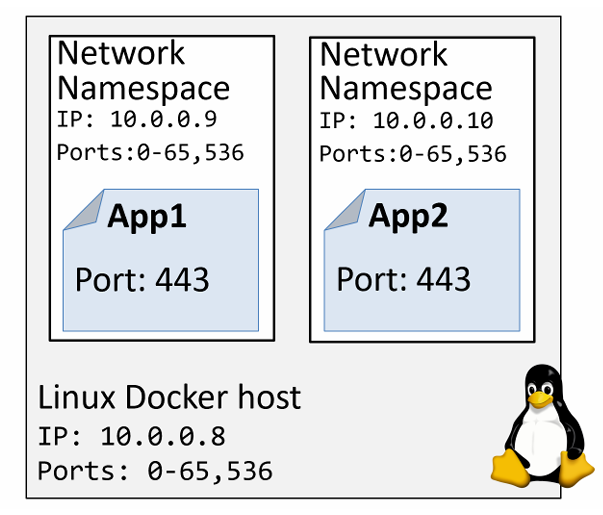
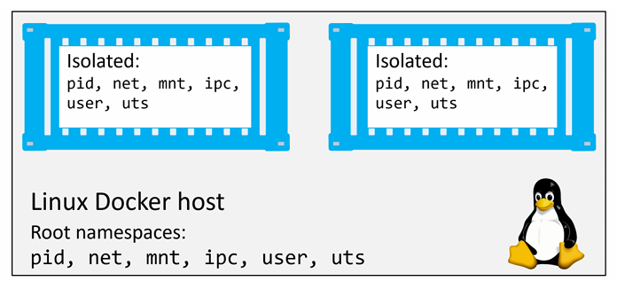
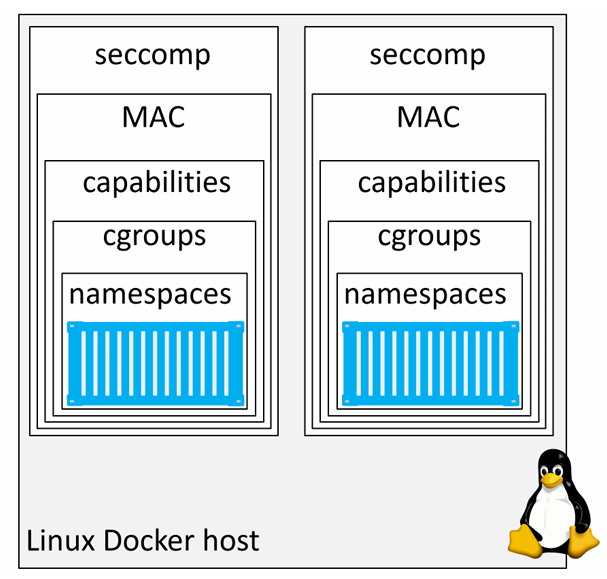
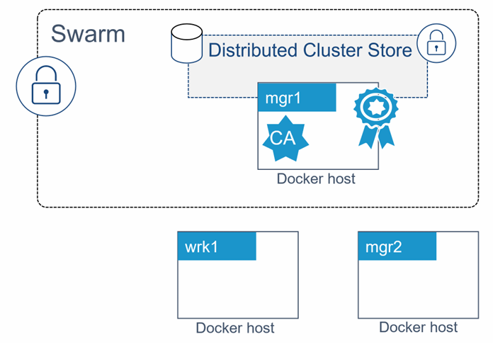
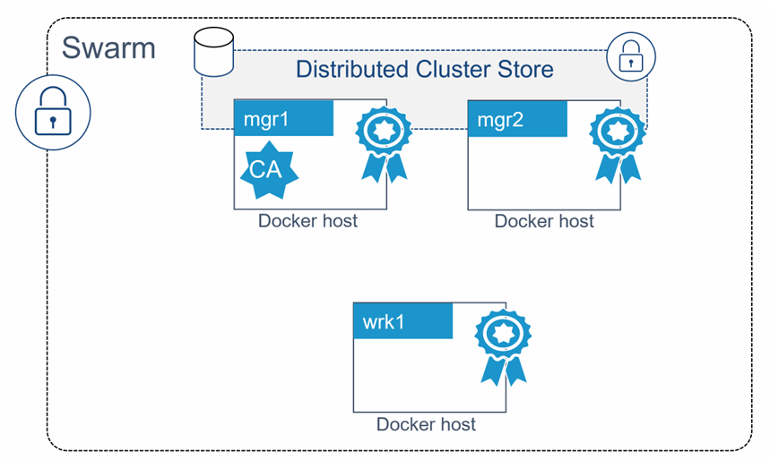
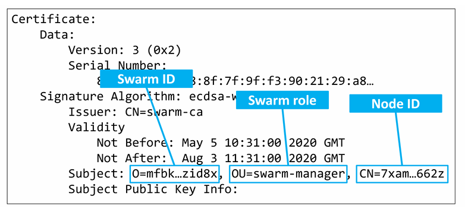
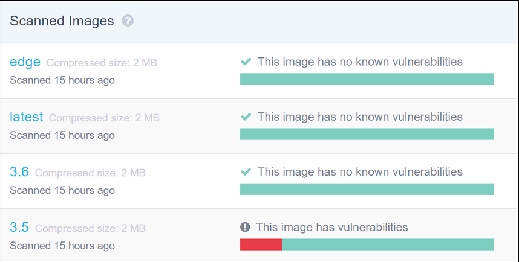
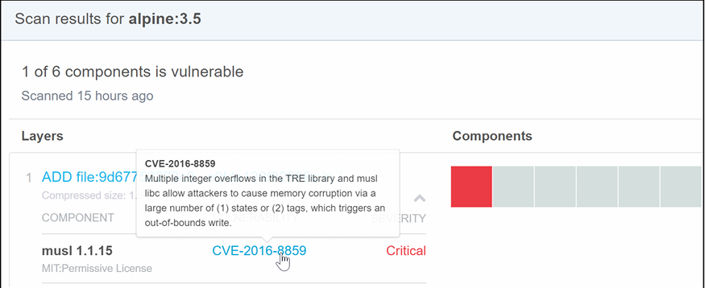
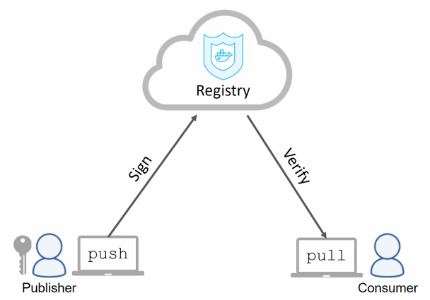

# Security in Docker 
## Security in Docker - The TLDR 

Docker cung cấp nhiều lớp bảo mật khác nhau 



Trên Linux, Docker tận dụng hầu hết các công nghệ bảo mật và cô lập tiến trình phổ biến: 
- namespace (tách biệt tài nguyên như process, network, filesystem)
- cgroups (control groups) (giới hạn tài nguyên như CPU, RAM)
- capabilities (chia nhỏ quyền root)
- MAC - Mandatory Access Control (Ví dụ: SELinux)
- seccomp (lọc system call để hạn chế hành vi nguy hiểm) 

Docker cũng bổ sung thêm nhiều công nghệ bảo mật rất tốt. 

Docker Swarm Mode được bảo mật mặc định như: 
- ID node được mã hóa, xác thực 2 chiều, tự động cấu hình CA, lưu trữ cluster được mã hóa, mạng được mã hóa, ..
- Docker Content Trust (DCT) cho phép bạn ký image và xác minh tính toàn vẹn cũng như nguồn phát hành của các image mà bạn sử dụng.

## Security in Docker - The deep dive

Tìm hiểu về các công nghệ bảo mật của: 
- Linux: 
  - Namespaces
  - Control Groups 
  - Capabilities 
  - Mandatory Access Contorl 
  - seccomp 
- Docker: 
  - Swarm mode
  - Image scanning
  - Docker Content Trust 
  - Docker Secrets 

### Linux security technologies 

#### Namespaces 
Kernel namespaces là nền tảng cốt lõi của container. Chúng chia nhỏ 1 hệ điều hành sao cho nó trông và hoạt động như nhiều hệ điều hành riêng biệt, được cô lập với nhau. 

**Ví dụ:** 

- Namespaces cho phép chạy nhiều web server, mỗi cái đều dùng port 443, trên cùng 1 OS. Để làm điều này, bạn chỉ cần chạy mỗi web server trong network namespace riêng. Điều này hoạt động vì mỗi network namespace có địa chỉ IP riêng và dải port đầy đủ. Bạn có thể cần map chúng ra các port khác nhau trên Docker host, nhưng mỗi web server vẫn có thể chạy mà không cần sửa code hay cấu hình lại port.


  

Docker giúp cho việc làm việc với namespace trở nên đơn giản. Docker tự động quản lý tất cả các namespace cần thiết để tạo container. 

Docker trên Linux sử dụng các kernel namespace sau: 
- Process ID (PID)
- Network (net)
- Filesystem/mount (mnt)
- User (user)

**NOTE:** Container Docker thực chất là 1 tập hợp các namespace được tổ chức lại với nhau - Ta sẽ có được toàn bộ cơ chế cô lập của OS với mỗi Container 

**Ví dụ:** Mỗi container đều có namespace riêng cho pid, net, mnt, user. Thực tế, chính tập hợp các namespace này tạo nên cái gọi là `container`



**Cách Docker sử dụng từng loại namespace:**
- Process ID namespace (pid): Docker sử dụng pid namespace để tạo cây tiến trình (process tree) riêng biệt cho mỗi container. Điều này có nghĩa là mỗi container có PID 1 riêng. Đồng thời, container không thể nhìn thấy hoặc truy cập process của container khác hay của host
- Network namespace (net): Docker dùng net namespace để cung cấp cho mỗi container một network stack riêng biệt, bao gồm: interface, địa chỉ IP, dải port và bảng định tuyến. Ví dụ, mỗi container có interface eth0 riêng, với IP và port riêng.
- Mount namespace (mnt): Mỗi container có một filesystem gốc (/) riêng biệt và được cô lập. Điều này có nghĩa là mỗi container có thể có `/etc`, `/var`, `/dev` riêng. Các process bên trong container không thể truy cập filesystem của host hoặc container khác.
- Inter-process Communication namespace (ipc): Docker dùng ipc namespace để quản lý shared memory bên trong container, đồng thời cô lập nó với shared memory bên ngoài.
- User namespace (user): Docker cho phép ánh xạ user trong container sang user khác trên host. Ví dụ phổ biến là ánh xạ user root trong container thành user thường (non-root) trên host.
- UTS namespace (uts): Docker dùng uts namespace để cung cấp hostname riêng cho mỗi container.

#### Control Groups 

Nếu namespaces dùng để cô lập, thì control groups (cgroups) dùng để giới hạn quyền tài nguyên 

Cgroups cho phép chúng ta đặt giới hạn để (theo ví dụ này) không có container nào có thể dùng hết được tài nguyên chung của hệ thống 

Các container được cô lập với nhau nhưng vẫn dùng chung tài nguyên của hệ điều hành như CPU, RAM, .... Cgroups cho phép chúng ta đặt giới hạn cho từng loại tài nguyên này, một container không thể chiếm dụng toàn bộ và gây ra tình trạng DoS

#### Capabilities 
Capabilities là một cơ chế cho phép ta chọn lọc những quyền của root mà container thực sự cần để chạy

Bên trong hệ thống, user root của Linux thực chất là tập hợp của rất nhiều capability như: 
- `CAP_CHOWN`: cho phép thay đổi quyền sở hữu file 
- `CAP_NET_BIND_SERVICE`: cho phép bind socket vào các port thấp (80, 443)
- `CAP_SETUID`: cho phép nâng quyền của 1 process 
- `CAP_SYS_BOOT`: cho phép khởi động lại hệ thống 
- ... 

Docker làm việc với capabilities để bạn có thể chạy container với quyền root nhưng loại bỏ những quyền không cần thiết. 

Ví dụ: Nếu container của bạn chỉ cần quyền bind vào các port thấp, bạn có thể chạy container và loại bỏ tất cả quyền root, sau đó chỉ thêm lại `CAP_NET_BIND_SERVICE`

#### Mandatory Access Control Systems
#### seccomp
Docker sử dụng seccomp ở chế độ filter để giới hạn các syscall mà container có thể gọi tới kernel của host.

#### Final thoughts on the Linux security technologies

Docker hỗ trợ hầu hết các công nghệ bảo mật quan trọng của Linux và đi kèm với các cấu hình mặc định hợp lý, giúp tăng cường bảo mật nhưng không quá hạn chế



### Docker platform security technologies 

#### Security in Swarm Mode 

Swarm mode tích hợp nhiều tính năng bảo mật được bật sẵn với các cấu hình mặc định bao gồm: 
- ID node được mã hóa 
- TLS xác thực 2 chiều 
- join Token 
- Cấu hình CA 
- Mạng được mã hóa 
- Kho lưu trữ cluster (config DB) được mã hóa 

#### Configure a secure Swarm 

Chạy lệnh sau trên node mà bạn muốn làm manager đầu tiên của swarm mới. 

```bash
docker swarm init
```

Thêm 1 worker vào Swarm: 

```bash
docker swarm join --token <token> 192.168.70.91:2377
```

Để thêm một manager, chạy:

```bash
docker swarm join-token manager 
```

Đó chính xác là tất cả những gì cần làm để cấu hình một swarm an toàn.

`mgr1` được cấu hình là manager đầu tiên của Swarm, đồng thời cũng là CA gốc. Bản thân swarm được gán 1 ClusterID dạng mã hóa. 

`mgr1` tự cấp cho mình một client certificate để xác định vai trò manager trong swarm, cấu hình xoay vòng chứng chỉ tự động với giá trị mặc định là 90 ngày, và một cơ sở dữ liệu cấu hình cluster đã được thiết lập và mã hóa.

Một tập các token bảo mật cũng được tạo ra để cho phép các manager và worker mới tham gia vào swarm.



Để thêm `mgr2` làm manager ta thực hiện các bước sau: 

- Chạy lệnh sau trên `mgr1` để lấy manager join token: 

  ```bash
  docker swarm join-token manager
  ```

- Chạy lệnh sau trên `mgr2`: 

  ```bash
  docker swarm join --token <token> 192.168.70.91:2377
  ```

Để thêm `wrk1` làm worker ta thực hiện các bước sau: 

- Chạy lệnh sau trên `mgr1` để lấy worker join token: 

  ```bash
  docker swarm join-token worker
  ```

- Chạy lệnh sau trên `wrk1`: 

  ```bash
  docker swarm join --token <token> 192.168.70.91:2377
  ```



#### Looking behind the scenes at Swarm security 

##### Swarm join tokens 

Thứ duy nhất cần để thêm các manager và worker mới vào một swarm hiện có là join token tương ứng. Do đó, việc giữ an toàn cho các join token là rất quan trọng 

Mỗi swarm duy trì 2 loại join token riêng biệt: 
- token để thêm manager 
- token để thêm worker 

Mỗi token gồm 4 phần, được phân tách bằng dấu `-`: 

```bash
PREFIX - VERSION - SWARM ID - TOKEN
```

- `PREFIX`: luôn là `SWMTKN` giúp để nhận biết và tránh vô tình public 
- `VERSION`: cho biết phiên bản của Swarm 
- `SWARM ID`: là 1 giá trị hash của certificate của swarm 
- `TOKEN`: phần quyết định node sẽ tham gia với vai trò manager hay worker

Ta có thể thu hồi và tạo token mới chỉ với 1 lệnh: 

```bash
docker swarm join-token --rotate manager 
```

Sau đó hệ thống sẽ cung cấp lệnh mới để thêm manager:


##### TLS and mutual authentication 

Mỗi manager và worker khi tham gia vào swarm sẽ được cấp một client certificate. Chứng chỉ này được dùng cho xác thực 2 chiều. Nó giúp xác định:
- Node đó là ai
- Thuộc Swarm nào 
- Vài trò của node trong Swarm 

Dùng lệnh sau để kiểm tra client certificate của 1 node trên Linux: 

```bash
sudo openssl x509 -in /var/lib/docker/swarm/certificates/swarm-node.crt -text
```

```bash
Certificate:
Data:
Version: 3 (0x2)
Serial Number:
80:2c:a7:b1:28...a8:af:89:a1:2a:51:89
Signature Algorithm: ecdsa-with-SHA256
Issuer: CN = swarm-ca
Validity
Not Before: May 5 10:31:00 2020 GMT
Not After : Aug 3 11:31:00 2020 GMT
Subject: O=mfbkgjm2tlametbnfqt2zid8x, OU=swarm-manager,
CN=7xamk8w3hz9q5kgr7xyge662z
Subject Public Key Info:
<SNIP>
```

Subject sử dụng các trường tiêu chuẩn để lưu thông tin:
- `O (Organization)`: lưu Swarm ID
- `OU (Organizational Unit)`: lưu vai trò của node trong swarm
- `CN (Common Name)`: Lưu ID mã hóa của node 



##### Configuring some CA settings 

##### The cluster store 

Cluster store là “bộ não” của một swarm, nơi lưu trữ cấu hình và trạng thái của cluster. Nó cũng rất quan trọng đối với các công nghệ khác của Docker như overlay networking và Secrets.

#### Detecting vulnerabilities with image security scanning

`Image scanning` là công cụ chính giúp bạn phát hiện các lỗ hổng và điểm yếu bảo mật trong image 

Các công cụ quét image hoạt động bằng cách phân tích image và tím kiếm các package có lỗ hổng đã được biết đến. Khi phát hiện ra, bạn có thể cập nhật các package và dependency lên phiên bản đã được vá lỗi.





#### Signing and verifying images with Docker Content Trust

Docker Content Trust (DCT) giúp việc xác minh tính toàn vẹn và nguồn phát hành của các image mà ta tải về 

DCT cho phép developer ký image khi push lên Docker Hub. Sau đó, các image này có thể được xác minh khi được pull và chạy 



DCT cung cấp các thông tin như: 
- Image có được ký để dùng trong môi trường cụ thể như prod hay dev hay không 
- Image có lỗi thời hay không 

Các bước sau minh họa cách cấu hình Docker Content Trust, ký và push image, sau đó pull image đã ký. Ta sẽ cần 1 cặp khóa mã hóa (key-pair) để ký image 

Ta tạo key-pair bằng lệnh sau: 

```bash
docker trust key generate nigel 
```

Lệnh này sẽ tạo 1 cặp khóa mới tên là `nigel`

Nếu như đã có key-pair, ta có thể import bằng câu lệnh sau: 

```bash
docker trust key load key.pem --name nigel 
```

Sau khi có key-pair hợp lệ, ta cần liên kết nó với repository mà ta sẽ push image đã ký

```bash
docker trust signer add --key nigel.pub nigel nigelpoulton/dct
```

- Thêm signer `nigel` vào repo 
- Khởi tạo repo có hỗ trợ chữ ký 

Ký và push image:

```bash
$ docker trust sign nigelpoulton/dct:signed
```

Image sẽ được ký và đẩy lên Docker Hub kèm theo metadata xác thực 

Sau khi push, ta có thể kiểm tra thông tin chữ ký: 

```bash
docker trust inspect nigelpoulton/dct:signed --pretty
```

Lệnh trên sẽ hiển thị: 
- Tag đã kí 
- Digest của image 
- Danh sách người ký 
- Các khóa quản trị 

Ta có thể buộc Docker luôn ký và xác minh image khi push/pull bằng cách bật biến môi trường:

```bash
$ export DOCKER_CONTENT_TRUST=1
```

Khi bật DCT: 
- Không thể pull image chưa được ký 
- Chỉ có thể push image đã được ký 

### Docker Secrets 

Docker 1.13 đã giới thiệu Docker Secrets như các đối tượng "first-class" trong Docker API 

Secrets được: 
- mã hóa khi lưu trữ 
- mã hóa khi truyền 
- được mount vào container dưới dạng filesystem trong bộ nhớ
- hoạt động theo mô hình least-privilege (chỉ cấp cho các service được phép truy cập)

Đây là một giải pháp khá toàn diện từ đầu đến cuối, và nó cũng có lệnh riêng là `docker secret`


