# Tìm hiểu về các câu lệnh GIT

## Summary

## 1. git add

`git add` = chọn thay đổi nào sẽ được đưa vào commit tiếp theo. Nó dùng để đưa thay đổi từ `Working Directory` vào `Staging Area`

### 1.0 git add <ten_file>

Thêm file được chỉ định 

```bash
git add main.py
```

### 1.1 git add .
Thêm tất cả file thay đổi trong thư mục hiện tại

```bash
git add .
```

Dùng khi muốn commit toàn bộ project

### 1.2 git add -u
Chỉ thêm file bị sửa hoặc bị xóa. 

Không thêm file mới

```bash
git add -u
```

### 1.3 git add <ten_folder>
Thêm toàn bộ file trong folder đó

```bash
git add src/
```

### 1.4 git add *.py

Thêm theo pattern

```bash
git add *.py

# Các file có đuôi ".py" sẽ đều được thêm vào
```

## 2. git rm

`git rm` là lệnh dùng để xóa file khỏi Git repository và đồng thời xóa file đó khỏi thư mục làm việc (workspace)

Khi chạy: 

```git
git rm file.txt
```

Git sẽ:
- Xóa file khỏi workspace 
- Đưa việc xóa này vào Staging Area
- Khi `git commit`, file sẽ bị xóa khỏi repository

### 2.0 `-f` (force)
Bắt Git xóa file ngay cả khi file đã được sửa mà chưa commit 

Git mặc định không cho xóa file nếu file có thay đổi mà chưa commit

**Ví dụ:**

Ở đây tôi có 1 file là `a.cpp`:

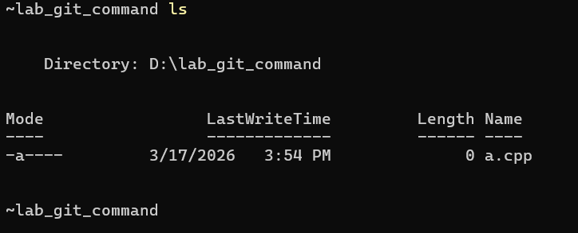

file này cũng đã có trên remote repository: github

Bây giờ tôi sẽ sửa nội dung của file này và thử sủ dụng lệnh `git rm`:

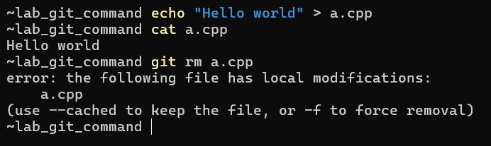

Ta thấy: Khi tôi sửa file a.cpp mà chưa commit thì sẽ không thể xóa file được 

Giờ ta sẽ sử dụng option `-f`:

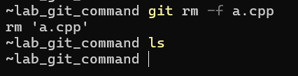

Lúc này ta thấy đã xóa file thành công. Tuy nhiên trên remote repo vẫn còn tồn tại file. Để có thể xóa file khỏi remote repo ta sẽ phải commit là push lại lên remote repo:

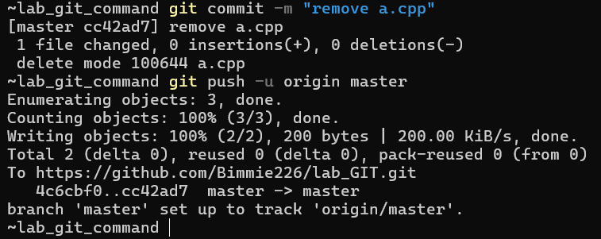

Kiểm tra trên github:

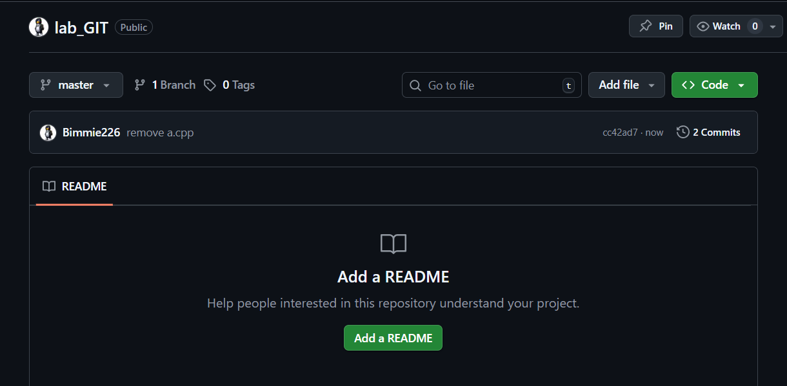

### 2.1 `--cached`

Chỉ xóa file khỏi Git repository nhưng giữ lại file trong Workspace

**Ví dụ:**

Bây giờ trên workspace và remote repo đều đang có file `a.py`:

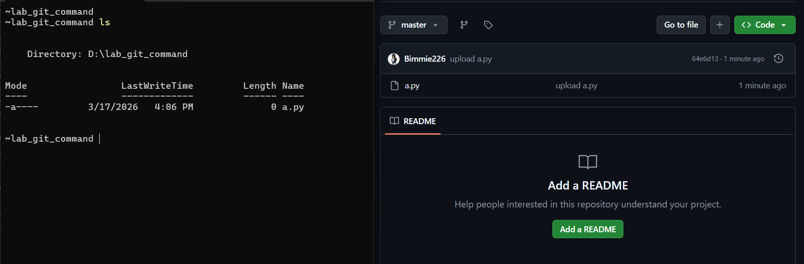

Tôi muốn giữ lại file `a.py` trong workspace nhưng trên remote repo tôi muốn xóa file đó đi, tôi sẽ sử dụng lệnh sau:

```git
git rm --cached main.py
```

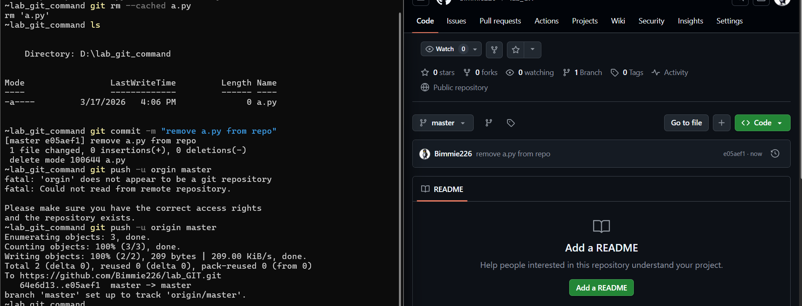

Ta thấy, sau khi sử dụng lệnh trên và commit lại thì bây giờ trên workspace vẫn tồn tại file `a.py` nhưng trên remote repo đã không còn file này nữa

### 2.2 `-r` (recursive)

Xóa thư mục và toàn bộ file bên trong

Git mặc định không cho xóa directory nếu không có `-r`

**Ví dụ:**

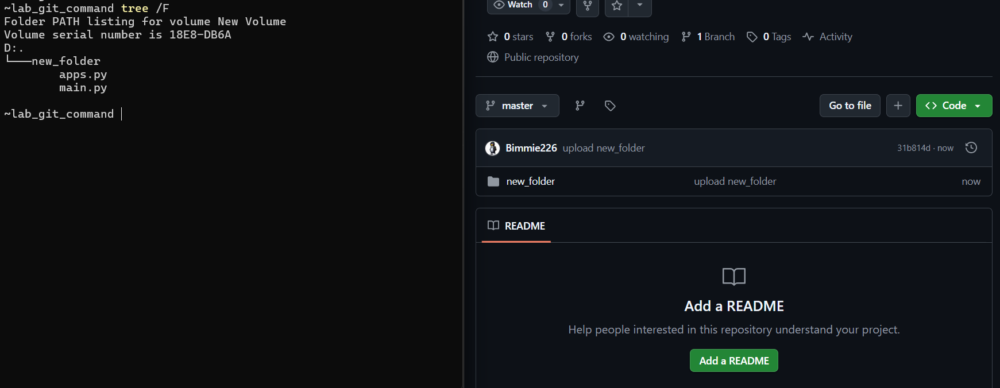

Lúc này trên workspace và repo đều có thư mục new_folder chứa 2 file `apps.py` và `main.py`

Ta muốn xóa thư mục này => sử dụng lệnh:

```git
git rm -r new_folder
```

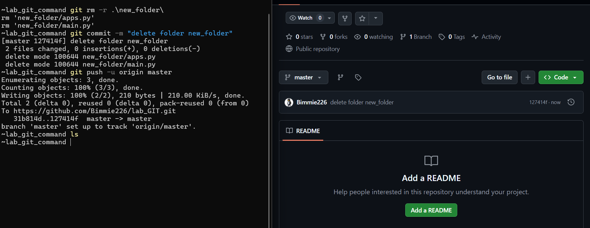

Ta thấy sau khi xóa và commit thì thư mục `new_folder` trên workspace và repo đều đã bị xóa

### 2.3 `--ignore-unmatch`

Không báo lỗi nếu file không tồn tại 

**Ví dụ:**

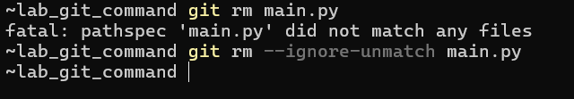

## 3. git commit
`git commit` là lệnh dùng để lưu lại các thay đổi đã được đưa vào Staging Area vào Local Repository

Hiểu đơn giản:

> `git commit` = tạo 1 snapshot của project tại thời điểm đó


Luồng hoạt động:

- 3 vùng liên quan đến luồng hoạt động của git commit là: `Workspace -> Staging Area -> Repository`

Quy trình:
- Sửa file: `Workspace`
- Thêm vào staging: `git add file`
- commit: `git commit -m "message"` - lúc này Git tạo 1 commit mới trong Local Repository

### 3.0 `-m` (message)

Cho phép viết commit message trực tiếp trên command line

```bash
git commit -m "add login API"
```

Nếu không có `-m`, Git sẽ mở editor để nhập message

### 3.1 `-a` (auto stage)
Tự động add tất cả file đã được track và bị thay đổi trước khi commit 

Tức là:

```bash
git add + git commit
```

Trong 1 lệnh

**Ví dụ:**

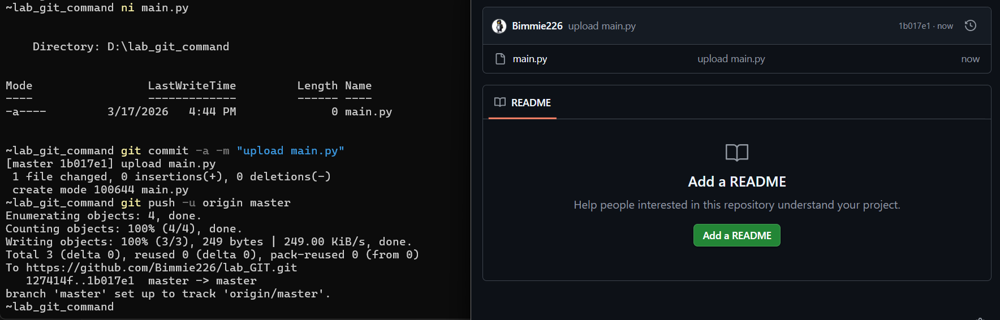

Ta thấy, không cần sử dụng git add ta vẫn có thể đẩy lên stagin sau đó commit và push lên repo

### 3.2 `--amend`

Dùng để sửa commit gần nhất

Có thể:
- Sửa message
- Thêm file vào commit vừa tạo

**Ví dụ:**

- Sửa messages:

    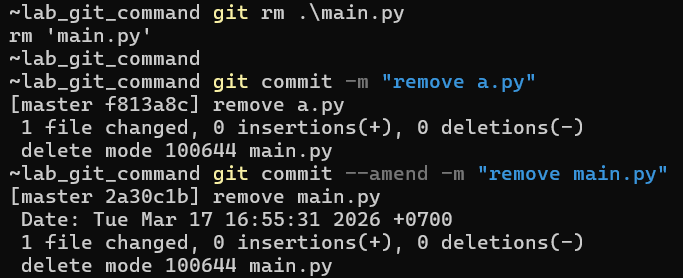

- Thêm file vào commit trước:

    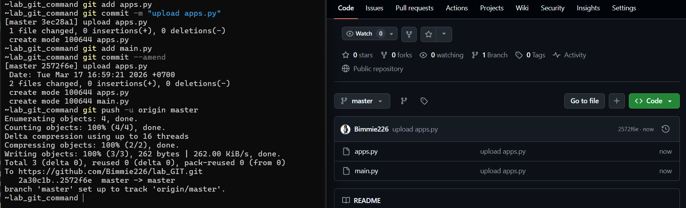

### 3.3 `--no-edit`

Giữ nguyên commit message khi dùng `--amend`

**Ví dụ:**

```bash
git add main.py
git commit --amend --no-edit
```

=> Chi thêm file vào commit cũ, không sửa message

### 3.4 `--author`

Thay đổi author của commit

**Ví dụ:**

```bash
git commit -m "update API" --author="Nguyen Van A <a@gmail.com>"
```

### 3.5 `--allow-empty`
Cho phép tạo commit dù không có thay đổi nào 

Thường dùng để: trigger CI/CD pipeline

**Ví dụ:**

```bash
git commit --allow-empty -m "trigger pipeline"
```

### 3.6 `-v` (Verbose)

Hiển thị diff của commit trong editor khi viết message

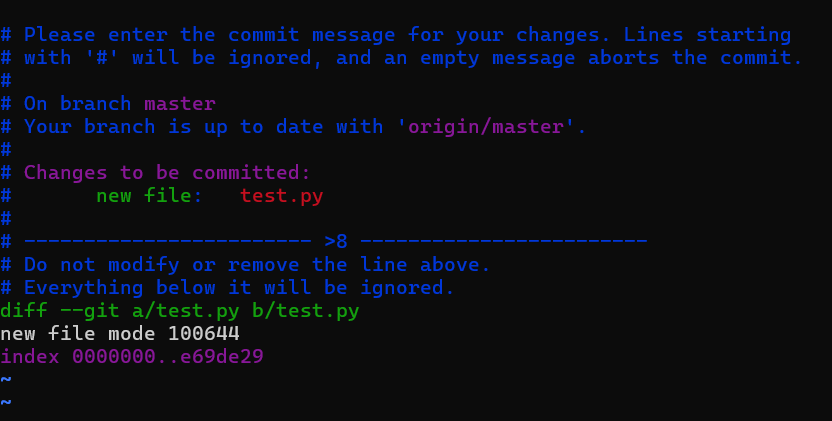