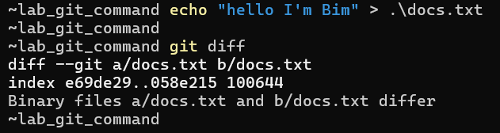
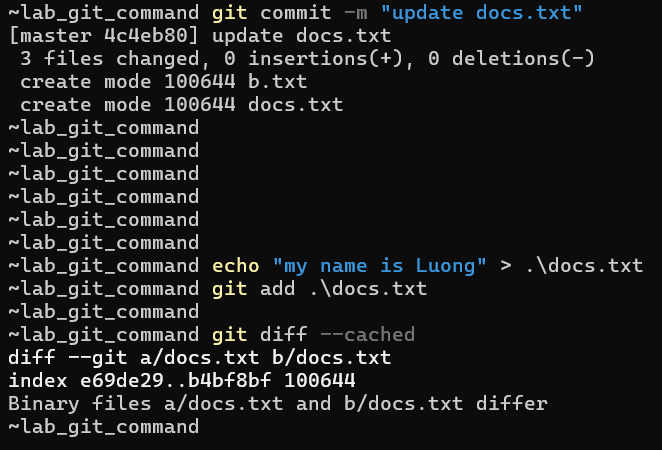
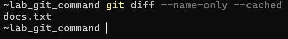
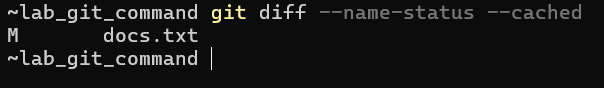
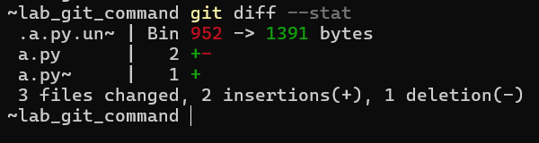
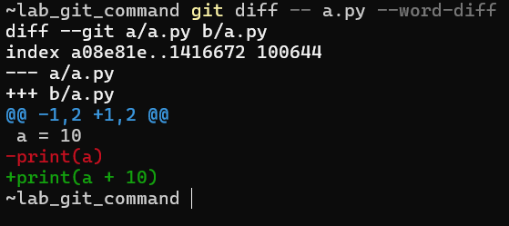

# Tìm hiểu về các câu lệnh GIT

## Summary

## 1. git add

`git add` = chọn thay đổi nào sẽ được đưa vào commit tiếp theo. Nó dùng để đưa thay đổi từ `Working Directory` vào `Staging Area`

### 1.0 git add <ten_file>

Thêm file được chỉ định 

```bash
git add main.py
```

### 1.1 git add .
Thêm tất cả file thay đổi trong thư mục hiện tại

```bash
git add .
```

Dùng khi muốn commit toàn bộ project

### 1.2 git add -u
Chỉ thêm file bị sửa hoặc bị xóa. 

Không thêm file mới

```bash
git add -u
```

### 1.3 git add <ten_folder>
Thêm toàn bộ file trong folder đó

```bash
git add src/
```

### 1.4 git add *.py

Thêm theo pattern

```bash
git add *.py

# Các file có đuôi ".py" sẽ đều được thêm vào
```

## 2. git rm

`git rm` là lệnh dùng để xóa file khỏi Git repository và đồng thời xóa file đó khỏi thư mục làm việc (workspace)

Khi chạy: 

```git
git rm file.txt
```

Git sẽ:
- Xóa file khỏi workspace 
- Đưa việc xóa này vào Staging Area
- Khi `git commit`, file sẽ bị xóa khỏi repository

### 2.0 `-f` (force)
Bắt Git xóa file ngay cả khi file đã được sửa mà chưa commit 

Git mặc định không cho xóa file nếu file có thay đổi mà chưa commit

**Ví dụ:**

Ở đây tôi có 1 file là `a.cpp`:


file này cũng đã có trên remote repository: github

Bây giờ tôi sẽ sửa nội dung của file này và thử sủ dụng lệnh `git rm`:


Ta thấy: Khi tôi sửa file a.cpp mà chưa commit thì sẽ không thể xóa file được 

Giờ ta sẽ sử dụng option `-f`:


Lúc này ta thấy đã xóa file thành công. Tuy nhiên trên remote repo vẫn còn tồn tại file. Để có thể xóa file khỏi remote repo ta sẽ phải commit là push lại lên remote repo:


Kiểm tra trên github:


### 2.1 `--cached`

Chỉ xóa file khỏi Git repository nhưng giữ lại file trong Workspace

**Ví dụ:**

Bây giờ trên workspace và remote repo đều đang có file `a.py`:


Tôi muốn giữ lại file `a.py` trong workspace nhưng trên remote repo tôi muốn xóa file đó đi, tôi sẽ sử dụng lệnh sau:

```git
git rm --cached main.py
```


Ta thấy, sau khi sử dụng lệnh trên và commit lại thì bây giờ trên workspace vẫn tồn tại file `a.py` nhưng trên remote repo đã không còn file này nữa

### 2.2 `-r` (recursive)

Xóa thư mục và toàn bộ file bên trong

Git mặc định không cho xóa directory nếu không có `-r`

**Ví dụ:**


Lúc này trên workspace và repo đều có thư mục new_folder chứa 2 file `apps.py` và `main.py`

Ta muốn xóa thư mục này => sử dụng lệnh:

```git
git rm -r new_folder
```


Ta thấy sau khi xóa và commit thì thư mục `new_folder` trên workspace và repo đều đã bị xóa

### 2.3 `--ignore-unmatch`

Không báo lỗi nếu file không tồn tại 

**Ví dụ:**


## 3. git commit
`git commit` là lệnh dùng để lưu lại các thay đổi đã được đưa vào Staging Area vào Local Repository

Hiểu đơn giản:

> `git commit` = tạo 1 snapshot của project tại thời điểm đó


Luồng hoạt động:

- 3 vùng liên quan đến luồng hoạt động của git commit là: `Workspace -> Staging Area -> Repository`

Quy trình:
- Sửa file: `Workspace`
- Thêm vào staging: `git add file`
- commit: `git commit -m "message"` - lúc này Git tạo 1 commit mới trong Local Repository

### 3.0 `-m` (message)

Cho phép viết commit message trực tiếp trên command line

```bash
git commit -m "add login API"
```

Nếu không có `-m`, Git sẽ mở editor để nhập message

### 3.1 `-a` (auto stage)
Tự động add tất cả file đã được track và bị thay đổi trước khi commit 

Tức là:

```bash
git add + git commit
```

Trong 1 lệnh

**Ví dụ:**


Ta thấy, không cần sử dụng git add ta vẫn có thể đẩy lên stagin sau đó commit và push lên repo

### 3.2 `--amend`

Dùng để sửa commit gần nhất

Có thể:
- Sửa message
- Thêm file vào commit vừa tạo

**Ví dụ:**

- Sửa messages:

    

- Thêm file vào commit trước:

    

### 3.3 `--no-edit`

Giữ nguyên commit message khi dùng `--amend`

**Ví dụ:**

```bash
git add main.py
git commit --amend --no-edit
```

=> Chi thêm file vào commit cũ, không sửa message

### 3.4 `--author`

Thay đổi author của commit

**Ví dụ:**

```bash
git commit -m "update API" --author="Nguyen Van A <a@gmail.com>"
```

### 3.5 `--allow-empty`
Cho phép tạo commit dù không có thay đổi nào 

Thường dùng để: trigger CI/CD pipeline

**Ví dụ:**

```bash
git commit --allow-empty -m "trigger pipeline"
```

### 3.6 `-v` (Verbose)

Hiển thị diff của commit trong editor khi viết message


## 4. git push
`git push` là lệnh dùng để đẩy các commit từ Local Repository lên Remote Repository (GitHub, GitLab, ...)

Sau khi bạn:

```bash
git add 
git commit
```

-> Các thay đổi chỉ nằm ở máy bạn (Local)

Muốn người khác thấy hoặc lưu trên server, bạn phải:

```bash
git push
```

**Luồng hoạt động đầy đủ:**

```
Workspace → Staging → Local Repo → Remote Repo
(add)       (commit)      (push)
```

### 4.0 `-u` / `--set-upstream`

Dùng để thiết lập kết nối giữa branch local và branch remote

**Ví dụ:**

- Lúc này bạn đang ở nhánh `main` trên local repo, bạn muốn liên kết nhánh main trên local và nhánh main trên remote, ta sẽ dùng câu lệnh sau:

    ```bash
    git push -u origin main
    ```

- Git đã thiết lập kết nối giữa nhánh main ở local và nhánh main ở remote. Từ lần sau muốn push ta chỉ cần:

    ```bash
    git push
    ```

### 4.1 `--force`

Ép push, ghi đè lịch sử trên remote. Thường sẽ sử dụng sau khi `commit --amend`

**Ví dụ:**

- Bạn đã push:

    ```bash
    remote:
    A --- B --- C
    ```

- Bạn sửa commit cuối:

    ```bash
    git commit --amend -m "fix login bug"
    ```

- Local lúc này:

    ```bash
    A --- B --- D (D thay cho C)
    ```

    Commit `C` bị thay bằng commit mới `D`

- Vấn đề:

    Remote vẫn là:
  
    ```bash
    A --- B --- C
    ```

    Local là:

    ```bash
    A --- B --- D
    ```

    -> 2 bên lịch sử khác nhau

- Nếu push bình thường Git sẽ chặn, ta bắt buộc phải dùng `--force`. Remote sẽ bị ghi đè `A --- B --- D`

### 4.2 `--force-with-lease`

An toàn hơn so với `--force`

**Ví dụ:**

- Remote (GitHub)

    ```bash
    A --- B --- C
    ```

- Bạn (Local):

    Bạn amend:

    ```bash
    A --- B --- D
    ```

- Nhưng có 1 người khác đã push thêm:

    Remote thực tế:

    ```bash
    A --- B --- C --- E
    ```

- Bạn chạy:

    ```bash 
    git push --force
    ```

    Kết quả:

    ```bash
    A --- B --- D
    ```

    -> Commit E của người khác bị mất luôn

- `--force-with-lease`: Nó sẽ kiểm tra xem Remote có còn giống như lần cuối mình thấy không?
- Cách hoạt động:

    Git nhớ lần cuối bạn pull/push:

    ```bash
    Remote lúc đó:
    A --- B --- C
    ```

    Nếu remote chưa thay đổi:

    ```bash
    A --- B --- C
    ```

    -> Cho phép force push

    Nếu remote thay đổi:

    ```bash
    A --- B --- C --- E
    ```

    -> Git sẽ chặn 

### 4.3 `origin` (remote name)
Chỉ định remote repository


**Ví dụ:**

```bash
git push origin main
```

- `origin`: tên remote
- `main`: branch

### 4.4 `--all`

Push tất cả các branch

**Ví dụ:**

```bash
git push --all origin
```

### 4.5 `--delete`

Xóa branch trên remote

**Ví dụ:**

```bash
git push origin --delete feature/login
```

### 4.6 `--tags`

Push các tag lên remote

```bash
git push --tags
```

- Tag là một nhãn(label) gắn vào một commit cụ thể. Đùng dể đánh dấu một mốc quan trọng trong project

**Ví dụ:**

- Giả sử lịch sử commit:

    ```bash
    A --- B --- C --- D --- E
    ```

- Bạn tạo tag:

    ```bash
    git tag v1.0 C
    ```

    -> `v1.0` trỏ tới commit `C`

## 5. git pull

`git pull` là lệnh dùng để lấy code mới từ remote về và cập nhật vào branch hiện tại của bạn 

**Ví dụ:**

- Remote: 

    ```bash
    A --- B --- C --- D
    ```

- Local của bạn:

    ```bash
    A --- B --- C
    ```

- Chạy: 

    ```bash
    git pull
    ```

    -> Kết quả: `A --- B --- C --- D`

- Nếu có thay đổ ở Local 

    ```bash
    Remote: A --- B --- C --- D
    Local:  A --- B --- C --- E
    ```

- Chạy: `git pull`

    -> sẽ thành:

    ```bash
    A --- B --- C --- D
              \ 
               E
    ```

    -> Git sẽ merge, có thể xảy ra conflict

### 5.0 `--rebase`

Thay vì merge => rebase commit của bạn lên trên 

**Ví dụ:**

```bash
git pull --rebase
```

- Trước: 

    ```bash
    A --- B --- C --- D   (remote)
          \
           E          (local)
    ```

- Sau:

    ```bash
    A --- B --- C --- D --- E'
    ```

    -> Lịch sử commit thẳng và đẹp hơn

### 5.1 `origin main`

Chỉ định rõ:
- remote: `origin`
- branch: `main`

**Ví dụ:**

```bash
git pull origin main
```

### 5.2 `--tags`

Lấy thêm tag từ remote

```bash
git pull --tags
```

### 5.3 `--verbose`

Hiển thị chi tiết

```bash
git pull --verbose
```


## 6. git diff
`git diff` dùng để: 
- So sánh code thay đổi
- Xem dòng nào đã thêm / xóa / sửa

-> Nó trả lời cho câu hỏi: "Code đã thay đổi gì?"


### 6.0 Các trường hợp dùng cơ bản

- So sánh working directory vs staging:

    ```bash
    git diff
    ```

    -> Hiển thị thay đổi chưa `add`

    

    Ta thấy sau khi sửa file `docs.txt` trên working directory mà chưa `add` lên staging thì khi sử dụng lệnh `git diff` sẽ hiển thị sự khác nhau 

- So sánh staging vs commit gần nhất

    ```bash
    git diff --cached
    # Hoặc 
    git diff --staged
    ```

    Xem những gì đã add nhưng chưa commit

    

- So sánh commit với commit:

    ```bash
    git diff commit1 commit2
    ```

### 6.1 `--name-only`
Chỉ hiển thị tên file bị thay đổi



### 6.2 `--name-status`

Hiển thị file + trạng thái



- M: Modified
- A: Added
- D: Deleted

### 6.3 `--stat`

Hiển thị thống kê thay đổi:



### 6.4 `--word-diff`

So sánh theo từng từ 

```bash
git diff --word-diff
```

### 6.5 `--ignore-space-change`

Bỏ qua thay đổi khoảng trắng 

```bash
git diff --ignore-space-change
```

### 6.6 `--ignore-all-space`

Bỏ qua hoàn toàn khoảng trắng

```bash
git diff --ignore-all-space
```

### 6.7 `--diff-filter`

Lọc theo loại thay đổi

```bash
git diff --diff-filter=A
```

- A: Chỉ hiển thị file Added
- M: Chỉ hiển thị file Modified
- D: Chỉ hiển thị file Deleted

### 6.8 `-- + <tên_file>`

Chỉ diff 1 file cụ thể:



## 7. git checkout 
`git checkout` dùng để: 
- Chuyển branch 
- Khôi phục file
- Xem trạng thái của commit cũ

Ta sử dụng `git checkout` khi:
- Chuyển sang branch khác để làm việc
- Xem code ở commit cũ
- Khôi phục file bị sửa


### 7.0 Các cách dùng cơ bản
- Chuyển branch

    ```bash
    git branch master
    ```

    -> Chuyển sang branch master

- Tạo branch mới và chuyển luôn 

    ```bash
    git checkout -b feature/login
    ```

    -> tạo branch feature/login và chuyển luôn sang branch đó

- Xem commit cũ (detached HEAD)

    ```bash
    git checkout 4c4eb80
    ```

    - Bạn không ở branch nào lúc này
    - Lúc này bạn đang ở detached HEAD
- Khôi phục file

    ```bash
    git checkout -- docs.txt
    ```
    -> reset file `docs.txt` về trạng thái commit gần nhất

### 7.1 