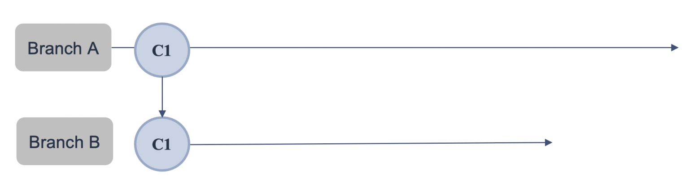
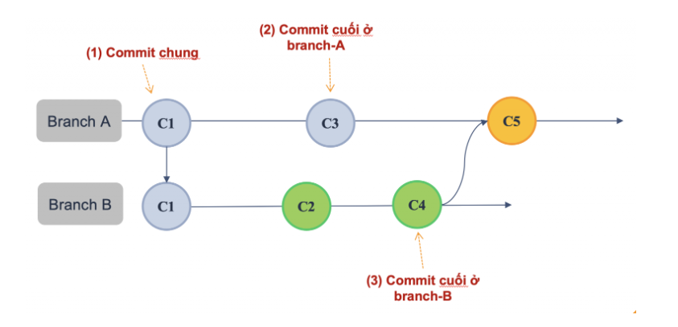
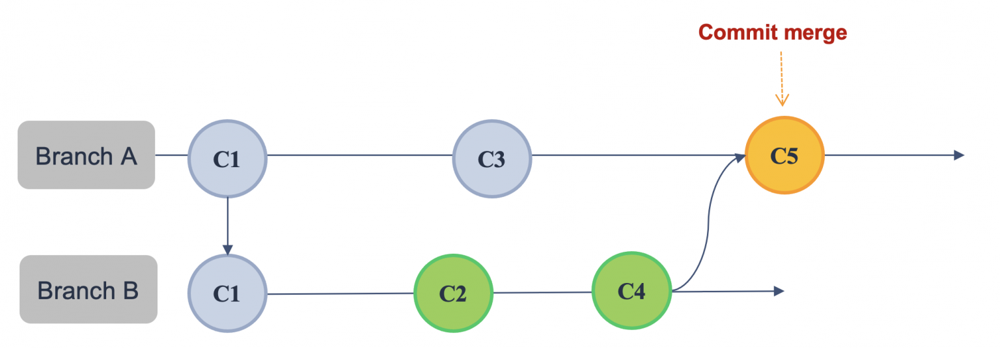
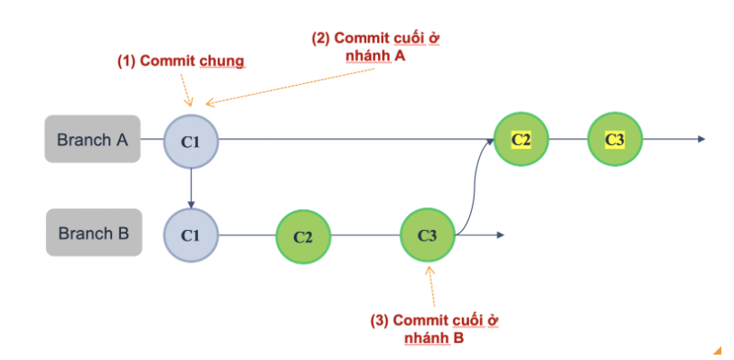
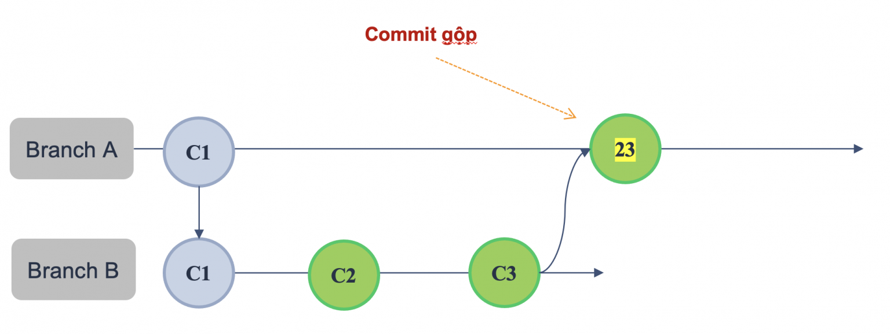

# git merge command
## I. git merge là gì ?
git merge là một lệnh phổ biến trong Git, được sử dụng để hợp nhất các thay đổi (commits) từ một nhánh vào nhánh hiện tại. Đây là công cụ quan trọng để thực hiện gộp nhánh trong quá trình làm việc giữa nhiều luồng phát triển khác nhau trong mã nguồn 

**Cú pháp cơ bản của Git merge:**

```bash
git merge <tên_branch>
```

**Trường hợp sử dụng của git merge:**

- Khi hợp nhất commits từ một nhánh tính năng (feature branch) vào nhánh chính (master, develop)
- Khi cần đồng bộ hóa nội dung giữa nhánh khác vào nhánh hiện tại 

**Ví dụ:**   bạn có một nhánh tính năng được tách ra từ nhánh develop, và bây giờ bạn cần cập nhật các thay đổi mới nhất vừa được đưa vào nhánh develop, bạn sẽ thực hiện như sau:

```bash
git checkout <nhánh_tính_năng>
git merge develop
```

## II. Cơ chế hoạt động của git merge

Giả sử ban đầu ta có nhánh A với commit C1, và nhánh B được tạo ra từ nhánh A:



Nhánh B sử dụng để phát triển tính năng mới, nên đã tạo 2 commit mới là C2 và C4. Còn đối với nhánh A, cũng đã được bổ sung commit C3 từ nhánh khác. Lúc này nếu chúng ta thực hiện:

```bash
git checkout A
git merge B
```

Lúc này, Git sẽ tạo 1 commit merge mới trong nhánh A, kết nối lịch sử của cả nhánh B vào nhánh A. Để làm điều đó, Git tìm kiếm 3 commit mục tiêu:

- Đầu tiên là "common ancestor commit": Nếu ta theo dõi lịch sử của 2 branch trong một dự án, chúng luôn có ít nhất một commit chung (trong trường hợp này là C1)
- Commit cuối cùng của nhánh A
- Commit cuối cùng của nhánh B

Mục tiêu của git merge là kết hợp các trạng thái hiện tại của hai nhánh. Vì vậy, các bản sửa đổi mới nhất của chúng rất quan trọng

Việc sử dụng Merge sẽ tạo ra một `merge commit` trên nhánh A (commit C5), lúc này lịch sử commit của 2 nhánh sẽ như sau:



## III. Phân loại git merge

### 3.0 Three-way merge
Đây là kiểu hợp nhất xảy ra khi cả hai nhánh merge và nhánh được merge có những thay đổi kể từ thời điểm có commit chung. 

Giống như ở ví dụ trên, khi mà ở nhánh chính và nhánh tính năng đều có những commit mới, lúc này nếu chúng ta thực hiện merge commit từ nhánh tính năng vào nhánh chính, Git sẽ thực hiện `Three-way merge`

**Đặc điểm của Three-way merge:**
- Tạo ra 1 commit merge (Thường sẽ có nộ dung message như "Merge branch A into B")
- Lịch sử commit không được tuyến tính
- Có thể xảy ra xung đột (Conflict) khi các thay đổi ở hai nhánh đều xảy ra trên cùng một tập tin
- Thực hiện mặc định khi cả hai nhánh đều có những thay đổi riêng



### 3.1 Fast-forward merge
Trong trường hợp khi thực hiện lệnh git merge từ nhánh B vào nhánh A, nhưng trước đó nhánh A không có thêm thay đổi mới nào kể từ khi nhánh B được tách ra. Nói cách khác: commit cuối cùng của nhánh A chính là commit chung với nhánh B, thì lúc này Git sẽ thực hiện `Fast-forward merge`

Git không tạo ra merge commit, mà chỉ đơn giản **di chuyển** HEAD của nhánh A đến vị trí của commit cuối cùng của nhánh B



**Đặc điểm của Fast-forward merge:**
- Không tạo ra merge commit
- Lịch sử commit được tuyến tính
- Thực hiện mặc định khi nhánh hiện tại không có thêm commit mới khác 


**Có thể chủ động thực hiện Fast-forward merge bằng tùy chọn –ff-only:**

```bash
git merge --ff-only <tên_branch>
```

Khi sử dụng tùy chọn này, nếu nhánh hiện tại đã có những thay đổi riêng, và không thể thực hiện fast-forward merge, Git sẽ báo lỗi và dừng hành động.

### 3.2 Squash merge
Khác với 2 loại merge phía trên, Squash merge là tùy chọn có thể được chỉ định. 

Loại merge này kết hợp tất cả các commits từ nhánh mục tiêu thành một commit duy nhất trước khi hợp nhất vào nhánh hiện tại

**Cú pháp sử dụng:**

```bash
git merge --squash <tên_branch>

git commit -m "nội dung merge"
```

Như theo ví dụ của nhánh A và B ở bên trên, chúng ta có thể thực hiện Squash merge thay đổi của nhánh B sang nhánh A bằng cách:

```bash
git checkout A
git merge --squash B

git commit -m "squash merge from B"
```



**Đặc điểm của Squash merge:**
- Tạo ra một commit gộp trên nhánh hiện tại
- Không giữ lại lịch sử commit của nhánh mục tiêu
- Được thực hiện khi có chỉ định (sử dụng tùy chọn `--squash` khi merge)
- Nội dung của nhánh hiện tại được đơn giản hóa
  
### 3.3 So sánh 3 loại merge trên

| Tiêu chí                          | Three-way                                                          | Fast-forward                                                                                                               | Squash                                                                              |
| --------------------------------- | ------------------------------------------------------------------ | -------------------------------------------------------------------------------------------------------------------------- | ----------------------------------------------------------------------------------- |
| Trường hợp sử dụng                | Thực hiện tự động khi cả 2 nhánh merge đều có những thay đổi riêng | Thực hiện tự động hoặc thủ công khi dùng option `--ff-only` khi nhánh hiện tại không có thay đổi mới so với nhánh mục tiêu | Thực hiện thủ công khi sử dụng option `--squash`                                    |
| Tạo ra commit mới                 | Có, tạo ra `merge commit`                                          | Không tạo ra commit mới                                                                                                    | Tạo ra commit gộp với nội dung là các thay đổi từu những commits của nhánh mục tiêu |
| Lịch sử commit của nhánh hiện tại | Lịch sử commit trở nên không tuyến tính                            | Lịch sử commit được tuyến tính                                                                                             | Lịch sử commit được tuyến tính                                                      |
| Lưu lại commit của nhánh mục tiêu | Có                                                                 | Có                                                                                                                         | Không. Chỉ giữ lại commit gộp                                                       |
| Xảy ra xung dột                   | Có khả năng xảy ra xung đột                                        | Không có hoặc hiếm khi xảy ra xung đột                                                                                     | Không có hoặc hiếm khi xảy ra xung đột                                              |

## IV. Quy trình thực hiện git merge
Giả sử chúng ta đang có nhánh develop và nhánh tính năng `feature/login`, nhánh tính năng này đã có những commits mới về việc xây dựng tính năng đăng nhập cho người dùng. Bây giờ chúng ta cần hợp nhất những thay đổi đó vào nhánh develop để thực hiện kiểm thử


**Chúng ta sẽ cần thực hiện những bước sau:**

- `Bước 1`: Checkout qua nhánh cần được merge (ở đây là nhánh develop)

    ```bash
    git checkout develop
    ```

- `Bước 2`: Đảm báo nhánh develop đã ở trạng thái mới nhất

    ```bash
    git pull origin main
    ```

- `Bước 3`: Thực hiện merge các thay đổi từ nhánh tính năng

    ```bash
    git merge feature/login
    ```

- `Bước 4`: 
  - Trường hợp nếu không có xung đột, hành động merge sẽ được kết thúc
  - Trường hợp có xung đột xảy ra, thực hiện xử lý xung đột:

Sử dụng git status để kiểm tra các tập tin nào đang bị xung đột và mở tập tin đó lên để giải quyết. Git sẽ đánh dấu phần mã bị xung đột như sau:

```bash
<<<<<<< HEAD
# Đây là thay đổi trên nhánh main ...
=======
# Đây là thay đổi từ nhánh feature/login ...
>>>>>>> main
```

**Trong đó:**
- `<<<<<<< HEAD`: Phần mã nguồn trên nhánh cục bộ
- `=======`: Ranh giới giữa phần mã cục bộ và remote
- `>>>>>>> main`: Phần mã từ remote repository.

Thực hiện xử lý xung đột bằng cách chọn 1 trong 2 nội dung hoặc kết hợp cả 2.

Sau khi hoàn tất, sử dụng lệnh sau để hoàn tất hành động merge:

```bash
git add <tên_file>
git commit -m "nội dung commit"
```

### 4.0 Làm sao để hủy bỏ hành động git merge

Trong trường hợp xuất hiện xung đột và quá trình merge bị gián đoạn, bạn có thể hoàn tác hành động merge bằng lệnh sau:

```bash
git merge -abort
```

Điều này sẽ dừng hành động merge và trả về trạng thái trước khi thực hiện merge cho nhánh hiện tại.

Trong trường hợp quá trình merge đã hoàn tất và commit merge đã được tạo ra trên nhánh hiện tại. Bạn có thể sử dụng `git reset` hoặc `git revert` để hoàn tác các thay đổi vừa được bổ sung sau khi merge.

| Tiêu chí           | Git reset                                                                                                | Git revert                                                                                              |
| ------------------ | -------------------------------------------------------------------------------------------------------- | ------------------------------------------------------------------------------------------------------- |
| Cú pháp            | `git reset --hard HEAD~1`                                                                                | `git revert -m "message" <merge commit hash>`                                                           |
| Cơ chế             | Loại bỏ merge commit khỏi lịch sử commit, các thay đổi cũng sẽ bị loại bỏ                                | Tạo ra một commit mới với nội dung đảo ngược so với merge commit                                        |
| Lịch sử commit     | Trở về trạng thái như trước khi merge                                                                    | Lịch sử sẽ vẫn còn merge commit và có thêm commit mới                                                   |
| Trường hợp sử dụng | Khi nội dung merge chưa được đẩy lên kho lưu trữ từ xa và không muốn giữ lại dấu vết của hành động merge | Để đảm bảo an toàn dữ liệu và tránh gây bất đồng bộ nếu khi đã đẩy nội dung merge lên kho lưu trữ từ xa |

# Tài liệu tham khảo

[REFERENCE 1](https://itviec.com/blog/git-merge-la-gi/)