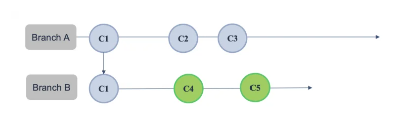
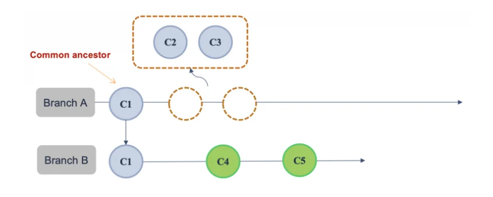
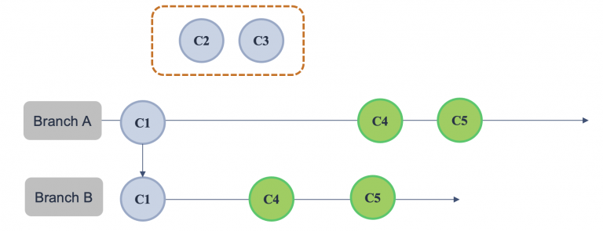
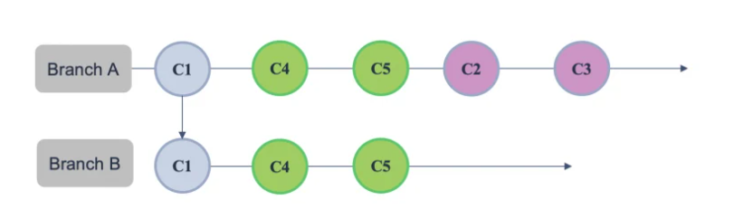

# git rebase command
## I. git rebase là gì?
git rebase là một lệnh mạnh mẽ trong git để hợp nhất các thay đổi từ nhánh này sang nhánh khác bằng việc tái sắp xếp lại lịch sử commits.

Git rebase sẽ đưa những commit mới của nhánh hiện tại lên phía đầu trong lịch sử commit và tạo ra một lịch sử commit tuyến tính

**Cú pháp cơ bản:**

```bash
git rebase <tên_branch>
```

Git rebase sẽ phù hợp trong những trường hợp như:
- Cập nhật thay đổi từ nhánh gốc nhưng không muốn tạo ra merge commit
- Muốn giữ cho lịch sử commit được gọn gàng và sạch sẽ: Bởi vì cơ chế tái tạo một lịch sử commit tuyến tính và không tạo ra commit merge nên git rebase rất phù hợp cho những dự án cần giữ lịch sử đơn giản và gọn gàng.

## II. Cơ chế hoạt động của git rebase
Git rebase hoạt động dựa trên cơ chế sắp xếp lại lịch sử commit và không tạo ra merge commit. Điều này sẽ hình thành một lịch sử commit tuyến tính. 

Chi tiết về cách thức hoạt động của git rebase được mô tả thông qua ví dụ sau:

Ta có 2 nhánh A và nhánh B đều có chung commit C1. Trải qua quá trình làm việc, nhánh A được bổ sung thêm commits C2 và C3 từ nhánh khác, còn nhánh B tạo thêm hai commit C4, C5.



Bây giờ chúng ta cần thực hiện hợp nhất các thay đổi từ nhánh B vào nhánh A bằng lệnh `git rebase`:

```bash
git checkout A
git rebase B
```

Đầu tiên, Git sẽ tìm đến commit chung gần nhất của A và B (common ancestor commit), sau đó **loại bỏ** tất cả các commit mới trên nhánh A đã xảy ra kể từ commit chung và lưu tạm thời trong bộ nhớ.



Tiếp theo, Git áp dụng các commit mới từ nhánh B vào nhánh A. Tại thời điểm này, tạm thời cả 2 nhánh thực sự trông giống hệ nhau về lịch sử commit




Cuối cùng, các commit mới từ nhánh A sẽ được đưa trở lại và được đặt ở đầu lịch sử commit. Vì chúng được đặt trên đầu các commit tích hợp từ nhánh B, nên được gọi là `Rebased`.



Như vậy, quá trình rebase để hợp nhất các thay đổi từ nhánh B vào nhánh A đã được hoàn tất. Nhánh A vẫn giữ được một lịch sử commit tuyến tính và không tạo ra thêm commit merge.

## III. Quy trình thực hiện Git rebase
Giả sử chúng ta đang có nhánh develop và nhánh tính năng feauture/login được tách ra từ nhánh develop. Sau quá trình làm việc, nhánh feauture/login đang có một số commits mới và cần được đẩy lên kho lưu trữ từ xa để thực hiện tạo pull request.

Trước hết cần thực hiện git rebase để cập nhật mã nguồn mới nhất từ nhánh develop:

Checkout qua nhánh cần được rebase (ở đây sẽ là nhánh develop)

```bash
git checkout develop
```

Đảm bảo nhánh develop đã ở trạng thái mới nhất

```bash
git pull origin develop
```

Chuyển sang nhánh tính năng và thực hiện rebase các thay đổi mới từ nhánh main

```bash
git checkout feature/login

git rebase develop
```

Trường hợp có xung đột xảy ra, thực hiện xử lý xung đột:


Mở tập tin bị xung đột, git sẽ đánh dấu phần mã bị xung đột như sau:

```bash
<<<<<<<HEAD 
# Đây là thay đổi trên nhánh new-feature...
=======
# Đây là thay đổi từ nhánh main ...
>>>>>>>main
```

Giữ lại phần code phù hợp hoặc kết hợp các thay đổi của cả hai nhánh.

Thêm các nội dung đã giải quyết vào staging:

```bash
git add <file>
```

Bởi vì git rebase sẽ xử lý xung đột trên từng commit, nên chúng ta cần tiếp tục quá trình rebase cho đến khi kết thúc:

```bash
git rebase --continue
```

Trường hợp muốn hoàn tác hành động rebase, bạn có thể sử dụng:


```bash
git rebase --abort
```

Đẩy nội dung nhánh tính năng lên kho lưu trữ từ xa:

```bash
git push origin feature/login
```

# Tài liệu tham khảo

[REFERENCE 1](https://itviec.com/blog/git-rebase-la-gi/)