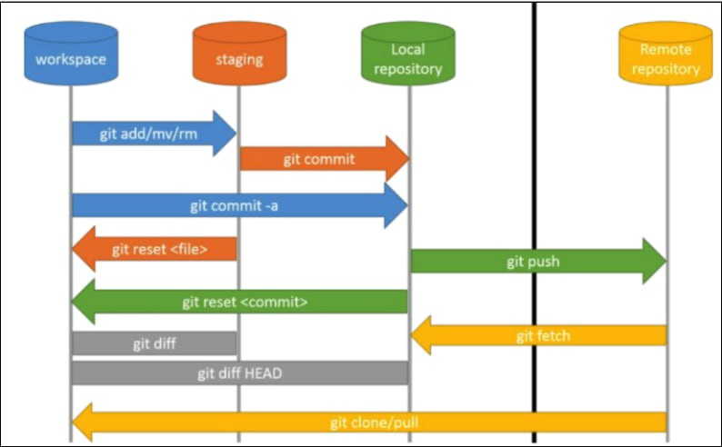
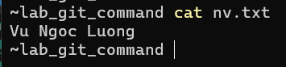
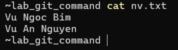
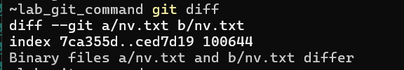

# Giải thích về mô hình workflow trong git

## I. Mô hình



## II. Giải thích chi tiết

### 2.0 Các thành phần chính

**Workspace(Working Directory):**
- Là thư mục trên máy nơi lưu các file làm việc

**Staging:** 
- Đây là nơi bạn chọn những thay đổi nào sẽ được commit.

**Local repository:**

- Là kho lưu trữ commit nằm trên máy của bạn
- Nó nằm trong thư mục `.git`
- Chứa: 
  - Toàn bộ lịch sử commit
  - branch
  - HEAD

**Remote repository:**

- Là kho chứa code nằm trên server (internet hoặc mạng nội bộ)
- Không nằm trên máy của bạn
- Dùng để:
  - Chia sẻ code
  - làm việc nhóm
- Ví dụ các remote repo phổ biến: Github, Gitlab, Bitbucket


### 2.1 git add/mv/rm

Khi sử dụng những command này các file được thay đổi sẽ được di chuyển từ workspace lên staging area, các file được thêm, sửa hoặc xóa sẽ được đưa vào đây để chuẩn bị được commit

### 2.2 git commit

Command này cho phép các thay đổi ở staging area thành 1 commit và được đưa vào local repo - nơi lưu trữ các commit trên máy

### 2.3 git commit -a

Đây là kết hợp giữa `git add .` và `git commit`, sau khi sử dụng command này tất cả các file trong thư mục dự án sẽ được add vào staging sau đó được commit lên Local repo

### 2.4 git reset <file>

Command này được sử dụng khi bạn vừa add, rm, mv 1 file nào đó vào staging nhưng sau đó muốn hoàn tác thao tác này. Nó sẽ giúp ta bỏ file ra khỏi stagin mà không xóa code

### 2.5 git push

Command này được sử dụng để đẩy các commit từ Local repo lên Remote repo. 

### 2.6 git reset <commit>

Command này sử dụng để quay lại 1 commit nào đó đã có trên local repo.

**Ví dụ:**

Giả sử ban đầu:

```bash
A --- B --- C --- D (HEAD)
```

bạn chạy:

```bash
git reset HEAD~1
```

- Trường hợp không dùng `--hard`:
  - Kết quả:

    ```bash
    A --- B --- C (HEAD)
    ```

    - Commit D bị loại khỏi lịch sử 
    - Tuy nhiên code của D không mất
    - Nó bị “rớt” về working directory (chưa add)
- Trường hợp dùng `--hard`:

    ```bash
    git reset --hard HEAD~1
    ```

  - Kết quả:

    ```bash
    A --- B --- C (HEAD)
    ```

    - Commit D biến mất
    - Code cũng mất luôn

### 2.7 git diff

Command này được sử dụng để so sánh sự khác biệt của code, xem dòng nào đã thêm / xóa / sửa với 2 môi trường là workspace và staging area

**Ví dụ:** 

- Ở đây ta có file `nv.txt` vơi nội dung như sau:

    

- Ta tiến hành add file này vào staging:

    ```bash
    git add nv.txt
    ```

- Lúc này trên workspace ta thay đổi nội dung của `nv.txt`:

    

- Ta sử dụng lệnh `git diff` để xem sự khác biệt của code với 2 môi trường là workspace và staging

    

### 2.8 git fetch

Command này dùng để lấy (download) dữ liệu mới từ remote repository về local, nhưng KHÔNG tự động merge vào branch hiện tại

Hiểu đơn giản là ví dụ ta đang đứng ở nhánh `develop` khi sử dụng git fetch thì `origin/develop - bản sao (read only) của nhánh develop trên remote` sẽ được cập nhất các thay đổi từ remote còn trên nhánh local `develop` vẫn chưa được cập nhật


### 2.9 git diff HEAD

Gần giống tương tự với command git diff tuy nhiên lần này ta sẽ xem sự khác nhau giữa workspace và commit

### 2.10 git clone - tạo repo từ đầu

`git clone` là lệnh: tải toàn bộ repo từ remote về và tự động setup local


`git clone` sẽ làm 3 việc cùng lúc:

- Tạo Local Repository: Copy toàn bộ lịch sử commit từ remote
- Tạo Remote-tracking branch: Ví dụ: `origin/master`, `origin/develop`
- Tạo Working Directory: Check out code ra để làm việc


Sau khi clone ta sẽ có:

```bash
origin/master <= bản sao remote
master        <= local branch (track origin/master)
workspace     <= code đã checkout
```

- Bạn làm việc trên `master`
- `master` đã kết nối với `origin/master`

### 2.11 git pull - cập nhật code

Bản chất của command git pull là `git fetch + git merge`

Ta có thể hiểu flow như sau:

```bash
Remote Repo
     │
     │ (fetch)
     ▼
origin/develop (local)
     │
     │ (merge)
     ▼
develop (local branch)
     │
     ▼
Workspace
```

Như vậy git pull sẽ thay đổi code trong workspace của bạn về code mới nhất trên remote 