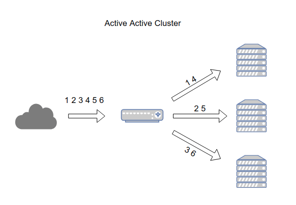
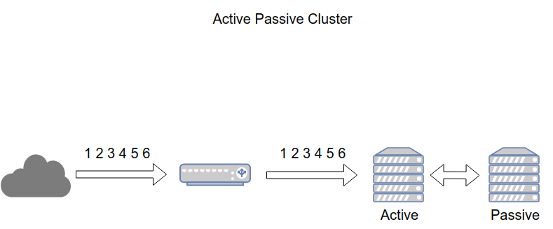

# Overview of High Availability

## I. High Availability là gì? 
Availability (tính sẵn sàng) la mức độ mà 1 ứng dụng và database service luôn ở trạng thái có thể sử dụng được 

Tính sẵn sàng được đo dựa trên trải nghiệm thực tế của người dùng ứng dụng. 

Thuật ngữ **downtime** được dùng để chỉ khoảng thời gian hệ thống không hoạt động hoặc không thể truy cập 

High Availability là một hệ thống có tính sẵn sàng cao được thiết kế để cung cấp dịch vụ tính toán liên tục, không bị gián đoạn trong **các khoảng thời gian quan trọng - hầu hết các giờ trong ngày, các ngày trong tuần và xuyên suốt cả năm - 24x356**

### 1.0 Các đặc điểm của HA
Một kiến trúc High Availability nên có các đặc điểm sau:
- Chịu được lỗi để hệ thống tiếp tục xử lý với mức gián đoạn tối thiểu hoặc không gián đoạn
- Có khả năng phục hồi nhanh
- Áp dụng các best practices vận hành để quản lý môi trường hệ thống
- Đạt được các mục tiêu đặt ra trong SLA, ví dụ:
  - RTO (Recovery Time Objective) — thời gian khôi phục mục tiêu
  - RPO (Recovery Point Objective) — mức mất dữ liệu cho phép 

  với tổng chi phí sở hữu (Total Cost of Ownership — TCO) thấp nhất có thể.

## II. Các thuật ngữ quan trọng 

- `Cluster`: Nhóm các server dành riêng để giải quyết 1 vấn đề, có khả năng kết nối, chia sẻ các task
- `Node`: Server thuộc Cluster
- `Failover`: khi 1 hoặc nhiều Node trong Cluster xảy ra vấn đề, các tài nguyên tự động được chuyển tới các node sẵn sàng phục vụ
- `Fault-tolerant cluster`: Đề cập đến khả năng chịu lỗi của hệ thống trên các thàn phần, cho phép dịch vụ hoạt động ngay cả khi một vài thành phần gặp sự cố
- `Heartbeat`: Tín hiệu xuất phát từ các node trong cụm với mục đích xác minh chúng còn sống và đang hoạt động. Nếu heartbeat tại 1 node ngừng hoạt động, cluster sẽ đánh dấu thành phần đó gặp sự cố và chuyển tài nguyên tại node lỗi sang node đang sẵn sàng phục vụ
- `Primary server, secondary server`: trong cluster dạng Active/Passive node đang đáp ứng giải quyết yêu cầu gọi là Primary server. Node đàng chờ hay dự phòng cho node Primary server được gọi là Secondary server 
- `Quorum`: Trong Cluster chứa nhiều tài nguyên, nên dễ xảy ra sự phân mảnh (split-brain - Tức cluster lớn bị tách ra thành nhiều cluster nhỏ). Điều này sẽ dẫn đến sự mất đồng bộ giữa các tài nguyên, ảnh hướng tới sự toàn vẹn của hệ thống. Quorum được thiết kế để ngăn chặn hiện tượng phân mảnh.

## III. High Availability hoạt động như thế nào ? 
HA đảm bảo dịch vụ hoạt động liên tục bằng cách triển khai các chiến lược tự động nhằm phòng ngừa sự cố và phản ứng khi có lỗi xảy ra 

### 3.0 Component Redundancy - Dự phòng thành phần 

Triển khai các thành phần dự phòng như: 
- server
- thiết bị mạng
- storage 
- nguồn điện 

Nếu một thành phần bị lỗi, thành phần dự phòng sẽ tiếp quản hoạt động 

### 3.1 Failover Machanism - Cơ chế chuyển đổi dự phòng 

Khi hệ thống chính (primary system) phát hiện sự cố — thường thông qua tín hiệu **Heartbeat** — nó sẽ tự động và nhanh chóng chuyển hoạt động sang hệ thống phụ/dự phòng (secondary hoặc standby system).

### 3.2 Load Balancing - Cân bằng tải 

Phân phối khối lượng công việc lên nhiều node khác nhau nhằm:

- tránh quá tải cho một node
- đảm bảo việc một node bị lỗi không làm toàn bộ dịch vụ sập.

### 3.3 Data Replication - Sao chép dữ liệu 
Đảm bảo dữ liệu được đồng bộ liên tục giữa hệ thống chính và hệ thống backup 

Việc đồng bộ có thể là: 
- synchronous replication 
- asynchronous replication 

### 3.4 Monitoring & Heartbeat - Giám sát & Heartbeat

Các công cụ giám sát liên tục kiểm tra trạng thái "sống/chết" của từng node thông qua tín hiệu **heartbeat**

Nếu heartbeat bị mất, hệ thống sẽ xem node đó là đã gặp sự cố.

### 3.5 Ví dụ thực tế về High Availability 

**Data Center:**

Một DC HA thường sử dụng: 
- Nguồn điện dự phòng 
- Nhiếu tuyến mạng dự phòng 
- hệ thống làm mát 

**Website thương mại điện tử:**

Triển khai nhiều Webserver chạy song song phía sau một Load balancer 

Nếu một server bị lỗi, traffic sẽ tự động được chuyển hướng sang các server còn lại.

**Hệ thống Database:**

Sử dụng Database Cluster, ví dụ:
- PostgreSQL Replication 
- MySQL Group Replication 

Nếu server Master bị lỗi, một server Slave sẽ tự động được nâng cấp thành Master mới thông qua cơ chế failover 

## IV. Các kiến trúc High Availability phổ biến 

### 4.0 Active - Active 

Active - Active cluster được tạo ra từ ít nhất 2 node, cả 2 node chạy đồng thời xử lý cùng 1 loại dịch vụ. Mục đích chính của Active - Active là tối ưu hóa cho hoạt động cân bằng tải (load balancing). Hoạt động cân bằng tải (load balancing) sẽ phân phối các tác vụ hệ thống tới tất cả các node bên trong cluster, tránh tình trạng các node xử lý tác vụ không cân bằng dẫn tới tình trạng quá tải. 

Khuyển cáo cho chế độ Active - Active là các node trong cụm cần được cấu hình giống nhau tránh tình trạng phân mảnh cụm.

### 4.1 Active - Passive 
Giống cấu hình Active - Active, Active Passive Cluster cần ít nhất 2 node, tuy nhiên không phải tất cả các node đều sẵn sàng xử lý yêu cầu. VD: Nếu có 2 node thì 1 node sẽ chạy ở chế độ Active, node còn lại sẽ chạy ở chế độ passive hoặc standby.

Passive Node sẽ hoạt động như 1 bản backup của Active Node. Trong trường hợp Active Node xảy ra vấn đề, Passive Node sẽ chuyển trạng thái thành active, tiếp quản xử lý các yêu cầu

### 4.2 Cluster High Availability 

Sử dụng phần mềm quản lý Cluster (Cluster Manager) để liên kết nhiều server thành một hệ thống thống nhất 

Cluster manager sẽ quản lý: 

- heartbeat 
- health check
- failover
- fencing 
- quorum 

Ví dụ phần mềm: 
- Kubernetes 
- Pacemaker 

### 4.3 Load Balancer + HA 

Dùng Load Balancer để: 
- phân phối traffic đồng thời liên tục kiểm tra health của server 

Nếu một server lỗi: 
- Load Balancer tự động loại server đó khỏi danh sách nhận traffic.

**Ví dụ:** 

Client -> HAProxy -> Nhiều webserver 

Nếu web2 chết: HAProxy ngừng route traffic tới Web2

**Ví dụ Load Balancer:** 
- HAProxy 
- NGINX

# Tài liệu tham khảo 

[REFERENCE 1](https://docs.oracle.com/en/database/oracle/oracle-database/26/haovw/overview-of-ha.html#GUID-747287A5-0961-4791-A8B5-1EFCA4F95104)

[REFERENCE 2](https://servodynamics.com.vn/what-is-high-availability/)

[REFERENCE 3](https://blog.cloud365.vn/linux/tong-quan-ve-cluster-p1/)