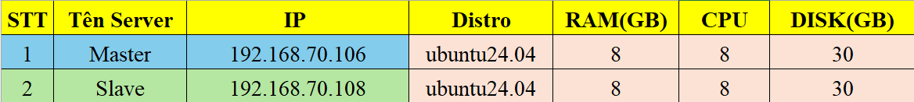
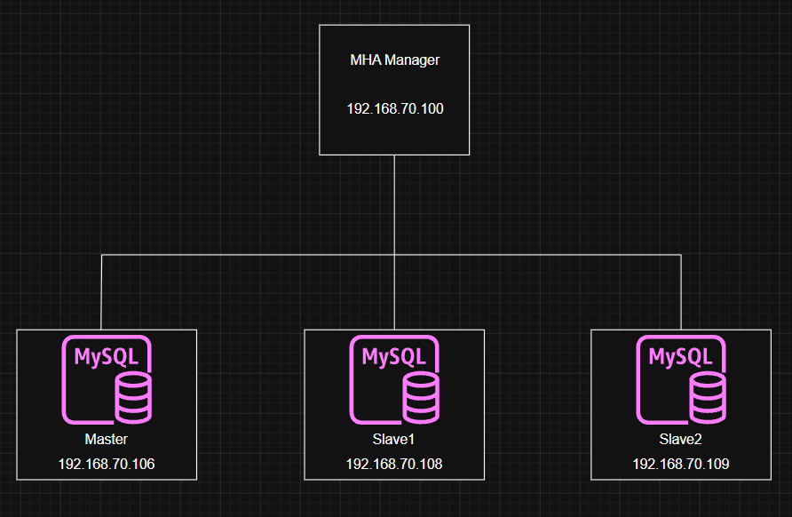

# Triển khai MySQL High Availability 
Kiến trúc Master-Slave Replication là giải pháp nền tảng để hạ tầng database từ một Single Point of Failure (SPOF) thành một thành phần có High Availability (HA). 

## I. Tại sao cần triển khai master-slave replication? 

Master-Slave Replication không chỉ là một cơ chế sao lưu đơn thuần, mà là giải pháp nền tảng giải quyết 4 thách thức lớn nhất trong vận hành hệ thống: 
- **Đảm bảo High Availability:** Khi Master gặp sự cố, các Slave có thể nhanh chóng được thay thế lên Master, giảm thiểu tối đa RTO (Recovery Time Objective), đảm bảo dịch vụ có thể hoạt động trở lại trong thời gian ngắn nhất 
- **Phân tách việc đọc-ghi:** Phân tải các truy vấn đọc sang các Slave, điều này giúp Master tập trung xử lý thao tác ghi, giảm đáng kể áp lực I/O và tối ưu hiệu suất truy vấn 
- **Sao lưu dữ liệu tức thời:** Slave hoạt động như một bản sao thời gian thực, có thể dùng để thực hiện các công việc backup snapshot mà không ảnh hưởng tới hiệu năng của Master đang chạy trực tiếp 
- **Mở rộng linh hoạt:** Dễ dàng mở rộng khả năng phục vụ truy vấn đọc bằng cách bổ sung thêm Slave mà không làm gián đoạn hệ thống hiện tại 

Master-Slave là cơ sở để hệ thống đáp ứng các yêu cầu khắt khe về dữ liệu: RPO (gần như không mất mát), RTO (phục hồi nhanh chóng)

## II. Phân tích cơ chế Replication 
Master-Slave là sự phối hợp chính xác của 3 thread quan trọng: 
- **Master's Binlog Dump Thread:** Luồng này chịu trách nhiệm đọc các sự kiện thay đổi từ `binlog` của Master và gửi chúng đến Slave 
- **Slave's I/O Thread:** Nhận dữ liệu Binlog từ Master và ghi vào `relay log` trên Slave.
- **Slave's SQL Thread:** Đọc relay log và thực thi các câu lệnh SQL để đồng bộ dữ liệu 

### 2.0 Lựa chọn định dạng Binlog

| **Format** | **Ưu điểm**                                                            | **Nhược điểm**                                                      |
| ---------- | ---------------------------------------------------------------------- | ------------------------------------------------------------------- |
| Statement  | Kích thước log nhỏ, truyền tải nhanh                                   | Rủi ro mất nhất quán với các hàm không xác định (Như NOW())         |
| Row        | Đảm bảo nhất quán 100%                                                 | Log rất lớn, tốn I/O và network, đặc biệt khi cập nhật các bảng lớn |
| Mixed      | Cân bằng giữa hiệu năng và nhất quán. MySQL tự động chọn format tối ưu | Có thể gặp khó khăn khi debug                                       |


## III. Global Transaction Indentifier (GTID) - Chuẩn mới cho Replication hiện đại 

GTID là cơ chế dùng để gắn một ID duy nhất cho mỗi transaction trong replication 

Trước khi có GTID, Replication kiểu cũ sử dụng file binlog và position trong file, vấn đề là khi ta failover thì rất khó để quản lý position. 

Thay vào đó, GTID cho mỗi transaction một ID duy nhất toàn hệ thống. Ví dụ: `3E11FA47-71CA-11E1-9E33-C80AA9429562:23`

- `UUID`: ID của server 
- `23`: transaction thứ 23

GTID giải quyết vấn đề cốt lõi: 
- Mỗi transaction được cấp một ID duy nhất trên toàn bộ cluster 
- Trong quá trình failover, các Slave không cần phải xác định vị trí file log (log file và position) mà chỉ cần báo cho Master mới biết **transaction ID cuối cùng chúng đã thực thi**.

## IV. Triển khai kiến trúc Master-Slave trong môi trường Production 

### 4.0 Phân hoạch địa chỉ IP 



### 4.1 Cấu hình Master 

Master cần ưu tiên tính bền vững và ghi log đầy đủ, chĩnh xác

```bash
vi /etc/mysql/mysql.conf.d/mysqld.conf
```

```bash
[mysqld]
server-id = 1
port = 3306

# Cấu hình Binlog & Độ an toàn dữ liệu
log-bin = /data/mysql/binlog/mysql-bin
binlog_format = mixed
binlog_row_image = minimal 
binlog_expire_logs_seconds = 604800  
sync_binlog = 1  

# Cấu hình GTID
gtid_mode = ON
enforce_gtid_consistency = ON
binlog_gtid_simple_recovery = 1

# Tối ưu Replication
binlog_transaction_dependency_tracking = WRITESET 

# Tối ưu InnoDB
innodb_buffer_pool_size = 6G  
innodb_flush_log_at_trx_commit = 1  
innodb_io_capacity = 1000
```

**Trong đó:** 

- `server-id = 1`: Mỗi server replication phải có ID riêng 
- `log-bin`: bật binary log 
- `binlog_format = mixed`: chọn format của binlog là mixed
- `binlog_row_image = minimal`: khi dùng ROW format ta chỉ ghi các cột cần thiết, không ghi toàn bộ ROW
- `binlog_expire_logs_seconds = 604800`: tự xóa binlog sau 7 ngày 
- `sync_binlog = 1`: Sau mỗi COMMIT fsync binlog xuống disk ngay (đảm bảo RPO = 0)
- `gtid_mode = ON`: Bật GTID replication 
- `enforce_gtid_consistency = ON`: Chặn các câu SQL không compatible với GTID 
- `binlog_gtid_simple_recovery = 1`: Tăng tốc recovery GTID khi restart MySQL 
- `binlog_transaction_dependency_tracking = WRITESET `: Tơi ưu replication song song, MySQL xác định transaction nào độc lập với nhau để Slave có thể apply song song 
- `innodb_buffer_pool_size = 6G`: RAM cache cho InnoDB
- `innodb_flush_log_at_trx_commit = 1`: Sau mỗi COMMIT flush redo log xuống disk 
- `innodb_io_capacity = 1000`: cho InnoDB biết ổ đĩa có khả năng IOPS(Input/Output Operations Per Second) khoảng bao nhiêu 

### 4.2 Cấu hình Slave 

Slave cần được tối ưu hóa cho các thao tác đọc và xử lý Relay Log

```bash
vi /etc/mysql/mysql.conf.d/mysqld.conf
```

```bash
[mysqld]
server-id = 2  
port = 3306

# Cấu hình Replication
relay_log_recovery = ON
read_only = ON  
super_read_only = ON  

# Cấu hình GTID
gtid_mode = ON
enforce_gtid_consistency = ON

# Cấu hình Parallel Replication
slave_parallel_type = LOGICAL_CLOCK
slave_parallel_workers = 8  
slave_preserve_commit_order = ON 

# Tối ưu InnoDB
innodb_flush_log_at_trx_commit = 2  
innodb_buffer_pool_size = 6G
```

**Trong đó:**

- `relay_log_recovery = ON`: Nếu Slave crash trong khi đang đọc relay log để apply, sau khi restart Slave sẽ xóa relay log cũ và tải lại từ Master
- `read_only = ON`: Biến Slave thành server chỉ đọc 
- `super_read_only = ON`: Ngay cả SUPER user cũng không ghi được.
- `slave_parallel_type = LOGICAL_CLOCK`: config replication song song
- `slave_parallel_workers = 8`: Số worker thread để apply replication song song (set theo số lượng core CPU)
- `slave_preserve_commit_order = ON`: Slave đảm bảo **commit order giống Master** dù apply song song 

### 4.3 Các bước thực hiện 

**Bước 1: Khởi tạo User Replication** 

Chạy trên Master: 

```sql
CREATE USER 'replicator'@'%' IDENTIFIED WITH mysql_native_password BY '123456'; 
GRANT REPLICATION SLAVE ON *.* TO 'replicator'@'%';
FLUSH PRIVILEGES;
```

**Bước 2: Khởi tạo snapshot dữ liệu (dùng XtraBackup)**

Sử dụng `Percona XtraBackup` để sao lưu hot backup trong Production.

```bash
xtrabackup --defaults-file=/etc/mysql/my.cnf --user=root --password='Bimvungoc23@2005' \
--backup --target-dir=/backup/full --parallel=4 
```

```bash
xtrabackup --prepare --target-dir=/backup/full
```

```bash
root@mysqlha:~# cat /backup/full/xtrabackup_binlog_info
binlog.000002   157
```

**Bước 3: Restore dữ liệu trên slave**

```bash
systemctl stop mysql.service
rm -rf /var/lib/mysql/*
xtrabackup --copy-back --target-dir=/backup/full --datadir=/var/lib/mysql
chown -R mysql:mysql /var/lib/mysql
systemctl start mysql.service
```

**Bước 4: Cấu hình Master-Slave Replication (Sử dụng GTID)**

Thực thi trên Slave

```sql
-- Thực thi trên Slave
CHANGE MASTER TO
  MASTER_HOST='192.168.70.106', -- IP của Master
  MASTER_USER='replicator',
  MASTER_PASSWORD='123456',
  MASTER_PORT=3306,
  MASTER_AUTO_POSITION=1;  -- Dùng GTID auto-positioning (bắt buộc)

START SLAVE;
SHOW SLAVE STATUS\G
```

```sql
mysql> SHOW SLAVE STATUS\G
*************************** 1. row ***************************
               Slave_IO_State: Waiting for source to send event
                  Master_Host: 192.168.70.106
                  Master_User: replicator
                  Master_Port: 3306
                Connect_Retry: 60
              Master_Log_File: binlog.000002
          Read_Master_Log_Pos: 839
               Relay_Log_File: slave-relay-bin.000002
                Relay_Log_Pos: 1049
        Relay_Master_Log_File: binlog.000002
             Slave_IO_Running: Yes
            Slave_SQL_Running: Yes
              Replicate_Do_DB:
          Replicate_Ignore_DB:
           Replicate_Do_Table:
       Replicate_Ignore_Table:
      Replicate_Wild_Do_Table:
  Replicate_Wild_Ignore_Table:
                   Last_Errno: 0
                   Last_Error:
                 Skip_Counter: 0
          Exec_Master_Log_Pos: 839
              Relay_Log_Space: 1259
              Until_Condition: None
               Until_Log_File:
                Until_Log_Pos: 0
           Master_SSL_Allowed: No
           Master_SSL_CA_File:
           Master_SSL_CA_Path:
              Master_SSL_Cert:
            Master_SSL_Cipher:
               Master_SSL_Key:
        Seconds_Behind_Master: 0
Master_SSL_Verify_Server_Cert: No
                Last_IO_Errno: 0
                Last_IO_Error:
               Last_SQL_Errno: 0
               Last_SQL_Error:
  Replicate_Ignore_Server_Ids:
             Master_Server_Id: 1
                  Master_UUID: 647d0cd0-2e6f-11f1-9ef7-525400b46135
             Master_Info_File: mysql.slave_master_info
                    SQL_Delay: 0
          SQL_Remaining_Delay: NULL
      Slave_SQL_Running_State: Reading event from the relay log
           Master_Retry_Count: 86400
                  Master_Bind:
      Last_IO_Error_Timestamp:
     Last_SQL_Error_Timestamp:
               Master_SSL_Crl:
           Master_SSL_Crlpath:
           Retrieved_Gtid_Set: 647d0cd0-2e6f-11f1-9ef7-525400b46135:1-3
            Executed_Gtid_Set: 647d0cd0-2e6f-11f1-9ef7-525400b46135:1-3
                Auto_Position: 1
         Replicate_Rewrite_DB:
                 Channel_Name:
           Master_TLS_Version:
       Master_public_key_path:
        Get_master_public_key: 0
            Network_Namespace:
1 row in set, 1 warning (0.28 sec)
```

### 4.4 Kiểm tra 

**Bước 1: Tạo Database trên Master và tạo 1 số table trong DB đó**

```sql
mysql> show databases;
+--------------------+
| Database           |
+--------------------+
| information_schema |
| mysql              |
| performance_schema |
| sys                |
+--------------------+
4 rows in set (0.01 sec)

mysql> create database testDB;
Query OK, 1 row affected (0.21 sec)

mysql> use testDB;
Database changed
mysql> create table table1 (
    ->   id int primary key
    -> );
Query OK, 0 rows affected (1.27 sec)

mysql> show tables;
+------------------+
| Tables_in_testDB |
+------------------+
| table1           |
+------------------+
1 row in set (0.01 sec)

mysql>
```

**Bước 2: Kiểm tra dữ liệu trên Slave**

```sql
mysql> show databases;
+--------------------+
| Database           |
+--------------------+
| information_schema |
| mysql              |
| performance_schema |
| sys                |
| testDB             |
+--------------------+
5 rows in set (0.02 sec)

mysql> use testDB;
Reading table information for completion of table and column names
You can turn off this feature to get a quicker startup with -A

Database changed
mysql> show tables;
+------------------+
| Tables_in_testDB |
+------------------+
| table1           |
+------------------+
1 row in set (0.00 sec)

mysql>
```

## V. Thiết kế kiến trúc HA và failover tự động 

### 5.0 Triển khai MHA 

MHA (Master High Availability) là giải pháp giúp chuyển đổi Master tự động failover với RTO < 30 giây mà gần như không mất dữ liệu. 

MHA bao gồm: 
- MHA Manager - Node giám sát 
- MHA Node - nằm trên mỗi server MySQL 

### 5.1 Mô hình hiện tại 



### 5.2 Setup SSH passwordless

**Trên MHA manager node:**

Tạo key ssh: 

```bash
ssh-keygen -t rsa -b 4096
```

Copy key: 

```bash
ssh-copy-id root@192.168.70.106
ssh-copy-id root@192.168.70.108
ssh-copy-id root@192.168.70.109
```

Làm tương tự với các node còn lại

### 5.3 Cài đặt MHA

**Trên Manager node:** 

```bash
sudo apt update 

sudo apt install -y \
make build-essential wget perl \
libdbd-mysql-perl \
libconfig-tiny-perl \
liblog-dispatch-perl \
libparallel-forkmanager-perl \
libmodule-install-perl

# Cài MHA Node
wget https://github.com/yoshinorim/mha4mysql-node/releases/download/v0.58/mha4mysql-node-0.58.tar.gz

tar -xzf mha4mysql-node-0.58.tar.gz
cd mha4mysql-node-0.58

perl Makefile.PL
make && sudo make install

cd ..

# Cài MHA Manager
wget https://github.com/yoshinorim/mha4mysql-manager/releases/download/v0.58/mha4mysql-manager-0.58.tar.gz

tar -xzf mha4mysql-manager-0.58.tar.gz
cd mha4mysql-manager-0.58

perl Makefile.PL
make && sudo make install
```

**Trên các node Master vs Slave:**

```bash
sudo apt update 

sudo apt install -y \
make build-essential wget perl \
libdbd-mysql-perl \
libconfig-tiny-perl \
liblog-dispatch-perl \
libparallel-forkmanager-perl \
libmodule-install-perl

# Cài MHA Node
wget https://github.com/yoshinorim/mha4mysql-node/releases/download/v0.58/mha4mysql-node-0.58.tar.gz

tar -xzf mha4mysql-node-0.58.tar.gz
cd mha4mysql-node-0.58

perl Makefile.PL
make && sudo make install
```

### 5.4 Tạo User cho MHA 

**Trên Các node DB:**

```sql
CREATE USER 'mha'@'%' IDENTIFIED BY '123456';
GRANT ALL PRIVILEGES ON *.* TO 'mha'@'%';
FLUSH PRIVILEGES;
```

### 5.5 Config MHA 

Tạo file: 

```bash
mkdir -p /etc/mha
vim /etc/mha/app1.cnf
```

Nội dung: 

```bash
[server default]

user=mha
password=123456

manager_workdir=/var/log/masterha/app1
manager_log=/var/log/masterha/app1/manager.log

master_binlog_dir=/data/mysql/binlog

ssh_user=root

repl_user=replicator
repl_password=123456

ping_interval=1

[server1]
hostname=192.168.70.106
candidate_master=1

[server2]
hostname=192.168.70.108
candidate_master=1

[server3]
hostname=192.168.70.109
candidate_master=1
```

### 5.6 Kiểm tra MHA 

**SSH:**

```bash
masterha_check_ssh --conf=/etc/mha/app1.cnf
```

```
Thu May 21 15:31:01 2026 - [warning] Global configuration file /etc/masterha_default.cnf not found. Skipping.
Thu May 21 15:31:01 2026 - [info] Reading application default configuration from /etc/mha/app1.cnf..
Thu May 21 15:31:01 2026 - [info] Reading server configuration from /etc/mha/app1.cnf..
Thu May 21 15:31:01 2026 - [info] Starting SSH connection tests..
Thu May 21 15:31:04 2026 - [debug]
Thu May 21 15:31:01 2026 - [debug]  Connecting via SSH from root@192.168.70.106(192.168.70.106:22) to root@192.168.70.108(192.168.70.108:22)..
Thu May 21 15:31:03 2026 - [debug]   ok.
Thu May 21 15:31:03 2026 - [debug]  Connecting via SSH from root@192.168.70.106(192.168.70.106:22) to root@192.168.70.109(192.168.70.109:22)..
Thu May 21 15:31:04 2026 - [debug]   ok.
Thu May 21 15:31:04 2026 - [debug]
Thu May 21 15:31:02 2026 - [debug]  Connecting via SSH from root@192.168.70.108(192.168.70.108:22) to root@192.168.70.106(192.168.70.106:22)..
Thu May 21 15:31:03 2026 - [debug]   ok.
Thu May 21 15:31:03 2026 - [debug]  Connecting via SSH from root@192.168.70.108(192.168.70.108:22) to root@192.168.70.109(192.168.70.109:22)..
Thu May 21 15:31:04 2026 - [debug]   ok.
Thu May 21 15:31:06 2026 - [debug]
Thu May 21 15:31:02 2026 - [debug]  Connecting via SSH from root@192.168.70.109(192.168.70.109:22) to root@192.168.70.106(192.168.70.106:22)..
Thu May 21 15:31:04 2026 - [debug]   ok.
Thu May 21 15:31:04 2026 - [debug]  Connecting via SSH from root@192.168.70.109(192.168.70.109:22) to root@192.168.70.108(192.168.70.108:22)..
Thu May 21 15:31:05 2026 - [debug]   ok.
Thu May 21 15:31:06 2026 - [info] All SSH connection tests passed successfully.
Use of uninitialized value in exit at /usr/local/bin/masterha_check_ssh line 44.
```

**Replication:**

```bash
masterha_check_repl --conf=/etc/mha/app1.cnf
```

