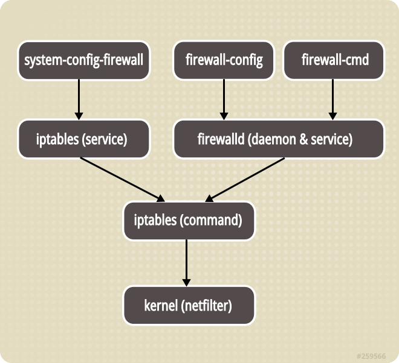
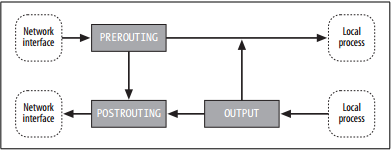
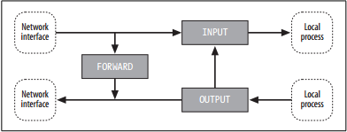
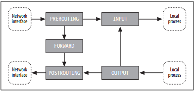
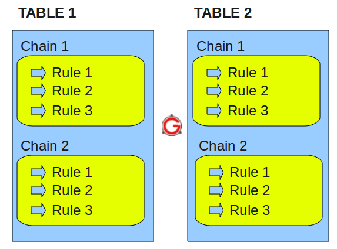
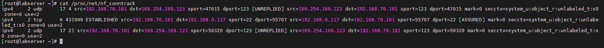

# Lý thuyết về Iptables
## I. Iptables là gì và để làm gì?

iptables là firewall software cơ bản được dùng nhiều nhất trong linux, được dùng để tạo tưởng lửa cho máy linux của bạn, nó có các chức năng lọc gói tin, nat gói tin qua đó để giúp làm nhiệm vụ bảo mật thông tin cá nhân tránh mất mát thông tin và áp dụng những chính sách đối với người sử dụng. Iptables hoạt động bằng cách giao tiếp với packet filtering hooks trong Linux kernel's networking stack. Các hooks này là netfilter framework

Netfilter là packet filtering framework bên trong Linux kernel 2.4.x và các phiên bản tiếp theo. Đây là phiên bản nâng các của ipchains cũng như ipfwadm trong những phiên bản linux kernel 2.0.x và 2.2.x netfilter là một danh sách các hooks nằm bên trong Linux kernel, nó cho phép kernel modules thực hiện các tác vụ đối với network stack

iptables đơn giản chỉ là một danh sách các rules được tổ chức theo dạng bảng. Mỗi một rule chứa một loạt các classifiers (iptables matches) và một conncected action (iptables target)

Các firewall software khác chỉ đơn giản là sử dụng lại cơ chế hoặc cung cấp GUI interface để người dùng thao tác với iptables

**Các tính năng chính:**

- stateless packet filtering (IPv4 & IPv6)
- stateful packet filtering (IPv4 and IPv6)
- all kinds of network address and port translation

`stateful filter` sẽ giữ 1 danh sách các connections đã được thiết lập, nó được cho là có hiệu quả hơn trong việc phát hiện các gói tin giả mạo 

`stateless filter` không giữ danh sách ấy, mọi packet đều được process một cách độc lập với nhau. Nó được cho là sẽ xử lí gói tin nhanh hơn

**Người dùng có thể làm gì với iptables?**

- Xây dựng một hệ thống tưởng lửa cho hệ thống dựa trên stateless và stateful packet filtering
- Triển khai một cụm cluster stateless và stateful firewall
- Dùng NAT để chia sẻ kết nối internet
- Dùng NAT để xây dựng transparent proxies
- Thực hiện một số tác vụ với packet như thay đổi TOS/DSCP/ECN trong IP header

## II. Sự khác biệt giữa iptables và firewalld

Firewalld là phiên bản firewall mới mặc định được sử dụng trong các phiên bản RHEL để thay thế cho interface của iptables. Về bản chất, nó vẫn kết nối tới netfilter kernel code. Firewalld tập trung chủ yếu vào việc cải thiện vấn đề quản lí rules bằng cách cho phép thay đổi cấu hình mà không bị mất các kết nối hiện tại

Hình dưới đây mô tả tổng quan mối quan hệ giữa iptables và firewalld



Như vậy cả 2 đều sử dụng iptables tool để giao tiếp với kernel packet filter

Tuy vậy, trong khi iptables service lưu cấu hình tại `/etc/sysconfig/iptables` và `/etc/sysconfig/ip6tables` thì firewalld lại lưu nó dưới dạng một loạt các file XML trong `/usr/lib/firewalld/`. 

**NOTE:** `/etc/sysconfig/iptables` không tồn tại nếu chưa cài đặt iptables service bởi mặc định firewalld mới là dịch vụ được cài đặt

Đối với iptables, mỗi một thay đổi đồng nghĩa với việc hủy bỏ toàn bộ các rules cũ và load lại một loạt các rules mới trong file `/etc/sysconfig/iptables`. Trong khi đó với firewalld, chỉ nhữndg thay đổi mới được applied. Vì thể firewalld có thể thay đổi cài đặt trong thời gian realtime mà không làm mất bất cứ kết nối nào

Để xem các iptables rules mà firewalld tạo ra, sử dụng câu lệnh sau:

```bash
iptables-save
```

**Hướng dẫn sử dụng iptables thay cho firewalld:**

- Cài đặt packages:

    ```bash
    yum install -y iptables-services
    ```

- Disable Firewalld service:

    ```bash
    systemctl mask firewalld
    ```

- Cho phép iptables service khởi động cùng hệ thống:

    ```bash
    systemctl enable iptables
    ```

- Stop Firewalld service

    ```bash
    systemctl stop firewalld
    ```

- Bật iptables service

    ```bash
    systemctl start iptables
    ```

**Một số lưu ý đối với iptables, firewalld và ufw:**

- Đối với RHEL, khi bạn tắt firewalld (mặc định) hoặc tắt iptables service. Các iptables rules cũng sẽ biến mất -> Một số service hoạt động dựa trên nó như network default của KVM (LB) cũng sẽ bị ảnh hưởng.
- Đối với Ubuntu/Debian, ufw là firewall mặc định. Tuy nhiên khi disable ufw, các iptables rules không bị mất đi. Mặc dù vậy, để có thể lưu lại các iptables rules đã cấu hình, bạn cần cài thêm gói `iptables-persistent`

## III. Các khái niệm thường gặp trong iptables

iptables định nghĩa ra 5 "hooks points" trong quá trình xử lí gói tin của kernel: `PREROUTING`, `INPUT`, `FORWARD`, `POSTROUTING` và `OUTPUT`. Các built-in chains được gán vào các hook points này, bạn có thể add một loạt các rules cho mỗi hook points. 

**NOTE:**

- chain không phải là "một object duy nhất nằm trong table". Cùng tên chain có thể tồn tại ở nhiều table
- Mỗi table có thể có nhiều chain

**Hình dưới đây mô tả quá trình gói tin đi qua hệ thống để NAT:**



**Hình dưới đây mô tả quá trình gói tin đi qua hệ thống để filter:**



**Hình dưới đây mô tả quá trình gói tin đi qua hệ thống để mangle:**



**Hook:**

| Hook        | Xử lý các packet                                                                                                                                                |
| ----------- | --------------------------------------------------------------------------------------------------------------------------------------------------------------- |
| FORWARD     | có đích là một server khác nhưng không được tạo từ server của bạn. Chain này là cách cơ bản để cấu hình server của bạn để route các request tới 1 thiết bị khác |
| INPUT       | có địa chỉ đích đến là server của bạn                                                                                                                           |
| OUTPUT      | được tạo bởi server của bạn                                                                                                                                     |
| PREROUTING  | vừa mới tiến vào từ network interface. Nó sẽ được thực thi trước khi quá trình routing diễn ra, thường dùng cho DNAT                                            |
| POSTROUTING | đi ra ngoài hoặc được forward sau khi quá trình routing hoàn tất, chỉ trước khi nó tiến vào đường truyền, thường dùng cho SNAT                                  |


**Tables:**

Iptables có 3 bảng chính: `filter`, `mangle` và `nat`

| Table  | Description                                                                                                                                                                                                                                                                            |
| ------ | -------------------------------------------------------------------------------------------------------------------------------------------------------------------------------------------------------------------------------------------------------------------------------------- |
| nat    | dùng để NAT, thường dựa vào địa chỉ nguồn hoặc đích. Nó có 3 chains là: `OUTPUT`, `POSTROUTING` và `PREROUTING`                                                                                                                                                                        |
| filter | dùng để thiết lập policy cho các traffic vào, qua và ra khỏi hệ thống. Iptables lấy đây làm table default, nếu bạn không khai báo bất cứ thông tin gì về table trong câu lệnh, iptables sẽ mặc định áp dụng nó cho filter table. Nó bao gồm các chains: `FORWARD`, `INPUT` và `OUTPUT` |
| mangle | Dùng để thay đổi một số thông tin cụ thể của packet. Nó có các chains là: `FORWARD`, `INPUT`, `OUTPUT`, `POSTROUTING` và `PREROUTING`                                                                                                                                                  |

**Chains:**

Mặc định thì mỗi table đều có chains trống. Bạn cũng có thể tự tạo chain cho mình. Mỗi chain sẽ có policy, policy này sẽ quyết định trạng thái của gói tin trong trường hợp nó không match với bất cứ rules nào. Policy chỉ có 2 target là `ACCEPT` và `DROP`, mặc định là `ACCEPT`. Các chain được tạo bởi user sẽ có policy mặc định và không thay đổi được có target là `RETURN` 

**Rules:**

iptables rule bao gồm một hoặc nhiều tiêu chuẩn để xác định packets nào sẽ phải chịu ảnh hưởng và target để xác định hàng đồng nạo sẽ được thực thi với packet ấy

Cả hai yếu tố của rules đó là match và target đều là tùy chọn. Như vậy, cấu trúc của iptables như sau: `iptables` -> `Tables` -> `Chains` -> `Rules`



**Matches:**

Có vô số các match có thể sử dụng với iptables. Ví dụ như Internet Protocol (IP) matches (protocol, source, hoặc destination address).

**Targets:**

Targets được dùng để xác định hành động sẽ được thực thid dối với các packets "match" với rules và nó cũng dùng để xác định chain policy. Hiện có 4 targets mặc định đó là:

| Target | Description                                                                                  |
| ------ | -------------------------------------------------------------------------------------------- |
| ACCEPT | Chấp nhận và cho phép gói tin đi vào hệ thống                                                |
| DROP   | Loại gói tin, không có gói tin trả lời                                                       |
| REJECT | Loại gói tin, tuy nhiên sẽ gửi một gói tin phản hồi cho bên gửi biết rằng kết nối bị từ chối |
| LOG    | Chấp nhận gói tin nhưng có ghi lại log                                                       |

## IV. Cách hoạt động của iptables
Iptables hoạt động bằng cách so sánh network traffic với một danh sách các rules. Rule định nghĩa các tính chất mà packet cần có để match với rule kèm theo những hành động sẽ được thực thi với những matching packets

Có rất nhiều các options để thiết lập rule sao cho nó match với packets đi qua như protocol, ip, interface... Khi một packet match, target được thực thi. Target có thể là quyết định cuối cùng áp dụng đối với packet ví dụ như `ACCEPT` hoặc `DROP`. Nó cũng có thể chuyển packet tới chain khác để xử lí hoặc đơn giản log lại.

Các rules này được gộp lại thành nhóm gọi là chains. Chains là danh sách các rules và nó sẽ được check lần lượt. Khi một packet match với 1 rules, nó sẽ được thực thi với hành động tương ứng và không cần phải check với các rules còn lại.

Mỗi chain có thể có một hoặc nhiều rule nhưng mặc định nó sẽ có 1 policy. Trong trường hợp packets không match với bất cứ rules nào, policy sẽ được thực thi, bạn có thể accept hoặc drop nó.

## V. Quá trình xử lí gói tin trong iptables

**Những gói tin có đích đến là server của bạn:**

| Step | Table  | Chain      |                                                                                                                                  |
| ---- | ------ | ---------- | -------------------------------------------------------------------------------------------------------------------------------- |
| 1    |        |            | Trên đường mạng (Internet)                                                                                                       |
| 2    |        |            | Tới interface                                                                                                                    |
| 3    | raw    | PREROUTING | Chain này được dùng để kiểm soát gói tin trước khi thiết lập giám sát đường truyền (connection tracking)                         |
| 4    |        |            | Thiết lập giám sát đường truyển                                                                                                  |
| 5    | mangle | PREROUTING | Dùng để mangle gói tin, ví dụ như thay đổi TOS...                                                                                |
| 6    | nat    | PREROUTING | Sử dụng chủ yếu cho DNAT                                                                                                         |
| 7    |        |            | Các routing decision được thiết lập để xác định đích đến gói tin                                                                 |
| 8    | mangle | INPUT      | mangle gói tin sau khi route nhưng vẫn chưa được gửi tới process trên máy                                                        |
| 9    | filter | INPUT      | Đây là nơi ta filter với mọi gói tin được gửi đến server. Lưu ý rằng mọi packets có đích đến là server đều phải đi qua chain này |
| 10   |        |            | Quá trình xử lí trên máy (local process)                                                                                         |

**Các gói tin bắt đầu từ server của bạn:**

| Step | Table  | Chain       |                                                                                                     |
| ---- | ------ | ----------- | --------------------------------------------------------------------------------------------------- |
| 1    |        |             | Local process                                                                                       |
| 2    |        |             | Routing decision được đưa ra. Source address, interface nào sẽ được sử dụng, ...                    |
| 3    | raw    | OUTPUT      | đây là nơi bạn có thể đưa ra một số quyết định trước khi gói tin được thiết lập trạng thái giám sát |
| 4    |        |             | Thiết lập trạng thái giám sát                                                                       |
| 5    | mangle | OUTPUT      | Nơi ta có thể mangle packets                                                                        |
| 6    | nat    | OUTPUT      | dùng để NAT cho các gói tin do chính máy tạo ra                                                     |
| 7    |        |             | Thêm routing decision bởi có thể quá trình mangle và nat làm thay đổi đích đến của gói tin          |
| 8    | filter | OUTPUT      | Nơi ta filter các gói tin từ phía local                                                             |
| 9    | mangle | POSTROUTING | Được sử dụng chủ yếu nếu ta muốn mangle gói tin sau khi nó được route nhưng chưa rời khỏi host      |
| 10   | nat    | POSTROUTING | Nơi ta SNAT                                                                                         |
| 11   |        |             | Đi ra một interface                                                                                 |
| 12   |        |             | Ra đường truyền                                                                                     |

**Các gói tin được forward:**

| Step | Table  | Chain       |                                                                                                          |
| ---- | ------ | ----------- | -------------------------------------------------------------------------------------------------------- |
| 1    |        |             | Trên đường mạng (Internet)                                                                               |
| 2    |        |             | Tới interface                                                                                            |
| 3    | raw    | PREROUTING  | Chain này được dùng để kiểm soát gói tin trước khi thiết lập giám sát đường truyền (connection tracking) |
| 4    |        |             | Thiết lập giám sát đường truyền                                                                          |
| 5    | mangle | PREROUTING  | Dùng để mangle gói tin vd như thay đổi TOS...                                                            |
| 6    | nat    | PREROUTING  | Sử dụng chủ yếu cho DNAT                                                                                 |
| 7    |        |             | Các routing decision được thiết lập để xác định đích đến gói tin                                         |
| 8    | mangle | FORWARD     | dùng để mangle các packet sau khi routing decision được đưa ra nhưng trước routing decision cuối cùng    |
| 9    | filter | FORWARD     | sau khi đã được route thì chỉ những forwarded packets mới có thể tới chain này, đây là nơi ta filter     |
| 10   | mangle | POSTROUTING | dùng để mangle các gói tin sau khi tất cả routing decision được thiết lập nhưng vẫn chưa ra khỏi host    |
| 11   | nat    | POSTROUTING | dùng cho SNAT                                                                                            |
| 12   |        |             | Đi ra một interface                                                                                      |
| 13   |        |             | Ra đường truyển                                                                                          |


Dưới đây là mô hình miêu tả quá trình gói tin traverse qua iptables


## VI. State machine

Về bản chất, có thể coi iptables là một stateful packets filtering firewall. Nó có cơ chế giám sát các kết nối đi qua

Với iptables, có 4 trạng thái cảu các kết nối đó là: `NEW`, `ESTABLISHED`, `RELATED` và `INVALID`

Iptables sử dụng một framework trong kernel có tên gọi là `conntrack`, nó có thể được load như một module hoặc cũng có thể là 1 phần của kernel. Tất cả các giám sát kết nối đều được thực hiện ở chain `PREROUTING`, trừ những packet từ local đi ra thì được kiểm soát bởi chain `OUTPUT`. 

**Ví dụ:** ta có 1 gói tin gửi đi, nó sẽ có trạng thái `NEW` ở chain `OUTPUT`, khi nó được phản hồi về, trạng thái của nó ở chain `PREROUTING` sẽ là `ESTABLISHED`.

File `/proc/net/nf_conntrack` chứa toàn bộ những entries trong conntrack database



```bash
ipv4     2 tcp      6 431999 ESTABLISHED src=192.168.70.101 dst=192.168.0.117 sport=22 dport=55707 src=192.168.0.117 dst=192.168.70.101 sport=55707 dport=22 [ASSURED] mark=0 secctx=system_u:object_r:unlabe              led_t:s0 zone=0 use=2
```

Ví dụ trên cho ta biết conntrack module quản lí các connection cụ thể như thế nào. Đầu tiên ta có protocol, ở đây là tcp. Tiếp theo, cùng giá trị nhưng ở dạng decimal coding. Sau đó là khoảng thời gian mà conntrack entry này có thể tồn tại. Sau đó chính là trạng thái, ở đây là ESTABLISHED. Tiếp đó ta thấy source cùng với destination IP, port kèm theo những gì chúng ta mong đợi của packet trả về (thông số được đảo ngược lại)

[ASSURED] cho ta biết rằng entry này sẽ được bảo đảm không bị xóa kể cả khi ta đạt đến con số maximum các entries có thể lưu. Con số này phụ thuộc vào số ram bạn có. Mặc định thì 128MB sẽ lưu được khoảng 8192 entries. Bạn có thể xem con số tối đa và sửa nó tại `/proc/sys/net/netfilter/nf_conntrack_max`

**User-land states**

| State       | Explaination                                                                                                                                                                                                                                      |
| ----------- | ------------------------------------------------------------------------------------------------------------------------------------------------------------------------------------------------------------------------------------------------- |
| NEW         | Trạng thái này cho ta biết đó là packet đầu tiên mà conntrack module thấy (những packet có cờ SYN)                                                                                                                                                |
| ESTABLISHED | Điều kiện để có trạng thái này đơn giản là 1 host gửi packet đi và nhận lại reply từ host khác                                                                                                                                                    |
| RELATED     | Kết nối ở trạng thái này khi nó liên quan tới kết nối khác ở trạng thái ESTABLISHED. Đầu tiên ta có 1 kết nối đã ESTABLISHED, sau đó kết nối này tiếp tục tạo ra một kết nối khác ra bên ngoài kết nối chính. Kết nối mới này được coi là RELATED |
| INVALID     | Có nghĩa rằng packet không thể được xác nhận hoặc nó không có bất cứ trạng thái nào, thông thường những paket như này sẽ bị drop                                                                                                                  |
| UNTRACKED   | Đây là những packet được đánh dấu trong bảng raw với target là NOTRACK. Sau đó nó sẽ được đánh dấu state là UNTRACKED                                                                                                                             |