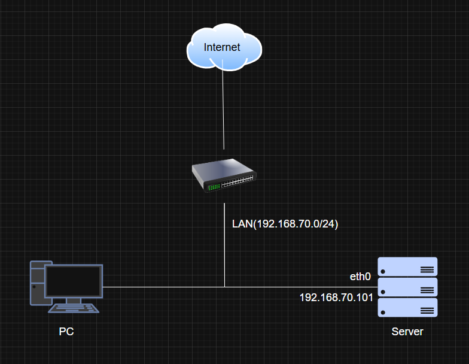
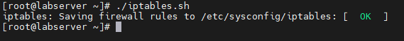
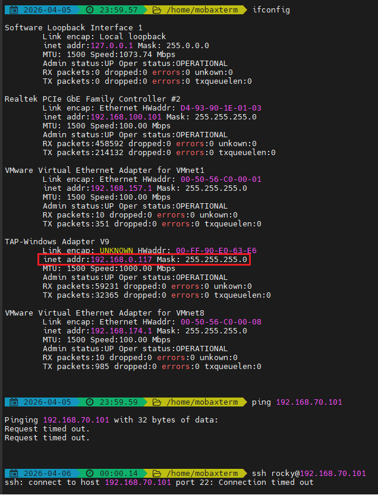
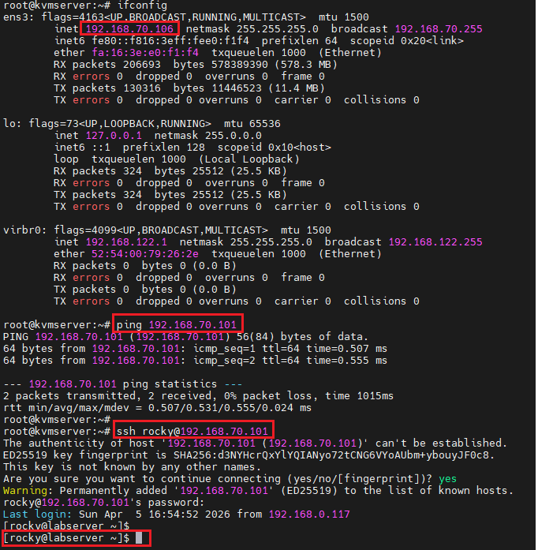
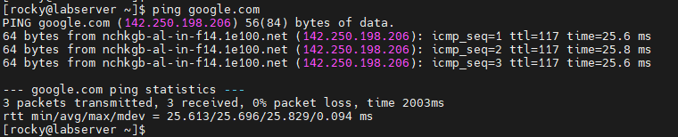

# I. Mô hình



Server: Rocky 9 (1 NIC)

Client: Rocky 9 (1 NIC)

# II. Yêu cầu 

## 2.0 Tổng quan

Chỉ cho phép các kết nối ở trạng thái đã thiết lập, kết nối từ loopback và internal network tới server, các kết nối khác mặc định sẽ bị loại bỏ. Ngoài ra, các kết nối từ server được phép đi ra bên ngoài 

## 2.1 Chi tiết

- DROP các INPUT traffic mặc định tới server 
- ACCEPT các OUTPUT traffic mặc định từ server
- ACCEPT các traffic đã kết nối (ESTABLISHED)
- ACCEPT kết nối từ loopback
- ACCEPT các kết nối ping 5 lần 1 phút từ internal network (192.168.100.0/24)
- ACCEPT các kết nối ssh từ internal network (192.168.100.0/24)

# III. Thực hiện

## 3.0 Ta sẽ viết 1 script rules cho iptables 

**NOTE:** ta sẽ disable firewall và start iptables.services

`vi iptables.sh`

```bash
#!/bin/bash

my_LAN='192.168.70.0/24'
server_host='192.168.70.101'

/sbin/iptables -F
/sbin/iptables -X

/sbin/iptables -P INPUT DROP
/sbin/iptables -P OUTPUT ACCEPT
/sbin/iptables -P FORWARD DROP

/sbin/iptables -A INPUT -m state --state ESTABLISHED,RELATED -j ACCEPT

/sbin/iptables -A INPUT -s 127.0.0.1 -d 127.0.0.1 -j ACCEPT

/sbin/iptables -A INPUT -p icmp --icmp-type echo-request -s $my_LAN -d $server_host -m limit --limit 1/m --limit-burst 5 -j ACCEPT

/sbin/iptables -A INPUT -p tcp -m state --state NEW -s $my_LAN -d $server_host --dport 22 -j ACCEPT 

service iptables save
systemctl restart iptables 
```

Chạy script và kiểm tra:

```bash
chmod +x iptables.sh
./iptables.sh
```



## 3.1 Kiểm tra

- Từ máy ngoài LAN có IP là `192.168.0.117` ta sẽ thử ping và ssh vào server:

    

- Từ PC cùng LAN với server ta sẽ SSH và Ping vào server:

    

- Từ server ta sẽ thử kết nối ra ngoài internet:

    