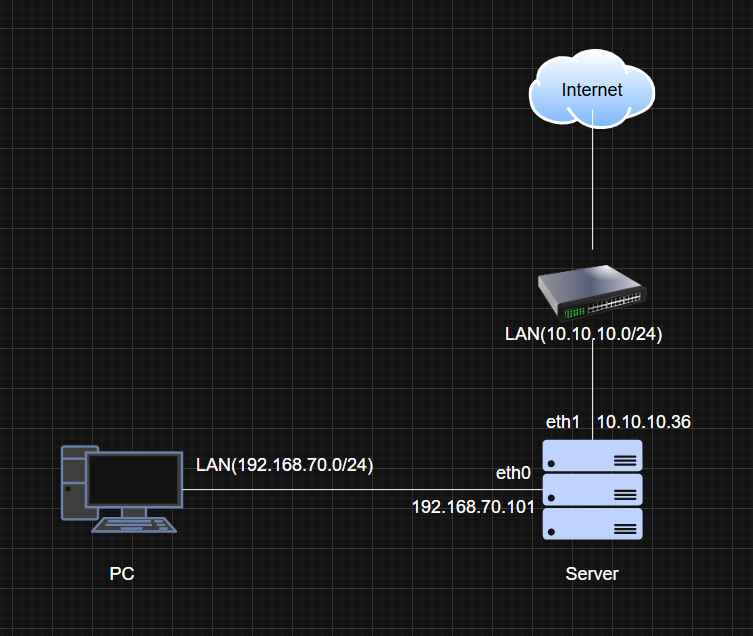
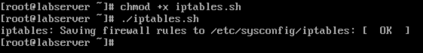
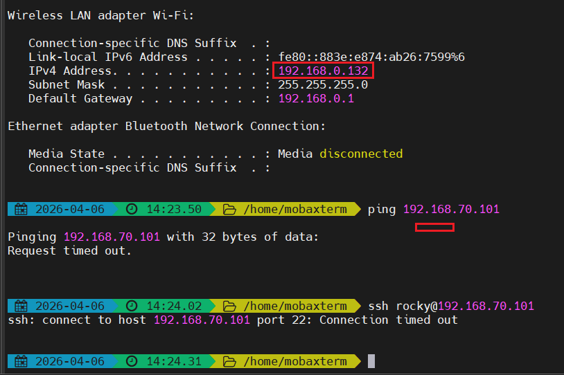
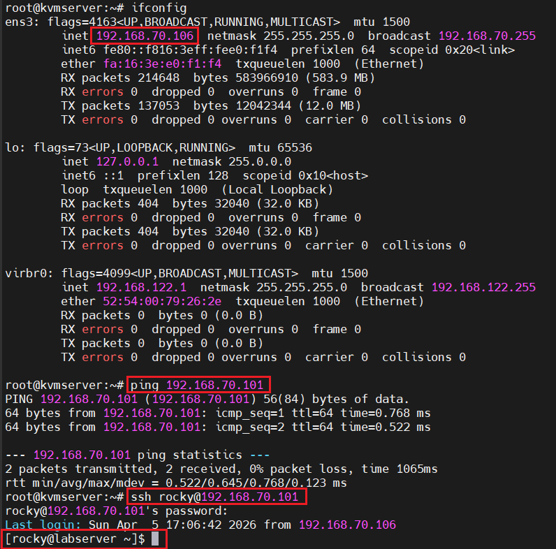

# I. Mô hình



Server: Rocky (2 NIC)

Client: Rocky (1 NIC)

# II. Yêu cầu

## 2.0 Tổng quan

Chi cho phép các kết nối đã được thiết lập, các kết nối từ internal network, loopback tới server. Forward các kết nối từ internal network để các máy bên trong có thể ra ngoài internet

## 2.1 Chi tiết

- DROP các INPUT traffic mặc định tới server
- ACCEPT các OUTPUT traffic mặc định từ server 
- DROP các traffic forward mặc định
- ACCEPT các traffic đã kết nối (ESTABLISHED)
- ACCEPT các kết nối loopback
- ACCEPT các kết nối ping 5 lần 1 phút từ internal network (192.168.70.0/24)
- ACCEPT các kết nối ssh từ internal network (192.168.70.0/24)
- ACCEPT các kết nối ra ngoài từ internal network và chuyển đổi địa chỉ nguồn

# III. Thực hiện 

## 3.0 Ta sẽ viết 1 script rules cho iptables 

**NOTE:** ta sẽ disable firewall và start iptables.services

`vi iptables.sh`

```bash
#!/bin/bash

trust_host='192.168.70.0/24'
server_host='192.168.70.101'

echo 1 > /proc/sys/net/ipv4/ip_forward

/sbin/iptables -F
/sbin/iptables -t nat -F
/sbin/iptables -X

/sbin/iptables -P INPUT DROP 
/sbin/iptables -P OUTPUT ACCEPT
/sbin/iptables -P FORWARD DROP 

/sbin/iptables -A FORWARD -i eth0 -o eth1 -s $trust_host -j ACCEPT
/sbin/iptables -A FORWARD -m state --state ESTABLISHED,RELATED -j ACCEPT

/sbin/iptables -A INPUT -m state --state ESTABLISHED,RELATED -j ACCEPT

/sbin/iptables -A INPUT -s 127.0.0.1 -d 127.0.0.1 -j ACCEPT

/sbin/iptables -A INPUT -p icmp --icmp-type echo-request -s $trust_host -d $server_host -m limit --limit 1/m --limit-burst 5 -j ACCEPT

/sbin/iptables -A INPUT -p tcp -m state --state NEW -m tcp -s $trust_host -d $server_host --dport 22 -j ACCEPT

/sbin/iptables -t nat -A POSTROUTING -o eth1 -s $trust_host -j MASQUERADE

service iptables save
systemctl restart iptables 
```

**Giải thích:**

- `echo 1 > /proc/sys/net/ipv4/ip_forward`: Cho phép Linux Forward packet giữa các interface
- `iptables -A FORWARD -i eth0 -o eth1 -s $trust_host -j ACCEPT`: Cho phép forward từ LAN (eth0) ra ngoài internet (eth1)
- `iptables -A FORWARD -m state --state ESTABLISHED,RELATED -j ACCEPT`: Cho phép packet thuộc connection đã có 
- `iptables -A INPUT -m state --state ESTABLISHED,RELATED -j ACCEPT`: Cho phép server nhận reply từ ngoài 
- `iptables -A INPUT -s 127.0.0.1 -d 127.0.0.1 -j ACCEPT`: Cho phép loopback
- `/sbin/iptables -A INPUT -p icmp --icmp-type echo-request -s $trust_host -d $server_host -m limit --limit 1/m --limit-burst 5 -j ACCEPT`: Cho phép ping (có giới hạn)
- `/sbin/iptables -A INPUT -p tcp -m state --state NEW -m tcp -s $trust_host -d $server_host --dport 22 -j ACCEPT`: Cho phép SSH từ LAN
- `iptables -t nat -A POSTROUTING -o eth1 -s $trust_host -j MASQUERADE`: Packet từ LAN (192.168.70.0/24) đi ra `eth1` sẽ bị đổi source IP thành IP của `eth1`


Chạy script và kiểm tra:

```bash
chmod +x iptables.sh
./iptables.sh
```



## 3.1 Kiểm tra

- Từ máy ngoài LAN có IP là `192.168.0.132` ta sẽ thử ping và ssh vào server:

    

- Từ PC cùng LAN với server ta sẽ SSH và Ping vào server:

    

/etc/cloud/cloud.cfg.d/99-disable-network-config.cfg