# I. Mô hình


## II. Yêu cầu
**Chi tiết:**

- DROP các INPUT traffic mặc định vào server
- ACCEPT các OUTPUT traffic mặc định từ server
- DROP các traffic forward mặc định
- ACCEPT các traffic đã kết nối (ESTABLISHED)
- ACCEPT kết nối từ loopback
- FORWARD các packet từ port 80 `enp1s0` tới Backend1 trên cùng port
- FORWARD các packet từ port 443 `enp1s0` tới Backend2 trên cùng port
- DROP các packet từ địa chỉ `192.168.122.200` 
- ACCEPT các kết nối ping 5 lần 1 phút từ internal network (`192.168.200.0/24`)
- DROP các packet từ địa chỉ `192.168.200.20`
- ACCEPT các kết nối ra ngoài từ internal network và chuyển đổi địa chỉ nguồn 

## III. Thực hiện 

Viết script rules cho iptables:

`vi iptables.sh`

```bash
#!/bin/bash

trust_host='192.168.200.0/24'
my_internal_ip='192.168.200.100'
my_external_ip='192.168.122.120'

listen_port_1='80'
backend_host_1='192.168.200.10'
backend_port_1='80'

listen_port_2='443'
backend_host_2='192.168.200.11'
backend_port_2='443'

echo 1 > /proc/sys/net/ipv4/ip_forward

/sbin/iptables -F
/sbin/iptables -t nat -F
/sbin/iptables -X

/sbin/iptables -P INPUT DROP
/sbin/iptables -P OUTPUT ACCEPT
/sbin/iptables -P FORWARD DROP

/sbin/iptables -A FORWARD -i enp7s0 -o enp1s0 -s $trust_host -j ACCEPT
/sbin/iptables -A FORWARD -m state --state ESTABLISHED,RELATED -j ACCEPT

/sbin/iptables -A FORWARD -s 192.168.122.200 -j DROP

/sbin/iptables -A FORWARD -p tcp -d $backend_host_1 --dport $backend_port_1 -j ACCEPT
/sbin/iptables -A FORWARD -p tcp -d $backend_host_2 --dport $backend_port_2 -j ACCEPT

/sbin/iptables -A INPUT -s 192.168.200.20 -j DROP

/sbin/iptables -A INPUT -m state --state ESTABLISHED,RELATED -j ACCEPT
/sbin/iptables -A INPUT -s 127.0.0.1 -d 127.0.0.1 -j ACCEPT
/sbin/iptables -A INPUT -p icmp --icmp-type echo-request -s $trust_host -d $my_internal_ip -m limit --limit 1/m --limit-burst 5 -j ACCEPT
/sbin/iptables -A INPUT -p tcp -m state --state NEW -m tcp -s $trust_host -d $my_internal_ip --dport 22 -j ACCEPT

/sbin/iptables -t nat -A POSTROUTING -o enp1s0 -s $trust_host -j MASQUERADE

/sbin/iptables -t nat -A PREROUTING -p tcp -d $my_external_ip --dport $listen_port_1 -j DNAT --to-destination $backend_host_1:$backend_port_1
/sbin/iptables -t nat -A PREROUTING -p tcp -d $my_external_ip --dport $listen_port_2 -j DNAT --to-destination $backend_host_2:$backend_port_2

sudo netfilter-persistent reload
sudo netfilter-persistent save
```

Chạy script và kiểm chứng:

```bash
chmod +x iptables.sh
./iptables.sh
```

## IV. Kiểm tra

### 1. Kiểm tra Port Forwarding 
Ta sử dụng máy ở dải `192.168.122.0/24` để kiểm tra:

- Thông tin của máy: 

    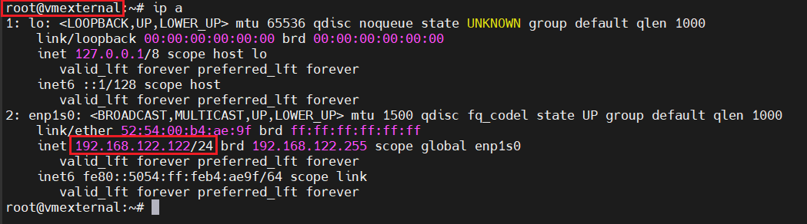

- Ta thử ping trực tiếp từ máy này tới `backend1: 192.168.200.10` với port `80`:

    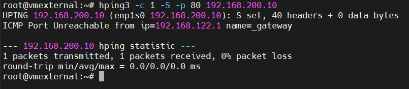

    -> Không thể ping tới backend1 từ VM này 

- Ta thử ping tới backend1 thông qua `server: 192.168.122.120` với port `80` và bắt gói tin ở server và backend1:

    - Server:

    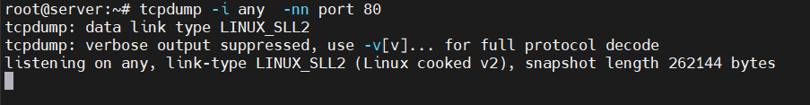

    - Backend1:

    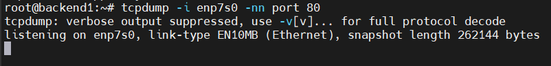

    - vm_external:

    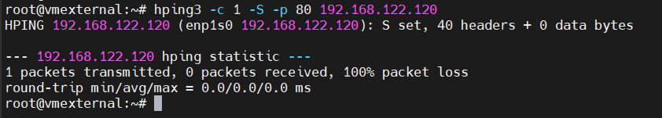

- Kiểm tra log:

  - Trên server: 

    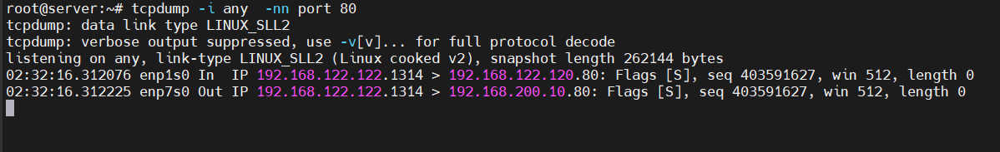

    Ta thấy: Có 2 gói tin được bắt trên port 80: 
  
    - `192.168.122.122.1314` > `192.168.122.120.80`: là gói tin từ VM ở external ping tới port 80 của server 
    - `192.168.122.122.1314` > `192.168.200.10.80`: là gói tin được forward từ server tới backend1

  - Trên backend1: 

    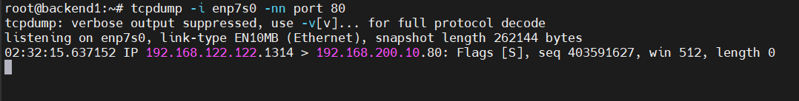

Tương tự ta sẽ thực hiện ping lên port 443 từ `vm_external` tới `server`:


- vm_external:

    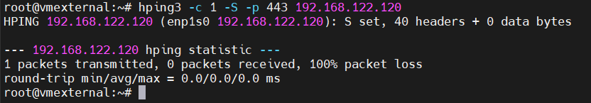

- server:

    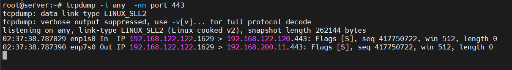

- backend2: 

    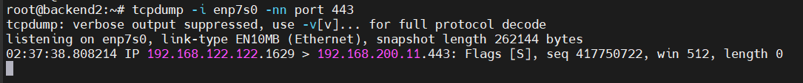

### 2. Kiểm tra SSH

Như yêu cầu của bài lab, ta sẽ chỉ cho phép SSH từ máy ở dải `192.168.200.0/24`

- Test trên `vm_external` ở dải `192.168.122.0/24`:

    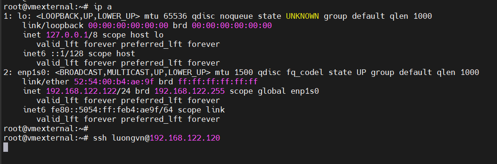

    Ta thấy, mặc dù cùng dải với server nhưng ta đã chặn ssh trên dải này nên không thể ssh vào 

- Test trên `backend2` ở dải `192.160.200.0/24`:

    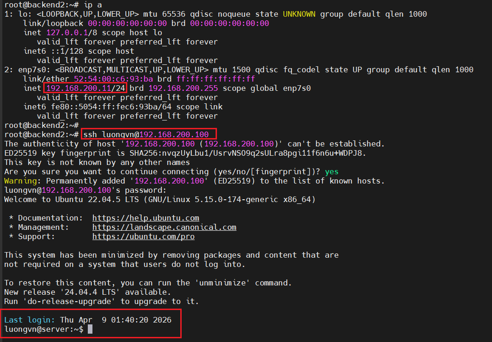

    SSH thành công 

### 3. Kiểm tra Ping

Ta chỉ có thể ping tới server ở dải `192.168.200.0/24` 

- test trên `vm_external`:

    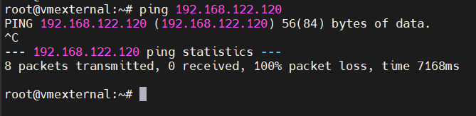

- test trên `backend2`:

    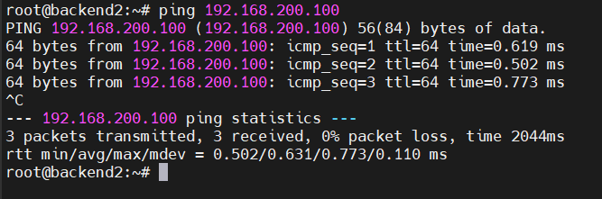
