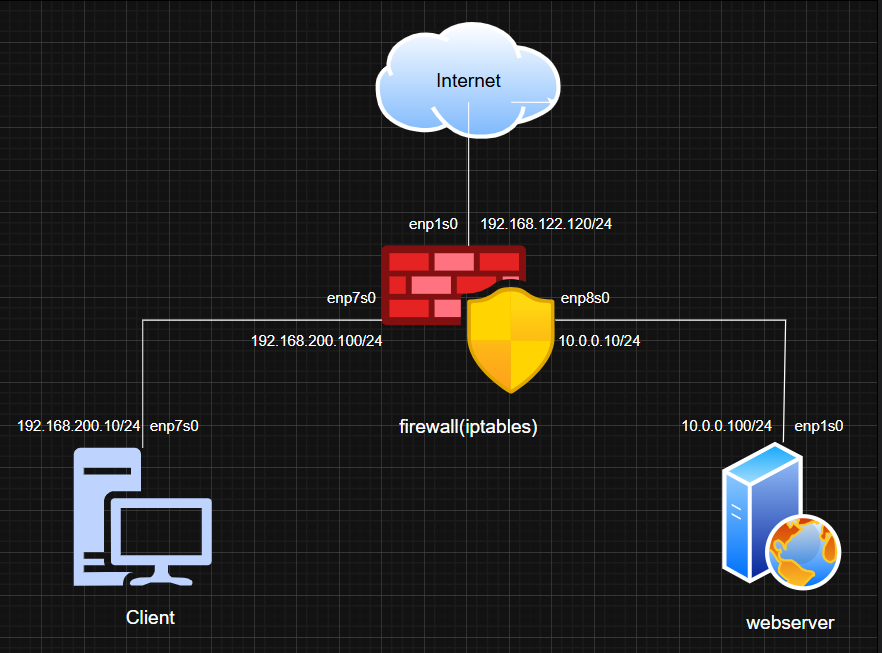
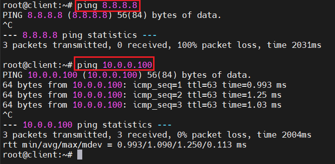
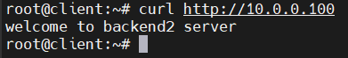
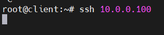
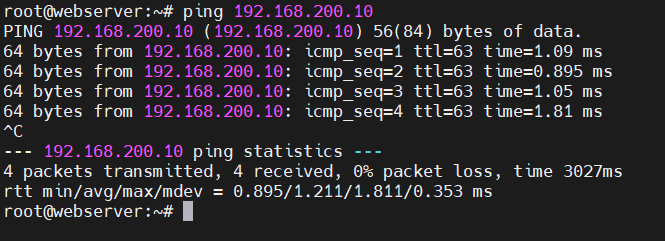
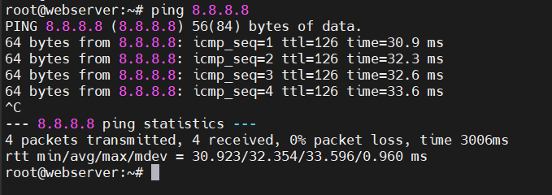

# I. Mô hình



# II. Yêu cầu

- Tất cả việc cấu hình iptables đều thực hiện trên máy chủ firewall(iptables)
- Client và Webserver có 2 dải mạng host-only khác nhau
- Client :
  - Chỉ được ping, access port 80 trên Webserver
  - Không ra được internet
  - Không có quyền ssh
- Webserver:
  - Có thể ra internet
  - Có thể ping, ssh sang Client

# III. Thực hiện

Viết script rules cho iptables:

`vi iptables.sh`

```bash
#!/bin/bash

client_host='192.168.200.0/24'
webserver_host='10.0.0.0/24'

echo 1 > /proc/sys/net/ipv4/ip_forward

/sbin/iptables -F
/sbin/iptables -t nat -F
/sbin/iptables -t mangle -F
/sbin/iptables -X

/sbin/iptables -P INPUT DROP
/sbin/iptables -P OUTPUT ACCEPT
/sbin/iptables -P FORWARD DROP

# loopback (chuẩn hơn)

/sbin/iptables -A INPUT -i lo -j ACCEPT

# cho phép SSH vào firewall (tránh tự lock)

/sbin/iptables -A INPUT -p tcp --dport 22 -j ACCEPT

/sbin/iptables -A INPUT -m state --state ESTABLISHED,RELATED -j ACCEPT
/sbin/iptables -A FORWARD -m state --state ESTABLISHED,RELATED -j ACCEPT

# >>> Config client rule <<<

# ping

/sbin/iptables -A FORWARD -p icmp -s $client_host -d $webserver_host -j ACCEPT

# http

/sbin/iptables -A FORWARD -p tcp -s $client_host -d $webserver_host --dport 80 -j ACCEPT

# KHÔNG cần rule DROP SSH vì default đã DROP

# chặn client ra internet

/sbin/iptables -A FORWARD -s $client_host -o enp1s0 -j DROP

# >>> Config webserver rule <<<

# ra internet

/sbin/iptables -A FORWARD -s $webserver_host -o enp1s0 -j ACCEPT

# ping client

/sbin/iptables -A FORWARD -p icmp -s $webserver_host -d $client_host -j ACCEPT

# ssh sang client

/sbin/iptables -A FORWARD -p tcp -s $webserver_host -d $client_host --dport 22 -j ACCEPT

# >>> Config nat <<<

/sbin/iptables -t nat -A POSTROUTING -s $webserver_host -o enp1s0 -j MASQUERADE

# >>> Save rule <<<

netfilter-persistent save
```

Chạy script và kiểm chứng: 

```bash
chmod +x iptables.sh
./iptables.sh
```

# IV. Kiểm tra 

- Từ client ping tới webserver và ping ra ngoài internet:

    

    -> Có thể ping sang webserver nhưng không thể ra internet

- Từ client thử truy cập webserver bằng HTTP: 

    

    -> Truy cập thành công

- Từ client thử ssh vào webserver:

    

    -> Không thể ssh

- Từ webserver ta ping thử vào client:

    

    -> Ping thành công

- Từ webserver ta ping thử ra internet:

    

    -> Ping ra internet thành công