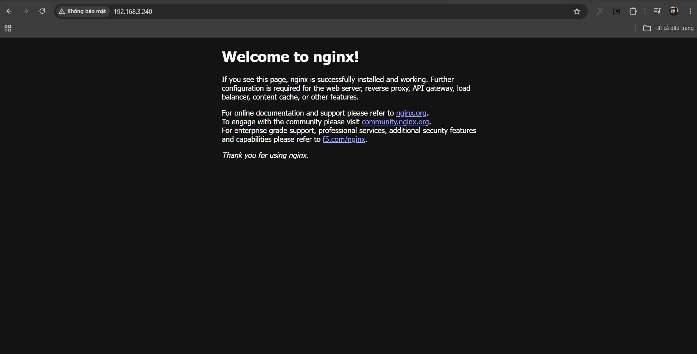

# Summary 

- [Summary](#summary)
- [Install MetaLB](#install-metalb)
  - [I. Deploy MetaLB](#i-deploy-metalb)
  - [II. Configure](#ii-configure)
    - [Bước 1: Tạo IPAddressPool](#bước-1-tạo-ipaddresspool)
    - [Bước 2: Tạo Layer2 Advertisement](#bước-2-tạo-layer2-advertisement)
  - [III. Test](#iii-test)
- [Tài liệu tham khảo](#tài-liệu-tham-khảo)


# Install MetaLB 

## I. Deploy MetaLB 

1. Add helm repo 

```bash
helm repo add metallb https://metallb.github.io/metallb
helm repo update
```

2. Create namespace for the deployment 

```bash
kubectl create namespace metallb-system
```

3. Deploy chart 

```bash
helm install metallb metallb/metallb \
  --namespace metallb-system \
  --create-namespace \
  --version 0.16.1
```

## II. Configure 

Đầu tiên, ta cần chọn một số địa chỉ IP chưa được sử dụng trong mạng để MetalLB quản lý 

Ví dụ, mạng nội bộ của tôi được cấu hình là: 

```bash
192.168.174.0/24
```

Điều này có nghĩa là: 
- 64 địa chỉ đầu tiên được dành cho IP tĩnh, chẳng hạn như: Router, Các máy chủ(ví dụ: các node trong K8s cluster)
- 64 địa chỉ tiếp theo được DHCP cấp phát cho: laptop, điẹn thoại, ...
- Các địa chỉ còn lại chưa được sử dụng. Đây chính là dải địa chỉ mà MetalLB sẽ sử dụng để cấp phát địa chỉ IP cho các Service kiểu LoadBalancer 

### Bước 1: Tạo IPAddressPool 

Để cấu hình MetalLB, trước tiên cần tạo 1 IPAddressPool 

Các địa chỉ IP có thể được khai báo theo: 
- CIDR (Ví dụ: `192.168.174.128/27`)
- Hoặc theo dải (Ví dụ: `192.168.174.128-192.168.174.159`)

Manifest: 

```yaml 
apiVersion: metallb.io/v1beta1
kind: IPAddressPool
metadata: 
  name: default-pool 
  namespace: metallb-system
spec: 
  addresses: 
    - 192.168.3.240-192.168.3.250
```

### Bước 2: Tạo Layer2 Advertisement 

Tiếp theo cần tạo một L2Advertisement.

Nó cho phép MetalLB quảng bá (advertise) các địa chỉ IP của Service kiểu LoadBalancer thông qua giao thức Layer 2 (ARP).

Manifest: 

```bash
apiVersion: metallb.io/v1beta1
kind: L2Advertisement
metadata:
  name: default-pool-advertisement
  namespace: metallb-system
spec:
  ipAddressPools:
  - default-pool
```

Áp dụng 2 manifest trên: 

```bash
kubectl apply -f ipaddresspool.yaml 
kubectl apply -f l2advertisement.yaml
```

## III. Test 

Bây giờ hãy triển khai một ứng dụng Nginx và tạo một Service kiểu LoadBalancer để kiểm tra.

**Deployment:**

```yaml
apiVersion: apps/v1
kind: Deployment
metadata:
  labels:
    app: nginx-deployment
  name: nginx-deployment
  namespace: default
spec:
  replicas: 1
  selector:
    matchLabels:
      app: nginx-deployment
  template:
    metadata:
      labels:
        app: nginx-deployment
    spec:
      containers:
      - image: nginx
        name: nginx
```

**Service:**

```yaml
apiVersion: v1
kind: Service
metadata:
  labels:
    app: nginx
  name: nginx-service
  namespace: default
spec:
  ports:
  - port: 80
    targetPort: 80
  selector:
    app: nginx-deployment
  type: LoadBalancer
```

Đợi khoảng 30 giây để Deployment và Service được tạo hoàn chỉnh.

Kiểm tra: 

```bash
devops@lab-k8s-master-01:~/project/testMetalLB$ kubectl get svc -n default
NAME            TYPE           CLUSTER-IP    EXTERNAL-IP       PORT(S)        AGE
kubernetes      ClusterIP      10.96.0.1     <none>            443/TCP        10d
nginx-service   LoadBalancer   10.96.8.199   192.168.3.240     80:31980/TCP   46s
```

- Service nginx có type là LoadBalancer 
- MetalLB đã tự động phát hiện service này 
- MetalLB cấp phát cho Service một địa chỉ IP ngoài (External IP):

Kiểm tra truy cập:



# Tài liệu tham khảo 

[REFERENCE 1](https://github.com/fireflycons/howto-install-metallb/blob/master/docs/01-install-metallb.md)