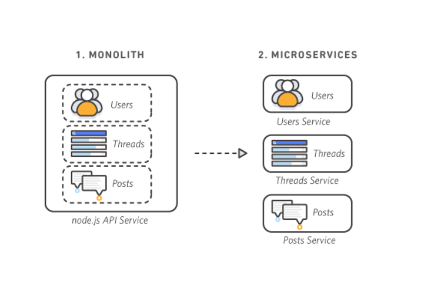

# Mục Lục 

- [Mục Lục](#mục-lục)
- [Tìm hiểu các khái niệm về Container \& Microservice](#tìm-hiểu-các-khái-niệm-về-container--microservice)
  - [I. Container](#i-container)
    - [1.0 Container Images](#10-container-images)
    - [1.1 Container Runtime](#11-container-runtime)
  - [II. Microservice](#ii-microservice)
    - [2.0 So sánh mô hình Monolith vs Microservice](#20-so-sánh-mô-hình-monolith-vs-microservice)
- [Tài liệu tham khảo](#tài-liệu-tham-khảo)

# Tìm hiểu các khái niệm về Container & Microservice 

## I. Container 

Công nghệ dùng để đóng gói một ứng dụng cùng với các thành phần phụ thuộc (runtime dependencies) cần thiết để chạy ứng dụng đó.

Container giúp tách biệt ứng dụng khỏi hạ tầng máy chủ bên dưới (host infra). Điều này làm cho việc triển khai trở nên dễ dàng hơn trên nhiều môi trường cloud hoặc hệ điều hành khác nhau 

Mỗi Node trong cụm Kubernetes sẽ chạy các container tạo nên những Pod được gán cho node đó. Các container trong cùng 1 Pod sẽ được đặt cùng vị trí và được lập lịch chạy cùng nhau trên cùng 1 node 

### 1.0 Container Images 

Một container image là một gói phần mềm sẵn sàng để chạy, chứa mọi thứ cần thiết cho 1 ứng dụng: 

- Mã nguồn (code)
- Môi trường thực thi (runtime)
- Các thư viện của ứng dụng và hệ thống
- Các giá trị cấu hình mặc định cần thiết

Container được thiết kế để không lưu trạng thái (stateless) và bất biến (immutable). Điều này có nghĩa là không nên chỉnh sửa mã nguồn của một container đang chạy.

Nếu muốn thay đổi một ứng dụng đã được container hóa, quy trình đúng là:

1. build 1 image mới chứa các thay đổi 

2. Tạo lại container từ image mới đó 

3. Khởi động container mới chạy thay container cũ 

### 1.1 Container Runtime

Container Runtime là một thành phần cốt lõi giúp Kubernetes có thể chạy container 1 cách hiệu quả. 

Nó chịu trách nhiệm quản lý: 

- Việc thực thi container 
- lifecycle của container 
- Khởi tạo, dừng, xóa containner 
- Quản lý tài nguyên mà container sử dụng 

Kubernetes hỗ trợ nhiều container runtime như: 

- containerd
- CRI-O

Thông thường, ta có thể để cluster tự chọn container runtime mặc định cho Pod 

Nếu cần sử dụng nhiều loại runtime khác nhau trong cùng một cluster, bạn có thể chỉ định một `RuntimeClass`cho Pod để Kubernetes biết phải chạy container bằng runtime nào 

## II. Microservice 

### 2.0 So sánh mô hình Monolith vs Microservice 

Kiến trúc nguyên khối là kiến trúc kết nối tất cả các đơn vị nghiệp vụ khác nhau của toàn bộ ứng dụng thành 1 khối duy nhất chia sẻ cùng 1 database. 

Hay nói cách khác: Toàn bộ ứng dụng nằm trong một project. Deploy 1 lần là deploy cả hệ thống và việc mở rộng từng nghiệp vụ là vô cùng khó khăn 

kiến trúc Microservice chia nhỏ ứng dụng thành nhiều dịch vụ độc lập để dễ quản lý và mở rộng. Mỗi dịch vụ chỉ đảm nhiệm một chức năng chuyên biệt và có thể được phát triển, kiểm thử, triển khai hoặc nâng cấp độc lập mà không làm gián đoạn toàn bộ hệ thống

Hay nói cách khác: Mỗi chức năng là 1 service riêng, mỗi service có source code riêng, container riêng và có thể deploy độc lập 

# Tài liệu tham khảo 

[REFERENCE 1](https://kubernetes.io/docs/concepts/containers/)

[REFERENCE 2](https://viettelidc.com.vn/tin-tuc/microservice-la-gi)

[REFERENCE 3](https://aws.amazon.com/microservices/)