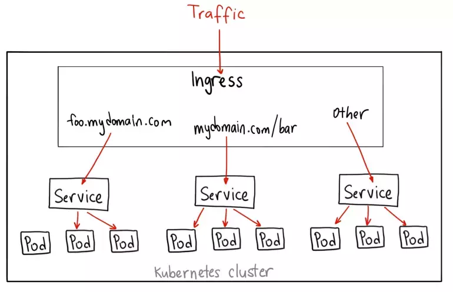
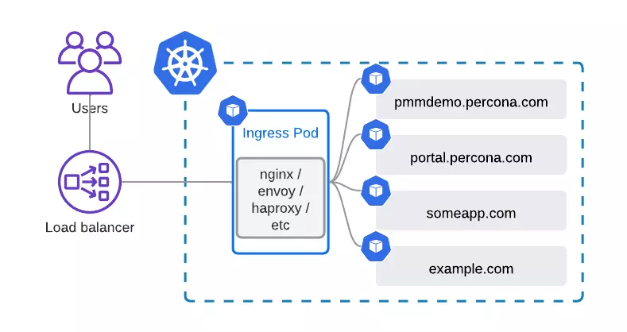

# Kubernetes Ingress

## I. Kubernetes Ingress là gì ? 

Ingress mở và phân luồng các kết nối HTTP và HTTPs từ bên ngoài k8s cluster vào các services bên trong cluster. Việc phân luồng dữ liệu này được quản lý bởi các "rule" được định nghĩa ở các tài nguyên Ingress trên k8s. Việc thực thi phân luồng dữ liệu được thực hiện bởi Ingress Controller, là 1 opensource cài đặt trên k8s. Nhiệm vụ của Ingress Controller là nạp các thông tin của các Ingress Resource để thực hiện phân luồng.



## II. Tại sao cần dùng Kubernetes Ingress ?

Ta đã biết về 3 loại service type trong k8s là: ClusterIP, Load Balancer và NodePort. Trong đó để expose ứng dụng ra bên ngoài thì chỉ có NodePort và LoadBalancer 

Sử dụng NodePort có 1 số hạn chế: 
- Service được expose hoàn toàn ra bên ngoài 
- Phải sử dụng qua port NodePort 
- Số lượng Port sử dụng cho NodePort hạn chế (30000-32767) 

Và Kubernetes Ingress sẽ giúp giải quyết vấn đề nêu trên:
- Các service ứng dụng sẽ được expose dưới dạng ClusterIP và sau đó được expose ra bên ngoài qua Ingress => Người dùng chỉ thực sự kết nối tới Ingress Controller
- Có thể dùng thêm external LoadBalancer bên ngoài để trỏ tới Ingress Controller => Có thể sử dụng port http/https để kết nối tới domain tương ứng của service thay vì phải chỉ định thêm NodePort
- Không bị hạn chế bởi số lượng Port mà NodePort có thể cung cấp.

## III. Cơ chế hoạt động của Ingress 
Cơ chế hoạt động của Ingress gồm 2 thành phần chính: 
- `Ingress Controller`: là thành phần điều khiển chính làm nhiệm vụ điều hướng các request tới các service bên trong k8s. Thường thì Ingress Controller được cài đặt trên k8s và được expose ra ngoài dưới dạng NodePort 
- `Ingress Rule`: Là 1 resource trên k8s. Nó chứa nội dung khai báo rule để điều hướng từ 1 request tới 1 service cụ thể trên k8s 

**NOTE:** Có nhiều Ingress Controller từ các nhà phát triển có thể lựa chọn để cài đặt. Ngoài ra trên k8s cũng hỗ trợ cài đặt nhiều Ingress Controller tùy nhu cầu sử dụng. 

## IV. Cấu trúc của Ingress Resource 

Ingress là 1 tài nguyên ở mức Namespace trên K8s và giống như các tài nguyên khác như Pod, Deployment hay Service, ta có thể định nghĩa nó bằng cách sử dụng file manifest dạng yaml. 

Ví dụ: 

```yaml
apiVersion: networking.k8s.io/v1
kind: Ingress
metadata:
  name: minimal-ingress
  annotations:
    nginx.ingress.kubernetes.io/rewrite-target: /
spec:
  ingressClassName: nginx-example
  rules:
  - http:
      paths:
      - path: /testpath
        pathType: Prefix
        backend:
          service:
            name: test
            port:
              number: 80
```

- Mọi request tới mà có Path chứa Prefix là `/testpath` thì sẽ được forward tới service test ở port 80 

### 4.0 Ingress Rules

Mỗi HTTP rule sẽ bao gồm các thông tin sau: 
- Thông tin host (không bắt buộc). Nếu có khai báo host cụ thể, rule sẽ chỉ apply cho host đó. Nếu host không được khai báo, thì rule được áp dụng cho mọi http đến.
- Danh sách `paths`, mỗi path sẽ có thông tin pathType và 1 backend(service) tương ứng với port của nó 
- 1 Backend là 1 bộ gồm service vs port. HTTP(HTTPs) request mà thỏa mãn điều kiện về host và path sẽ được chuyển tới backend đã khai báo

### 4.1 Path types 

Mỗi cấu hình `path` trong ingress đều yêu cầu phải có `path type` tương ứng. Có 3 loại Path type đang được k8s support gồm: 
- ImplementationSpecific: Để Ingress Controller tự quyết định cách match.
- Exact: Khớp chính xác 100%
- Prefix: Khớp theo tiền tố


### 4.2 Ví dụ về một kiến trúc triển khai sử dụng Ingress và LoadBalancer 

Thông thường để expose các service của dịch vụ HTTP/HTTPs qua Ingress, người ta sử dụng thêm 1 External LB bên ngoài. LB này sẽ làm nhiệm vụ forward request HTTP/HTTPS từ client tới NodePort của Ingress Controller

Lúc này Ingress Controller sẽ phân tích domain của request và các Ingress Rule mà nó đang quản lý để forward request tới service tương ứng trên k8s.



# Tài liệu tham khảo 

[REFERENCE 1](https://viblo.asia/p/k8s-basic-kubernetes-ingress-pgjLNb39L32)