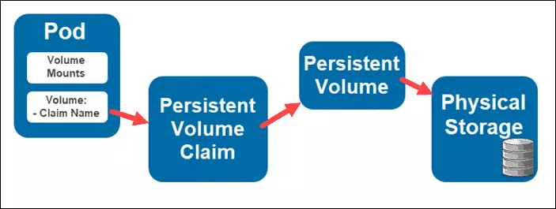

# Mục lục 

- [Mục lục](#mục-lục)
- [Persistent Storage](#persistent-storage)
  - [I. Persistent Volumes](#i-persistent-volumes)
  - [II. Persistent Volume Claim](#ii-persistent-volume-claim)
  - [III. Storage Classes](#iii-storage-classes)
- [Tài liệu tham khảo](#tài-liệu-tham-khảo)


# Persistent Storage

Kubernetes Persistent Storage cung cấp cho các ứng dụng triển khai trên k8s 1 cách thuận tiện để yêu cầu và sử dụng tài nguyên lưu trữ. Persistent Storage là điều cần thiết với các ứng dụng quan trọng cần lưu trữ ổn định, bền bỉ vượt xa pod hoặc thậm chí là node mà pod đang chạy.

Để tạo và sử dụng Persistent Storage, k8s cung cấp cho ta 2 loại API resource là PersistentVolume (PV) và PersistentVolumeClaim(PVC). 



## I. Persistent Volumes 

PersistentVolume (PV) là 1 phần không gian lưu trữ dữ liệu trong cụm được cấp phát bởi Admin k8s cluster hoặc được cấp phát linh hoạt. 

Nó là 1 loại resource của cụm, các PV này tồn tại hoàn toàn độc lập với bất kỳ Pod nào sử dụng PV. 

## II. Persistent Volume Claim 

Một người dùng muốn sử dụng PV thì cần tạo 1 PersistentVolumeClaim(PVC). Nó chính là 1 yêu cầu sử dụng PV. Thông thường, người dùng sẽ tạo 1 manifest PVC chỉ định số lượng, loại lớp lưu trữ (storage class), yêu cầu các mức tài nguyên CPU, bố nhớ, ... 

Ngoài ra, PVC còn có thể xác định các chế độ quyền truy cập cụ thể vào vùng lưu trữ (ví dụ như: ReadWriteOnce, ReadOnlyMany or ReadWriteMany). Kubernetes sau đó sẽ dựa vào các thông tin này để tìm và dự trữ dung lượng lưu trữ cần thiết.

- `ReadWriteOnce (RWO)`: Volume có thể được mount bởi 1 node. Và Volume này có thể được truy cập bởi nhiều Pod với điều kiện các Pod này cùng chạy trên node đó 
- `ReadOnlyMany(ROX)`: Volume có thể được mount dưới dạng ReadOnly bởi nhiều node 
- `ReadWriteMany(RWX)`: Volume có thể được mount dưới dạng Read-Write bởi nhiều node 
- `ReadWriteOncePod(RWOP)`: Volume có thể được mount dưới dạng Read-Write bởi 1 Pod duy nhất 

Ta có thể hình dung mối quan hệ giữa PV vs PVC giống như Node vs Pod. Nếu như Pod tiêu thụ tài nguyên của Node thì ở đây, PVC sẽ tiêu thụ tài nguyên của PV 

Các bước cần để triển khai Pod sử dụng PV: 

- Khởi tạo 1 persistent volume. PV có thể là nfs, ceph, ... 
- Tạo 1 manifest PVC và thực hiện ràng buộc với PV được tạo trước đó. Nó chỉ định dung lượng lưu trữ và kiểu lưu trữ cần thiết.
- Sau đó người dùng tạo Pod với volume sử dụng PVC

## III. Storage Classes 

Storage Class là 1 tài nguyên của Cluster, tương ứng với Node hay PV. Một Storage Class gồm 3 thành phần chính: `provisioner`, `parameter` và `reclaimPolicy` và được sử dụng khi 1 PVC nào đó cần được tạo động 1 PV. 

Tên của storage class là thông tin quan trọng để người dùng yêu cầu một "hạng" lưu trữ trên hệ thống. Người quản trị có thể cấu hình tên và các tham số của Storage Class khi tạo, và không thể thay đổi sau khi tạo xong.

Ví dụ: 

- `nfs-storageclass`: sử dụng nfs làm storage system và tạo các volume trên đó 

    ```yaml
    apiVersion: storage.k8s.io/v1
    kind: StorageClass
    metadata:
        name: example-nfs
    provisioner: example.com/external-nfs
    parameters:
        server: nfs-server.example.com
        path: /share
        readOnly: "false"
    ```

# Tài liệu tham khảo 

[REFERENCE 1](https://viblo.asia/p/kubernetes-storage-hoc-cach-su-dung-persistent-volume-pv-va-persistent-volume-claim-pvc-Qpmleyynlrd)
