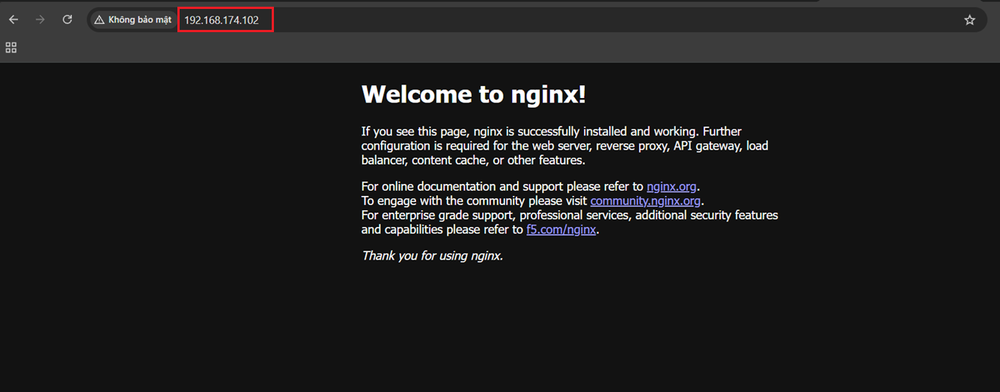
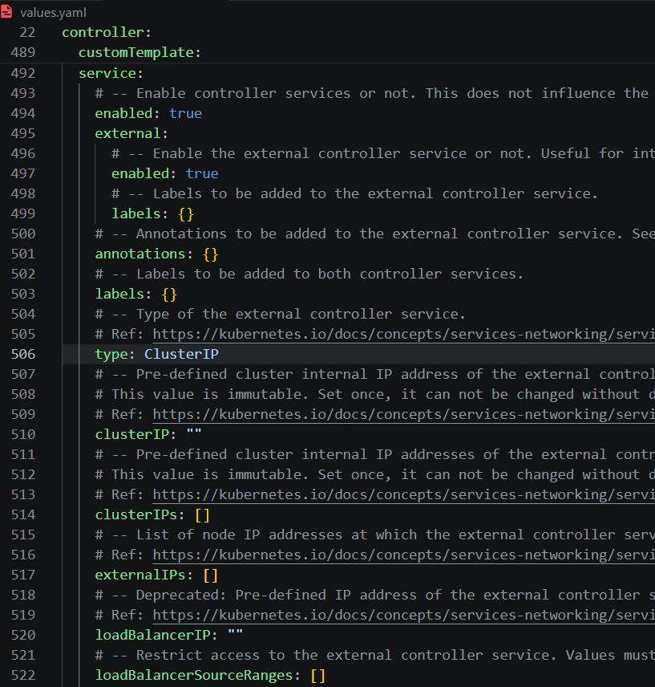
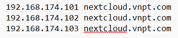
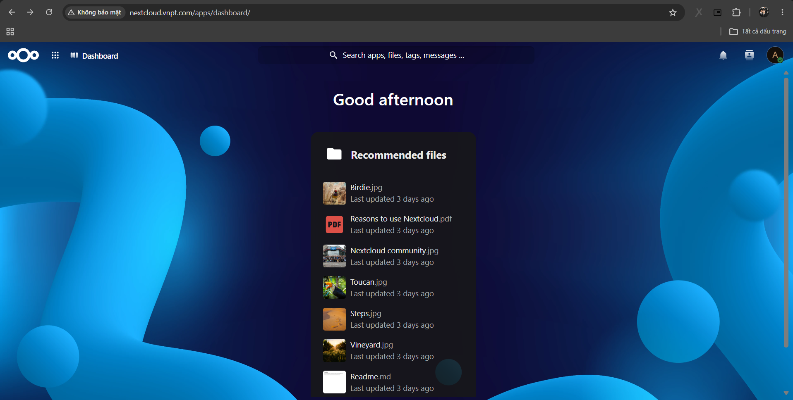

# Host network trong K8s 

## I. host network là gì ? 

`hostNetwork` trong Kubernetes là cơ chế cho phép Pod sử dụng trực tiếp network namespace của Node, thay vì được cấp một network namespace riêng như mặc định 

Nói cách khác: 

- Mặc định: Mỗi Pod có 1 IP riêng 
- hostNetwork: true: Pod không có IP riêng, mà dùng luôn IP của Node 

### 1.0 Ví dụ về cách cấu hình Pod sử dụng hostNetwork 

nginx-deployment: 

```yaml 
apiVersion: apps/v1
kind: Deployment 
metadata: 
  name: nginx-deployment
  namespace: nginx-hostnetwork
spec: 
  replicas: 1
  selector: 
    matchLabels: 
      app: nginx 
  template: 
    metadata: 
      labels: 
        app: nginx
    spec: 
      hostNetwork: true
      containers: 
        - name: nginx 
          image: nginx
          ports: 
            - containerPort: 80 
```

Apply: 

```bash
kubectl apply -f nginx-hostNetwork-deployment.yaml
```

Kiểm tra: 

```bash
devops@lab-k8s-master-01:~/project/testHostNetwork$ kubectl get po -n nginx-hostnetwork -o wide
NAME                                READY   STATUS    RESTARTS   AGE   IP                NODE                NOMINATED NODE   READINESS GATES
nginx-deployment-7b49b57ff8-2xw44   1/1     Running   0          62s   192.168.174.102   lab-k8s-master-02   <none>           <none>
```

- IP của Pod lúc này là IP của Node `lab-k8s-master-02`: 192.168.174.102

Port container chạy cũng là Port của Node, ở file manifest deployment ở bên trên ta thấy container ta chỉ định chạy trên port 80, bây giờ ta sẽ thử truy cập vào Port 80 của Node 



- Lưu ý: Không thể có 2 Pod dùng chung 1 Port trên 1 Node 

## II. Lab sử dụng Ingress Controller với hostNetwork 

Tham khảo bài lab [deploy NextCloud vs mariaDB](https://github.com/Bimmie226/ghichep-Kubernetes/tree/master/Project/NextCloud) lên cụm K8s sử dụng [Nginx Ingress](https://github.com/Bimmie226/ghichep-Kubernetes/blob/master/Deploy_Application_on_K8s/06.Ingress_Kubernetes.md#install-ingress-nginx) 

Tổng quan về bài lab trên: 
- Service Nginx Ingress Controller được install trên cụm bằng Helm và sử dụng service là NodePort. Trong bài lab này ta sẽ thay đổi service thành ClusterIP và cấu hình cho Pod Nginx-Ingress-Controller sử dụng network của host 

Vì bên trên ta đã chạy 1 Pod nginx sử dụng port 80 nên giờ ta sẽ phải xóa Pod đó: 

```bash
kubectl delete deployment nginx-deployment -n nginx-hostnetwork 
```

```bash
devops@lab-k8s-master-01:~$ kubectl delete deployment nginx-deployment -n nginx-hostnetwork
deployment.apps "nginx-deployment" deleted
```

Xem Service Ingress-nginx-controller cũng như Pod trong Service đó tại thời điểm hiện tại: 

- Service: 

```bash
devops@lab-k8s-master-01:~$ kubectl get svc -n ingress-nginx
NAME                                 TYPE        CLUSTER-IP       EXTERNAL-IP   PORT(S)                      AGE
ingress-nginx-controller             NodePort    10.98.249.133    <none>        80:30080/TCP,443:30443/TCP   2d21h
ingress-nginx-controller-admission   ClusterIP   10.103.201.223   <none>        443/TCP                      2d21h
devops@lab-k8s-master-01:~$ kubectl describe svc ingress-nginx-controller -n ingress-nginx
Name:                     ingress-nginx-controller
Namespace:                ingress-nginx
Labels:                   app.kubernetes.io/component=controller
                          app.kubernetes.io/instance=ingress-nginx
                          app.kubernetes.io/managed-by=Helm
                          app.kubernetes.io/name=ingress-nginx
                          app.kubernetes.io/part-of=ingress-nginx
                          app.kubernetes.io/version=1.15.1
                          helm.sh/chart=ingress-nginx-4.15.1
Annotations:              field.cattle.io/publicEndpoints:
                            [{"port":30080,"protocol":"TCP","serviceName":"ingress-nginx:ingress-nginx-controller","allNodes":true},{"port":30443,"protocol":"TCP","se...
                          meta.helm.sh/release-name: ingress-nginx
                          meta.helm.sh/release-namespace: ingress-nginx
Selector:                 app.kubernetes.io/component=controller,app.kubernetes.io/instance=ingress-nginx,app.kubernetes.io/name=ingress-nginx
Type:                     NodePort
IP Family Policy:         SingleStack
IP Families:              IPv4
IP:                       10.98.249.133
IPs:                      10.98.249.133
Port:                     http  80/TCP
TargetPort:               http/TCP
NodePort:                 http  30080/TCP
Endpoints:                172.16.108.186:80
Port:                     https  443/TCP
TargetPort:               https/TCP
NodePort:                 https  30443/TCP
Endpoints:                172.16.108.186:443
Session Affinity:         None
External Traffic Policy:  Cluster
Events:                   <none>
```

- Pod: 

```bash
devops@lab-k8s-master-01:~$ kubectl get po -n ingress-nginx -o wide
NAME                                       READY   STATUS    RESTARTS      AGE     IP               NODE                NOMINATED NODE   READINESS GATES
ingress-nginx-controller-d6f5f6d89-4h284   1/1     Running   2 (23m ago)   2d21h   172.16.108.186   lab-k8s-master-01   <none>           <none>
devops@lab-k8s-master-01:~$ kubectl describe po ingress-nginx-controller-d6f5f6d89-4h284 -n ingress-nginx
Name:             ingress-nginx-controller-d6f5f6d89-4h284
Namespace:        ingress-nginx
Priority:         0
Service Account:  ingress-nginx
Node:             lab-k8s-master-01/192.168.174.101
Start Time:       Fri, 26 Jun 2026 09:47:03 +0000
Labels:           app.kubernetes.io/component=controller
                  app.kubernetes.io/instance=ingress-nginx
                  app.kubernetes.io/managed-by=Helm
                  app.kubernetes.io/name=ingress-nginx
                  app.kubernetes.io/part-of=ingress-nginx
                  app.kubernetes.io/version=1.15.1
                  helm.sh/chart=ingress-nginx-4.15.1
                  pod-template-hash=d6f5f6d89
Annotations:      cni.projectcalico.org/containerID: c96ca2876498ddd69a85ba44163900783a1678885737b6a4a2f0b80d50e0331e
                  cni.projectcalico.org/podIP: 172.16.108.186/32
                  cni.projectcalico.org/podIPs: 172.16.108.186/32
Status:           Running
IP:               172.16.108.186
IPs:
  IP:           172.16.108.186
Controlled By:  ReplicaSet/ingress-nginx-controller-d6f5f6d89
Containers:
  controller:
    Container ID:    containerd://cafdc38b30422d87b2fd39aa7245ad718dc2c89f48b03a763193a9af553604e1
    Image:           registry.k8s.io/ingress-nginx/controller:v1.15.1@sha256:594ceea76b01c592858f803f9ff4d2cb40542cae2060410b2c95f75907d659e1
    Image ID:        registry.k8s.io/ingress-nginx/controller@sha256:594ceea76b01c592858f803f9ff4d2cb40542cae2060410b2c95f75907d659e1
    Ports:           80/TCP, 443/TCP, 8443/TCP
    Host Ports:      0/TCP, 0/TCP, 0/TCP
    SeccompProfile:  RuntimeDefault
    Args:
      /nginx-ingress-controller
      --publish-service=$(POD_NAMESPACE)/ingress-nginx-controller
      --election-id=ingress-nginx-leader
      --controller-class=k8s.io/ingress-nginx
      --ingress-class=nginx
      --configmap=$(POD_NAMESPACE)/ingress-nginx-controller
      --validating-webhook=:8443
      --validating-webhook-certificate=/usr/local/certificates/cert
      --validating-webhook-key=/usr/local/certificates/key
    State:          Running
      Started:      Mon, 29 Jun 2026 06:46:28 +0000
    Last State:     Terminated
      Reason:       Unknown
      Exit Code:    255
      Started:      Sun, 28 Jun 2026 09:24:21 +0000
      Finished:     Mon, 29 Jun 2026 06:45:34 +0000
    Ready:          True
    Restart Count:  2
    Requests:
      cpu:      100m
      memory:   90Mi
    Liveness:   http-get http://:10254/healthz delay=10s timeout=1s period=10s #success=1 #failure=5
    Readiness:  http-get http://:10254/healthz delay=10s timeout=1s period=10s #success=1 #failure=3
    Environment:
      POD_NAME:       ingress-nginx-controller-d6f5f6d89-4h284 (v1:metadata.name)
      POD_NAMESPACE:  ingress-nginx (v1:metadata.namespace)
      LD_PRELOAD:     /usr/local/lib/libmimalloc.so
    Mounts:
      /usr/local/certificates/ from webhook-cert (ro)
      /var/run/secrets/kubernetes.io/serviceaccount from kube-api-access-l2rgh (ro)
Conditions:
  Type                        Status
  PodReadyToStartContainers   True
  Initialized                 True
  Ready                       True
  ContainersReady             True
  PodScheduled                True
Volumes:
  webhook-cert:
    Type:        Secret (a volume populated by a Secret)
    SecretName:  ingress-nginx-admission
    Optional:    false
  kube-api-access-l2rgh:
    Type:                    Projected (a volume that contains injected data from multiple sources)
    TokenExpirationSeconds:  3607
    ConfigMapName:           kube-root-ca.crt
    ConfigMapOptional:       <nil>
    DownwardAPI:             true
QoS Class:                   Burstable
Node-Selectors:              kubernetes.io/os=linux
Tolerations:                 node.kubernetes.io/not-ready:NoExecute op=Exists for 300s
                             node.kubernetes.io/unreachable:NoExecute op=Exists for 300s
Events:
  Type    Reason          Age                From                      Message
  ----    ------          ----               ----                      -------
  Normal  SandboxChanged  23m (x2 over 23m)  kubelet                   Pod sandbox changed, it will be killed and re-created.
  Normal  Pulled          23m                kubelet                   Container image "registry.k8s.io/ingress-nginx/controller:v1.15.1@sha256:594ceea76b01c592858f803f9ff4d2cb40542cae2060410b2c95f75907d659e1" already present on machine
  Normal  Created         23m                kubelet                   Created container: controller
  Normal  Started         23m                kubelet                   Started container controller
  Normal  RELOAD          23m                nginx-ingress-controller  NGINX reload triggered due to a change in configuration
```

Ta thấy: Service của ingress-nginx-controller đang là NodePort và Pod trong service đó đang được cấp 1 IP mặc định (không phải IP của Node: lab-k8s-master-01) 


### 2.0 Bước 1:

Ta sẽ cấu hình lại để Service ingress-nginx-controller là ClusterIP và expose Pod ingress-nginx-controller ra ngoài bằng cách sử dụng hostnetwork 

Sửa file values.yaml của chart ingress-nginx:



- Type mặc định của service có thể là LoadBalancer hoặc NodePort, hãy đổi lại là ClusterIP như hình trên 

### 2.1 Bước 2: 

Enable Hostnetwork và thêm dnsPolicy 

- Sửa `hostnetwork: false` thành `hostnetwork: true`
- Sửa `dnsPolicy: ClusterFirst` thành `dnsPolicy: ClusterFirstWithHostNet` -> để Pod vẫn sử dụng DNS của cụm K8s 

### 2.2 Bước 3: 

Không publish service nữa 

- Sửa `publishService: enable: true` thành `publishService: enable: false`

### 2.3 Bước 4: 

Nếu bạn đang sử dụng deployment hãy chú ý để replicas là 1 hoặc đổi kind từ deployment thành DaemonSet 

### 2.4 Bước 5: 

Upgrade: 

```bash
helm upgrade ingress-nginx . -n ingress-nginx -f values-hostnet.yaml
```

```bash
devops@lab-k8s-master-01:~/ingress-nginx$ helm upgrade ingress-nginx . -n ingress-nginx -f values-hostnet.yaml
Release "ingress-nginx" has been upgraded. Happy Helming!
NAME: ingress-nginx
LAST DEPLOYED: Mon Jun 29 07:39:24 2026
NAMESPACE: ingress-nginx
STATUS: deployed
REVISION: 2
TEST SUITE: None
NOTES:
The ingress-nginx controller has been installed.
Get the application URL by running these commands:
  export POD_NAME="$(kubectl get pods --namespace ingress-nginx --selector app.kubernetes.io/name=ingress-nginx,app.kubernetes.io/instance=ingress-nginx,app.kubernetes.io/component=controller --output jsonpath="{.items[0].metadata.name}")"
  kubectl port-forward --namespace ingress-nginx "${POD_NAME}" 8080:80
  echo "Visit http://127.0.0.1:8080 to access your application."

An example Ingress that makes use of the controller:
  apiVersion: networking.k8s.io/v1
  kind: Ingress
  metadata:
    name: example
    namespace: foo
  spec:
    ingressClassName: nginx
    rules:
      - host: www.example.com
        http:
          paths:
            - pathType: Prefix
              backend:
                service:
                  name: exampleService
                  port:
                    number: 80
              path: /
    # This section is only required if TLS is to be enabled for the Ingress
    tls:
      - hosts:
        - www.example.com
        secretName: example-tls

If TLS is enabled for the Ingress, a Secret containing the certificate and key must also be provided:

  apiVersion: v1
  kind: Secret
  metadata:
    name: example-tls
    namespace: foo
  data:
    tls.crt: <base64 encoded cert>
    tls.key: <base64 encoded key>
  type: kubernetes.io/tls
```

Kiểm tra lại service vs Pod: 

```bash
devops@lab-k8s-master-01:~/ingress-nginx$ kubectl get svc -n ingress-nginx
NAME                                 TYPE        CLUSTER-IP       EXTERNAL-IP   PORT(S)          AGE
ingress-nginx-controller             ClusterIP   10.98.249.133    <none>        80/TCP,443/TCP   2d21h
ingress-nginx-controller-admission   ClusterIP   10.103.201.223   <none>        443/TCP          2d21h

devops@lab-k8s-master-01:~/ingress-nginx$ kubectl describe svc ingress-nginx-controller
Error from server (NotFound): services "ingress-nginx-controller" not found
devops@lab-k8s-master-01:~/ingress-nginx$ kubectl describe svc ingress-nginx-controller -n ingress-nginx
Name:              ingress-nginx-controller
Namespace:         ingress-nginx
Labels:            app.kubernetes.io/component=controller
                   app.kubernetes.io/instance=ingress-nginx
                   app.kubernetes.io/managed-by=Helm
                   app.kubernetes.io/name=ingress-nginx
                   app.kubernetes.io/part-of=ingress-nginx
                   app.kubernetes.io/version=1.15.1
                   helm.sh/chart=ingress-nginx-4.15.1
Annotations:       field.cattle.io/publicEndpoints: null
                   meta.helm.sh/release-name: ingress-nginx
                   meta.helm.sh/release-namespace: ingress-nginx
Selector:          app.kubernetes.io/component=controller,app.kubernetes.io/instance=ingress-nginx,app.kubernetes.io/name=ingress-nginx
Type:              ClusterIP
IP Family Policy:  SingleStack
IP Families:       IPv4
IP:                10.98.249.133
IPs:               10.98.249.133
Port:              http  80/TCP
TargetPort:        http/TCP
Endpoints:         192.168.174.101:80,192.168.174.102:80,192.168.174.103:80
Port:              https  443/TCP
TargetPort:        https/TCP
Endpoints:         192.168.174.101:443,192.168.174.102:443,192.168.174.103:443
Session Affinity:  None
Events:            <none>
```

```bash
devops@lab-k8s-master-01:~/ingress-nginx$ kubectl get po -n ingress-nginx -o wide
NAME                             READY   STATUS    RESTARTS   AGE     IP                NODE                NOMINATED NODE   READINESS GATES
ingress-nginx-controller-8lxx5   1/1     Running   0          2m32s   192.168.174.103   lab-k8s-master-03   <none>           <none>
ingress-nginx-controller-p9fdr   1/1     Running   0          2m32s   192.168.174.101   lab-k8s-master-01   <none>           <none>
ingress-nginx-controller-rrwxp   1/1     Running   0          2m32s   192.168.174.102   lab-k8s-master-02   <none>           <none>
```

Ta truy cập thử từ browser: 

- Lưu ý: Ở bài lab [deploy NextCloud vs mariaDB](https://github.com/Bimmie226/ghichep-Kubernetes/tree/master/Project/NextCloud) ta đã tạo 1 Ingress rule là khi truy cập bằng domain `nextcloud.vnpt.com` do đó ta sẽ phải add host domain là `nextcloud.vnpt.com` và IP là IP của các Node ở đây là: `192.168.174.101, 192.168.174.102, 192.168.174.103`

  


- Truy cập browser: 

  

> Như vậy ta đã có thể expose Pod Ingress-nginx-controller ra bên ngoài mà không cần dùng Service Type NodePort 