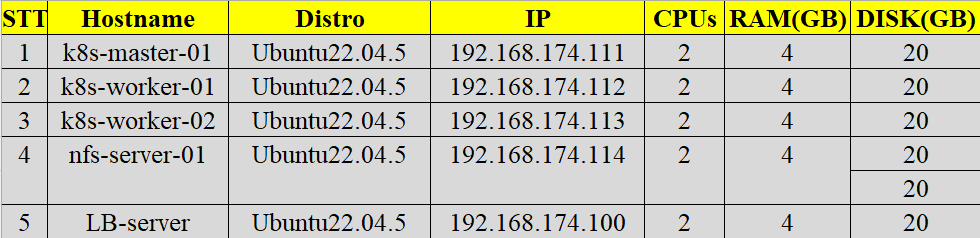
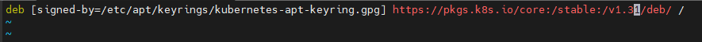

# Summary 

- [Summary](#summary)
- [Upgrade Kubernetes Version (kubeadm)](#upgrade-kubernetes-version-kubeadm)
  - [I. Tóm tắt các lưu ý cốt lõi](#i-tóm-tắt-các-lưu-ý-cốt-lõi)
  - [II. Bối cảnh bài lab](#ii-bối-cảnh-bài-lab)
  - [III. Quy trình tổng quan](#iii-quy-trình-tổng-quan)
  - [IV. Lưu ý về etcd khi upgrade Control Plane](#iv-lưu-ý-về-etcd-khi-upgrade-control-plane)
  - [V. Tiến hành thực hiện Upgrade](#v-tiến-hành-thực-hiện-upgrade)
    - [Bước 1 - Đổi Kubernetes Package Repository (nếu cần)](#bước-1---đổi-kubernetes-package-repository-nếu-cần)
    - [Bước 2 - Xác định phiên bản patch cần nâng cấp](#bước-2---xác-định-phiên-bản-patch-cần-nâng-cấp)
    - [Bước 3 - Nâng cấp Control Plane Node đầu tiên](#bước-3---nâng-cấp-control-plane-node-đầu-tiên)
    - [Bước 4 - Drain \& nâng cấp kubelet/kubectl trên node vừa upgrade](#bước-4---drain--nâng-cấp-kubeletkubectl-trên-node-vừa-upgrade)
    - [Bước 5 - Các Control Plane Node còn lại](#bước-5---các-control-plane-node-còn-lại)
    - [Bước 6 - Nâng cấp Worker Node](#bước-6---nâng-cấp-worker-node)
    - [Quan sát về downtime khi drain worker](#quan-sát-về-downtime-khi-drain-worker)
  - [VI. Kiểm tra lại version sau khi upgrade](#vi-kiểm-tra-lại-version-sau-khi-upgrade)
  - [VII. Lặp lại cho đến version mong muốn](#vii-lặp-lại-cho-đến-version-mong-muốn)
- [Tài liệu tham khảo](#tài-liệu-tham-khảo)


# Upgrade Kubernetes Version (kubeadm)

Kubernetes upgrade là quá trình cập nhật hệ thống Kubernetes lên phiên bản mới hơn. Đây là một tác vụ phức tạp, đòi hỏi phải được lập kế hoạch và thực hiện một cách cẩn thận. Quá trình nâng cấp có thể bao gồm việc cập nhật các thành phần như Kubernetes API Server, Controller Manager, Scheduler, Kubelet, Kube-Proxy, ...

Điều quan trọng là việc nâng cấp Kubernetes không chỉ đơn thuần là chuyển sang một phiên bản mới hơn. Mục tiêu của quá trình này là đảm bảo toàn bộ hệ thống vẫn tiếp tục hoạt động ổn định sau khi nâng cấp, không gây gián đoạn với các ứng dụng đang chạy. Do đó, cần cân bằng giữa việc tận dụng các tính năng mới, các bản vá bảo mật với yêu cầu duy trì tính ổn định và độ tin cậy của hệ thống

## I. Tóm tắt các lưu ý cốt lõi

> - **Backup trước khi làm bất cứ điều gì.** Không có gì đảm bảo upgrade luôn suôn sẻ.
> - **Không được bỏ qua minor version** khi upgrade (ví dụ không thể nhảy thẳng 1.30 → 1.32).
> - Nên nâng lên **patch version mới nhất** của minor đang dùng càng sớm càng tốt.
> - Thứ tự upgrade bắt buộc: **Primary Control Plane → các Control Plane còn lại → Worker Node**.
> - Chỉ cần đổi **package repository** khi nhảy sang **minor version mới**, không cần nếu chỉ lên patch trong cùng minor.
> - Nên chủ động dừng `kube-apiserver` vài giây trước khi upgrade để tránh request bị treo khi etcd restart (Chi tiết [tại mục IV](#iv-lưu-ý-về-etcd-khi-upgrade-control-plane)).

## II. Bối cảnh bài lab

Mô hình cụm hiện tại: 1 Control Plane node + 2 Worker node, đang chạy Kubernetes **v1.30.14**.

```bash
devops@k8s-master-01:~$ k get no
NAME            STATUS   ROLES           AGE     VERSION
k8s-master-01   Ready    control-plane   9m12s   v1.30.14
k8s-worker-01   Ready    <none>          8m48s   v1.30.14
k8s-worker-02   Ready    <none>          8m38s   v1.30.14
```

Mục tiêu: nâng cấp lên **v1.36**, thực hiện tuần tự từng minor version một (1.30 → 1.31 → ... → 1.36). Trong lúc upgrade, cụm có triển khai sẵn ứng dụng NextCloud (4 pod, MariaDB StatefulSet, Ingress qua Nginx) cùng `ingress-nginx` và `nfs-subdir-external-provisioner`, để tiện quan sát xem quá trình upgrade có gây downtime hay không, và vì sao.

**Chi tiết resource đang chạy trên cụm:**

```bash
devops@k8s-master-01:~$ kubectl get all -n nextcloud
NAME                                        READY   STATUS    RESTARTS   AGE
pod/mariadb-statefulset-0                   1/1     Running   0          9m29s
pod/nextcloud-deployment-58c6fd6bbc-9tdrd   1/1     Running   0          6m11s
pod/nextcloud-deployment-58c6fd6bbc-pdgzd   1/1     Running   0          6m11s
pod/nextcloud-deployment-58c6fd6bbc-tfrhh   1/1     Running   0          6m11s
pod/nextcloud-deployment-58c6fd6bbc-w5tt4   1/1     Running   0          6m11s

NAME                        TYPE        CLUSTER-IP      EXTERNAL-IP   PORT(S)    AGE
service/mariadb-service     ClusterIP   10.96.177.194   <none>        3306/TCP   9m29s
service/nextcloud-service   ClusterIP   10.105.41.38    <none>        80/TCP     6m11s

NAME                                   READY   UP-TO-DATE   AVAILABLE   AGE
deployment.apps/nextcloud-deployment   4/4     4            4           6m11s

NAME                                              DESIRED   CURRENT   READY   AGE
replicaset.apps/nextcloud-deployment-58c6fd6bbc   4         4         4       6m11s

NAME                                   READY   AGE
statefulset.apps/mariadb-statefulset   1/1     9m29s

devops@k8s-master-01:~$ kubectl get ingress -n nextcloud
NAME                CLASS   HOSTS                ADDRESS          PORTS   AGE
nextcloud-ingress   nginx   nextcloud.vnpt.com   10.110.213.234   80      6m25s
```

`ingress-nginx` (expose bằng NodePort, đứng sau 1 LB server ngoài) và `nfs-provisioner`:

```bash
devops@k8s-master-01:~$ kubectl get all -n ingress-nginx
NAME                                           READY   STATUS    RESTARTS   AGE
pod/ingress-nginx-controller-d6f5f6d89-rc5sq   1/1     Running   0          37m

NAME                                         TYPE        CLUSTER-IP       EXTERNAL-IP   PORT(S)                      AGE
service/ingress-nginx-controller             NodePort    10.110.213.234   <none>        80:30080/TCP,443:30443/TCP   37m
service/ingress-nginx-controller-admission   ClusterIP   10.100.1.144     <none>        443/TCP                      37m
```

```bash
devops@k8s-master-01:~$ kubectl get all -n nfs-provisioner
NAME                                                   READY   STATUS    RESTARTS   AGE
pod/nfs-subdir-external-provisioner-79d57b87bd-xrnpd   1/1     Running   0          11m
```

Phân hoạch địa chỉ IP



</details>

## III. Quy trình tổng quan

Ở mức tổng quan, nâng cấp một cụm K8s bằng kubeadm gồm 3 bước lớn:

1. Nâng cấp **Primary Control Plane Node**
2. Nâng cấp các **Control Plane Node còn lại**
3. Nâng cấp các **Worker Node**

## IV. Lưu ý về etcd khi upgrade Control Plane

`kube-apiserver` chạy dưới dạng Static Pod nên luôn hoạt động, kể cả sau khi node đã bị drain. Nếu bước `kubeadm upgrade` có nâng cấp cả etcd, thì trong lúc Static Pod của etcd restart, mọi request gửi đến `kube-apiserver` sẽ bị tạm treo cho đến khi etcd sống lại.

Để giảm thiểu ảnh hưởng, Kubernetes khuyến nghị chủ động dừng `kube-apiserver` an toàn vài giây trước khi chạy `kubeadm upgrade apply`, thực hiện trên từng Control Plane Node:

```bash
killall -s SIGTERM kube-apiserver   # Graceful shutdown kube-apiserver
sleep 20                            # Chờ các request hiện tại hoàn thành
kubeadm upgrade ...                 # Thực hiện lệnh nâng cấp
```

## V. Tiến hành thực hiện Upgrade 

### Bước 1 - Đổi Kubernetes Package Repository (nếu cần)

**Chỉ cần thực hiện khi nhảy sang minor version khác** (vd: v1.31 → v1.32). Nếu chỉ lên patch trong cùng minor (vd: v1.32.5 → v1.32.7) thì **bỏ qua bước này**.

Lưu ý: các repo cũ `apt.kubernetes.io` / `yum.kubernetes.io` đã ngừng phát triển từ 13/09/2023. Từ mốc đó trở đi, K8s yêu cầu dùng repo mới tại `pkgs.k8s.io`.

**1.1 Kiểm tra repo đang dùng:**

```bash
pager /etc/apt/sources.list.d/kubernetes.list
```

Nếu kết quả có dạng sau thì hệ thống đã dùng repo mới:

```bash
devops@k8s-master-01:~$ pager /etc/apt/sources.list.d/kubernetes.list
deb [signed-by=/etc/apt/keyrings/kubernetes-apt-keyring.gpg] https://pkgs.k8s.io/core:/stable:/v1.30/deb/ /
```

**1.2 Chuyển sang repo của minor version mới:**

```bash
vim /etc/apt/sources.list.d/kubernetes.list
```



Sửa lại version thành minor version bạn muốn nâng lên (ví dụ 1.30 → 1.31). **Không được bỏ qua minor nào.**

### Bước 2 - Xác định phiên bản patch cần nâng cấp

```bash
sudo apt update

sudo apt-cache madison kubeadm
```

```bash
devops@k8s-master-01:~$ sudo apt-cache madison kubeadm
   kubeadm | 1.31.14-1.1 | https://pkgs.k8s.io/core:/stable:/v1.31/deb  Packages
   kubeadm | 1.31.13-1.1 | https://pkgs.k8s.io/core:/stable:/v1.31/deb  Packages
   kubeadm | 1.31.12-1.1 | https://pkgs.k8s.io/core:/stable:/v1.31/deb  Packages
   kubeadm | 1.31.11-1.1 | https://pkgs.k8s.io/core:/stable:/v1.31/deb  Packages
   kubeadm | 1.31.10-1.1 | https://pkgs.k8s.io/core:/stable:/v1.31/deb  Packages
   kubeadm | 1.31.9-1.1 | https://pkgs.k8s.io/core:/stable:/v1.31/deb  Packages
   kubeadm | 1.31.8-1.1 | https://pkgs.k8s.io/core:/stable:/v1.31/deb  Packages
   kubeadm | 1.31.7-1.1 | https://pkgs.k8s.io/core:/stable:/v1.31/deb  Packages
   kubeadm | 1.31.6-1.1 | https://pkgs.k8s.io/core:/stable:/v1.31/deb  Packages
   kubeadm | 1.31.5-1.1 | https://pkgs.k8s.io/core:/stable:/v1.31/deb  Packages
   kubeadm | 1.31.4-1.1 | https://pkgs.k8s.io/core:/stable:/v1.31/deb  Packages
   kubeadm | 1.31.3-1.1 | https://pkgs.k8s.io/core:/stable:/v1.31/deb  Packages
   kubeadm | 1.31.2-1.1 | https://pkgs.k8s.io/core:/stable:/v1.31/deb  Packages
   kubeadm | 1.31.1-1.1 | https://pkgs.k8s.io/core:/stable:/v1.31/deb  Packages
   kubeadm | 1.31.0-1.1 | https://pkgs.k8s.io/core:/stable:/v1.31/deb  Packages
```

Nếu danh sách xuất hiện các bản 1.31 là repo đã đúng. Nếu không thấy version mong muốn, kiểm tra lại xem đã cấu hình đúng package repository ở Bước 1 chưa.

### Bước 3 - Nâng cấp Control Plane Node đầu tiên

Chọn 1 Control Plane Node để nâng cấp trước.

**3.1 Nâng cấp `kubeadm`:**

```bash
# Thay x bằng phiên bản patch mới nhất
sudo apt-mark unhold kubeadm && \
sudo apt-get update && sudo apt-get install -y kubeadm='1.31.x-*' && \
sudo apt-mark hold kubeadm
```

Kiểm tra lại: `kubeadm version`

```bash
devops@k8s-master-01:~$ kubeadm version
kubeadm version: &version.Info{Major:"1", Minor:"31", GitVersion:"v1.31.14", GitCommit:"5e00b99bac504844579ec74886b6cc5c9611ca19", GitTreeState:"clean", BuildDate:"2025-11-11T20:23:36Z", GoVersion:"go1.24.9", Compiler:"gc", Platform:"linux/amd64"}
```

- Ở đây tôi đã tải thành công kubeadm v1.31.14 

**3.2 Xem kế hoạch nâng cấp** 

```bash
sudo kubeadm upgrade plan 
```

Lệnh này sẽ: 

- Kiểm tra xem cụm K8s có đủ điều kiện để nâng cấp hay không 
- Xác định những phiên bản Kubernetes mà cụm có thể nâng cấp lên.
- Hiển thị bảng thông tin về trạng thái phiên bản của các Component Configuration trong cụm.

```bash
devops@k8s-master-01:~$ sudo kubeadm upgrade plan
[preflight] Running pre-flight checks.
[upgrade/config] Reading configuration from the cluster...
[upgrade/config] FYI: You can look at this config file with 'kubectl -n kube-system get cm kubeadm-config -o yaml'
[upgrade] Running cluster health checks
[upgrade] Fetching available versions to upgrade to
[upgrade/versions] Cluster version: 1.30.14
[upgrade/versions] kubeadm version: v1.31.14
I0713 01:54:24.753476    9158 version.go:261] remote version is much newer: v1.36.2; falling back to: stable-1.31
[upgrade/versions] Target version: v1.31.14
[upgrade/versions] Latest version in the v1.30 series: v1.30.14

Components that must be upgraded manually after you have upgraded the control plane with 'kubeadm upgrade apply':
COMPONENT   NODE            CURRENT    TARGET
kubelet     k8s-master-01   v1.30.14   v1.31.14
kubelet     k8s-worker-01   v1.30.14   v1.31.14
kubelet     k8s-worker-02   v1.30.14   v1.31.14

Upgrade to the latest stable version:

COMPONENT                 NODE            CURRENT    TARGET
kube-apiserver            k8s-master-01   v1.30.14   v1.31.14
kube-controller-manager   k8s-master-01   v1.30.14   v1.31.14
kube-scheduler            k8s-master-01   v1.30.14   v1.31.14
kube-proxy                                1.30.14    v1.31.14
CoreDNS                                   v1.11.3    v1.11.3
etcd                      k8s-master-01   3.5.15-0   3.5.24-0

You can now apply the upgrade by executing the following command:

        kubeadm upgrade apply v1.31.14

_____________________________________________________________________


The table below shows the current state of component configs as understood by this version of kubeadm.
Configs that have a "yes" mark in the "MANUAL UPGRADE REQUIRED" column require manual config upgrade or
resetting to kubeadm defaults before a successful upgrade can be performed. The version to manually
upgrade to is denoted in the "PREFERRED VERSION" column.

API GROUP                 CURRENT VERSION   PREFERRED VERSION   MANUAL UPGRADE REQUIRED
kubeproxy.config.k8s.io   v1alpha1          v1alpha1            no
kubelet.config.k8s.io     v1beta1           v1beta1             no
_____________________________________________________________________
```

- Output này cho thấy cụm K8s đã sẵn sàng để nâng cấp từ 1.30.14 lên 1.31.14 và không có cảnh báo nào ngăn việc upgrade

**3.3 Thực hiện upgrade:**

Chọn phiên bản Kubernetes mà bạn muốn nâng cấp, sau đó chạy lệnh tương ứng.

```bash
# Thay x bằng phiên bản Patch mà bạn đã chọn
sudo kubeadm upgrade apply v1.31.x
```

Sau khi lệnh hoàn tất, bạn sẽ thấy thông báo tương tự:

```bash
[upgrade/successful] SUCCESS! Your cluster was upgraded to "v1.31.14". Enjoy!

[upgrade/kubelet] Now that your control plane is upgraded, please proceed with upgrading your kubelets if you haven't already done so.
```

- Cụm K8s đã được nâng cấp thành công lên `v1.31.14`
- Bước tiếp theo là tiến hành nâng cấp kubelet trên các node nếu bạn chưa thực hiện 

**3.4 Nâng cấp CNI plugin:** 

- Hãy nâng cấp Container Network Interface (CNI) Provider Plugin theo hướng dẫn của nhà cung cấp.

- Mỗi CNI có thể có quy trình nâng cấp riêng.

- Nếu CNI của bạn được triển khai dưới dạng DaemonSet, thì không cần thực hiện bước này trên các Control Plane Node còn lại.

### Bước 4 - Drain & nâng cấp kubelet/kubectl trên node vừa upgrade

**4.1 Drain node:** Chuẩn bị node cho quá trình bảo trì bằng cách: 

- Đánh dấu node là Unschedulable 
- Di chuyển các workload đang chạy sang các node khác 

```bash
# Thay <node-to-drain> bằng tên node cần Drain
kubectl drain <node-to-drain> --ignore-daemonsets
```

**4.2 Nâng cấp `kubelet` và `kubectl`:**

```bash
# Thay x trong 1.31.x-* bằng phiên bản Patch mới nhất
sudo apt-mark unhold kubelet kubectl && \
sudo apt-get update && sudo apt-get install -y kubelet='1.31.x-*' kubectl='1.31.x-*' && \
sudo apt-mark hold kubelet kubectl
```

**4.3 Restart kubelet:**

Sau khi nâng cấp xong, khởi động lại dịch vụ kubelet: 

```bash
sudo systemctl daemon-reload
sudo systemctl restart kubelet
```

**4.4 Uncordon node** (đưa node trở lại trạng thái schedulable):

Sau khi hoàn tất việc nâng cấp và xác nhận node hoạt động bình thường, đưa node trở lại trạng thái có thể nhận Pod mới bằng cách Uncordon:

```bash
# Thay <node-to-uncordon> bằng tên node cần Uncordon
kubectl uncordon <node-to-uncordon>
```

- Node sẽ được đánh dấu là Schedulable, cho phép Kubernetes tiếp tục lập lịch (schedule) các Pod mới lên node này.


### Bước 5 - Các Control Plane Node còn lại

Quy trình gần giống với Control Plane Node đầu tiên.

Tuy nhiên, thay vì chạy:

```bash
sudo kubeadm upgrade apply
```
hãy sử dụng:

```bash
sudo kubeadm upgrade node
```
Ngoài ra:

- Không cần chạy lại: `sudo kubeadm upgrade plan`
  
- Không cần nâng cấp lại CNI Provider Plugin.

### Bước 6 - Nâng cấp Worker Node

Quy trình nâng cấp các Worker Node nên được thực hiện lần lượt từng node một, bạn cần đảm bảo rằng cụm K8s vẫn còn đủ năng lực để chạy các ứng dụng hiện có, tránh việc đưa quá nhiều Worker Node vào trạng thái bảo trì cùng lúc, dẫn đến thiếu tài nguyên hoặc làm gián đoạn dịch vụ 

Bạn nên hoàn tất việc nâng cấp các Control Plane Node trước, sau đó mới tiến hành nâng cấp các Worker Node

**6.1 Thay đổi Kubernetes Package Repository trên worker:** 

Cũng giống như khi upgrade các Control Plane Node ở Bước 1, ta cũng cần thay đổi Package Repo của K8s trên Node Worker về phiên bản mà mình muốn uggrade lên 

**6.2 Nâng cấp `kubeadm` trên worker:**

```bash
# Thay x trong 1.31.x-* bằng phiên bản Patch mới nhất
sudo apt-mark unhold kubeadm && \
sudo apt-get update && sudo apt-get install -y kubeadm='1.31.x-*' && \
sudo apt-mark hold kubeadm
```

**6.3 Cập nhật cấu hình cục bộ của kubelet:**

```bash
sudo kubeadm upgrade node
```

**6.4 Drain worker node:** 

Chuẩn bị Node trong quá trình bảo trì bằng cách: 

- Đánh dấu node là Unschedulable
- Di chuyển các workload đang chạy sang node khác 

**Lưu ý:** Lệnh này phải được thực hiện trên một Control Plane Node (Ở đây là `k8s-master-01`)

```bash
# Thực hiện lệnh này trên một Control Plane Node
# Thay <node-to-drain> bằng tên Worker Node cần Drain
kubectl drain <node-to-drain> --ignore-daemonsets
```

Sau khi drain `k8s-worker-01` và kiểm tra thì tôi thấy Ứng Dụng NextCloud vẫn không downtime, lý do là vì các Workload đã được chuyển sang `k8s-worker-02`

```bash
devops@k8s-master-01:~$ k get all -n nextcloud -o wide
NAME                                        READY   STATUS    RESTARTS      AGE   IP              NODE            NOMINATED NODE   READINESS GATES
pod/mariadb-statefulset-0                   1/1     Running   1 (57m ago)   10h   172.16.118.84   k8s-worker-02   <none>           <none>
pod/nextcloud-deployment-58c6fd6bbc-fgd27   1/1     Running   1 (58m ago)   10h   172.16.118.81   k8s-worker-02   <none>           <none>
pod/nextcloud-deployment-58c6fd6bbc-ghqbs   1/1     Running   0             31s   172.16.118.87   k8s-worker-02   <none>           <none>
pod/nextcloud-deployment-58c6fd6bbc-qc6jc   1/1     Running   1 (58m ago)   10h   172.16.118.83   k8s-worker-02   <none>           <none>
pod/nextcloud-deployment-58c6fd6bbc-vzg92   1/1     Running   1 (57m ago)   10h   172.16.118.85   k8s-worker-02   <none>           <none>

NAME                        TYPE        CLUSTER-IP      EXTERNAL-IP   PORT(S)    AGE   SELECTOR
service/mariadb-service     ClusterIP   10.98.236.33    <none>        3306/TCP   10h   app=mariadb
service/nextcloud-service   ClusterIP   10.108.177.90   <none>        80/TCP     10h   app=nextcloud

NAME                                   READY   UP-TO-DATE   AVAILABLE   AGE   CONTAINERS   IMAGES             SELECTOR
deployment.apps/nextcloud-deployment   4/4     4            4           10h   nextcloud    nextcloud:latest   app=nextcloud

NAME                                              DESIRED   CURRENT   READY   AGE   CONTAINERS   IMAGES             SELECTOR
replicaset.apps/nextcloud-deployment-58c6fd6bbc   4         4         4       10h   nextcloud    nextcloud:latest   app=nextcloud,pod-template-hash=58c6fd6bbc

NAME                                   READY   AGE   CONTAINERS   IMAGES
statefulset.apps/mariadb-statefulset   1/1     10h   mariadb      mariadb:11
```

**6.5 Nâng cấp `kubelet`/`kubectl`:**

```bash
# Thay x trong 1.31.x-* bằng phiên bản Patch mới nhất
sudo apt-mark unhold kubelet kubectl && \
sudo apt-get update && sudo apt-get install -y kubelet='1.31.x-*' kubectl='1.31.x-*' && \
sudo apt-mark hold kubelet kubectl
```

**6.6 Restart kubelet:**

```bash
sudo systemctl daemon-reload
sudo systemctl restart kubelet
```

**6.7 Uncordon Node:**

Đưa Worker Node trở lại trạng thái hoạt động bình thường bằng cách đánh dấu node là Schedulable, cho phép Kubernetes tiếp tục lập lịch (schedule) các Pod mới lên node.

- Lưu ý: Lệnh này phải được thực hiện trên một Control Plane Node.

```bash
# Thực hiện lệnh này trên một Control Plane Node
# Thay <node-to-uncordon> bằng tên Worker Node
kubectl uncordon <node-to-uncordon>
```

**6.8 Nâng cấp các Worker Node còn lại theo thứ tự của Bước 6**

### Quan sát về downtime khi drain worker

- Khi drain `k8s-worker-01`: ứng dụng NextCloud **không downtime**, vì toàn bộ workload đã được chuyển sang `k8s-worker-02`.
- Khi drain tiếp `k8s-worker-02` (lúc này `worker-01` đã xong upgrade): hệ thống **có downtime ngắn**, do lúc này toàn bộ workload đang tập trung ở `worker-02`, cần thời gian để chuyển ngược lại sang `worker-01`. Hệ thống phục hồi sau khoảng **~30 giây**.

> Bài học: downtime hay không phụ thuộc vào việc scheduler còn node nào rảnh để "hứng" workload trong lúc drain, chứ không phải bản thân thao tác upgrade gây ra downtime.

## VI. Kiểm tra lại version sau khi upgrade

```bash
kubectl get nodes
```

```bash
NAME            STATUS   ROLES           AGE     VERSION
k8s-master-01   Ready    control-plane   3d19h   v1.31.14
k8s-worker-01   Ready    <none>          3d19h   v1.31.14
k8s-worker-02   Ready    <none>          3d19h   v1.31.14
```

Cụm đã upgrade thành công từ **v1.30.14 → v1.31.14**.

## VII. Lặp lại cho đến version mong muốn

Lặp lại toàn bộ quy trình trên (Bước 1 → 6), **mỗi lần một minor version**, không được nhảy cóc, cho đến khi đạt version mục tiêu:

```bash
NAME            STATUS   ROLES           AGE     VERSION
k8s-master-01   Ready    control-plane   3d20h   v1.36.2
k8s-worker-01   Ready    <none>          3d20h   v1.36.2
k8s-worker-02   Ready    <none>          3d20h   v1.36.2
```

# Tài liệu tham khảo

- https://kubernetes.io/docs/tasks/administer-cluster/kubeadm/kubeadm-upgrade/
- https://v1-32.docs.kubernetes.io/docs/tasks/administer-cluster/kubeadm/change-package-repository/
- https://komodor.com/learn/kubernetes-upgrade-how-to-do-it-yourself-step-by-step/
