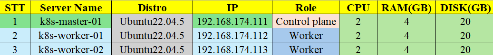
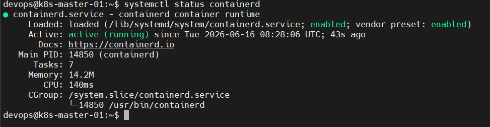
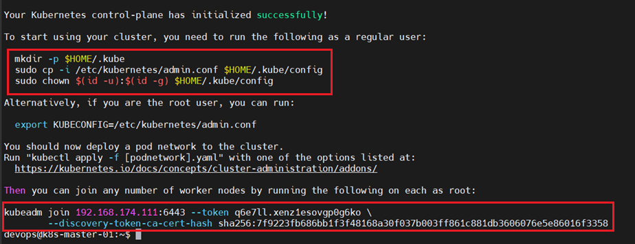

# Mục Lục 

- [Mục Lục](#mục-lục)
- [Triển khai Kubernetes Cluster sử dụng kubeadm](#triển-khai-kubernetes-cluster-sử-dụng-kubeadm)
  - [I. Phân hoạch địa chỉ IP](#i-phân-hoạch-địa-chỉ-ip)
  - [II. Tiến hành cài đặt](#ii-tiến-hành-cài-đặt)
    - [2.0 Các bước cần thiết trước khi cài đặt](#20-các-bước-cần-thiết-trước-khi-cài-đặt)
    - [2.1 Cài đặt containerd](#21-cài-đặt-containerd)
    - [2.2 Cài đặt kubelet, kubeadm, kubectl](#22-cài-đặt-kubelet-kubeadm-kubectl)
    - [2.3 Triển khai mô hình 1 master và 2 worker](#23-triển-khai-mô-hình-1-master-và-2-worker)
    - [2.4 Thêm network cho cụm](#24-thêm-network-cho-cụm)


# Triển khai Kubernetes Cluster sử dụng kubeadm

## I. Phân hoạch địa chỉ IP 



## II. Tiến hành cài đặt 

### 2.0 Các bước cần thiết trước khi cài đặt

Thực hiện trên cả 3 node 

Update & Upgrade hệ thống: 

```bash
sudo apt update -y && sudo apt upgrade -y 
```

Thêm user mới để thực hiện cài cụm k8s bằng user này 

```bash
adduser devops
```

Thêm user mới tạo vào trong group sudo:

```bash
usermod -aG sudo devops
```

Chuyển sang user devops và thực hiện các lệnh sau để cài đặt cụm

```bash
su devops
```

Tiến hành tắt swap trên hệ thống 

```bash
sudo swapoff -a
sudo sed -i '/swap.img/s/^/#/' /etc/fstab
```

### 2.1 Cài đặt containerd
Thực hiện trên cả 3 node

Cấu hình module kernel 

```bash
vim /etc/modules-load.d/containerd.conf
```

- Nội dung: 

    ```bash
    overlay
    br_netfilter
    ```

Tải module kernel: 

```bash
sudo modprobe overlay
sudo modprobe br_netfilter
```

Cấu hình hệ thống mạng: 

```bash
echo "net.bridge.bridge-nf-call-ip6tables = 1" | sudo tee -a /etc/sysctl.d/kubernetes.conf
echo "net.bridge.bridge-nf-call-iptables = 1" | sudo tee -a /etc/sysctl.d/kubernetes.conf
echo "net.ipv4.ip_forward = 1" | sudo tee -a /etc/sysctl.d/kubernetes.conf
```

Áp dụng cấu hình sysctl

```bash
sudo sysctl --system
```

Cài đặt các gói cần thiết cho containerd: 

```bash
sudo apt install -y curl gnupg2 software-properties-common apt-transport-https ca-certificates
sudo curl -fsSL https://download.docker.com/linux/ubuntu/gpg | sudo gpg --dearmour -o /etc/apt/trusted.gpg.d/docker.gpg
sudo add-apt-repository "deb [arch=amd64] https://download.docker.com/linux/ubuntu $(lsb_release -cs) stable"
```

Cài đặt containerd: 

```bash
sudo apt update -y 
sudo apt install -y containerd.io
```

Cấu hình containerd: 

```bash
containerd config default | sudo tee /etc/containerd/config.toml >/dev/null 2>&1
sudo sed -i 's/SystemdCgroup = false/SystemdCgroup = true/g' /etc/containerd/config.toml
```

Khởi động containerd: 

```bash
sudo systemctl restart containerd
sudo systemctl enable containerd
```



### 2.2 Cài đặt kubelet, kubeadm, kubectl

Thêm kho lưu trữ Kubernetes

```bash
echo "deb [signed-by=/etc/apt/keyrings/kubernetes-apt-keyring.gpg] https://pkgs.k8s.io/core:/stable:/v1.30/deb/ /" | sudo tee /etc/apt/sources.list.d/kubernetes.list
curl -fsSL https://pkgs.k8s.io/core:/stable:/v1.30/deb/Release.key | sudo gpg --dearmor -o /etc/apt/keyrings/kubernetes-apt-keyring.gpg
```

Cài đặt các gói Kubernetes

```bash
sudo apt update -y
sudo apt install -y kubelet kubeadm kubectl
sudo apt-mark hold kubelet kubeadm kubectl
```

### 2.3 Triển khai mô hình 1 master và 2 worker 

Thực hiện trên `k8s-master-01`: 

```bash
sudo kubeadm init
```



```bash
mkdir -p $HOME/.kube
sudo cp -i /etc/kubernetes/admin.conf $HOME/.kube/config
sudo chown $(id -u):$(id -g) $HOME/.kube/config
```

Kiểm tra các node: 

```bash
devops@k8s-master-01:~$ kubectl get node
NAME            STATUS     ROLES           AGE    VERSION
k8s-master-01   NotReady   control-plane   101s   v1.30.14
```

- Trạng thái của node đang là `NotReady` vì ta chưa cài network cho cụm k8s nên nó chưa thể kéo các tài nguyên về 

Thực hiện trên `k8s-worker-01` và `k8s-worker-02`

```bash
sudo kubeadm join 192.168.174.111:6443 --token q6e7ll.xenz1esovgp0g6ko \
        --discovery-token-ca-cert-hash sha256:7f9223fb686bb1f3f48168a30f037b003ff861c881db3606076e5e86016f3358
```

Kiểm tra lại trên `k8s-master-01`: 

```bash
devops@k8s-master-01:~$ kubectl get nodes
NAME            STATUS     ROLES           AGE     VERSION
k8s-master-01   NotReady   control-plane   3m47s   v1.30.14
k8s-worker-01   NotReady   <none>          12s     v1.30.14
k8s-worker-02   NotReady   <none>          9s      v1.30.14
```

### 2.4 Thêm network cho cụm 

```bash
kubectl apply -f https://raw.githubusercontent.com/projectcalico/calico/v3.25.0/manifests/calico.yaml
```

Chờ vài phút sau đó kiểm tra lại các node: 

```bash
devops@k8s-master-01:~$ kubectl get nodes
NAME            STATUS   ROLES           AGE     VERSION
k8s-master-01   Ready    control-plane   7m50s   v1.30.14
k8s-worker-01   Ready    <none>          4m15s   v1.30.14
k8s-worker-02   Ready    <none>          4m12s   v1.30.14
```

Như vậy cụm k8s đã hoàn toàn khởi chạy thành công !!!