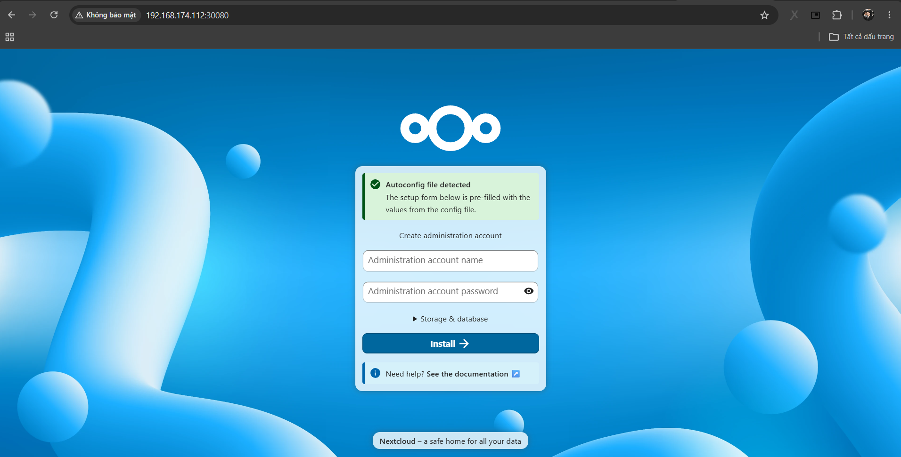

# Triển khai ứng dụng trên cụm K8s

Bài lab triển khai ứng dụng đơn giản trên cụm K8s

# Summary 

- [Triển khai ứng dụng trên cụm K8s](#triển-khai-ứng-dụng-trên-cụm-k8s)
- [Summary](#summary)
  - [I. Cài NFS Server](#i-cài-nfs-server)
  - [II. Cài NFS Client trên Worker](#ii-cài-nfs-client-trên-worker)
  - [III. Tạo PersistentVolume](#iii-tạo-persistentvolume)
  - [IV. Tạo PersistentVolumeClaim](#iv-tạo-persistentvolumeclaim)
  - [V. Deploy MariaDB](#v-deploy-mariadb)
  - [VI. Deploy NextCloud](#vi-deploy-nextcloud)
  - [VII. Expose Service](#vii-expose-service)
  - [VIII. Kiểm tra](#viii-kiểm-tra)
- [Tài liệu tham khảo](#tài-liệu-tham-khảo)


## I. Cài NFS Server 

Thực hiện trên Server nfs: 

```bash
sudo apt update -y
sudo apt install nfs-kernel-server -y
```

Tạo thư mục lưu dữ liệu: 

```bash
sudo mkdir -p /data/nfs
sudo chmod 777 /data/nfs
```

Khai báo export: 

```bash
vim /etc/exports
```

Thêm: `/data/nfs *(rw,sync,no_subtree_check,no_root_squash)`

Apply: 

```bash
sudo exportfs -rav
sudo systemctl restart nfs-kernel-server
```

## II. Cài NFS Client trên Worker 

Thực hiện trên tất cả các node Worker: 

```bash
sudo apt install nfs-common -y
```

## III. Tạo PersistentVolume 

IP của NFS server: `192.168.174.114`

Tạo thư mục lưu dự án: 

```bash
mkdir -p ~/project/NextCloud
```

Tạo file manifest cho PV: 

```bash
vim ~/project/NextCloud/pv.yaml
```

```yaml
apiVersion: v1
kind: PersistentVolume
metadata:
  name: nextcloud-pv
spec:
  capacity:
    storage: 20Gi
  accessModes:
    - ReadWriteMany
  persistentVolumeReclaimPolicy: Retain
  nfs:
    path: /data/nfs
    server: 192.168.174.114
```

Apply: 

```bash
kubectl apply -f pv.yaml
```

## IV. Tạo PersistentVolumeClaim 

```bash
vim ~/project/NextCloud/pvc.yaml
```

```yaml
apiVersion: v1
kind: PersistentVolumeClaim
metadata:
  name: nextcloud-pvc
spec:
  accessModes:
    - ReadWriteMany
  resources:
    requests:
      storage: 10Gi
```

Apply: 

```bash
kubectl apply -f pvc.yaml
```

Kiểm tra: 

```bash
devops@k8s-master-01:~$ kubectl get pvc
NAME            STATUS   VOLUME         CAPACITY   ACCESS MODES   STORAGECLASS   VOLUMEATTRIBUTESCLASS   AGE
nextcloud-pvc   Bound    nextcloud-pv   20Gi       RWX                           <unset>                 9s
```

## V. Deploy MariaDB 

```bash
vim ~/project/NextCloud/mariadb.yaml
```

```yaml
apiVersion: apps/v1
kind: Deployment
metadata:
  name: mariadb
spec:
  replicas: 1
  selector:
    matchLabels:
      app: mariadb
  template:
    metadata:
      labels:
        app: mariadb
    spec:
      containers:
      - name: mariadb
        image: mariadb:11
        env:
        - name: MYSQL_ROOT_PASSWORD
          value: rootpass
        - name: MYSQL_DATABASE
          value: nextcloud
        - name: MYSQL_USER
          value: nextcloud
        - name: MYSQL_PASSWORD
          value: nextcloudpass
```

Apply: 

```bash
kubectl apply -f ~/project/NextCloud/mariadb.yaml
```

Tạo Service: 

```bash
vim ~/project/NextCloud/mariadb-service.yaml
```

```yaml
apiVersion: v1
kind: Service
metadata:
  name: mariadb
spec:
  selector:
    app: mariadb
  ports:
  - port: 3306
```

Apply: 

```bash
kubectl apply -f ~/project/NextCloud/mariadb-service.yaml
```

## VI. Deploy NextCloud 

```bash
vim ~/project/NextCloud/nextcloud.yaml
```

```yaml
apiVersion: apps/v1
kind: Deployment
metadata:
  name: nextcloud
spec:
  replicas: 1
  selector:
    matchLabels:
      app: nextcloud
  template:
    metadata:
      labels:
        app: nextcloud
    spec:
      containers:
      - name: nextcloud
        image: nextcloud:latest
        env:
        - name: MYSQL_DATABASE
          value: nextcloud

        - name: MYSQL_USER
          value: nextcloud

        - name: MYSQL_PASSWORD
          value: nextcloudpass

        - name: MYSQL_HOST
          value: mariadb

        ports:
        - containerPort: 80

        volumeMounts:
        - mountPath: /var/www/html
          name: nextcloud-storage

      volumes:
      - name: nextcloud-storage
        persistentVolumeClaim:
          claimName: nextcloud-pvc
```

Apply: 

```bash
kubectl apply -f ~/project/NextCloud/nextcloud.yaml
```

## VII. Expose Service 

```bash
vim ~/project/NextCloud/nextcloud-service.yaml
```

```yaml
apiVersion: v1
kind: Service
metadata:
  name: nextcloud-service
spec:
  type: NodePort

  selector:
    app: nextcloud

  ports:
  - port: 80
    targetPort: 80
    nodePort: 30080
```

Apply: 

```bash
kubectl apply -f ~/project/NextCloud/nextcloud-service.yaml
```

## VIII. Kiểm tra

```bash
devops@k8s-master-01:~$ kubectl get pods
NAME                         READY   STATUS    RESTARTS   AGE
mariadb-55c64955fd-b69lf     1/1     Running   0          4m29s
nextcloud-55c4bc455b-zkbbn   1/1     Running   0          93s
```

Kiểm tra service 

```bash
devops@k8s-master-01:~$ kubectl get svc
NAME                TYPE        CLUSTER-IP     EXTERNAL-IP   PORT(S)        AGE
kubernetes          ClusterIP   10.96.0.1      <none>        443/TCP        77m
mariadb             ClusterIP   10.96.54.154   <none>        3306/TCP       3m53s
nextcloud-service   NodePort    10.99.187.3    <none>        80:30080/TCP   55s
```

Truy cập từ Browser: 




# Tài liệu tham khảo 

[REFERENCE 1](https://www.youtube.com/watch?v=wwbzPtCMELw)