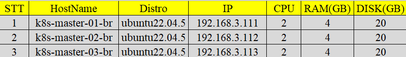
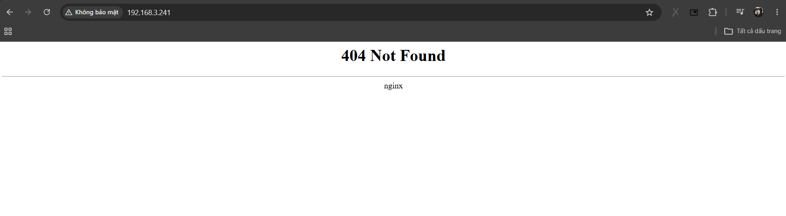
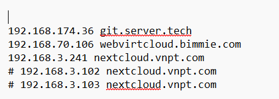
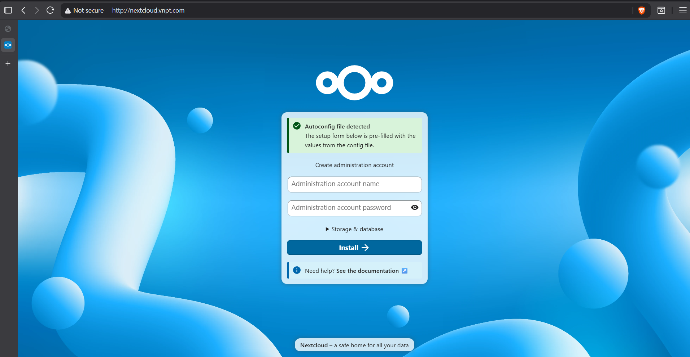

# Triển khai NextCloud sử dụng ingress-nginx vs MetalLB

## I. Phân hoạch địa chỉ IP 



## II. Thực hiện

### 2.0 Cài đặt metallb trên cụm k8s 

Tham khảo bài viết cài đặt metallb bằng helm [tại đây](https://github.com/Bimmie226/system-intership/blob/main/LuongVN/KUBERNETES/MetaLB/02.Install_MetalLB.md)

### 2.1 Cài đặt Ingress-Nginx trên cụm k8s 

Add repo của ingress nginx: 

```bash
helm repo add ingress-nginx https://kubernetes.github.io/ingress-nginx/
helm repo update 
```

```bash
devops@k8s-master-01-br:~$ helm search repo nginx
NAME                            CHART VERSION   APP VERSION     DESCRIPTION
ingress-nginx/ingress-nginx     4.15.1          1.15.1          Ingress controller for Kubernetes using NGINX a...
```

Tạo namespace cho ingress-nginx: 

```bash
kubectl create ns ingress-nginx
```

Install Chart Ingress-nginx: 

```bash
helm -n ingress-nginx install ingress-nginx ingress-nginx/ingress-nginx
```

```bash
devops@k8s-master-01-br:~$ helm -n ingress-nginx install ingress-nginx ingress-nginx/ingress-nginx
NAME: ingress-nginx
LAST DEPLOYED: Mon Jul  6 07:29:15 2026
NAMESPACE: ingress-nginx
STATUS: deployed
REVISION: 1
TEST SUITE: None
NOTES:
The ingress-nginx controller has been installed.
It may take a few minutes for the load balancer IP to be available.
You can watch the status by running 'kubectl get service --namespace ingress-nginx ingress-nginx-controller --output wide --watch'

An example Ingress that makes use of the controller:
  apiVersion: networking.k8s.io/v1
  kind: Ingress
  metadata:
    name: example
    namespace: foo
  spec:
    ingressClassName: nginx
    rules:
      - host: www.example.com
        http:
          paths:
            - pathType: Prefix
              backend:
                service:
                  name: exampleService
                  port:
                    number: 80
              path: /
    # This section is only required if TLS is to be enabled for the Ingress
    tls:
      - hosts:
        - www.example.com
        secretName: example-tls

If TLS is enabled for the Ingress, a Secret containing the certificate and key must also be provided:

  apiVersion: v1
  kind: Secret
  metadata:
    name: example-tls
    namespace: foo
  data:
    tls.crt: <base64 encoded cert>
    tls.key: <base64 encoded key>
  type: kubernetes.io/tls
```

Kiểm tra service của ingress-nginx: 

```bash
devops@k8s-master-01-br:~$ kubectl get svc -n ingress-nginx
NAME                                 TYPE           CLUSTER-IP       EXTERNAL-IP     PORT(S)                      AGE
ingress-nginx-controller             LoadBalancer   10.111.111.118   192.168.3.241   80:32141/TCP,443:31382/TCP   53s
ingress-nginx-controller-admission   ClusterIP      10.98.229.12     <none>          443/TCP                      53s
```

- Vì bên trên ta cấu hình giải IP mà metallb là từ 192.168.3.240 - 192.168.3.241 nên ở đây service ingress-nginx được expose với IP là 192.168.3.241

- Truy cập thử từ browser: 

  

  - Vì ta chưa cấu hình bất kì ingress nào nên truy cập sẽ hiện 404, tuy nhiên điều này cũng cho thấy rằng service ingress-nginx-controller đã được expose bằng metallb 

### 2.2 Triển khai NextCloud 

#### 2.2.0 Triển khai NFS-provisioner trên cụm k8s bằng helm 

Ở đây ta sẽ lấy server có địa chỉ IP là: 192.168.3.114 làm nfs-server 

Tham khảo bài viết triển khai NFS-provisioner bằng helm [tại đây](https://github.com/Bimmie226/ghichep-Kubernetes/blob/master/Deploy_Tools_on_K8s/03.Install_NFS_provisioner_on_K8s.md)

#### 2.2.1 Deploy MariaDB 

Manifest: 

```yaml
apiVersion: v1
kind: PersistentVolumeClaim 
metadata: 
  name: mariadb-pvc
  namespace: nextcloud
spec: 
  accessModes: 
    - ReadWriteMany 
  resources: 
    requests: 
      storage: 5Gi
  storageClassName: nfs-client  

---

apiVersion: v1
kind: Service 
metadata: 
  name: mariadb-service 
  namespace: nextcloud 
spec: 
  selector: 
    app: mariadb 
  ports: 
    - port: 3306
      targetPort: 3306
  
---

apiVersion: apps/v1
kind: StatefulSet
metadata:
  name: mariadb-statefulset
  namespace: nextcloud
spec:
  serviceName: mariadb-service
  replicas: 1
  selector:
    matchLabels:
      app: mariadb
  template:
    metadata:
      labels:
        app: mariadb
    spec:
      securityContext:
        fsGroup: 65534
      containers:
      - name: mariadb
        image: mariadb:11
        env:
        - name: MYSQL_ROOT_PASSWORD
          value: "root"
        - name: MYSQL_DATABASE 
          value: "nextcloud"
        - name: MYSQL_USER
          value: "nextcloud" 
        - name: MYSQL_PASSWORD
          value: "nextcloud"  
        ports:
        - containerPort: 3306
          name: mysql
        volumeMounts:
        - name: mariadb-storage
          mountPath: /var/lib/mysql
      volumes:
      - name: mariadb-storage
        persistentVolumeClaim:
          claimName: mariadb-pvc
```

- Kiểm tra PVC: 

```bash
devops@k8s-master-01-br:~/project/NextCloud$ kubectl get pvc -n nextcloud
NAME          STATUS   VOLUME                                     CAPACITY   ACCESS MODES   STORAGECLASS   VOLUMEATTRIBUTESCLASS   AGE
mariadb-pvc   Bound    pvc-14bce1e0-efa3-45a7-9c8b-04a696a858ce   5Gi        RWX            nfs-client     <unset>                 41s
```

- Kiểm tra PV: 

```bash
devops@k8s-master-01-br:~/project/NextCloud$ kubectl get pv
NAME                                       CAPACITY   ACCESS MODES   RECLAIM POLICY   STATUS   CLAIM                                                 STORAGECLASS   VOLUMEATTRIBUTESCLASS   REASON   AGE
pv-nfs-subdir-external-provisioner         10Mi       RWX            Retain           Bound    nfs-provisioner/pvc-nfs-subdir-external-provisioner                  <unset>                          3m
pvc-14bce1e0-efa3-45a7-9c8b-04a696a858ce   5Gi        RWX            Delete           Bound    nextcloud/mariadb-pvc                                 nfs-client     <unset>                          63s
```

#### 2.2.2 Deploy NextCloud 

Manifest: 

```yaml
apiVersion: v1
kind: PersistentVolumeClaim 
metadata: 
  name: nextcloud-pvc
  namespace: nextcloud
spec:
  accessModes: 
    - ReadWriteMany 
  resources: 
    requests: 
      storage: 5Gi
  storageClassName: nfs-client  

---

apiVersion: apps/v1
kind: Deployment
metadata:
  name: nextcloud-deployment
  namespace: nextcloud
spec:
  replicas: 1
  selector:
    matchLabels:
      app: nextcloud
  template:
    metadata:
      labels:
        app: nextcloud
    spec:
      containers:
      - name: nextcloud
        image: nextcloud:latest
        env:
        - name: MYSQL_DATABASE
          value: nextcloud
        - name: MYSQL_USER
          value: nextcloud
        - name: MYSQL_PASSWORD
          value: nextcloud
        - name: MYSQL_HOST
          value: mariadb-service
        ports:
        - containerPort: 80
        volumeMounts:
        - mountPath: /var/www/html
          name: nextcloud-storage
      volumes:
      - name: nextcloud-storage
        persistentVolumeClaim:
          claimName: nextcloud-pvc

---

apiVersion: v1
kind: Service
metadata:
  name: nextcloud-service
  namespace: nextcloud
spec:
  selector:
    app: nextcloud
  ports:
  - port: 80
    targetPort: 80

---

apiVersion: networking.k8s.io/v1
kind: Ingress
metadata:
  name: nextcloud-ingress
  namespace: nextcloud
  annotations:
    nginx.ingress.kubernetes.io/affinity: "cookie"
    nginx.ingress.kubernetes.io/affinity-mode: "persistent"
    nginx.ingress.kubernetes.io/session-cookie-name: "route"
    nginx.ingress.kubernetes.io/session-cookie-max-age: "172800"
    nginx.ingress.kubernetes.io/session-cookie-expires: "172800"
spec:
  ingressClassName: nginx
  rules:
  - host: nextcloud.vnpt.com
    http:
      paths:
      - path: /
        pathType: Prefix
        backend:
          service:
            name: nextcloud-service
            port:
              number: 80
```

- Kiểm tra PVC: 

```bash
devops@k8s-master-01-br:~/project/NextCloud$ kubectl get pvc -n nextcloud
NAME            STATUS   VOLUME                                     CAPACITY   ACCESS MODES   STORAGECLASS   VOLUMEATTRIBUTESCLASS   AGE
mariadb-pvc     Bound    pvc-14bce1e0-efa3-45a7-9c8b-04a696a858ce   5Gi        RWX            nfs-client     <unset>                 4m15s
nextcloud-pvc   Bound    pvc-e9b46eaa-581e-429b-a5db-955fc36a2e60   5Gi        RWX            nfs-client     <unset>                 97s
```

- Kiểm tra PV: 

```bash
devops@k8s-master-01-br:~/project/NextCloud$ kubectl get pv -n nextcloud
NAME                                       CAPACITY   ACCESS MODES   RECLAIM POLICY   STATUS   CLAIM                                                 STORAGECLASS   VOLUMEATTRIBUTESCLASS   REASON   AGE
pv-nfs-subdir-external-provisioner         10Mi       RWX            Retain           Bound    nfs-provisioner/pvc-nfs-subdir-external-provisioner                  <unset>                          6m35s
pvc-14bce1e0-efa3-45a7-9c8b-04a696a858ce   5Gi        RWX            Delete           Bound    nextcloud/mariadb-pvc                                 nfs-client     <unset>                          4m38s
pvc-e9b46eaa-581e-429b-a5db-955fc36a2e60   5Gi        RWX            Delete           Bound    nextcloud/nextcloud-pvc                               nfs-client     <unset>                          2m1s
```

#### 2.2.3 Add Host 

Ta để ý trên manifest của nextcloud phần ingress ta đã chỉ định 1 rule là nếu truy cập vào domain `nextcloud.vnpt.com` thì sẽ được forward đến service NextCloud

Do đó ở đây ta sẽ add host với domain là `nextcloud.vnpt.com` và IP sẽ là IP của service ingress-nginx-controller được expose ra ngoài và ở đây là: `192.168.3.241`



### 2.3 Test 

