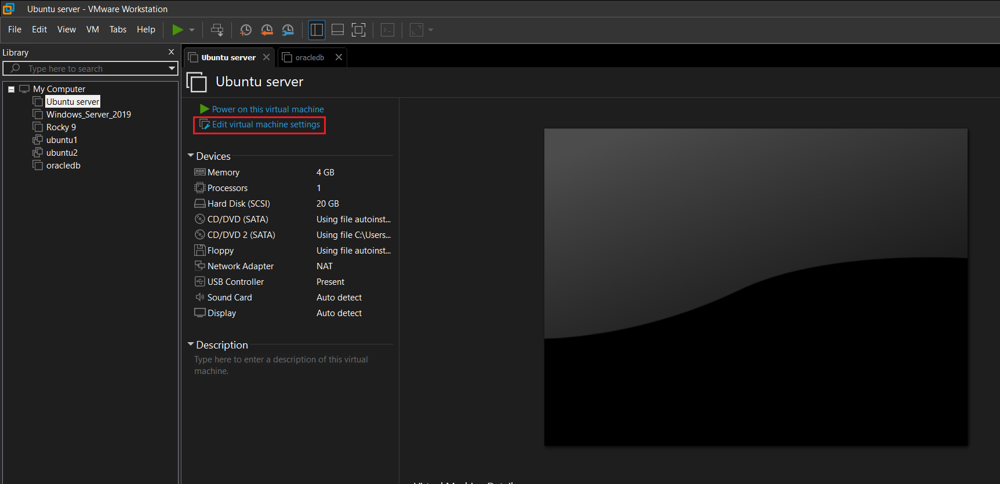
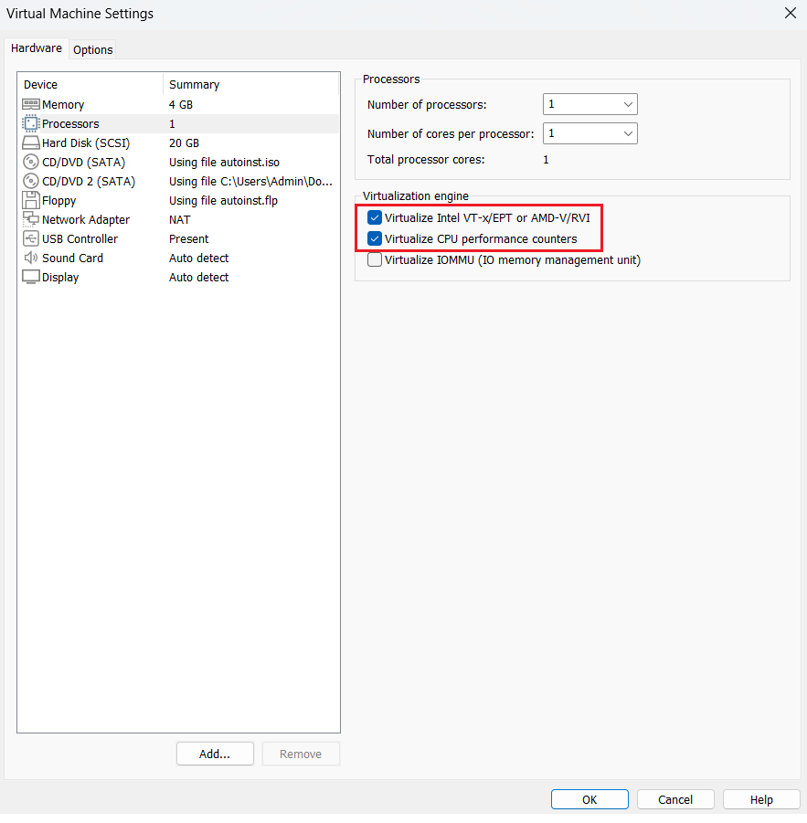
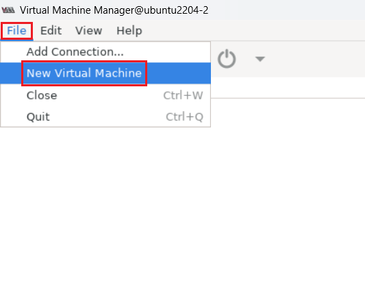
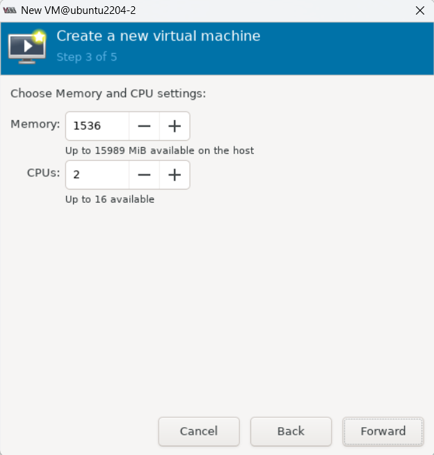
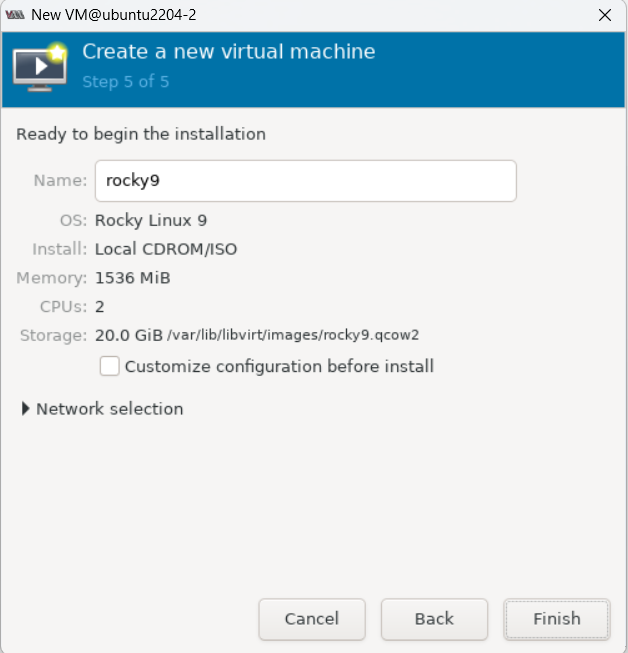
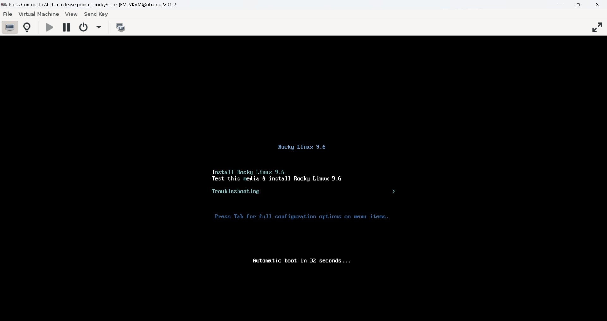

# Cài KVM trên ubuntu

## I. Cài KVM   
Trước tiên ta kiểm tra máy có hỗ trợ ảo hóa không bằng lệnh:

```bash
egrep -c '(vmx|svm)' /proc/cpuinfo
```

- Kết quả > 0 -> CPU có hỗ trợ ảo hóa
- Kết quả = 0 -> CPU chưa hỗ trợ ảo hóa

Khi kết quả = 0 ta có thể bật ảo hóa bằng cách sau:





Cài đặt các gói cần thiết:

```bash
sudo apt update
sudo apt install -y qemu-kvm libvirt-daemon-system libvirt-clients bridge-utils virt-manager
```

Kiểm tra modul KVM đã được cài:

```bash
root@dev-server:~# lsmod | grep kvm
kvm_intel             286720  0
kvm                   667648  1 kvm_intel
root@dev-server:~#
```

Bật và khởi động `libvirt`:

```bash
systemctl enable libvirtd
systemctl start libvirtd
```

## II. Sử dụng công cụ virt-manager để cài vm

Ta chuẩn bị sẵn file `.iso` Rocky 9

```bash
cd /var/lib/libvirt
mkdir file-iso
```

```bash
root@dev-server:/var/lib/libvirt/file-iso# ls
Rocky-9.6-x86_64-minimal.iso
root@dev-server:/var/lib/libvirt/file-iso#
```

Vào virt-manager để cấu hình VM:

```bash
virt-manager
```

Chọn `file` -> `New Virtual Machine`:



Chọn `browser` để chỉ ra vị trí lưu file `.iso`:


Chọn dung lượng RAM và số CPU cho máy ảo:



Chọn dung lượng ổ cứng cho máy ảo:


Chọn `finish` để tải máy ảo:



