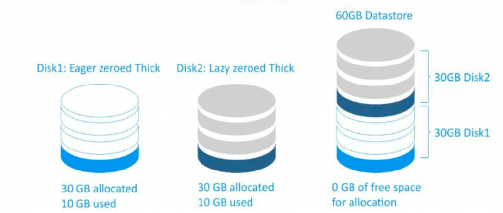
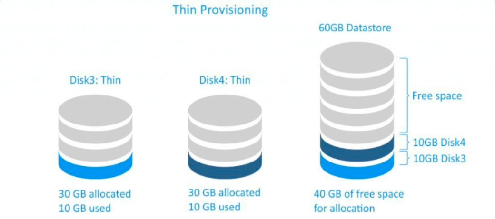

# Cơ chế lưu tữ Thin-Thick
## I. Thick

Thick storage (hay thick provisioning) là cách cấp phát toàn bộ dung lượng lưu trữ ngay từ đầu cho một ổ đĩa ảo (virtual disk), dù dữ liệu bên trong có dùng hết hay chưa.

Ví dụ:

- Bạn tạo Virtual disk = 100GB
- Dù hệ điều hành trong VM mới dùng 5GB

-> 100GB vẫn bị chiếm toàn bộ trên storage thật

Thick có 2 loại:

- `Thick lazy`: Khi tạo 1 disk cho VM nó sẽ ánh xạ đến một phân vùng trên disk thật. Nó nhận đủ dung lượng disk mà ta tạo cho VM và nó sẽ không xóa dữ liệu cũ trên disk (nếu có), khi chúng ta ghi cái gì lên đó thì nó mới xóa dữ liệu đi. Chính vì vậy nên việc tạo đĩa ảo sẽ rất nhanh nhưng sẽ mất nhiều thời gian cho lần ghi đầu tiên do ta phải xóa dữ liệu cũ (nếu có)
- `Thick Eager`: Cũng như `thick lazy` nó cũng nhận toàn bộ dung lượng mà ta tạo disk cho VM. Tuy nhiên, nó sẽ ghi toàn bộ bit 0 lên phần dung lượng chưa được sử dụng của disk ảo. Vì vậy khi ta tạo disk cho VM ở kiểu này sẽ lâu hơn `thick lazy` nhưng với lần ghi đầu tiên sẽ nhanh hơn

Như ta thấy thì nó sẽ rất lãng phí disk. Nếu ta có 1 disk với dung lượng 60G, ta tạo 2 máy ảo với cơ chế Thick mỗi máy 30G. Ta sẽ không thể tạo thêm máy ảo dù 2 máy ảo đã tạo không dùng hết 30G của chúng. Tuy nhiên, nó giúp đảm bảo sự độc lập giữa các VM.

## II. Thin

Với cơ chế này, ta sẽ tránh được sự lãng phí dung lượng ổ cứng so với thick. Cơ chế này thì VM chỉ chiếm dung lượng bằng đúng phần dung lượng mà nó đang sử dụng và lưu trữ. Vì vậy với phần dung lượng còn trống ta có thể làm việc khác.

Với cơ chế này ta có thể tận dụng được hết dung lượng disk.

Tuy nhiên, nếu dung lượng đĩa cứng bị hết thì tất cả các VM trên đó sẽ gặp vấn đề vì không còn dung lượng disk để sử dụng