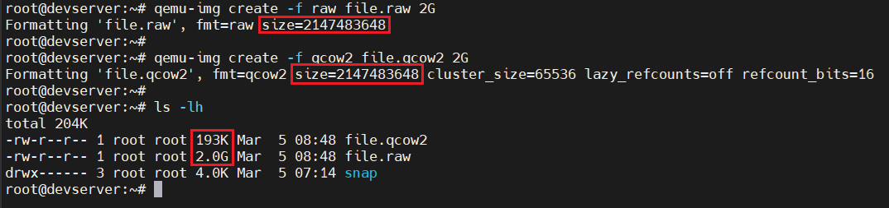
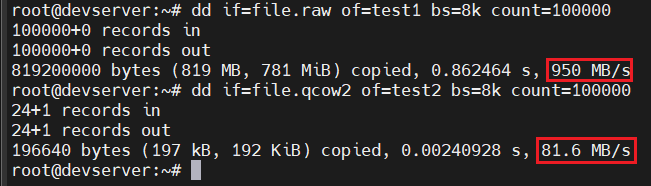
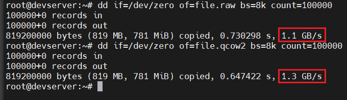
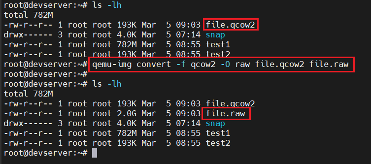
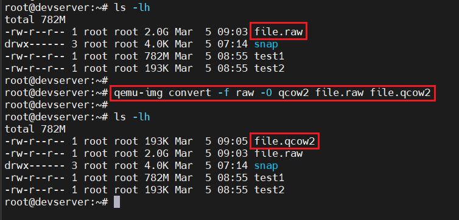

# Định dạng ổ đĩa ISO, RAW và QCOW2 trong KVM
## I. Các định dạng ổ đĩa trong KVM
Trong KVM Guest có 2 thành phần chính:

1. **VM defination:** được lưu dưới dạng file XML tại `/etc/libvirt/qemu`. File này chứa các thông tin của máy ảo như tên, thông tin về tài nguyên của VM(RAM, CPU), ...

2. **Storage:** được lưu dưới dạng file image tại thư mục `/var/lib/libvirt/images`. 3 định dạng thông dụng nhất của file image sử dụng trong KVM là: `ISO`, `raw`, `qcow2`

### 1. ISO
File ISO là file image của 1 đĩa CD/DVD, nó chứa toàn bộ dữ liệu của đĩa CD/DVD đó. File ISO thường được sử dụng để cài đặt hệ điều hành của VM, người dùng có thể import trực tiếp hoặc tải về từ internet

### 2. RAW

- Là định dạng file image phi cấu trúc
- Khi người dùng tạo mới một máy ảo có disk format là `raw` thì dung lượng của file disk sẽ đúng bằng dung lượng của ổ đĩa máy ảo bạn đã tạo (cơ chế Thick)
- Định dạng raw là hình ảnh theo dạng nhị phân (bit by bit) của ổ đĩa
- `raw` chính là định dạng mặc định của QEMU

### 3. QCOW2
- QCOW2(QEMU Copy-On-Write 2) là định dạng ảnh đĩa do QEMU phát triển, hỗ trợ các tính năng nâng cao như nén, snapshot, Thin Provisioning
- Đặc điểm của QCOW2 đó là nó chỉ hỗ trợ Thin Provisioning (dung lượng tăng theo dữ liệu), do vậy kích thước của file qcow2 khá nhỏ gộn vì chỉ chiếm dung lượng thực tế sử dụng

## II. So sánh RAW và QCOW2
### 1. Dung lượng
Để kiểm tra dung lượng của 2 định dạng này, ta sẽ dùng lệnh `qemu-img` để tạo ra một file có định dạng raw và một file có định dạng qcow2 cả 2 file nàu đều có dung lượng là `2G`.



Ta thấy, khi tạo 2 file đều có dung lượng là 2G, nhưng khi kiểm tra thực tế thì file qcow2 chỉ có dung lượng là 193K, còn file định dạng raw thì vẫn là 2G

### 2. Performance(Hiệu năng)
Để test hiệu năng giữa 2 định dạng này ta sử dụng câu lệnh `dd` để đọc và ghi dữ liệu từ các file trên

**Đọc dữ liệu:** qcow2 < raw

```bash
dd if=file.raw of=test1 bs=8k count=100000
dd if=file.qcow2 of=test2 bs=8k count=100000
```



**Ghi dữ liệu:** qcow2 > raw

```bash
dd if=/dev/zero of=file.raw bs=8k count=100000
dd if=/dev/zero of=file.qcow2 bs=8k count=100000
```



### 3. Tạo snapshot
Chỉ có `qcow2` hỗ trợ tạo snapshot

### 4. Chuyển đổi giữa `raw` và `qcow2`

- Chuyển từ `qcow2` sang `raw`:

    ```bash
    qemu-img convert -f qcow2 -O raw file.qcow2 file.raw
    ```

    

- Chuyển từ `raw` sang `qcow2`:

    ```bash
    qemu-img convert -f raw -O qcow2 file.raw file.qcow2
    ```

    

- **NOTE:** Chuyển đổi này chỉ được thực hiện khi VM đang được tắt và sau khi chuyển đổi xong ta phải tiến hành sửa lại định dạng disk trong file `XML` tương ứng