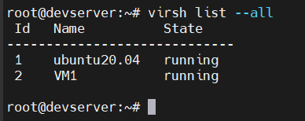
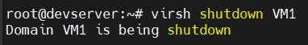
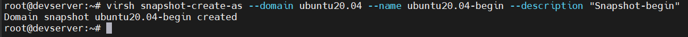
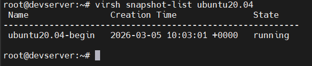
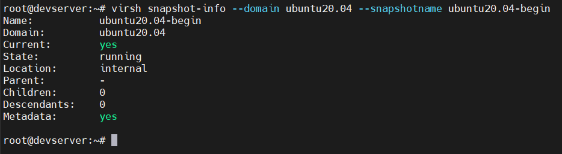
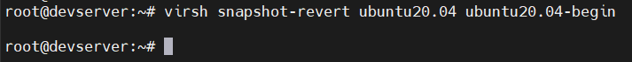
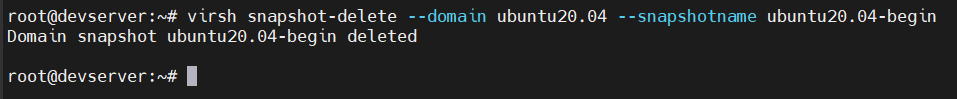
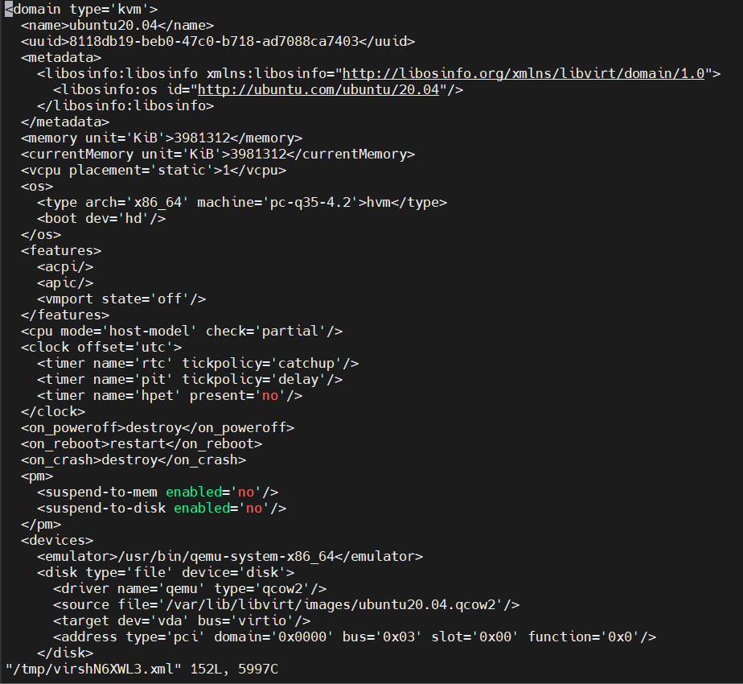
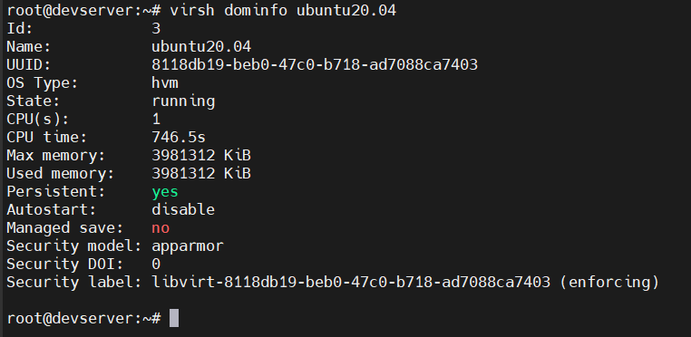

# Tạo và quản lý máy ảo bằng CLI Virsh
## 1. Tạo VM với Virsh
Để tạo máy ảo bằng dòng lệnh ta sử dụng `virt-install`

Hầu hết các option đều không bắt buộc. Yêu cầu tối thiểu là: `--name`, `--memory`, lưu trữ(`--disk` hoặc `--filesystem`)

```bash
virt-install \
--name=VM1 \
--vcpus=1 \
--memory=4096 \
--cdrom="/var/lib/libvirt/file-iso/ubuntu-20.04.6-live-server-amd64 (1).iso" \
--disk=/var/lib/libvirt/images/vm1.img,size=6 \
--os-variant=ubuntu20.04 \
--graphics vnc \
--network network=default
```

Trong đó:
- `--name`: đặt tên cho máy ảo
- `--vcpus`: là tổng số CPU định tạo cho máy ảo
- `--memory`: chỉ ra dung lượng RAM cho máy ảo(đơn vị MB)
- `--cdrom`: sau đó chỉ ra đường dẫn đến file ISO. Nếu muốn boot bằng cách khác ta dùng option `--locaion` sau đó chỉ ra đường dẫn đến file (có thể là đường dẫn trên internet).
- `--disk`: Chỉ ra vị trí lưu disk của máy ảo. `size` chỉ ra dung lượng disk của máy ảo (đơn vị GB). Có thể tạo thêm disk bằng cách thêm 1 dòng nữa
- `--os-variant`: chỉ ra kiểu của HĐH của máy ảo đang tạo. Option này có thể chỉ ra hoặc không nhưng nên sử dụng nó vì nó sẽ cải thiện hiệu năng của máy ảo. Nếu bạn không biết HĐH hành của mình thuộc loại nào bạn có thể tìm kiếm thông tin bằng cách dùng lệnh `osinfo-query os`
- `--graphics`: chọn kiểu màn hình tương tác
- `--network`: chỉ ra cách kết nối mạng của máy ảo. Nếu tạo nhiều card mạng, ta chỉ cần khai báo thêm

**NOTE:** Các `option` và `arguments` phải viết liền với dấu "=" và không được có space.

### 1.1 Các trường hợp tạo máy ảo dùng `virt-install`

#### 1.1.1 Tạo máy ảo bằng file `.iso`
- Sử dụng option `--cdrom`
- `disk` phải là không gian trống

```bash
virt-install \
--connect qemu:///system \
--name iso \
--memory 1024 \
--vcpus 1 \
--disk /var/lib/libvirt/images/iso.img,size=10 \
--cdrom=/var/lib/libvirt/file-iso/CentOS-7-x86_64-Minimal-1804.iso \
--network network=default \
--graphics vnc,listen='0.0.0.0'
```

#### 1.1.2 Tạo máy ảo bằng file image
- Sử dụng option `--import`
- `disk` là đường dẫn đến file image

```bash
virt-install \
--connect qemu:///system \
--name template \
--memory 500 \
--vcpus 1 \
--disk /var/lib/libvirt/images/template.img \
--import \
--network network=default \
--graphics vnc,listen='0.0.0.0'    
```

#### 1.1.3 Tạo máy ảo qua Internet(netboot)
- Sử dụng option `--location`: sau đó là đường dẫn url chứa file cài đặt netboot (netboot được cung cấp bởi hệ điểu hành)

```bash
virt-install \
--connect qemu:///system \
--name internet \
--ram 2048 \
--vcpus 1 \
--disk path=/var/lib/libvirt/images/internet.qcow2,size=10 \
--location 'url' \
--network bridge=br0 \
--network network=default \
--graphics vnc,listen='0.0.0.0' \      
```

Đối với ubuntu, các file img được cung cấp miễn phí [tại dây](https://cloud-images.ubuntu.com/)


## 2. Hiển thị danh sách máy ảo

```bash
virsh list --all
```



## 3. Tắt VM

```bash
virsh shutdown <tên_máy_ảo>
```



## 4. Bật VM

```bash
virsh start <tên_máy_ảo>
```

## 5. Reboot VM

```bash
virsh reboot <tên_máy_ảo>
```

## 6. Xóa máy ảo

```bash
virsh undefine <tên_máy_ảo>
```

## 7. Tạo snapshot

```bash
virsh snapshot-create-as --domain tên_máy --name tên_bản_snapshot --description "mô tả bản snapshot"
```



**NOTE:** snapshot chỉ tạo được khi định dạng disk ảo của ta sử dụng là `qcow2` chính vì vậy nếu bạn đang sử dụng định dạng `raw` mà muốn tạo snapshot thì cần phải chuyển sang định dạng `qcow2`.

### 7.1 Xem danh sách các bản snapshot trên 1 VM

```bash
virsh snapshot-list <tên_máy_ảo>
```



### 7.2 Xem thông tin chi tiết của bản snapshot

```bash
virsh snapshot-info --domain <tên_máy_ảo> --snapshotname <tên_bản_snapshot>
``` 



### 7.3 Revert để chạy lại một bản snapshot đã tạo

```bash
virsh snapshot-revert <tên_máy_ảo> <tên-bản-snapshot>
```



### 7.4 Xóa 1 bản snapshot

```bash
virsh snapshot-delete --domain <tên_máy_ảo> --snapshotname <tên_bản_snapshot>
```



## 8. Sửa thông tin CPU hoặc Memory

```bash
virsh edit <tên_VM>
```



## 9. Một số lệnh khác

### 9.1 Xem thông tin chi tiết về file disk của VM

```bash
qemu-img info <đường_dẫn_file-disk>
```

### 9.2 Xem thông tin cơ bản của 1 VM

```bash
virsh dominfo <tên_VM>
```



# Tài liệu tham khảo

[REFERENCE 1](https://github.com/danghai1996/thuctapsinh/blob/master/HaiDD/KVM/kvm/06-virsh_commandOnkvm.md)