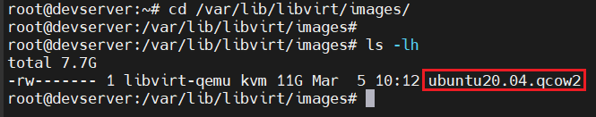
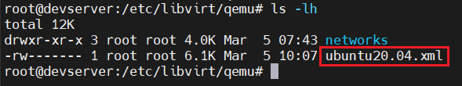
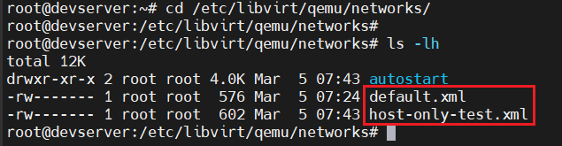
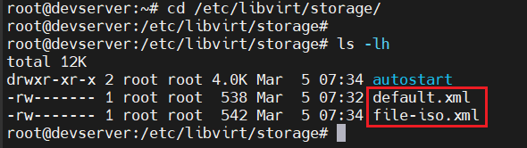
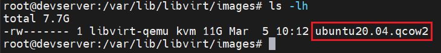
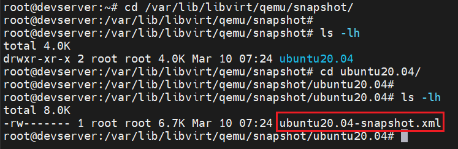

# Các file của VM trên KVM
## Một số thư mục và file (mặc định) của VM trên KVM

### 1. Thư mục lưu các disk của VM

```bash
/var/lib/libvirt/images
```



### 2. Thư mục chứa các file `.xml` thông số kĩ thuật của VM

```bash
/etc/libvirt/qemu
```



### 3. Thư mục chứa các file liên quan đến `network`

```bash
/etc/libvirt/qemu/networks
```



### 4. Thư mục lưu các storage

```bash
/etc/libvirt/storage
```



### 5. Thư mục chứa các images của VM 

```bash
/var/lib/libvirt/images
```



### 6. Thư mục lưu các bản snapshot của các VM

```bash
/var/lib/libvirt/qemu/snapshot
```

