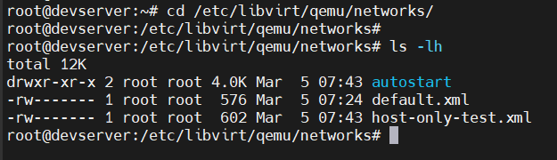
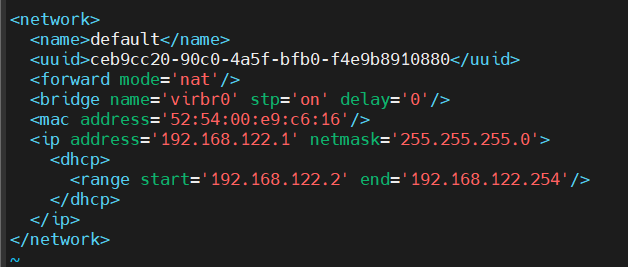
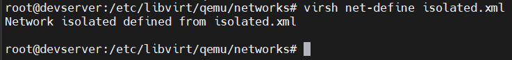
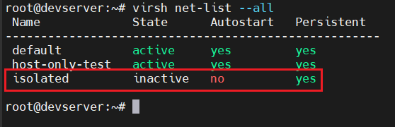
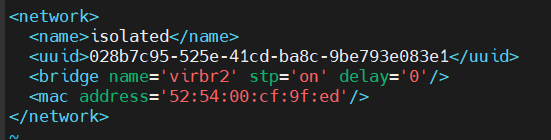
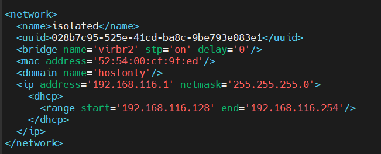
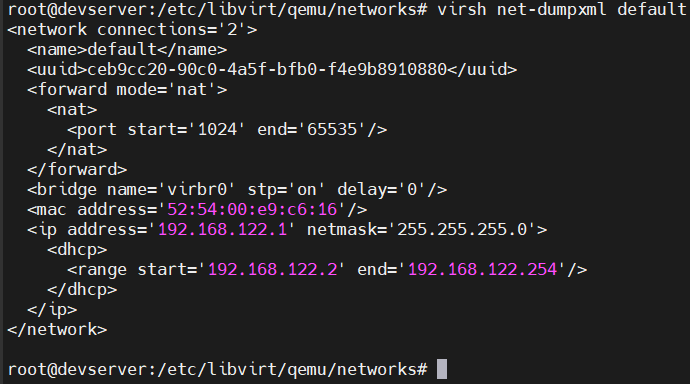
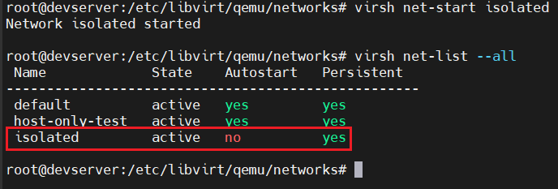
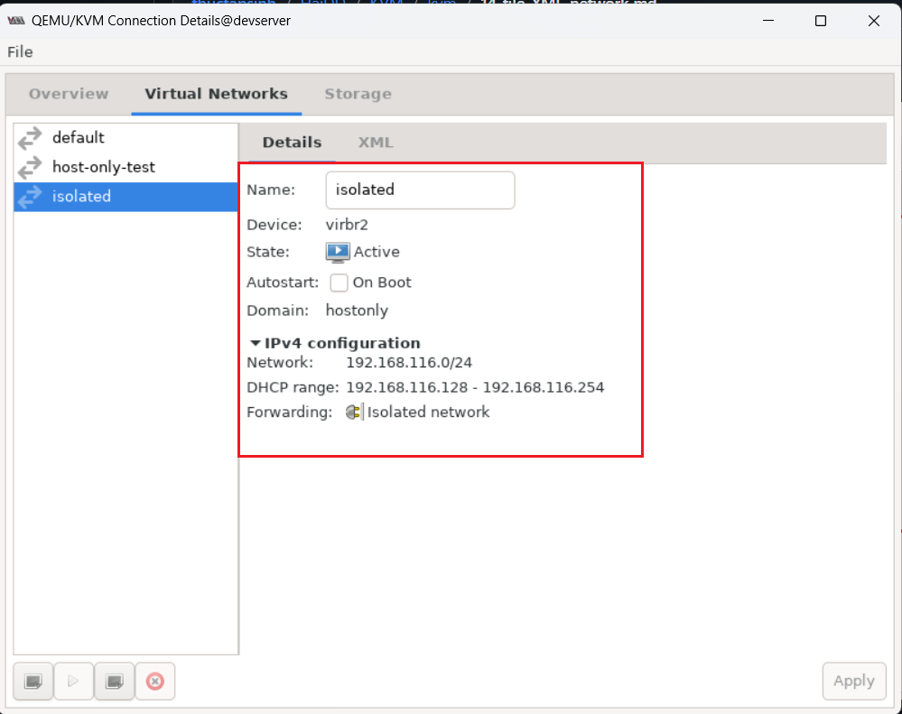

# File XML network và tạo virtual-network bằng file XML

## I. File XML network

Thư mục chứa file XML network:

```bash
/etc/libvirt/qemu/networks
```

Các file ở đây là mạng ảo trong KVM



Ta sẽ xem file `default.xml`



- `name`: tên mạng
- `forward mode`: kiểu mạng
- `bridge`: card sử dụng 
- `mac`: địa chỉ MAC
- `ip`: thông số IP của mạng
  - `dhcp`: thông tin dhcp của mạng
    - `range`: dải cấp dhcp cho các VM

## II. Tạo virtual network bằng file XML

### 1. Chuẩn bị file XML
Ở đây, ta sẽ tạo 1 mạng ảo Host-only. Ta tạo file xml `isolated.xml` trong thư mục `/etc/libvirt/qemu/networks`

```xml
<network>
<name>isolated</name>
</network>
```

### 2. Tiến hành tạo mạng bằng file xml
Tiến hành define network từ file xml bằng câu lệnh: `virsh net-define isolated.xml`



Sau khi đã define, ban có thể sử dụng câu lệnh `virsh net-list --all` để xem network available:



Mạng `isolated` đã xuất hiện, tuy nhiên nó vẫn chưa được active

Sau khi define, libvirt sẽ tự động add thêm một số thành phần vào file xml bạn vừa tạo và lưu nó tại `/etc/libvirt/qemu/networks/`

File `isolated.xml`



Ta có thể chỉnh sửa file xml bằng lệnh `virsh net-edit isolated`

File `isolated.xml` sau khi chỉnh sửa:



Bên cạnh đó, bạn cũng có thể dùng lệnh `virsh net-dumpxml <net_name>` để xem chi tiết cấu hình trong các file network xml của Linux Bridge.



Sau khi cấu hình xong, ta tiến hành start virtual network vừa tạo bằng câu lệnh `virsh net-start isolated`



Như vậy, isolated đã được start và có thể sử dụng. Dùng virt-manager để xem:



### 3. Chỉnh sửa cấu hình mạng 
Trong trường hợp người dùng muốn thay đổi cấu hình:
- Tiến hành chỉnh sửa trong file xml
- dùng lệnh `virsh net-destroy` và `virsh net-start` để reset lại virtual network

### 4. Ví dụ về file XML các kiểu mạng

#### 4.0 NAT 

```xml
<network>
  <name>nat</name>
  <bridge name="virbr1"/>
  <forward mode="nat"/>
  <ip address="192.168.123.1" netmask="255.255.255.0">
    <dhcp>
      <range start="192.168.123.128" end="192.168.123.254"/>
    </dhcp>
  </ip>
</network>
```

- `<forward mode="nat"/>` : dòng này định nghĩa kiểu mạng là NAT

#### 4.1 Host-only

```xml
<network>
  <name>hostonly</name>
  <bridge name="virbr2"/>
  <ip address="192.168.125.1" netmask="255.255.255.0">
    <dhcp>
      <range start="192.168.125.128" end="192.168.125.254"/>
    </dhcp>
  </ip>
</network>
```

Với kiểu Host-only sẽ không có thẻ chuyển tiếp `<forward>`

#### 4.2 Bridge

```xml
<network>
  <name>local</name>
  <bridge name="virbr3"/>
  <forward mode="route" dev="ens33"/>
  <ip address="192.168.127.1" netmask="255.255.255.0">
    <dhcp>
      <range start="192.168.127.128" end="192.168.127.254"/>
    </dhcp>
  </ip>
</network>
```

`<forward mode="route" dev="ens33"/>`:
- `mode="route"`: kiểu mạng bridge
- `dev="ens33"`: chọn card bridge mà nó gắn vào

## III. Attach & Detach interface

### 3.0 Xem interface cua VM

```bash
virsh domiflist vm_name
```

### 3.1 Attach

```bash
virsh attach-interface \
--domain vm_test \
--type bridge \
--source br-isolated \
--model virtio \
--config --live
```

### 3.2 Detach

```bash
virsh detach-interface \
--domain vm_test \
--type network \
--mac 52:54:00:xx:xx:xx \
--config --live
```